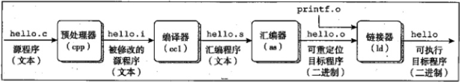
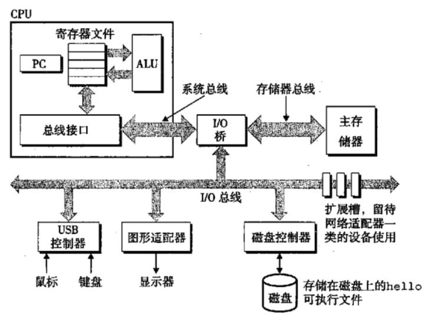
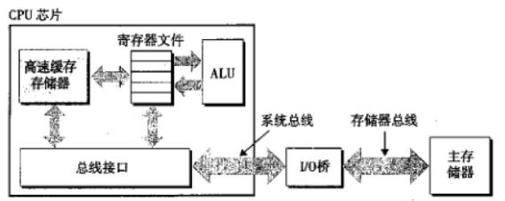
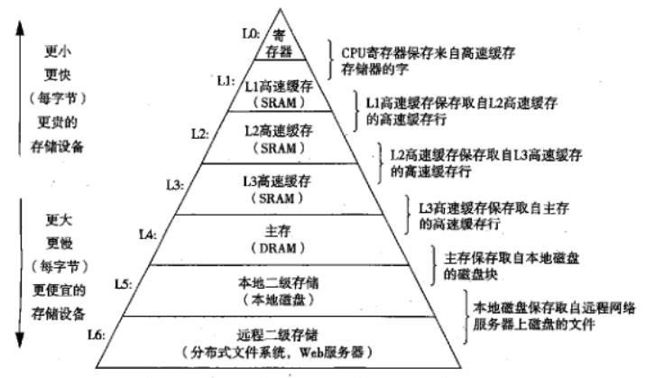
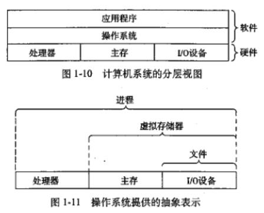
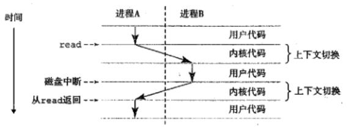
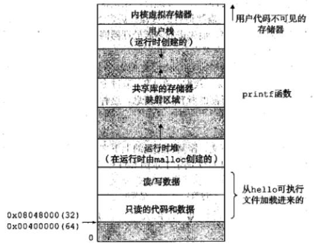
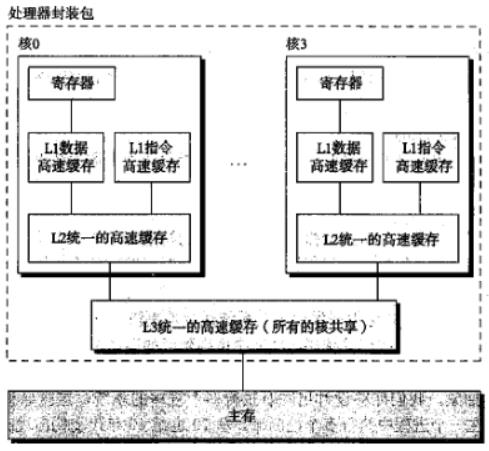
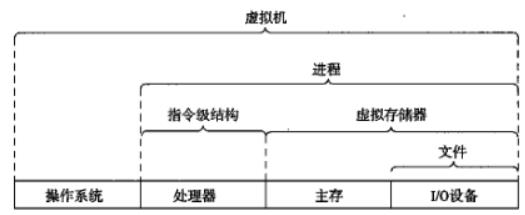

# 01_计算机系统漫游

> 通过程序生命周期理解计算机系统的主要概念和主题

```c
#include<stdio.h>

int main(){
	printf("hello,world\n");
	return 0;
}
```

## 信息、程序与指令

### 信息

- 整个计算机系统中的所有信息都可以用一串比特的形式表示
- 区分不同的数据对象的方法是读到这些对象时的上下文
  - 不同的上下文，同样的字节序列可能表示整数、浮点数、字符串或机器指令等

### 程序

#### 编译器驱动程序

```
linux> gcc -o hello hello.c
```

> 四个阶段共同构成编译系统



#### 预处理阶段

- 根据头文件修改原始的C程序

#### 编译阶段

- 将文本文件hello.c翻译为文本文件hello.s
- 包含<u>汇编语言程序</u>，以及函数main的定义，以文本格式描述低级机器语言指令
- 汇编语言为不同高级语言的不同编译器提供通用的输出语言

#### 汇编阶段

- 将hello.s翻译为机器语言指令，打包为<u>可重定位目标程序</u>，并保存在hello.o中
- 二进制文件hello.o字节编码为机器语言指令，而非字符

#### 链接阶段

- 将单独预编译好的目标文件合并到二进制文件hello.o程序中，得到hello文件
- hello为<u>可执行目标文件</u>，加载到内存中由系统执行

### 理解编译系统工作原理的意义

- 优化程序性能
- 理解链接时出现的错误
- 避免安全漏洞

### 指令与处理器

- 运行可执行文件，将文件名输入到shell中，加载并运行，直到程序终止

#### 系统硬件组成



#### 总线

- 携带信息细节并负责信息在各个部件间传递
- 设计为传送定长的字节块 (字)

#### I/O设备

- 输入输出设备与外部联系
- 每个I/O设备都通过控制器或适配器与I/O总线相连
- 控制器与适配器区别主要在于封装方式
  - 控制器：I/O设备本身或PCB上的芯片组
  - 适配器：主板插槽上插卡

#### 主存

- 临时存储设备，在处理器执行程序时存放程序和所处理数据
- 由一组DRAM芯片组成，从逻辑上来说是一个线性字节数组，每个字节有其唯一地址 (数组索引)

#### 处理器

- 解释/执行存储在主存中指令的引擎
- 核心是一个字长的存储设备 (或寄存器)，称为程序计数器 (PC)
  - 任何时刻PC都指向主存中某条机器语言指令 (含有其地址)
- 系统通电到断电过程中处理器不断执行PC所指向的指令，再更新PC指向下一条指令
  - 指令执行模型由指令集结构决定
- 指令执行围绕着主存、寄存器文件、算术/逻辑单元 (ALU)进行
  - 寄存器文件：小的存储设备，由字长为1的寄存器组成
  - 算术/逻辑单元：计算新的数据和地址
  - 示例指令
    - 加载
    - 存储
    - 操作
    - 跳转
- 指令集结构和微体系结构区别
  - 指令集结构描述每条机器代码指令的效果
  - 微体系结构描述处理器实际上如何实现

### 程序的运行机制

- shell等待输入后将字符`./hello`逐一读入寄存器，再放入存储器中
- shell执行一系列指令来加载可执行文件，将目标文件中的代码和数据从磁盘复制到主存
  - 利用直接存储器存取 (DMA)技术，数据可以不通过处理器而直接从磁盘到达主存
- 一旦目标文件中代码和数据加载到主存，处理器就开始执行mian程序中的机器语言指令
- 将输出字节从主存复制到寄存器文件，再从寄存器文件复制到显示设备，最终显示

## 高速缓存

> 系统花费大量时间将信息从一个地方挪到另一个地方
>
> 系统设计一个主要目标就是让这类复制操作尽可能快地完成



- 针对处理器和主存之间的差异，采用高速缓存存放处理器近期可能需要的信息
- 硬件实现技术为SRAM
- 比较新的系统会有三级高速缓存 (利用高速缓存局部性原理)
  - 局部性原理：程序具有访问局部区域里数据和代码的趋势
- 高速缓存可以将程序的性能提高一个数量级

## 存储设备层次结构

> 普遍观念：在处理器和大而慢的设备间需要插入小而快的存储设备



- 层次结构的主要思想：一层上的存储器作为低一层存储器的高速缓存
  - 主存是磁盘上数据的高速缓存
  - 分布式文件系统的网络系统中，本地磁盘是存储在其他系统中磁盘上数据的高速缓存

## 操作系统管理硬件



- 将操作系统看作应用程序和硬件间插入的一层软件
- 操作系统基本功能
  - 防止硬件被失控的应用程序滥用
  - 向应用程序提供简单一致的机制以控制复杂而差异巨大的低级硬件设备
- 几个基本的抽象概念
  - 文件：对I/O设备的抽象表示
  - 虚拟存储器：对主存和磁盘I/O设备的抽象表示
  - 进程：对处理器、主存和I/O设备的抽象表示

### 进程

- 提供程序的代码和数据是系统存储器中唯一对象的假象
- 对正在运行的程序的一种抽象
- 并发运行指不同进程的指令交错执行
  - 大多数系统中需要运行的进程数多于可以运行它们的CPU个数
- CPU看上去并发地执行多个进程的进程间切换，这种交错执行的机制称为上下文切换
  - 上下文：保持跟踪进程运行所需的所有状态信息
    - PC
    - 寄存器文件当前值
    - 主存的内容
- 当操作系统决定将控制权从当前进程转移到某个新进程时，就会进行上下文切换
  - 保存当前进程上下文，恢复新进程的上下文，然后传递控制权



> 示例中shell进程和hello进程并发

### 线程

- 现代系统中，一个进程可以由多个线程执行单元组成，而不是只有单一控制流
  - 每个线程都运行在进程的上下文中，并共享同样的代码和全局数据
- 网络服务器对并行处理的需求让线程作为编程模型越发重要
  - 多线程之间比多进程之间更容易共享数据，更加高效，可以加快程序运行

### 虚拟存储器

- 为每个进程提供独占主存的假象
- 每个进程看到一致的存储器，称为虚拟地址空间



#### 虚拟地址空间定义区

- 程序代码和数据
  - 对于所有进程，代码从同一固定地址开始，紧接着是和C全局变量相对应的数据位置
  - 代码和数据区按照可执行目标文件的内容初始化
- 堆
  - 代码和数据区后紧随着运行时堆
  - 代码和数据区在进程一开始运行时就规定了大小，而堆可以在运行时动态拓展或收缩
- 共享库
  - 中间部分存储C标准库或数学库这类共享库的代码和数据区域
- 栈
  - 虚拟地址空间顶部为用户栈，编译器用它实现函数调用
  - 可以在程序执行期间动态拓展和收缩
- 内核虚拟存储器
  - 操作系统的一部分
  - 地址空间顶部区域为内核保留，不允许应用程序读些或直接调用其中定义的函数

### 文件

- 字节序列
- 向应用程序提供统一的视角

## 系统间网络通信

- 现代系统经常经过网络和其他系统连接到一起
- 从单独系统视角，网络可视为一个I/O设备
- 用telnet应用远程运行程序的基本步骤
  - 用户键入可执行文件名
  - 本地客户端向远程服务器发送字符串
  - 服务器向shell发送可执行文件名字符串，shell运行程序并将输出发送给服务器
  - 服务器向客户端发送输出
  - 客户端在显示器上打印输出

## 重要主题

> 系统并不仅是硬件，而是硬件和系统软件互相交织的集合体，必须共同协作以达到运行应用程序的最终目的

### 并发和并行

- 两大需求
  - 希望计算机做得更多
  - 希望计算机运行更快
- 并发 (concurrency)：同时具有多个活动的系统
- 并行 (parallelism)：并发使系统运行得更快
  - 可在计算机系统多个抽象层次上运用

#### 线程级并发

- 构建进程抽象，可以设计出同时执行多个程序的系统，导致并发
- 使用线程可以在一个进程中执行多个控制流
- 单处理器系统：处理器在多个任务间切换、大多数实际计算也由一个处理器完成
- 多处理器系统：由单操作系统内核控制的多处理器组成的系统
  - 随着多核处理器和超线程 (hyperthreading)出现，变得更加常见
- 超线程，也称为同时多线程 (simultaneous multi-threading)
  - 允许一个CPU执行多个控制流
  - 某些硬件 (如PC和寄存器文件)有多个备份，而其他硬件部分 (如浮点运算单元)只有一份
  - 超线程处理器在单个周期基础上决定要执行哪一个线程，以更好地利用处理资源



- 多处理器可以从两个方面提高系统性能
  - 减少执行多个任务时模拟并发的需要
  - 可以使应用程序更快地运行(需要程序以多线程方式书写)

#### 指令级并行

- 较低抽象层次上同时执行多条指令的属性
- 流水线
- 超标量处理器：可以达到比一个周期一条指令更快的执行速率

#### 单指令、多数据并行

- 单指令、多数据 (SIMD)并行：在最低层次中，一些处理器有允许一条指令产生多个可并行执行操作的特殊硬件
- 提高处理影像、声音和视频数据应用的执行速度

### 计算机系统中抽象的重要性

- 不同编程语言提供不同形式和等级的抽象支持
- 在处理器中，指令集结构提供对实际处理器硬件的抽象



- 文件：对I/O的抽象
- 虚拟存储器：对程序存储器的抽象
- 虚拟机：提供对整个计算机 (操作系统、处理器和程序)的抽象