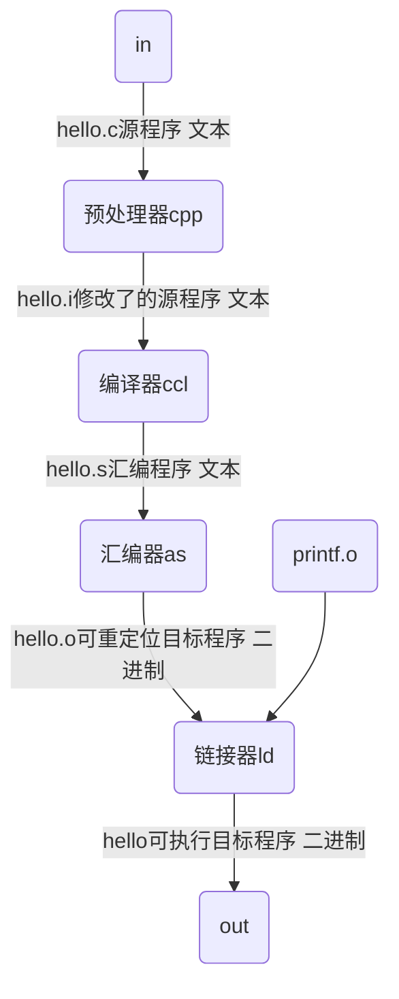

# 01_计算机系统漫游

> 通过程序生命周期理解计算机系统的主要概念和主题

```c
#include<stdio.h>

int main(){
	printf("hello,world\n");
	return 0;
}
```

## 信息、程序与指令

### 信息

- 整个计算机系统中的所有信息都可以用一串比特的形式表示
- 区分不同的数据对象的方法是读到这些对象时的上下文
  - 不同的上下文，同样的字节序列可能表示整数、浮点数、字符串或机器指令等

### 程序

#### 编译器驱动程序

```
linux> gcc -o hello hello.c
```

> 四个阶段共同构成编译系统



#### 预处理阶段

- 根据头文件修改原始的C程序

#### 编译阶段

- 将文本文件hello.c翻译为文本文件hello.s
- 包含汇编语言程序，以及函数main的定义，以文本格式描述低级机器语言指令
- 汇编语言为不同高级语言的不同编译器提供通用的输出语言

#### 汇编阶段

#### 链接阶段

### 指令与处理器

#### 系统硬件组成

## 高速缓存

## 存储设备层次结构

## 操作系统管理硬件

### 进程

#### 线程

#### 虚拟内存

#### 文件

## 系统间网络通信

## 重要主题

### Amdahl定律

### 并发和并行

### 计算机系统中抽象的重要性