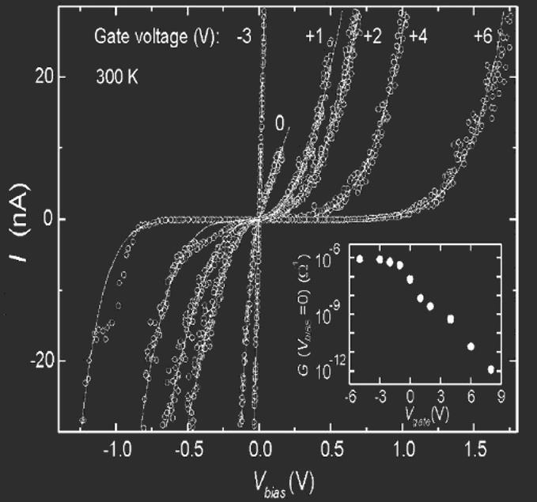
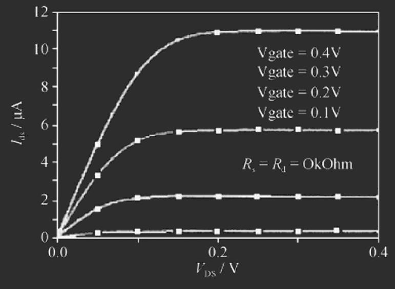

# 场效应晶体管

[TOC]

## 碳纳米管场效应晶体管 (FET)

### 与普通半导体的区别

- 半导体在掺杂之后，根据其掺杂的种类不同，导电方式分为P型和N型半导体
- 半导体性质的碳纳米管的导电方式根据加在其径向方向上的偏压不同而改变
  - 在加正偏压的情况下，碳纳米管内部的载流子为电子，属于n型
  - 如加偏压为负，碳纳米管的载流子为空穴，导电类型为p型

### 典型碳纳米管分立器件结构

#### 1998：首次提出

- 荷兰道尔夫特工业大学Tans S. J. 等于1998年首次提出利用碳纳米管制备场效应晶体管
  - 硅衬底做背栅 (衬底上通过热氧化生长1层厚300 nm的SiO2层)
  - 制备Pt作电极,再利用自组装技术将半导体型的单根单壁碳纳米管搭接Pt电极上
- 从I-V特性曲线可看出电流在nA量级
  - Vgate为零时，I-Vbias特性曲线出现了一些小的非线性
  - Vgate为正时，在Vbias=0附近出现明显的间隙状态非线性
  - Vgate为负时，I-Vbias特性曲线变为线性，电阻饱和于1 kΩ附近

#### 2004：垂直结构

- Hoenlein等提出新型垂直碳纳米管结构的场效应晶体管
  - 垂直生长单壁碳纳米管 (SWCNT)直径为1 nm，长为10 nm
  - 制备的同轴栅介质和栅的厚度约为1 nm，SWCNT的上、下端分别为源漏极
  - 垂直CNT-FET的优越性表现为CNT的垂直生长比水平生长更容易

#### 2004：双壁结构

- 中国科学院物理研究所的梁迎新等提出双壁碳纳米管场效应晶体管
  - 低电导率的DWCNT内壁 (直径1.34 nm)作为栅
  - 高电导率的DWCNT外壁 (直径1.73 nm)作为导电沟道
- 理论上器件的关断电流为0.03 μA，开启电流为14 μA
- 实际制备时内外壁栅极定位难以实现，基本没有实用化的可能性

#### 2006：双栅结构

- Bae-Horng Chen等提出双栅 (底栅+顶栅)结构的、SWCNT沟道导电类型可调的CNT-FET
  - 在980℃下通过湿法氧化获得600 nm的栅氧化层
  - 低等离子增强化学气相沉积 (PECVD)沉积200 nm的氧化层或氮化硅层
  - RF 溅射法制备150 nm的源漏和钛栅极
- 底栅施加正偏压，顶栅电压0~-12 V时，源漏电流随顶栅压的减小而减小，导电沟道可以有效实现夹断
- 底栅施加负偏压，顶栅电压0~-12 V 时，源漏电流随顶栅压的减小而增大

#### 2008：新型围栅

- Chen等提出新型围栅结构 (GAA)的CNT-FET
  - 碳纳米管CNT完全被栅介质层 和Ti/Au栅极包裹
  - 源漏间距为100 nm
  - 利用原子层沉积 (ALD)法制备10 nm的Al2O3
  - 湿法腐蚀去除栅极以外的氮化钨和Al2O3
- 器件的阈值电压为2 V

#### 2009：多根单壁

- Albert Lin等提出多根单壁碳纳米管构建CNT-FET
  - 沟道内SWCNTs的密度为1~3 根/μm
  - 沟道的宽长比为W/L = 50/1
  - 多通道SWCNTs-FET结构

## 低维材料的态密度

### 三维

- 对于bulk半导体，能量E的可能状态数N

$$
N \propto \vec{k}^3, \frac{dN}{dk} \propto k^2
\\\vec{k}^3: 波矢
$$

- 所以能态密度为$N(E) \propto k^2\frac{1}{k}=k$

- 由于$k \propto E^{\frac{1}{2}}$，所以对于bulk半导体有

$$
N(E) \propto E^{\frac{1}{2}}
$$

### 二维

- 对于在一维上存在约束的二维 (面)结构，电子可以在面内自由运动，但在垂直方向上受到约束
- 对于厚度为L的平板，允许的能态是一系列由下式给出的分立能级

$$
E_{(n)}=\frac{\hbar^2}{2m}(\frac{n\pi}{L})^2
\\n=1, 2, 3, ...
$$

- 能量E的能态数N是在半径为k的圆碟内的状态数，为$N \propto k^2$

- 故$\frac{dN}{dk} \propto k$,因此能态密度与能量无关，为

$$
N(E) \propto k\frac{1}{k}=1
$$

- 各能量组合后的能态密度呈现出与约束相关的台阶，以及台阶间的水平线

### 一维

- 在二维受到约束则给出一维的“量子线”
- 沿着量子线，能态的数目正比于$k$，即$N \propto k$，因此$\frac{dN}{dk}\propto Const$
- 能态密度为$N(E) \propto \frac{1}{k}$，或写成$N(E) \propto E^{-\frac{1}{2}}$
- 组合的能态密度展现出量子约束态导致的尖锐阶跃，在跳跃间为$E^{-\frac{1}{2}}$的变化

### 零维

- 如果在三维上都受到约束，则导致零维的“量子点”
- 此时只出现与量子约束相对应的分离能级，所得的能态密度为一系列的简单的线