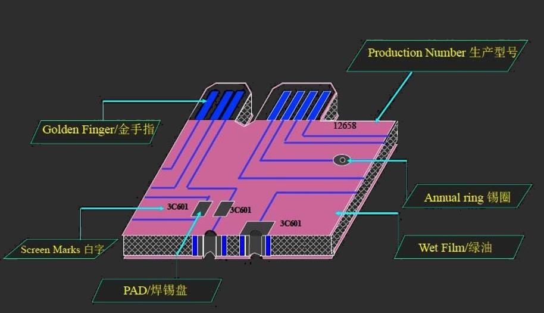
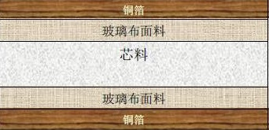

# 第五章：印刷电路板

[TOC]

## 简介

### 定义及典型结构

> Printed Circuit Board，印刷电路板
>
> - 在绝缘基材上，按预定设计，制成印制线路、印制元件或由两者组合而成的导电图形后制成的板
> - 作为元器件的**机械支撑**，提供系统电路工作所需要的**电气连接**，是实现电子产品小型化、轻量化、装配机械化和自动化的重要基础部件

#### 广义

- 在印制线路板上搭载LSI、IC、晶体管、电阻、电容等电子部件，并通过焊接达到电气连通
  的**成品**
- 采用的安装技术
  - 插入安装方式
  - 表面安装方式

#### 狭义

- 没有安装元器件，只有布线电路图形的**半成品**板 (印制线路板)

#### 层次划分

| 层次 |   0   |   1    |  2   |   3   |  4   |
| :--: | :---: | :----: | :--: | :---: | :--: |
|      | Wafer | Module | Card | Board | Gate |

### 历史

- 1903：Mr. Albert Hanson首创利用“线” (Circuit)观念应用于电话交换机系统 (金属箔切割成的线路导体+石蜡纸)
- 1936：
  - Dr. Paul Eisner发明箔膜技术，并申请专利 (减去法)
  - 宫本喜之助以喷附配线法吹着配線方法成功申请专利 (加成法)
  - 由于当时电子器件发热量大，两者均无法使用
- 1950：
  - 玻璃基板上以银漆配线 (日本)
  - 酚醛树脂制的纸质酚醛基板 (CCL)上铜箔配线 (日本)
    - 覆铜板 (Copper Clad Laminate)由玻纤布等作增强材料，**浸以合成树脂**，单面或双面覆以铜箔，经加热加压后而成的一种产品
    - 是制作PCB的原材料，PCB厂是CCL厂的下游行业
    - 将CCL通过显影蚀刻掉不需要的铜箔形成线路
    - 如果是多层PCB，还要将多个蚀刻好线路的CCL用粘结片进行层压，形成多层板
- 1953：Motorola开发出电镀贯穿孔法的双面板
- 1961：美国Hazeltine Corporation参考了电镀贯穿孔法，制作出多层板
- 1967：增层法之一的 “gPlated-up technology”
- 1979：Pactel发表增层法之一的 “Pactel法”
- 1984：NTT开发薄膜回路的 “Copper Polyimide法”
- 1988：西门子开发Microwiring Substrate的增层印刷电路板
- 1990：BM 开发“表面增层线路” (Surface Laminar Circuit，SLC)的增层印刷电路板
- 1995：松下电器开发**全层内部导通孔** (Any Layer Interstitial Via Hole, ALIVH)的**增层印刷电路板**
- 1996：东芝开发B2it的增层印刷电路板

### 基本制作方法

#### 减除法 (先加铜再去除部分)

- 铜箔基板 (上下是薄铜片，如果加热中间材料会变硬)
- 钻孔
- 化铜+镀铜
- 影像转移 (一般用负光刻胶上下贴膜)
- 蚀刻
- 防焊

#### 全加成法 (后期镀铜)

- 树脂积层板 (不含铜箔)
- 钻孔
- 树脂表面活化
- 印阻剂 (抗镀、抗焊) <和上一步一起，实现光刻显影>
- 化学铜析键
- 防焊

## 分类

### 分类

- 按电路类型
  - 插装PCB
  - 表面贴装PCB
- 按基材机械强度
  - 硬式 (刚性)PCB
  - 软式 (挠性)PCB
  - 柔性PCB (塑料膜)
- 按电路层数
  - 单面PCB
    - 只有一层导电图形层，单面覆铜板
  - 双面PCB
    - 有两层导电图形层,双面板的压板材料只有P片 (Prepreg, 半固化片)和Cu箔、双面覆铜板
  - 多层PCB
    - 由三层及以上的导电图形层与绝缘材料交替层压粘结在一起制成的印刷电路板
    - 压板材料既有P片和最外层的两个Cu箔，还有P片之间的内层覆铜板

### 半固化片

- 在多层电路板层压时使用的半固化片，是覆铜板在制作过程中的半成品
- 在环氧玻纤布覆铜板生产过程中，玻纤布经上胶机上胶并烘干至B阶，这种半成品称黏结片
  - B阶：高分子物已经相当部分关联，但此时物料仍然处于可溶、可熔状态
- 用途
  - 直接用于压制覆铜板 ，通常称为黏结片
  - 直接作为商品出售，供应印制板厂，该片用于多层板的压合，通常称为半固化片
  - 英文名均为Prepreg，生产过程一样

### PCB分类

- 结构
  - 单面板
  - 双面板
  - 多面板
- 硬度性能
  - 硬板
  - 软板
  - 软硬板
- 孔的导通状态
  - 暗孔板
  - 盲孔板
  - 明孔板
- 生产及客户需求
  - 喷锡板
  - 镀金板
  - ENTEK板
  - 碳油板
  - 金手指板

### PCB基材分类

- 按**增强材料** (最常用)
  - 纸基板 (FR-1,FR-2,FR-3)
  - 环氧玻纤布基板 (FR-4,FR-5)
  - 复合基板 (CEM-1,CEM-3)
  - HDI板材 (RCC)
  - 特殊基材 (金属类基材、陶瓷类基材、热塑性基材等)
- 按**树脂**
  - 酚酫树脂板
  - 环氧树脂板
  - 聚脂树脂板
  - BT树脂板
  - PI (聚酰亚胺)树脂板
- 按**阻燃性能**
  - 阻燃型 (UL94-VO,UL94-V1)
  - 非阻燃型 (UL94-HB级)

> - 刚性板
>   - 纸基板
>     - 非阻燃型：XPC、XXXPC
>     - 阻燃型 (V-0，V-1)：FR-1、FR-2、FR-3
>   - 复合基板
>     - 非阻燃型：CEM-2、CEM-4
>     - 阻燃型 (V-0，V-1)：CEM-1、CEM-3
>       CEM-5
>   - 玻纤布基板
>     - 非阻燃型：G-10、G-11
>     - 阻燃型 (V-0，V-1)：FR-4、FR-5
>     - PI板、PTFE板、BT板、PPE (PPO)板、CE板等
>   - 涂树脂铜箔 (RCC)、金属基板、陶瓷基板等
> - 挠性板：聚酯薄膜挠性覆铜板、聚酰亚胺薄膜挠性覆铜板

## 硬式印制电路板

### 绝缘体材料

#### 树脂 (Resin)

- 环氧树脂 (Epoxy)
  - 目前印刷线路板业用途最广的底材。液态时称为清漆或凡立水 (Varnish)
  - 主要成分
    - 单体：双酚A (Bisphenol A)，表氯醇 (Epichlorohydrin)
    - 架桥剂 (即硬化剂)：双氰胺(Dicyandiamide)
    - 速化剂：(BDMA)及 (2-MI)
    - 溶剂：乙二醇甲醚，乙烯乙二醇和二甲基甲酰胺等
    - 稀释剂：丙酮，甲基乙基酮
  - 优点：价格低廉，介电常数小，与銅箔的附著力很強，与玻璃纤维結合后之挠性強度较佳
- 酚醛树脂 (Phenolic)
- 聚酰亚胺树脂 (Polyimide, PI)
  - 玻璃化温度 $T_g\approx 260℃$
  - 优点
    - $T_g$高，在高温下具有良好性质,如介电性、尺寸稳定性等
    - 不容易产生胶渣，对内层与孔壁的连接性比FR4好
  - 缺点：不易溴化，价格昂贵，常温下有吸湿 (可用于湿度传感器)
- 聚四氟乙烯 (Polytetrafluorethylene)
- B-三氮树脂 (Bismaleimide Triazine, BT)
  - $T_g\approx 180℃$
  - 优点：耐热性好，抗撕裂强度理想，可以难燃处理，介电常数小
  - 缺点：易出现漏电现象，受湿气及高温影响，易出现爆米花现象
- 苯并环丁烯 (Benzocyclobutene, BCB)
- 高性能环氧树脂 (Multifunctional Epoxy)
  - 酚醛树脂+环氧树脂
  - 具有空间架桥结构，$T_g$较高，可耐较差的热环境
  - 优点：改善了抗水性、抗化性及尺寸稳定性，$T_g$也随之提高
  - 缺点：因本身硬度及脆性而易毁坏钻头，胶渣不易除去

#### 玻璃纤维

> 玻璃纤维在PCB基板中的功用，是作为补强材料。基板的补强材料尚有其他几种，如纸质基板的纸材，Kelvar纤维，以及石英纤维

- A：高碱性
- C：抗化性
- E：**电子用途** (介电性及抗水性优良)
- S：高强度

#### 复合基板

- 面料和芯料由不同的增强材料构成的刚性覆铜板，称为复合基覆铜板
  - 主要是CEM系列覆铜板
  - 其中**CEM-1 (环氧纸基芯料)**和**CEM-3 (环氧玻璃无纺布芯料)**是CEM中两个重要的种类
- 具有优异的机械加工性，适合冲孔工艺
- 由于增强材料的限制，一般板材最薄厚度为0.6mm，最厚为2.0mm
- 填料的不同可以使得基材有不同功能：如适合LED用的白板、黑板、家电行业用的高CTI板等
- **CEM-1**
  - 覆铜板结构
    - 面料是玻纤布，芯料是纸或玻璃纸， 树脂均是环氧树脂
    - 产品以单面覆铜板为主
  - 特点
    - 产品的主要性能优于纸基覆铜板
    - 具有优异的机械加工性
    - 成本低于玻纤覆铜板
- **CEM-3**
  - 性能水平、价格介于CEM-1和FR-4之间的复合型覆铜板层压板
  - 用浸渍环氧树脂的玻纤布作板面，环氧树脂玻纤纸作芯料，单面或双面覆盖铜箔后热压而成

##### 复合基板CEM增强材料

- 玻璃纸或纤维纸
  - CEM-3 玻璃纸
  - CEM-1 纤维纸
- 玻璃布
  - 7628为主要填料
  - 氢氧化铝、滑石粉等

### 导体材料

#### 铜箔

- 碾轧法：铜块碾轧制片而成，延展性高, 但与基材的附着力不好，成本较高，另外,因技术问题，所制宽度受限
- 电镀法：利用硫酸铜镀液，在渡槽中以非常高的速度冲动镀液，以600ASF的高电流密度将柱状结晶的铜层镀在不锈钢之上再撕下
- 优点：价格便宜，可得各种厚度铜箔
- 缺点：延展性差，应力极高易折断

##### 铜箔的表面处理

- **硫化处理** (在含有硫酸铜和硫酸镍的溶液中电镀，形成含镍化合物，增加抗剥强度)
- 在粗面上**镀黄铜与锌** (防止树脂中Dicy高温下对铜箔的侵蚀)
- 对光面与粗面**钝化处理** (防污防锈)

##### 厚度单位

- **盎司/平方英尺**：一平方英尺面积上覆盖的铜箔重量
- 常见规格：1/8,1/4,1/2等

### 胶片制作

> 预浸料坯 (Prepreg，P片)：玻璃纤维或其它纤维浸泽树脂，经部分聚合而成
>
> - 树脂是B-stage
> - 又称Bonding Sheet

玻璃布 + Varnish ==> Coating ==> Drying (Solvent Removal) ==> B-Staging (Chemical Advancement) ==> Prepreg

#### 常见胶片种类

- 大部分EPOXY系统之储放温度要求在5℃以下，其寿命约在3~6个月
- 储放超出此时间后，须取出再做各分析以判定是否可再使用
- 1mil = 1/1000inch = 0.00254cm = 0.0254mm
- Prepreg厚度通常可变化范围是4-6mil

### 电路板制作

- PCB产业几乎是以OEM，也就是受客户委托制作空板
  - OEM：委托方提出产品设计方案
  - ODM：从设计到生产都由生产方自行完成
  - 关键在于谁有知识产权，前者是代工，后者是贴牌
- 目前PCB制造面临的几个挑战
  - 薄板
  - 高密度
  - 高性能
  - 高速
  - 产品周期缩短
  - 降低成本等

#### 流程

##### 制前设计流程

- 客户需要提供的数据

  - 料号资料 (Part Number)

    - 内容：料号版别，更改历史，日期及发行信息
    - 格式：和Drawing一起或另有文本文档

  - 工程图 (Drawing)

    - 内容

      - 料号工程图：一些特殊需求，如原物料需求、特性阻抗控制、防焊、文字种类、颜色、尺寸容差，层次等
      - 钻孔图：此图通常标示孔位及孔号
      - 连片工程图：包含每一小片的位置、尺寸、折断边、工具孔相关规格、特殊符号以及特定制作流程和容差

      - 迭合工程图：包含各导体层、绝缘层厚度、阻抗要求、总厚度等

    - 格式：HPGL及Post Script

  - 底片资料 (Artwork Data)

    - 内容：线路层、防焊层、文字层
    - 格式：Gerther (RS-274)

  - Aperture List

    - 内容：定义各种pad的形状、一些特别的如thermal pad并特别定义construction方法
    - 格式：文本文件

  - 钻孔资料

    - 内容：定义孔位置、孔号、PTH & NPTH、盲孔或埋孔层
    - 格式：Excellon  Format

  - 钻孔工具档

    - 内容：定义孔径、电镀状态、盲埋孔、档名
    - 格式：文本文件

  - 网表资料

    - 内容：定义线路的连通
    - 格式：IPC-356或其他从CAD输出的各种格式

  - 制作规范

    - 内容：
      - 指明依据的国际规格，如IPC、MIL
      - 客户自己的PCB进料规范
      - 特殊产品必须的规格，如PCMCIA
    - 格式：文本文件

- 资料审查

  - 审查客户的产品规格，是否厂内制程能力可及
  - 原物料需求 (BOM-Bill of Material)
  - 有无户ECO (Engineering Change Order)

- 着手设计，决定流程

  - 双面金手指 (负片制程)
    - 裁板 ==> 钻孔 ==> 去巴里 ==> 化学铜 ==> 第一层铜 ==> 压干膜 ==> 曝光 ==> 显像 ==> 第二层铜 ==> 镀Sn/Pb ==> 剥膜 ==> 蚀刻 ==> 剥Sn/Pb ==> 防焊(LPI) ==> 曝光 ==> 显像 ==> 硬化 ==> 喷锡 ==> 镀金手指 ==> 成型 ==> 检测 ==> 包装出货

- CAD/CAM作业

#### 细节

- 裁板 (Board Cut)
  - 目的
    - 依照制前设计所规划的要求，将基板材料裁切成工作所需尺寸
  - 主要原物料：基板，锯片
    - 基板由铜皮和绝缘层压合而成，依要求有不同板厚规格，可分为H/H，1oz/oz，2oz/oz等种类
  - 注意事项
    - 避免板边巴里影响品质，裁切后进行磨边和圆角处理
    - 考虑涨缩影响，裁切板送下制程前进行烘烤
    - 裁切需注意机械方向一致的原则
- 前处理 (Pretreat)
  - 目的
    - 去除铜面上的污染物，增加铜面粗糙度，以利于后续压膜过程
  - 主要原物料
    - 刷轮
- 压膜 (Lamination)
  - 目的
    - 将经处理的基板铜面透过热压方式贴上抗蚀干膜
  - 主要原物料：干膜 (Dry Film)
    - 溶剂显像型
    - 半水溶液显像型
    - 卤水溶液显像型
    - 水溶性干膜主要是因为含有机酸根，会与强碱反应，可被水溶掉
- 曝光 (Exposure)
  - 目的
    - 经光源作用将原始底片上的图像转移到感光底板上
  - 主要原物料：底片
    - 内层作用底片为负片，即白色透光部分发生聚合反应，黑色部分则因不透光而不发生反应，外层所用底片刚好与内层相反，底片是正片
- 显影 (Developing)
  - 目的
    - 用碱液作用将未发生聚合反应的干膜冲掉，发生聚合反应的干膜作为蚀刻时的抗蚀保护层保留。由于比较厚，干膜一般是负胶
    - 主要原物料：Na2CO3
- 蚀刻 (Etching)
  - 目的
    - 利用药液将显影后露出的铜刻蚀掉，形成内层线路图形
  - 主要原物料：蚀刻药液 (CuCl2)
- 去膜 (Strip)
  - 目的
    - 利用强碱将保护铜面的抗蚀层剥掉，露出线路图形
  - 主要原物料：NaOH

> 黑氧化/棕化 ==> 铆合 ==> 叠板 ==> 压合 ==> 后处理
>
> 目的是将铜箔，胶片与氧化处理后的内层线路板压合为多层板

- 黑氧化

  - 作用：粗化铜表面，增大结合面积，增加表面结合力

  - 原理：铜的氧化形式有两种：CuO (黑色)，Cu2O (紫红色)，而黑氧化的产物是两种形式以一定比例共存

    2Cu + 2ClO2- ==> Cu2O + ClO3- + Cl- 

    Cu2O + 2ClO2- ==> 2CuO + ClO3- + Cl- 

  - 基本流程：上版 ==> 除油 ==> 水洗 ==> 微蚀 ==> 水洗 ==> 第一次黑氧化 ==> 水洗 ==> 微蚀 ==> 水洗 ==> 预浸 ==> 第二次黑氧化 ==> 水洗 ==> 热水洗 ==> 烘干 ==> 落板

  - 流程缺陷：黑化工艺，使得树脂与铜面的接触面积增大，结合力加强。但同时也带来了一种缺陷：**粉红圈**

    - 黑氧化层的Cu2O和CuO变成Cu

  - 解决方法：

    - 提高黑化膜的抗酸能力
    - 引入新的工艺流程

- 棕化

  - 原理：在铜表面通过反应产生一种均匀，有良好粘合特性及粗化的有机金属层结构 (通常形成铜的络合物)
  - 优点
    - 工艺简单、容易控制
    - 棕化膜抗酸性好，不会出现粉红圈缺陷
  - 缺点
    - 结合力不及黑化处理的表面
    - 两种工艺的线拉力有较大差异

- 铆合 (预叠)

  - 目的：利用铆钉 (四层板不需要铆钉)将多张内层板钉在一起，以避免后续加工时产生层间滑移
  - 主要原物料：铆钉；P/P
    - P/P (Prepreg)：由树脂和玻璃纤维布组成，据玻璃布种类可分为1060，1080，2116，7268等几种
    - 树脂据交联状况可分为
      - A阶：完全未固化
      - B阶：半固化 (生产中使用)
      - C阶：完全固化

- 叠板

  - 目的：将预叠合好的板叠成待压多层板形式
  - 主要原物料：铜皮。电镀铜皮按厚度可分为
    - 1/30Z (T)
    - 1/20Z (H)
    - 10Z (1)
    - RCC (覆树脂铜皮)

- 压合

  - 目的：通过热压方式将叠合板压成多层板
  - 主要原物料：牛皮纸，钢板

- 后处理

  - 目的：经切割、打靶、捞边、磨边等工序对压合的多层板进行初步外形处理，以便后续生产品质控制要求及提供后工序加工的工具孔
  - 主要原物料：钻头，铣刀

- CCD冲孔

  - 目的：利用CCD对位冲出检验作业的定位孔和铆钉孔
  - 主要原物料：冲头
  - 注意事项
    - CCD冲孔精度直接影响铆合对准度，故机台精度定期确认非常重要
    - 钻孔作业中会使用的物料有钻针 (Drill Bit),垫板 (Back-up board),盖板(Entry board)等
      - 钻针材料
        - 94%硬度高耐磨性强的碳化钨 (Tungsten Carbide, WC)
        - 6%耐冲击及硬度不错的钴 (Cobalt)
        - 有机粘着剂

- AOI检验

  - Automatic Optical Inspection，自动光学检测
  - 目的：通过光学反射原理将图像回馈至设备处理，与设定的逻辑判断原则或资料图形相比较，找出缺点位置
  - 注意事项：由于测试方式是逻辑比较，一定会存在一些误判，需要人工加以确认

> 钻孔 ==> 去毛头 (Deburr) ==> 去胶渣 (Desmear) ==> 化学铜 (PTH) ==> 一次铜 (Panel Plating)
>
> 目的
>
> - 使孔壁上的非导体部分树脂和玻璃纤维金属化
> - 方便进行后续电镀铜制程，完成足够导电及焊接的金属孔壁

- 去毛头
  - 毛头形成原因：钻孔后边缘未切断的铜丝和玻璃布
  - 目的：去除孔边缘的巴里，防止镀孔不良
  - 重要的原物料：刷轮
- 去胶渣
  - 胶渣形成原因：钻孔时造成的高温超过玻璃化转移温度$T_g$而形成熔融状，产生胶渣
  - 目的：裸露出各层需互连的铜环，而膨松剂可以改善孔壁结构，增强电镀铜的附着力
  - 重要原物料：KMnO4 (除胶剂)
- 化学铜
  - 目的：通过化学沉积的方式使表面沉积厚度为20-40 micro inch的化学铜
  - 重要原物料：活化钯，镀铜液
- 一次铜
  - 目的：镀上200-500 micro inch厚度的铜以保护仅有20-40 micro inch厚度的化学铜不被后制程破坏造成孔破
  - 重要原物料：铜球

> 前处理 ==> 压膜 ==> 曝光 ==> 显影
>
> 目的：经过钻孔和通孔电镀后，内外层已经连通，本制程制作外层线路，以达电性的完整

- 前处理

  - 目的：去除铜面上的污染物，增加铜面粗糙度以利于后续压膜制程
  - 重要原物料：刷轮

- 压膜

  - 目的：通过热压法使干膜紧密附着在干面上

  - 重要原物料：干膜 (Dry Film)

    - 溶剂显像型
    - 半水溶液显像型
    - 卤水溶液显像型

    水溶性干膜主要是由于组成中含有有机酸，会与强卤反应成为有机酸的监类，可溶于水

- 曝光

  - 目的：通过image transfer技术在干膜上曝出客户所需的线路
  - 重要的原物料：底片
    - 外层所用底片与内层相反，为负片，底片黑色为线路，白色为底板 (白底黑线)
    - 白色的部分紫外光投射过去，干膜发生聚合反应，不能被显影液洗掉

- 显影

  - 目的：把尚未发生聚合反应的区域用显像液将之冲洗掉，乙感光部分则因已发生聚合反应洗不掉而留在铜面上成为蚀刻或电镀的阻剂膜
  - 重要原物料：弱碱 (Na2CO3)

> 二次镀铜 ==> 镀锡 ==> 剥膜 ==> 线路蚀刻 ==> 剥锡
>
> 目的：将铜厚度镀至需求厚度，完成所需求的线路外形

- 二次镀铜
  - 目的：将显影后的裸露铜面的厚度加厚，以达到客户需求
  - 主要原物料：铜球
- 镀锡
  - 目的：在完成二次镀铜的表面镀上一层锡保护膜作为蚀刻时的保护剂
  - 主要原物料：锡球
- 剥膜
  - 目的：将抗电镀的干膜用药水剥除
  - 主要原物料：剥膜液 (KOH)
- 线路蚀刻
  - 目的：将非导体部分的铜蚀掉
  - 主要原物料：蚀刻液 (氨水)
- 剥锡
  - 目的：将导体部分的起保护作用的锡剔除
  - 主要原物料：HNO3+H2O2两液型剥锡液

##### 绿油：阻焊膜

- 定义：涂覆在印制板不需焊接的线路和基材上的保护膜

- 目的：防止焊接时线路间产生桥接，同时提供永久性的电气环境和抗化学保护层

- 工作原理

  - 液态光成像阻焊油墨简称感光胶或湿膜
  - 感光胶经网印并预烘后，进行光成像曝光，紫外光照射使具有自由基的环氧树脂系统产生光聚合反应
  - 未感光部分 (焊盘被底片挡住)，在稀碱液中显影喷洗而清除
  - 已感光部分进行热固化，使树脂进一步交联成为永久性硬化层

  > 基本制作流程：前处理 ==> 丝印 (Screen Printing) ==> 停放15min ==> 预固化 ==> +复制黄菲林 (Duplicate GII Film) 曝光 ==> 停放15min ==> 显影 ==> 终固化 (Baking)

- 前处理
  - 目的
    - 除去铜箔表面的氧化物，油脂和其它杂质
    - 粗化铜表面，增加表面积，使之能与阻焊油墨有良好的结合力
  - 前处理是丝印阻焊前的十分重要的工序，成品检查出现阻焊膜掉，胶带试验不合格，波峰焊后板面阻焊起泡，阻焊下的大铜面有污物等问题，都同表面处理有关
- 预烘
  - 目的：蒸发油墨中所含的约25%的溶剂，使皮膜成为不粘底片的状态
  - 温度和时间应有限制
- 曝光
  - 将需要留在板子上的油墨经紫外光照射后发生交联反应，在显影时不被褪去
  - 未感光部分则被曝光后的油墨Na2CO3溶液溶解洗掉露出焊盘、焊垫等需焊的区域
  - 曝光后的油墨不溶于弱碱 (1%Na2CO3)但可溶于强碱(5%-10%NaOH),
  - 从而达到既可显影又可及时使有问题的板返工处理的目的
- 显影
  
  - 目的：使油墨中未感光部分溶解于显影液而被洗去，留下之感光部分，起绝缘、保护的作用
- 终固化
  
  - 目的：使阻焊油墨彻底固化，形成稳固的网状构架，达到其电气和物化性能
- 白字 (Component Mark)
  - 元件字符
    提供黄，白或黑色标记，给元件安装和今后维修印制板提供信息
  - 具体采用丝印的方法

### PCB常用字符代号

> 国标 GB/T 4721-1992规定CCL产品型号的字符代号：CXXXX(Y)-XX(?)

- 第一位：C覆铜箔
- 第二，三位：基材所用树脂
  - PF酚醛，EP环氧，UP聚酯，SI有机硅
  - TF聚四氟乙烯，PI聚酰亚胺
- 第四，五位：基板所用增强材料
  - CP纤维纸，GC无碱玻璃布，GM玻璃纤维毡
  - AC芳香族聚酰胺纤维布，AM芳香族聚酰胺纤维毡

> 若以纤维纸为增强材料，在后面加G表示两面贴附无碱玻璃布，字母末尾用”-“连着两位数字表示产品编号，具有阻燃型的CCL在最后加字母F表示，否则不加
>
> 例如：CEPCP(G)-23F：阻燃型环氧纤维纸基，两表面贴附玻璃布覆铜板

#### 常见基材和主要组成

- FR-1：酚醛棉纸，这基材通称电木板 (比FR-2较高经济性)
- FR-2 ：酚醛棉纸
- FR-3：棉纸 (Cotton paper)、环氧树脂
- FR-4：玻璃布 (Woven glass)、环氧树脂
- FR-5：玻璃布、环氧树脂
- FR-6：毛面玻璃、聚酯
- G-10：玻璃布、环氧树脂
- CEM-1：棉纸、环氧树脂 (阻燃)
- CEM-2：棉纸、环氧树脂 (非阻燃)
- CEM-3：玻璃布、环氧树脂
- CEM-4：玻璃布、环氧树脂
- CEM-5：玻璃布、多元酯
- AIN：氮化铝
- SIC：碳化硅