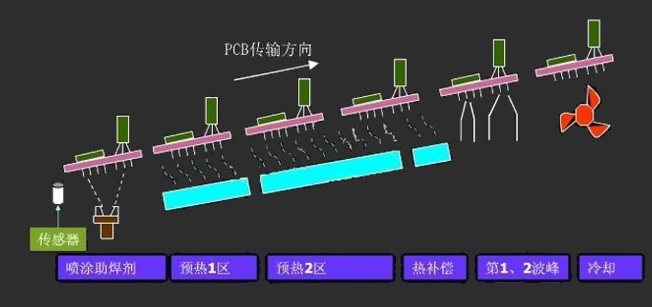

# 第七章：元器件与电路板的接合

[TOC]

## 元器件与电路板的接合方式

### 概述

#### 分类

- 引脚插入式接合 (PTH)：历史最悠久的传统结合方式
- 表面贴装技术接合 (SMT)：应电子封装“轻 薄 短 小”的趋势而开发，后兴的较好的技术

#### 接点功能

- 主要提供热和电能信号的传导
- SMT还可以承载元器件的重量

#### 选择因素

- 封装元器件的形状
- 电路板上元器件与电路连线的密度
- 元器件更换与修护能力
- 可靠度
- 功能需求
- 制作成本

## 引脚插入式接合

### 导孔形状

- 直插型
- 弯曲型
- 半弯曲型
- 铲型
- 迂回结合型

### 焊接形式

- 支撑焊接点
- 无支撑焊接点

### 导孔接合

#### 弹簧固定式的引脚接合

> 将引脚插入已固定于电路板上的双叉型弹簧夹中

- 原理
  - 陶瓷材料与高分子树脂制成的印制电路板的热膨胀系数差异过大
  - 如果直接将陶瓷封装元器件焊接在电路板上容易导致热应力破坏
  - 使用弹簧固定接合，利用弹簧片松弛的效应可以缓解热应力的破坏
- 工艺
  - 元器件对齐、制动机具把引脚推入弹簧夹
  - 机具的推力同时负有磨去污染层以形成低接触电阻接触面的任务
- 弹簧夹材料
  - 耐磨耗
  - 低摩擦系数
  - 通常采用铍铜合金/Ni/Pd/Au
- 优点
  - 可更换或升级元器件
  - 钯改善腐蚀及耐磨性
  - 金降低接触电阻，提供焊接时良好的焊锡润湿性

#### 引脚的焊接接合

> 涂助焊剂 ==> 预热 ==> 涂布焊锡 ==> 吹除多余焊锡 ==> 检测/维护 ==> 清洁

##### 涂助焊剂

> 清洁电路板金属焊接表面与电镀导孔内壁

- 方法
  - 发泡式涂布
  - 波式涂布
  - 喷洒涂布

##### 预热

- 目的
  - 使助焊剂中的溶剂挥发并干燥 (减少焊接时产生的气体)
  - 分解松香，提升助焊剂的活性
    - 去除印制板焊盘、元器件端头和引脚表面的氧化膜以及其它污染物
    - 保护金属表面防止发生高温再氧化
  - 充分预热解决平衡封装元器件温度不均匀现象，防止热爆震波的产生 (对于设计复杂的电路板尤为重要，避免焊接时急剧升温产生热应力损坏PCB板和元器件)
- 一般预热温度为125℃

##### 涂布焊锡

- 方法：波峰焊
  - 通孔插装最常见的焊锡涂布方法
  - 电路板通过锡槽时槽中焊锡的作用
    - 提供焊锡的涂布
    - 刮除及清洁结合点表面金属氧化层
  - 焊锡沉浸的高度为电路板厚度的1/3-1/2
  - 多层电路板中沉浸高度达电路板厚度的1/4
  - 理想情况下，焊锡波与电路板的移动方向相反，移动速度大致相同
- 倾斜式电路板输送焊锡涂布
  - 电路板输送带与焊锡系统维持6-8度的倾斜，获得最佳的涂布效果
  - 可减小电路板离开时焊锡波与电路板所形成的凹面半径
  - 抑制焊锡的过度涂布
  - 降低水柱状焊点或相邻焊点发生桥架短路的曲线

- 波峰焊机中常见的预热方法
  - 空气对流加热
  - 红外加热器加热
  - 热空气和辐射相结合的方法加热
- **温度补偿**
  - 进入温度补偿阶段，经补偿后的PCB板在波峰焊接中减少热冲击
- **第一波峰**
  - 由狭窄的喷口的“湍流”流速快，对具有影阴的焊接部位有较好的渗透性
  - 湍流波向上的喷射力使助焊剂气体顺利排除，大大减少了漏焊以及垂直填充不足的缺陷
- **第二波峰**
  - “平滑”焊锡流动速度更慢
  - 能有效去除端子上的过量焊锡，使所有的焊接面润湿良好
  - 能对第一波峰造成的拉尖和桥接进行充分的修正
- **冷却阶段**
  - 制冷系统使PCB的温度急剧下降
  - 可明显改善无铅焊料共晶生产时产生的空泡及焊盘剥离问题
- **氮气保护**
  - 在焊接整个过程中，在预热阶段和焊接区加氮气保护可有效防止铜和共晶焊料氧化
  - 大幅度提高润湿性和流动性，确保焊点的可靠性
- 焊锡波形变化
  - 对称波
  - 不对称波
    - 焊锡与电路板输送相反方向有大部分的流动量
    - 与电路板输送相同方向仅有小部分流动
    - 是波峰焊最常用的焊锡波形
  - 双波
  - 阶梯波

##### 吹除多余焊锡

- 方法：空气刀 (高压热空气)把多余的焊锡吹走

> 近年来表面贴装技术广泛应用，使焊锡波形的设计变化更多
>
> - <u>在一般层流型波焊前加入扰流型波焊，扰流型的高速泵使焊锡产生脉冲状的焊锡波</u>
> - 目的
>   - 增强焊锡对焊垫表面氧化层磨刮清洁的能力
>   - 增强焊锡深入涂布的能力，避免漏焊发生
>   - 加速助焊剂挥发气体的排除，避免导孔与焊垫发生焊锡填充不足的现象
>     - 后续的层流型波峰焊除具有继续涂布的功能外，还具有将扰流型波峰焊产生的过度涂布除去的功能
>     - 避免发生相邻焊点产生架桥短路

## 表面贴装技术接合

> 无需对PCB钻插装孔而直接将元器件贴焊到PCB表面规定位置上的装联技术

### 概述

#### 概述

- 将必要的IC封装元器件、电容、电阻等置放在电路板表面上，再以适当的焊接技术完成它们的连接
- 适合高密度、微小焊点的接合
- 焊接点功能：电、热传导、元器件重量的支撑

#### 优点

> <u>与传统工艺相比：小型化、高密度、高可靠、低成本、生产自动化</u>

- 能提升元器件接合的密度
- 能减小封装的体积重量
- 获得更优良的电气特性
- 可降低生产成本

#### 主要问题

- 接合的检测困难
- 元器件与基板材料热膨胀系数的差异导致的热应力问题

#### 引脚形式

- 鸥翼型 (L)
  - 适合朝着薄方向发展，适合于安装位置较低的场合
  - 适合各种焊接方法，但缺点是引脚无缓冲余地，在振动应力下易损伤
- 钩型 (J)
  - 基板利用率高，安装更坚固，抗振性强，但安装厚度较高  
- 粗柄型 (I)
  - 并不常用，它是由插装形式的元器件截断引脚形成

|                          | L型  | J型  | I型  |
| :----------------------: | :--: | :--: | :--: |
| 与未来高引脚封装的相容性 | 极佳 |  佳  | 不良 |
|         封装高度         | 极佳 |  佳  | 不良 |
|         引脚刚性         | 不良 | 极佳 |  佳  |
|  与多次焊接制程的相容性  | 极佳 |  佳  |  佳  |
|    过焊时自动对齐能力    | 极佳 |  佳  | 不良 |
|    焊接后检查容易程度    |  佳  |  佳  |  佳  |
|         清洗能力         |  佳  | 极佳 | 极佳 |
|         封装效率         | 不良 | 极佳 |  佳  |

#### 发展简史

- SMT技术自20世纪60年代产生于美国
- 日本在20世纪70年代将SMT技术应用在消费类电子产品
- 欧洲各国SMT的起步较晚，但其发展水平仅次于日本和美国
- 20世纪80年代初期，我国从美、日等国成套引进了SMT生产线用于彩电调谐器生产
- 20世纪80年代中期以来，SMT进入高速发展阶段，90年代初已成为完全成熟的新一代电路组装技术，并逐步取代通孔插装技术

#### 技术现状

- 进入20世纪90年代以来，全球采用通孔组装技术的电子产品正以年11％的速度下降
- 而采用SMT的电子产品正以8％的速度递增
- 到目前为止，日、美等国已有80％以上的电子产品采用了SMT

#### 发展趋势

- 更高的工艺稳定性和可靠性，以满足大批量，专业化生产，降低成本
- 更高的组装精度，以满足微细间距的器件贴装，提高组装密度
- 更高的技术含量，适应新型器件的组装
- 有利于环保，有利于人体健康

#### 常见缩写形式

- SMC (Surface Mounting Components)
  - 表面组装元件，主要指一些无源元件，像电阻、电感，并不需分极性
- SMD (Surface Mounting Device)
  - 表面组装件器件，主要是指有源器件 ，像电容IC类，需要分正负极的
- SMA (Surface Mounting Assembly)
  - 表面组装组件
- SMT (Surface Mounting Technology)
  - 表面贴装技术

### 工艺

|   组装方式   |       组装方式        | 电路基板 |       元器件       |               焊接工艺               |
| :----------: | :-------------------: | :------: | :----------------: | :----------------------------------: |
| 单面混合组装 |        先贴法         | 单面PCB  | 表面贴装及通孔插装 | 一般采用先贴法，先A回流焊，再B波峰焊 |
| 单面混合组装 |        后贴法         | 单面PCB  | 表面贴装及通孔插装 | 一般采用先贴法，先A回流焊，再B波峰焊 |
| 双面混合组装 |    SMD和THC都在A面    | 双面PCB  | 表面贴装及通孔插装 |         先A回流焊，再B波峰焊         |
| 双面混合组装 | THC在A面，两面都有SMD | 双面PCB  | 表面贴装及通孔插装 |         先A回流焊，再B波峰焊         |
|  全表面组装  |     单面表面组装      | 单面PCB  |      表面贴装      |               A回流焊                |
|  全表面组装  |     双面表面组装      | 双面PCB  |      表面贴装      |         先A回流焊，再B回流焊         |

> SMT组装方式与组装工艺流程主要取决于
>
> - 表面组装组件 (SMA)的类型
> - 使用的元器件种类
> - 组装设备条件
>
> 大体上可以将表面组装组件分成
>
> - 单面混装
> - 双面混装
> - 全表面组装

#### 单面混合组装

> 表面组装元器件 (SNMC/SMD)与通孔插装元件 (THC)分布在PCB不同的一面上混装，但其焊接面仅为单面
>
> 采用单面PCB和波峰焊接 (现一般采用双波峰焊)工艺，具体有先贴和后贴两种组装方式

- 先贴法：在PCB的B面 (焊接面)先贴装SMC/SMD，然后在A面插装THC
  - 流程
    - B面涂覆黏着剂
    - B面贴砖表面安装元件
    - 红外加热
    - 黏着剂固化
    - 翻版
    - A面插通孔元件
    - B面波峰焊
    - 清洗
  - 特点
    - 工艺简单，组装密度低
- 后贴法
  - 流程
    - A面插通孔元件
    - 翻版
    - B面涂覆黏着剂
    - B面贴砖表面安装元件
    - 红外加热
    - 黏着剂固化
    - 翻版
    - B面波峰焊
    - 清洗
  - 特点
    - 工艺较复杂，组装密度高

#### 双面混合贴装

> 也有先贴和后贴表面组装元器件 (SMC/SMD)的区别，一般根据表面组装元器件的类型和PCB的大小合理选择，通常采用先贴法较多，该类组装也有两种组装方式
>
> 把表面组装集成芯片 (SMIC)和THC放在PCB的A面，把SNMC和小外型晶体管 (SOT)放在B面
>
> 这种组装方式由于在PCB的单面或双面贴装SMC/SMD，又把难以表面组装化的有引线元件插入组装，因此组装密度相当高

- SMC/SMD 和THC同侧方式
- SMC/SMD 和THC不同侧方式

#### 全表面贴装

> 全表面组装中，在PCB上只有SMC/SMD而无THC。由于目前元器件还未完全实现SMT化，实际应用中这种组装方式不多

- 单面表面组装：采用单面PCB在单面组装SMC/SMD
- 双面表面组装：采用双面PCB在两面组装SMC

### 锡膏和黏着剂的涂覆

#### 锡膏涂覆：印刷法

- 就是将焊膏以印刷的方法通过丝网板或模板的开口孔涂敷在焊盘上

|     成分     |                 主要材料                 |            作用             |
| :----------: | :--------------------------------------: | :-------------------------: |
| 焊料金属粉末 |                   SnPb                   |       SMD与电路的连接       |
|    活化剂    | 松香，甘油硬脂酸酯，盐酸，联氨，三乙醇酸 |       金属表面的净化        |
|    增粘剂    |           松香，松香脂，聚丁烯           | 净化金属表面，与SMD保持粘性 |
|     溶剂     |              丙三醇，乙二醇              |     对焊膏特性的适应性      |
| 摇溶性附加剂 |          Castor石腊 (腊乳化液)           |   防离散，塌边等焊接不良    |

##### 丝网印刷法

- 将丝网 (单根聚脂丝或不锈钢丝)紧绷在铝制框架上， 获得一个平坦而有柔性的丝网表面
- 丝网上粘有光敏乳胶，用光刻法制作出开口图形。开口部分与印制板上的焊盘相对应

##### 模板印刷法

- 模板的结构
  - 在金属模板上通过激光切割、电镀或蚀刻的方法制作出开口图形
- 模板的类型
  - 全金属模板：不锈钢板或黄铜板 (变形量小的材料)
  - 柔性金属模板:将金属模板粘接在丝网上，实际上是丝网板与金属模板的结合
- 钢模板制备
  - 化学蚀刻模板
    - 成本低，孔壁较粗糙
  - 激光切割模板
    - 可以开出梯形孔 , 孔壁粗糙度一般为5-6μm左右;成本稍高 
    - 在加工时熔化金属的飞溅会使模板表面比较粗糙，不过经过抛光工序后，可以改善这一点
  - 电铸模板
  - 孔壁粗糙度一般为2.5μm左右，很高的精度
  - 开口的周围可加工出密封圈,形成完整的焊膏形状
  - 电镀工艺不均匀失去密封效果，密封块可能会去掉
  - 成本高,制作周期长

##### 模板与丝网印刷在锡膏涂覆中的比较

- 结构方面
  - 模板的图形开口处没有丝网网格，具有完全的开口面积
  - 丝网的图形开口处只提供大约1/2的开口面积
- 印刷工艺方面
  - 丝网印刷时丝网与基板必须保持阶跃距离，称为非接触印刷
  - 模板印刷时模板与基板之间可以没有距离，可以采用接触 (金属板)和非接触 (柔性板)两种印刷方式
- 优缺点分析
  - 使用角度
    - 模板印精度优于丝网印，它印刷时可直接看清焊盘，因此定位方便
    - 模板印刷可使用的粘度范围大，开口不会堵塞，容易清洗
  - 制造角度
    - 丝网制作成本低、制造周期短，适于快速周转
  - 印刷设备
    - 模板印刷可采用各种类型 (手动、全自动)
    - 丝网印刷因定位困难，只能采用全自动印刷机
- 共同特点
  - 高效快速，可一次性完成对基板的涂膏
  - 印刷时焊膏是暴露在空气中,容易被污染

#### 黏着剂涂敷技术

> 在SMC/SMD主体的下方 (非焊接部位)涂敷黏着剂

- 作用
  - 是在焊接前固定它们的位置
- 实际生产时需要用到的两种情况
  - 采用波峰焊焊接前，需先将片状元件用胶粘剂粘贴在基板的规定位置，然后才能进入波峰焊焊接
  - 采用再流焊焊接双面板前，为防止先焊好的A面上的大型器件在B面再流焊时脱落，需要在先焊的A面大型器件下点胶，将其粘接在基板上

##### 常用黏着剂

- SMT使用的黏着剂，又称贴片胶，是一种红色的膏状体
- 主要成分：胶粘剂、固化剂、颜料、溶剂
- 常用的表面安装胶粘剂主要有两类
  - 环氧树脂
    - 属于热固型、高粘度的胶粘剂
    - 耐腐蚀的能力最强, 但易脆裂
    - 有单组分和双组分两种，可以做成液体、膏剂、薄膜和粉剂等形式供使用
    - 用途最为广泛的胶粘剂
  - 聚丙烯类
    - 在紫外线照射及适当加热下几秒钟内能固化，其粘度特性非常适合于高速点胶机
    - 但粘结强度略低，是比较新型的胶粘剂

##### 常用涂敷方法

- 丝网印刷法
  - 与焊膏的印刷方法相仿
- 针式转印法
  - 操作
    - 采用针矩阵模具
    - 先在贴片胶供料槽上蘸取适量的胶
    - 然后转移到PCB的点胶位置上同时进行多点涂敷
  - 优点
    - 效率高
    - 投资少
    - 适用于单一品种的大批量生产
  - 缺点
    - 胶量不易控制
    - 胶槽中易混入杂质，影响粘结质量
    - PCB改版时，需重新制作一套针矩阵模具
- 分配器点涂法
  - 将焊膏置于注射器内部并借助于气动、液压或电驱动方式加压，使焊膏经针孔排出点在PCB基板的焊盘表面
  - 形状由注射针尺寸、点胶时间和压力大小来控制
- 分配器点涂法与印刷法的比较
  - 速度
    - 注射法是逐点进行，速度较慢；印刷法是一次完成
  - 适应性
    - 注射法非常灵活，可应用在丝网/模板不能采用的场合
    - 通用性强，适用于小批量、多品种的生产模式
    - 印刷法适用于大批量、单一品种的生产

### 贴片技术

- 在涂膏或点胶完成后，通过机械手利用真空吸力将料盘或编带中的SMT元件拾取后贴到PCB表面指定位置
- 可以采用手工、半自动、全自动的方式，贴片设备通常叫做贴片机
- 由于片状元器件的微小化、安装的高密度的特点，贴片作业基本上均需采用贴片机，手工贴放只是在很少的情况下使用

#### 手工贴片

- 手工贴放片状元器件既不可靠、也不经济，但在试生产时往往还需采用这种方式
- 元件的贴放主要是拾取和贴放下去两个动作
- 手工贴放时，最简单的工具是小镊子，但最好是采用手工贴放机的真空吸管拾取元件进行贴放

#### 自动贴片 

- 在规模生产中，由于贴片的准确度要求，几乎迫使人们必须采用自动化设备

- 在中等产量的表面安装生产线中，贴片设备的费用约占总投资的50%

- 自动贴片机基本结构

  - 机器本体
    - 用来安装和支撑贴装机的底座
    - 一般采用高刚性金属机架，配合防震橡胶脚座来支撑整机
  - 片状元器件供给系统
    - 供料系统由元器件包装容器及机械供料器组成
    - 供料系统的工作方式根据元器件的包装形式和贴片机的类型而确定
    - 元器件的包装形式有散装、编带、棒式、托盘四种
    - 步骤
      - 贴装前，将各种类型的供料装置分别安装到相应的供料器支架上
      - 随着贴装进程，装载着多种不同元器件的散装料仓水平方向运动，把即将贴装的那种元器件送到料仓门的下方，便于贴装头拾取
      - 纸带包装元器件的盘装编带随编带架垂直旋转，管状和定位料斗在水平面上二维移动，为贴装头提供新的待取元件
  - 印制板传送与定位装置
    - 固定的二维平面移动的工作台，在计算机控制系统的操纵下，随工作台移动到工作区域内，并被精确定位，使贴装头能把元器件准确地释放到需要的位置上
  - 贴装头及其驱动定位装置
  - 贴装头 (吸嘴)
    - 相当于机械手
    - 动作由拾取/贴放、旋转/定位两种模式组成
    - 步骤
      - 贴装头通过程序控制完成三维的往复运动，实现从供料系统取料后移动到SMB的指定位置上
      - 贴装头的端部有一个用真空泵控制的吸盘，当换向阀打开时，吸盘上的负压把元器件从供料系统中吸上来
      - 当换向阀门关闭时吸盘把元器件释放到SMB上
  - 计算机控制系统
    - 贴片机能够准确有序地工作，其核心机构是微型计算机
    - 通过计算机程序，控制贴片机的自动工作步骤
  - 光学检测与视觉对准系统
    - 比较先进的贴装机为适应高密度超大规模集成电路
    - 保证芯片能够高精度地准确定位
    - 以计算机为主体的图像观察、识别和分析系统
    - 视觉检测系统的主要功能
      - 基板的精确定位
      - 元器件定心和对准
      - 元器件有/无
      - 机械性能及电器性能的检测等

  > - 随着SMT技术的发展，全自动贴片机的功能、效率、精度及灵活性越来越强，全视觉、多功能、模块式、高速度的贴片机不断推出
  > - 能适应从片状元件直至BGA、 CSP及0.3mm细间隙QPF等精密器件的贴放
  > - 精度达到 0.03mm
  > - 贴片速度达到0.04s/片甚至更高
  > - 所以，SMA的组装效率之高是通孔插装组件所无法比拟的

### 焊接技术

> 常用焊接方法：波峰焊、回流焊

#### 波峰焊

> 用黏着剂把元器件固定在印制电路板上后，再通过波峰焊涂布焊锡到接合点上

- 注意事项

  - 黏着剂：环氧树脂、丙烯树脂
  - 用网印、针头或喷嘴将黏着剂涂布在元器件位置
  - 用120-150°C热处理或UV照射硬化，将元器件固定

- 优点

  - 技术成熟、适合大量生产、一次焊接完成

- 缺点

  - 高温焊锡的浸渍，损害元器件
  - 不适用于特殊形状、间距很小的表面贴装型元器件的焊接
  - 存在漏焊、焊点架桥短路

  > 可选用合成活化助焊剂与水溶性助焊剂 (低固体成分的松脂或树脂助焊剂)，避免漏焊、抑制焊点架桥，只是增加了后续清洗的困扰

#### 回流焊

> 把锡料印在焊垫上后，放置元器件，再以回流方式，把焊垫加热使锡料再次流动

- 与波峰焊相比

  - 不需要把元器件直接浸渍在熔融的焊料中，元器件受到的热冲击小
  - 仅在需要部位放焊料，能控制焊料量，避免桥接等缺陷
  - 熔融焊料表面张力的作用，能自动校正元器件的位置
  - 可以采用局部加热，同一基板上可以采用不同焊接工艺进行焊接
  - 焊料中不会混入杂质；使用焊膏时能保持焊料的组成

  > - 回流焊技术不适用于通孔插装元器件的焊接
  > - 但随着PCB组装密度的提高和SMT技术的推广应用
  >
  > 回流焊技术正成为电路组装焊接技术的主流

##### 回流焊加热曲线

- 预热区 (Preheat)
  - 作用
    - 将PCB温度从室温提升到预热温度
  - 最佳升温速率：2℃ /sec
    - 速率太大导致对PCB和元器件造成损害，容易发生助焊剂爆喷
    - 加热速率通常受到元器件制造商推荐值的限制，一般最大4℃ /sec，不超过2分钟
    - 速率太小导致助焊剂溶剂挥发不完全
  - 此阶段PCB上各元器件升温速率存在差异，PCB上存在温度梯度分布
- 保温/渗透区 (Dryout)
  - 作用
    - 使PCB各区域在进入焊接区前温度达到均匀一致
    - 助焊剂得到足够蒸发
    - 树脂、活性剂充分清理，焊接区域去除氧化膜
  - 理想状态
    - 温度均匀，焊盘、钎料球、元件引脚上的氧化膜均被清除
  - 保温区长度与PCB有关
- 再流区 (Reflow)
  - 作用
    - 使钎料熔化并可靠的润湿被焊金属 (焊盘、元件引脚)表面
  - 温度设定
    - 温度高时助焊剂效率高，钎料粘度、表面张力下降，有助于更快的润湿
    - 过高则造成PCB和元器件热损伤
  - 钎料熔融时间
    - 30-60sec
    - 过短助焊剂未完全消耗，焊点中存在杂质
    - 过长会使焊点变脆，元件受损
- 冷却/凝固区 (Cooling)
  - 作用
    - 使钎料凝固，形成焊点
  - 冷却过慢使更多基体金属溶入焊点，焊点粗糙暗淡
  - 冷却过快形成热应力损坏PCB、元器件

> - 线路板比较大，钎剂的活性并不很好时，可以选择较长时间的回流时间，并采用具有明显浸泡 (保温)时间的加热曲线
> - 钎料膏的活性很好，升温速度比较缓慢，线路板中元器件之间的温度差别并不很大时，可以采用无明显浸泡时间段的回流曲线，可以减少回流焊时间

##### 加热曲线设定的关键因素

- 确认元器件的特点
  - 一般产品的元器件对温度不敏感，但是有些元件对加热温度和速度有特别的要求
  - 根据这些要求设定工艺曲线或回流焊设备
- 确认线路板的大小、重量、难加热元件的存在。根据不同情况设定加热速度
- 根据元件特性和工艺曲线要求选择钎料膏产品
- 进行试验焊接

#### 影响焊接性能的各种因素

- 工艺因素

  > - 焊接前处理方式，处理的类型，方法，厚度，层数
  >
  > - 处理后到焊接的时间内是否加热，剪切或经过其他的加工方式

- 焊接工艺的设计

  - 焊区：尺寸，间隙，焊点间隙
  - 导带 (布线)：形状，导热性，热容量
  - 被焊接物：焊接方向，位置，压力，粘合状态等

- 焊接条件因素

  - 指焊接温度与时间，预热条件，加热，冷却速度
  - 焊接加热的方式，热源的载体的形式 (波长，导热速度等)

- 焊接材料因素

  - 焊剂：成分，浓度，活性度，熔点，沸点等
  - 焊料：成分，组织，不纯物含量，熔点等
  - 母材：组成，组织，导热性能等
  - 焊膏：粘度，比重，触变性能
  - 基板的材料：种类，包层金属等

- 按照加热方式的回流焊分类

  - 气相回流焊

    > 氟碳化合物的蒸汽凝固在电路板上发出的湿热使锡膏回熔而完全接合

    - 优点
      - 正确的温度控制与稳定度
      - 均匀的加热系统
      - 不同形状与大小的元器件可同时进行回焊接合
      - 无元器件遮蔽热源的效应
      - 焊接时间短
      - 氟碳化合物液体可提供氧化保护作用

  - 红外线回流焊

    > 用红外光源的能量进行焊接

    - 优点
      - 可以随时改变系统的加热温度和温度曲线变化，因此焊锡可以不同种类
      - 要在氮气气氛中传送元器件，以防止焊点氧化、从而提升焊锡润湿能力，防止电路板的边缘焦黑

  - 传导回流焊

    > 分为热压式、输送带式 (热平台式)回流焊

    - 热压式回流焊
      - 利于发热棒对引脚的接点直接进行热压接合
      - 用于L型引脚的扁平封装和小型化封装的焊接
    - 输送带式回流焊
      - 从底板传导热源
      - 只适合单面、小型、低产量的焊接

  - 热板加热回流焊

  - 激光回流焊

    > 用二氧化碳激光能量进行焊接，高可靠性元器件接合常用方法

    - 优点
      - 不必使用助焊剂，是无接触焊接工艺，可以防止焊接点区域热应力发生
      - 快速完成接合，金属间化合物的产量可抑制到最小，提高接点的延展性和抗疲劳性
    - 缺点
      - 焊接前表面的清洁要求非常严格
      - 产量低、成本高

## 引脚架材料与工艺

> 又称导线架

### 材料

- 铁镍合金
- 复合金属
- 铜合金

#### 铁镍合金

> 最常用的引脚架是42％铁-58％镍合金 (Alloy42)

- 因为它的热膨胀系数跟硅的热膨胀系数相近，能配合金硅共晶晶片黏结法使用
- 和氧化铝的热膨胀系数也相近，作陶瓷封装主要的引脚材料
- 其中已经含有镍，所以不用镀镍即可进行电镀和焊锡沉浸
- 只要适当的热处理，它可以具有良好的强度与韧性以配合未来的冲膜和引脚成型
- 缺点：热传导率低，不适于长时间操作或高功率元器件

#### 复合金属

> 常是覆铜的不锈钢复合材料

- 将铜箔滚压在不锈钢薄片上，再以热处理进行固溶焊接而成的复合金属材料
- 锈钢有跟Alloy42相近的机械性质，有比Alloy42更优良的热传导性质

#### 铜合金

> 与铁、锌、锡、磷、锆等合金

- 铜本身具有良好的电、热性质，但机械强度较低，所以通常添加铁、锆、锌、锡、磷等元素成为合金，改善其热处理及加工硬化的性质
- 铜合金热传导性能优良，但热膨胀系数高，不适合和金硅共晶晶片黏结法，只能以高分子胶或环氧树脂进行引脚和晶片的黏结，多用于塑胶封装的引脚架材料

### 制作工艺

- 合金原料配制得到的铸块，经过锻造或滚压、切割等步骤制成适当厚度的薄片
- 再经过热处理消除残余应力，并经车铣、研磨和抛光等步骤除去表面缺陷及氧化层
- 以及电镀处理使其具有良好的表面品质

### 加工方法

- 冲膜：借助模具制造
  - 速度块、产量高、产品单位成本低
  - 模具精密、昂贵，投资成本高
- 光化学刻蚀：用光刻成像技术在金属薄片上定义出引脚形状，再用刻蚀液喷洒在金属两面，制出引脚架
  - 设备简单、投资成本低、耗时短，适合开发中的封装

## 完成后的清洗

- 生产中，光刻成像工艺、电镀与刻蚀、焊锡掩膜涂布、助焊剂涂布、焊锡预涂布、人为取放预输送等过程，也可能是焊接工艺中所留下的残留物：如元器件和电路板的填料、焊锡掩膜的残料、助焊剂、焊油、焊锡等
- 由于贴装密度高、电路引线细，当助焊剂残留物或其他杂质存留在印制板表面或空隙中，会导致产品在使用过程中，在各种应力的加速作用下，使电路及元器件引脚因腐蚀而断路，所以必须及时清洗，才能保证产品的可靠性

### 污染来源和种类

- 非极性/非离子性污染
  - 松脂或油脂类，导致黏着能力降低、接触电阻提高、成品外观不佳
  - 不溶水、绝缘
- 极性/非离子污染
  - 助焊剂的酯蜡
  - 导致表面电阻降低而使电源信号渗漏
- 离子性污染
  - 残留的溶剂和物质
  - 提高表面电流渗漏、金属离子迁移将长成须晶而发生短路
- 不溶解/粒状污染
  - 空气尘埃、粉屑、纤维等物质
  - 导致成品外观不佳、孔洞等

### 清洗类型与材料

- 有机溶剂清洗
  - 自70年代以来，出现了以CFC-113 (三氟三氯乙烷)和甲基氯仿 (1,1,1-三氯乙烷)为主体的两大类清洗剂，它们在SMT工艺中获得了广泛应用
  - 但CFC-113和甲基氯仿对大气臭氧层有破坏作用，危害地球的生态平衡
  - 根据1990年修订的蒙特利尔协定书，这两类物质都属于2000和2005年先后停止生产和使用的范畴，对于发展中国家限定时间尚可延缓10年
- 半水清洗
  - 先用低挥发卤化碳氢化合物溶剂 (萜烯溶剂)，分解松香基助焊剂残留物，然后再用水漂洗
  - 萜烯是从柑桔、柠檬、木材加工的副产品中获得的天然溶剂
  - 因为不能高度挥发，必须实施水漂洗过程，因此也叫“半水清洗”
  - 缺点是易燃、成本高，对某些塑料有溶解作用，有气味，有污水处理问题 
- 水清洗
  - 松香型助焊剂焊接的SMA
  - 由于残留物不溶于水，一般是在水中加5%-10%的皂化剂 (碱性材料)，它能和松香反应，产生可溶于水的脂肪酸盐，然后用去离子水喷淋冲洗、加乙醇脱水、烘干
  - 缺点是有污水处理问题

### 清洗方法

> 保证清洗清洁度的重要因素之一是清洗方法，尤其是水比溶剂有较高的表面张力，清洗时更难渗透到SMD的下方，有必要在清洗时加上适当的机械力

- 离心清洗：依靠旋转产生的离心力与清洗剂的化学作用去除污染物
- 汽相清洗：把SMA放入加热到汽相的溶液中清洗
- 超声清洗：用超声波发生器发出的高频振荡 (20kHz)转换成机械振荡，激励清洗剂产生很强的冲击力和扩散作用，对元件底部缝隙清洗效果较好
- 喷射清洗：在压力泵的作用下，清洗剂经喷嘴高速喷出冲洗SMA