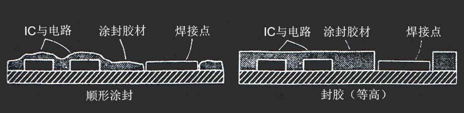

# 第八章：封胶材料与气密性封装技术

[TOC]

## 封胶材料与技术

> IC芯片完成PCB模块封装 (组装)后，除了<u>部分焊接点、指状结合点和开关</u>等位置以外，为了使成品表面不会受到外来环境因素 (湿气、化学溶剂、应力破坏等)及后续封装工艺的损害，通常在<u>芯片表面涂覆一层25-125 um厚的高分子材料涂层</u>进行保护

### 封胶的作用

- 保护成品表面不受外界环境因素的影响
- 避免半成品后续封装工艺带来的损伤

### 封胶工艺的分类

> 按涂布外形分类

- **顺形涂封**
- **封胶**

#### 区别

> 可类比为建筑中的平顶房与起脊房

- 涂封胶材
- 涂封外形

------

### 顺形涂封

> Conformal Coatings，也称顺敷涂封

#### 材料

- 丙硫醋酸类树脂 (AR)

  - 优良的抗湿与介电性质
  - 抗化学溶剂侵蚀性较差，但可被除去以供电路板修补用

- 氨基甲酸酯树脂 (PUR/PU)

  > 普遍使用的顺形涂封材料

  - 涂层具有良好的强韧性/抗水汽渗透/抗化学侵蚀性
  - 与印制电路板间的黏着性好，但涂布有此种保护膜的电路板不方便修复

- 环氧树脂 (ER)

- 硅胶树脂 (SR)

  - 优良的电气性质/低吸水性/低离子杂质浓度
  - 良好的低温功能与热稳定性
  - 既是顺形涂封材料，也是重要的封胶材料
  - 低介电常数，适合微波电子封装
  - 但机械性质逊于氨基甲酸酯树脂和环氧树脂
  - 抗化学溶剂侵蚀特性不良

- 氟碳/氟化高分子树脂 (FC)

  > 高可靠性需求的军用电子元器件封装

  - 价格高，工艺设备昂贵
  - 优良的防水性/抗润湿性/抗化学侵蚀性/低介电常数
  - 良好的高温稳定性/抗高能量辐射特性
  - 适用于高离子型污染、高湿度等恶劣环境中的涂封保护材料

- 聚对环本二甲苯树脂 (XY)

  > 唯一可用气相沉积聚合反应进行涂封的材料

  - 优良的抗湿气渗透性/抗化学侵蚀性/电性和机械性质/不受吸收水分影响的稳定电气特性
  - 通常25 μm厚薄膜可达到保护目的
  - 完成涂封后难以除去进行修复

#### 流程

> 组装完成后的PCB表面清洗后，将涂封的液态原料以喷洒或沉浸方法均匀涂布，再经适当烘烤热处理或紫外光烘烤处理后形成保护膜层

##### PCB表面清洗

> 目的：避免将污染物密封在涂层内造成腐蚀、涂层裂缝及发泡等损坏

- 先以气体溶剂喷洒印制电路板的表面，除去残存助焊剂与油脂
- 再以去离子水与异丙醇溶剂冲洗，将残存的盐类溶去
- 电路板以压缩空气吹干，在60-80℃烘烤1-2小时，将溶剂和水蒸气完全蒸发除去

##### 特定区域均匀涂胶

> 涂布前某些固定于电路板上的元器件，如与外界电路连接的端子、开关、继电器、电位计等必须以胶带或胶膜罩住，以免涂敷薄膜破坏其原有的功能

###### 涂胶方式

- **喷涂法** (最常用)
  - 以输送带将印制电路板移至喷出原料的喷枪前而完成涂封
  - 封装元器件底部及其高度所造成的遮蔽效应会使涂封不完全，需借助涂封原料粘滞性的改善与多次不同角度的喷洒加以修正
- **沉浸法**
  - 将组装完成的电路板完全浸于涂封树脂液后缓慢移出
  - 此方法可使整个电路板有100%的完全涂布
- **流动式涂布** (Flow coating)
  - 通过喷嘴头的树脂原料流到电路板表面而完成涂封
- **毛刷涂布** (Brush Coating)
  - 仅供损坏元器件更换之处的涂层破洞修补用，很少应用在大量生产的工艺中

##### 烘烤处理成型

> 树脂原料涂布完成后，须再施予烘烤热处理成为硬化薄层

###### 烘烤方式

- **烘箱加热**
- **紫外光加热**
  - 适用于丙硫酸酯化的氨基甲酸醋脂与环氧树脂
  - 优点
    - 比热处理时间短 (一般3-30s)
    - 所耗能源较少
    - 不会有材料粘滞性减低的困扰
    - 涂装薄膜的收缩率较小
    - 无毒性气体排出
  - 缺点
    - 设备昂贵
    - 元器件相对高度变化造成的光遮蔽较容易导致不均匀的烘烤质量。通常电路板烘烤时需要旋转，使紫外光能有均匀的照射
- 常使用烘箱加热与紫外光的混合烘烤方法以获得最佳品质的硬化涂层

##### 涂层检查

------

### 封胶

> Encapsulants

#### 材料

- 硅胶树脂 (SR)
- 酸酐基类树脂 (AE)

> - 常见的IC芯片封胶材料为环氧树脂和硅胶树脂
> - 环氧树脂具有较好的抗水渗透性/抗化学腐蚀性/热稳定性，通常是具有环氧乙烷环或环氧氧化物群化学结构特征的高分子化合物的总称

##### 单环氧树脂基材料

- 环乙烯氧化物 (Cyclohexene oxide)
- 氯甲环氧丙烷 (Epichlorohydrin)
- 缩水甘油酸类 (Glycidyl Acid)
- 环氧丙醇 (Glycidol)
- 缩水甘油族群 (Glycidyl Group)

##### 其他硬化剂

> 环氧树脂可以用自有高分子键合反应与其他硬化剂材料作用，形成具有交联硬化结构的材料

- 氨基类硬化剂
  - 芳香族胺基硬化剂、脂肪酸胺基硬化剂的加合物、环脂肪酸氨基硬化剂
  - 快速硬化，性质稳定
  - 电性质与抗水渗透性不佳
  - 在封胶工艺中较少使用
- 掺合酸酐基硬化剂
  - 优良的高温特性
  - 酯链容易发生水解反应
  - 仅适合高温、湿度为非主要劣化因素的场合
- 酚醛硬化剂
  - 热稳定性不及酸酐类环氧树脂
  - 有良好的抗水渗透性
  - 应用极广泛

##### 常见环氧树脂

> 商用环氧树脂除树脂原料外通常还包括硬化剂、催化剂、填充剂、阻燃剂等微量添加物

- 双酚醛A聚二缩水甘油醚 (Polyglycidyl Ether of Bisphenol A, DGEBA)

  - 高分子材料，反映群间彼此距离的增长使材料的弹性模块、玻璃转变温度与抗水渗透特性降低，线性温度膨胀系数也随之升高
  - DGEBA树脂不适合在高温、高湿环境中使用，主要应用为防止应力引发破坏的低弹性模块封胶保护
  - 双酚醛F聚二缩水甘油醚 (DGEBF)有更高的粘滞性

- 酚醛环氧树脂 (Epoxidized Phenol Novolac, EPN)

- 甲酚醛环氧树脂 (Epoxidized Cresol Novolac，ECN / Epoxy B)

  > EPN ECN也称酚醛清漆树脂
  >
  > 以氯甲烷环氧丙烷上的环氧树脂基于苯醇上羟基反应合成
  >
  > - 低线性热膨胀系数/低水渗透性/高二次元玻璃转移温度
  > - 为目前最普遍的硬式封胶材料

- 环脂肪酸环氧树脂 (Cycloaliphatic Epoxies)

  - 极佳的电性与抗环境侵蚀的能力，唯一无残留氯离子的环氧树脂

## 塑料封装

### 塑料封装的概述

> 现今已经从DIP发展出PDIP、SOP、SOJ、SIP、ZIP、PQFP、PBGA、FCBGA等元器件
>
> 芯片贴装 ==> 打线键合 ==> 铸膜成型 ==> 烘烤成型 ==> 引脚镀锡 ==> 引脚切割成型

#### 与陶瓷封装的区别

- 优点
  - 成本低
  - 薄型化
  - 工艺较为简单
  - 适合自动化生产
- 缺点
  - 散热性
  - 耐热性
  - 密封性
  - 可靠度

#### 设计因素

- 必须考虑各种工艺、材料因素
  - 封装配置与IC芯片尺寸
  - 导体与钝化保护层材料的选择
  - 芯片黏结方法
  - 铸膜树脂材料
  - 引脚架的设计
  - 铸膜成型工艺条件 (温度、压力、时间、烘烤硬化条件)

### 材料

> 铸膜成型材料分为
>
> - 热硬化 (固)型高分子材料
> - 热塑型高分子材料
>
> 最主要的材料：酚醛树脂/硅胶树脂(都属热硬化型高分子材料)

- 酚醛树脂
  - 早期的酚醛树脂有氯与钠离子，容易吸水，在烘烤时释出氨气造成腐蚀破坏
  - 有优异的铸膜成型特性，但也有某些影响封装可靠度的缺点
  - 高耐热变形特性、高交联密度产生的低吸水特性
  - <u>常用的甲酚醛</u>通常以酚类 (或称苯醇，phenols)与甲醛在酸性环境中反应制成
  - <u>环氧类酚醛树脂</u> (Epoxy Novolacs)以氯甲环氧丙烷与双酚类反应而成
    - 制备过程中盐酸为不可避免的副产物，必须纯化去除
  - 随着纯化技术的进步，<u>酚醛树脂中的氯离子浓度很低</u>，引脚材料与IC芯片金属电路部分发生腐蚀的机会也降低
    - 不再是影响塑料封装可靠度的主要因素
- 双酚类树脂 (DGEBA)
  - 20世纪60年代普遍使用
  - DGEBA原料中的氯甲环氧丙烷由丙烷与氯气反应而成，残余氯离子浓度可达3%
    - 封装元器件的破损大多是**氯离子腐蚀**造成的
  - 容易引致**开窗式**破坏
    - 玻璃化转变温度约100-120℃，可靠性测试温度为125℃以上，在玻璃化转变温度附近的热膨胀系数急剧变化
    - 温度循环试验时，热应力可把金线拉离接垫处而断路，低温时应力恢复使导线与接垫接触形成通路

> 现在已开发出符合要求的酚醛树脂
>
> 氯离子浓度低 (<10 ppm)，耐热变形特性和交联密度产生的低吸水特性好

- 硅胶树脂
  - 优点
    - 无残留的氯/钠离子
    - 玻璃化转变温度低 (20-70ºC)
    - 材质光滑，无须加模具松脱剂
    - 高耐热性/低介电常数/低温环境应用/低吸水性
  - 缺点
    - 黏着性质不佳，密封性不良，可能导致焊锡的渗透而形成短路
    - 热膨胀系数差异造成胶材脱离
  - 应用
    - 高耐热性/低介电性质/低温环境/低吸水性等需求的封装
      - 硅胶中的硅氧键比树脂中碳键强，在60-400℃具有相当稳定的性质

> 以上介绍的三种铸膜材料不能单独用于塑料封装的铸膜成型，必须添加多种有机与无机材料

#### 添加材料

> 塑料封装的铸膜成型材料必须添加有机和无机材料，才能具有很好的性质
>
> 一般有成分：**酚醛树脂** (25.5%-29.5%)/加速剂/硬化剂/催化剂/耦合剂/无机填充剂 (68-72%)/阻燃剂/模具松脱剂/黑色色素

- 加速剂

  - 通常和硬化剂拌和使用
  - 在铸膜热压过程中引发树脂的交联作用，并加速交联反应
  - 含量影响铸膜材料的胶凝硬化时间

- 硬化剂

  - 一般是含有胺基、酚基、酸基、酸酐基、或硫醇基的高分子树脂类材料
  - <u>胺基、酸酐基类使用最多</u>
    - 酸酐基硬化的树脂材料**容易脆裂**，需加入羟基端丁二烯腈橡皮**柔韧剂**，增加树脂的韧性
  - 吸水性高，在高温、高湿环境中材质特性不稳定
  - 含量影响铸膜材料的粘滞性与化学反应特性和材料中主要的键合形成与交联反应完成的程度

- 无机填充剂

  - 粉末状凝熔硅石
  - 使铸膜材料的基底强化、降低热膨胀系数、提高热传导率和热震波阻抗性
  - 成本低

  > 为改善无机填充剂与树脂材料间的黏着性，常添加硅甲烷环氧树脂或氨基硅甲烷，添加量和添加方法通常是产业的机密

- 阻燃剂

  - 为符合产品阻燃的安全标准
  - 通常添加溴化环氧树脂，或氧化锑作为阻燃剂

- 模具松脱剂

  - 棕榈蜡、合成脂蜡

- 黑色素

  - 为外壳颜色美观和统一标准

#### 铸膜材料制作

- 将各种原料按适当比例混合
- 使环氧树脂与硬化剂产生部分反应 (B-stage)
- 将所有原料制成固体硬料，研磨成粉粒
- 压制成铸膜工艺所需的形状，在低温下储存

### 工艺

> 主要方法：转移铸膜、轴向喷洒涂胶、反应射出成型

#### 转移铸膜

> 最常见的密封工艺技术

- 基本过程
  - 把已经互连的芯片和引脚置于铸孔中
  - 利用挤制杆把软化的原料，经过闸口与流道压入模具腔体的铸孔中
  - 热处理后原料完全硬化，从模具中推出
- 注意事项
  - 原料填充时，挤制杆压力
    - 速度过慢，会使原料在进入铸孔时已经硬化，而推倒电路连线
    - 速度过快，原料流动的动量会使导线弯曲
  - 密封时也一样，要控制得当
    - 压力过小，密封不全
    - 压力过大，推倒电路连线
- 模具的设计为影响成品率与可靠度的重要部件

#### 轴向喷洒涂胶

- 基本过程
  - 利用喷嘴把原料涂布在芯片表面，比顺形涂封时树脂层厚度大
  - 必须把芯片加热到适当的温度，以调节原料的黏滞性，调节涂封的厚度和外貌
- 优点
  - 成品厚度较薄，可缩小封装的体积
  - 没有铸膜成型工艺压力引致的破坏
  - 没有原料流动和铸孔填充过程引致的破坏
  - 适用与以TAB连线的芯片封装 
- 缺点
  - 成品易受水气侵袭
  - 原料黏滞性的要求苛刻
  - 只能做单面涂封，无法避免应力的产生
  - 工艺时间长

#### 反应射出成型

- 基本过程
  - 把原料分别置于两组容器中搅拌
  - 输入铸孔中使其发生聚合反应而完成涂封
- 优点
  - 能源成本低
  - 低铸膜压力，能减低倒线发生的机会
  - 使用的原料一般有较好的芯片润湿能力
  - 适用于以TAB连线的芯片封装 
  - 可以使用热硬化型与热塑型材料进行铸模
- 缺点
  - 原料须均匀地搅拌
  - 还没有普遍、标准化的树脂原料

### 塑料封装的可靠性试验

#### 破坏机制

- 材料的热膨胀系数差异所引起的热应力破坏

- 湿气渗透所引致的腐蚀破坏

#### 试验方法

- 高温偏压试验

  - 将封装元器件置于125-150℃的测试腔中，使其在最高电压与电流负荷下工作
  - 试验元器件与材料相互作用所引起的破坏

- 温度循环试验

  - 试验条件
    - 65-150℃循环变化，在高温与低温各停留1 h
    - 55-200℃循环变化，在高温与低温各停留10 min
    - 0-125℃循环变化，3次变化/h
  - 测量应力对封装结构的影响
  - 能检测出连线接点分离、连线断裂、接合面裂隙、芯片表面的钝化层破坏等

- 温度/湿度/偏压试验 (Temperature/Humidity/Voltage Bias，THB)

  > 所有试验中最严格的一种

  - 将IC元器件置于85℃/85%相对湿度的测试腔中，并在元器件上通入交流负载 (通常约为5V)
  - 类似试验
    - HAST试验 (Highly Accelerated Stress Test)
      - 将元器件置于100-175℃、50-85%相对湿度的环境中，并加入偏压
    - GI应力试验
      - 将封装元器件置于含氮、硫磺、过氧水、二氧化氮、臭氧等特殊气体环境中

## 气密性封装

> 完全能够防止污染物 (液体或固体)的侵入和腐蚀的封装，大大提高电路的可靠性
>
> 渗水率由大到小：硅胶树脂 > 环氧树脂 > 氟碳高分子 > 玻璃 > 金属

- 在外来环境的侵害中，水汽是引起IC芯片损坏最主要的因素
  - 芯片导线的间距极小，在导体间很容易建立起一个强大的电场
  - 若水汽侵入，会使不同金属间的电解反应而腐蚀，相同金属间电解反应而使阳极溶解
    - 与水相关的诸多问题使得军事及航空工业必须采用气密封装来得到高可靠性及长寿命
- 金属、陶瓷、玻璃、塑料都可以做封装材料
  - 塑料的气密性不好，不能做气密性封装的材料
  - 气密性封装的材料只有<u>金属、陶瓷、玻璃</u>，其封装为<u>高可靠性封装</u>

### 金属气密性封装

> 气密性良好，热传导和电屏蔽效果良好

#### 概述

- 常用镀镍或金的金属基座来<u>固定芯片</u>
- 针状引脚以玻璃绝缘材料固定在基座的钻孔上，与芯片<u>打线键合</u>，用硬焊或焊锡完成IC芯片黏结
- 基座周围再用熔接、硬焊或焊锡等方法与另一金属封盖接合
- 为减低硅与金属的热膨胀系数的差异，金属封装基座表面通常焊有一金属片<u>缓冲层</u>，以缓和热应力并增加散热能力
- 熔接的密封速度、合格率和可靠性最好，只是<u>不能移去封盖作修护</u>，硬焊或焊锡可以

#### 材料要求

- 具有优良的水分子渗透阻绝能力
- 可靠度/密封性
- 提供良好的热传导和电屏蔽

#### 材料

- 科瓦铁镍钴合金
  - 与玻璃具有优良的接合特性，常用作罐体和引脚材料
  - 但需要钼金属作金属缓冲层，以改善科瓦铁镍钴合金的热传导性质的不佳
- 铜
  - 热传导性能和导电性能高 
  - 但强度不足，要加铝或银改善其机械特性

### 陶瓷气密性封装

> 接合紧密，常用于封装大规模集成电路

#### 概述

- 利用玻璃与陶瓷及科瓦铁镍钴或Alloy42合金引脚架材料间能形成紧密接合的特性提供可靠度和密封性

#### 示例

- 陶瓷双列式封装
  - 把金属引脚架用暂时软化的玻璃固定在釉化表面的氧化铝陶瓷基板上
  - 芯片粘贴和打线接合后，用另一陶瓷封盖，在400℃热处理或涂上硼硅酸玻璃材料而密封
- 针栅阵列陶瓷封装 (PGA)或带引脚的陶瓷芯片载体 (CLCC)密封
  - 在基板和封盖的周围用厚膜技术镀上镍或金的密封环
  - 再用焊锡/硬焊的方法把金属或陶瓷的封盖与基板接合
    - 熔接、玻璃及金属密封垫圈等也可用于密封盖与基板接合
- 陶瓷针栅阵列外壳 (CPGA)
  - 最常用的插装型外壳2.54mm节距规则或交错排列腔体向上或向下
  - 可附带热沉用于封装CPU/DSP/CCD/ASIC等VLSI芯片
  - 陶瓷四边引线扁平外壳 (CQFP)
    - 体积小/重量轻/适合表面安装
    - 用于封装各种大规模集成电路，如ECL/CMOS/TTL等
- 无引线陶瓷片式载体 (CLCC)
- 陶瓷扁平外壳 (FP)
  - 通常1.27mm节距
  - 可定制非标准引线节距和腔体产品，可安装热沉
  - 主要用于封装中、小规模集成电路
- 双列直插多层陶瓷外壳 (DIP)
  - 插装型外壳，通常2.54mm节距
  - 具有电热性能好/可靠性高等优点
  - 有带热沉和不带热沉两种
- 陶瓷焊球阵列外壳 (CBGA)
  - 面阵引出，焊球节距1.27mm/1.00mm
  - 芯片安装可采用引线键合或倒装焊

### 玻璃气密性封装

> 有良好的化学稳定性、电绝缘性和致密性，但强度低，易破裂

#### 概述

- 具有良好的化学稳定性/抗氧化性/电绝缘性和致密性
  - 可以通过成分的调整改变热性质
- 金属密封封装中，玻璃可用来把针状的引脚固定在基座的钻孔上
  - 提高电绝缘，形成金属和玻璃间的封装
- 陶瓷双列式封装的开发过程中，密封材料成为工艺瓶颈，直到PbO-B2O3-SiO2-Al2O3-ZnO玻璃的开发
  - 可用于陶瓷封装中，提供氧化铝陶瓷/金属引脚间的密封粘贴
- <u>玻璃和陶瓷材料黏着性好，但与金属的黏着性质，除了科瓦铁镍钴外普遍不佳</u>
  - 需要控制好玻璃在金属表面的润湿能力
- 当含有饱和金属氧化物浓度的玻璃与干净的金属表面接触时，润湿能力最佳
- 金属氧化物的溶解为金属与玻璃间形成密封的关键步骤

#### 示例

- 匹配密封
  - 玻璃密封材料的热膨胀系数应与金属材料相近
- 玻璃跟金属间的压缩密封 (Compression seals)，不需要金属氧化物的辅助
  - 压缩密封选用热膨胀系数低于金属的玻璃材料进行粘结
  - 密封冷却时，金属有较大的收缩而压迫玻璃造成密封
  - 压缩密封所得的强度和密封性都比匹配密封高，接面的热稳定性比匹配密封低
  - 缺点
    - 强度低
    - 脆性高
    - 残留应力容易导致破裂，运输过程中也要小心

#### 气密性封帽方法

- 电阻焊 (平行缝焊、点焊)

  - 优点
    - 局部加热，对芯片热冲击小
    - 成本低。

- 钎焊

  - Au80%-Sn20%合金焊料

    - 优良的物理性能，高可靠电子器件封装中最好的焊料
    - 优点
      - 高耐腐蚀性/高抗蠕变性/高强度/良好的浸润性
      - 无需助焊剂

  - 工艺过程

    > 外壳和盖板清洗 ==> 烘干 ==> 组装 ==> 封口

    - 焊接温度300-330℃，保温3-5 min
    - 炉内采用氮气气氛其氧含量应不大于50 ppmv，水汽含量应不于100 ppmv
    - 盖板和外壳之间要施加一定的压力

- 玻璃熔封

- 激光焊

- 超声焊

- 冷压焊