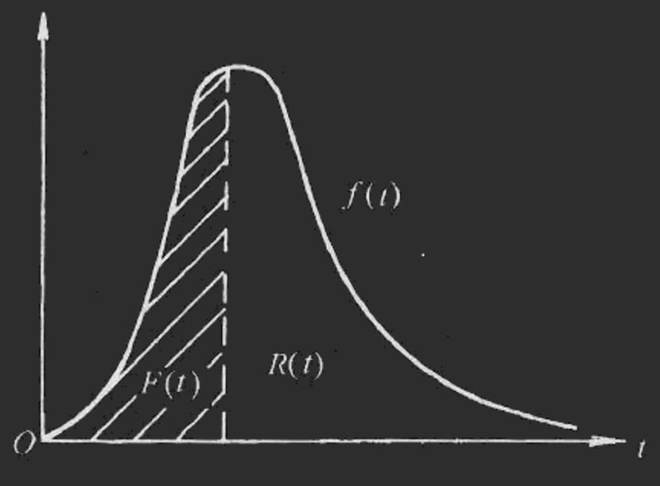
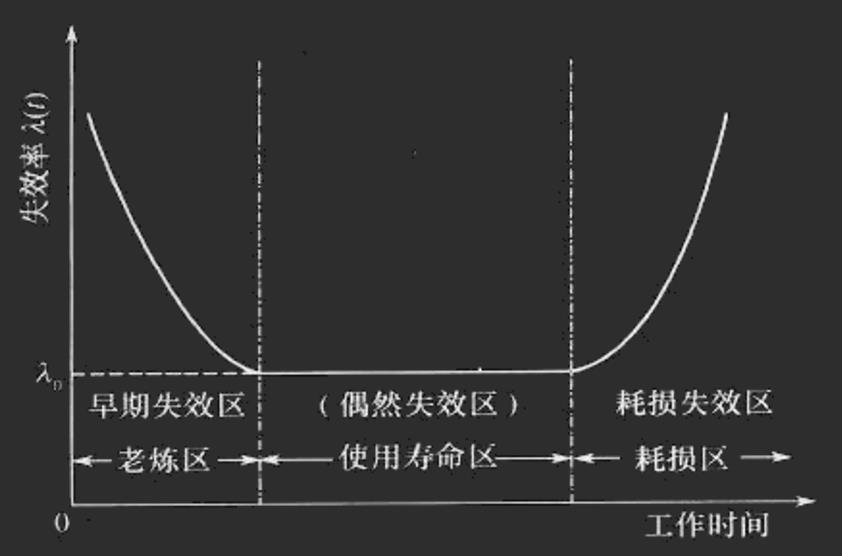
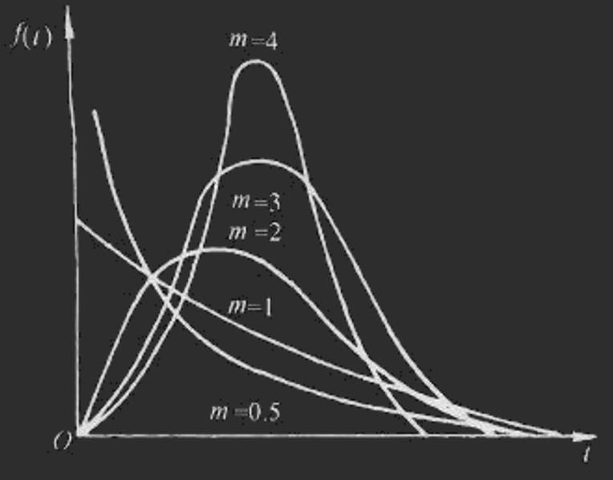
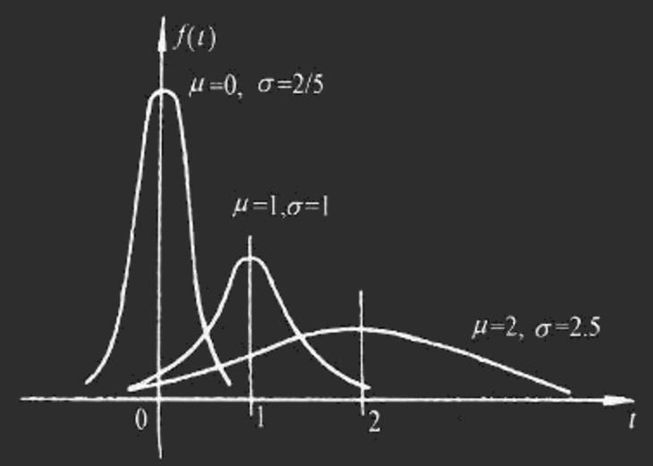
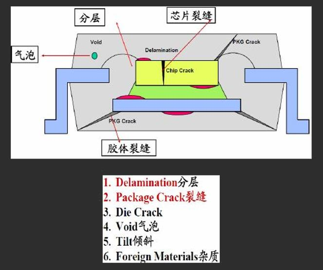
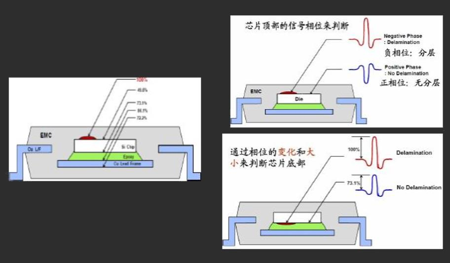
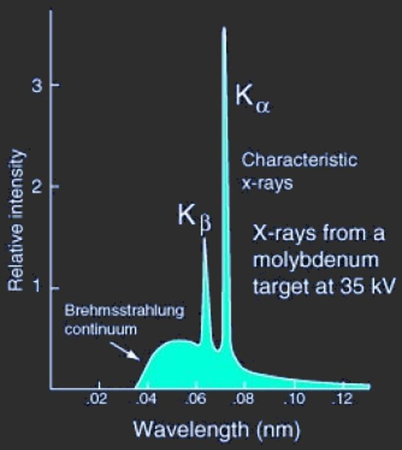
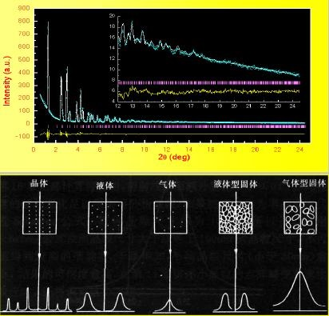

# 第十章：封装可靠性及缺陷分析

[TOC]

## 封装可靠性工程概述

### 名词解释

- 生产率 (Productivity)：资源的利用效率，即产出与投入的比值
- 质量 (Quality)：产品符合顾客规定要求的程度 (经久耐用)
- 可靠性 (Reliability)：产品在规定条件、规定时间内完成规定功能的能力
  - “规定条件”：环境、负荷、工作方式、使用方法。
    - 环境：温度、湿度、气氛、粒子、机械运动……
  - “规定时间”：贮存时间和使用时间，即寿命（ 实际上也是“规定条件”）
  - “完成规定功能”：顾客要求的“全部”功能。
- 产品失去规定的功能 ==> 失效

> 生产率 (1970-1980s) ==> 质量 (1990s) ==> 可靠性 (2000s)

### 数学定量描述

#### 可靠度

$$
R(t)=P(T≥t)\approx\frac{N-n(t)}{N}\\
可靠度：R(t)，产品在规定条件下和规定时间内完成规定功能的概率\\
T:产品寿命\\
N:产品总数，且足够大\\
n(t):从开始工作到t时刻的累积失效数\\
$$

#### 失效分布函数

产品在规定的时间t以前累积失效的概率
$$
F(t)=P(T<t)\approx\frac{n(t)}{N} (0\rightarrow 1)\\
R(t)+F(t)=1
$$

#### 失效密度函数

理论上失效概率在时间上的分布
$$
f(t)=\frac{dF(t)}{dt}=-\frac{dR(t)}{dt}\\
F(t)=1-R(t)=\int_o^tf(t)dt
$$

#### f(t)，F(t)与R(t)的关系

#### 失效率

工作到某一时刻尚未失效的产品，在该时刻后，单位时间内发生失效的概率

> 失效率＝失效率函数

$$
\lambda(t)=\frac{n(t+\Delta t-n(t))}{[N-n(t)]\Delta t}=\frac{\Delta n(t)}{[N-n(t)]\Delta t}\\
N:产品总数，且足够大\\
n(t):N个产品从开始工作到t时刻的累积失效数
$$

#### 关系

失效分布函数F(t)、失效密度函数f(t）与失效率λ(t)的关系
$$
\lambda(t)\approx\frac{f(t)}{R(t)}=\frac{f(t)}{1-F(t)}\\
R(t)=exp[-\int_o^t\lambda(t)dt]\\
若lambda(t)=常数，则R(t)=e^{-\lambda}，失效率越低，可靠性越高\\
f(t)\approx\lambda e^{-\lambda},~F(t)\approx1-e^\lambda
$$

- 失效率单位为$\%/10^{3}h$，即每工作1000小时后产品失效的百分数
- 非特 (Fit)：适用于半导体器件等高可靠性器件
  - $1Fit=1×10^{-9}/h=1×10^{-6}/1000h$

### 失效率曲线

> 可靠性主要是解决早期不良产品

- 早期失效期
  - 产品使用的早期，失效率较高且下降很快
  - 主要由于设计、制造、贮存、运输等形成的缺陷，以及调试、起动不当等人为因素所造成的
- 偶然失效期
  - 主要由非预期的过载、误操作、意外的天灾以及一些尚不清楚的偶然因素所造成
  - 偶然失效期是能有效工作的时期，称为有效寿命
- 耗损失效期
  - 失效率上升较快
  - 产品已经老化、疲劳、磨损、蠕变、腐蚀等所谓有耗损的原因所引起

### 产品的寿命

- 产品寿命：对不可修复的产品是“产品失效前的工作时间或工作次数”，或“无故障工作时间”
- 产品寿命往往研究的是某一批或某一类产品的“总体寿命”
- 数学上常用的是平均寿命、中位寿命、特征寿命 (统计学概念)

#### 数学特征

- 平均寿命：某批产品寿命的算术平均值

  - MTTF (Mean Time To Failure)，失效前平均工作时间
    - 对于不可修复产品，其失效前工作或贮存的平均时间
  - MTBF (Mean Time Between Failures)，平均无故障工作时间(对于可修复装置)
    - 对于可修复产品，为两次相邻失效间的平均工作时间

- 中位寿命t0.5

  - 某批产品工作到刚好一半数量失效时的工作时间

    $R(t_{0.5})=F(t_{0.5})=50\%$

#### 常用失效分布

##### 韦伯分布

> Weibull distribution

$$
F(t)=1-e^{-(t-γ)m/t_o}\\
f{t}=\frac{m}{t_0}(t-γ)^{m-1}e^{-(t-γ)\frac{m}{t_0}}\\
m为形状参数\\
γ为位置参数\\
t_0为尺度参数
$$

- m通常在[1, 7]间取值，通过改变m可以表示不同阶段的失效情况
- 也可以作为许多其他分布的近似，可将形状参数设为合适的值近似正态、对数正态、指数 (m=1)等分布

##### 正态分布

> Normal Distribution

$$
F(t)=\int_{-\infin}^t\frac{1}{\sigma\sqrt{2\pi}}e^{-\frac{(t-\mu)^2}{2\sigma^2}}dt\\
f(t)=\frac{1}{\sigma\sqrt{2\pi}}e^{-\frac{(t-\mu)^2}{2\sigma^2}}\\
\sigma:正态分布的标准差\\
\mu:正态分布的平均值
$$

- 标准正态分布：μ=0，σ=1的正态分布

##### 指数分布

> Exponential distribution，韦伯分布的特殊情况

##### 对数正态分布*

> Lognormal distribution，韦伯分布的特殊情况

### 可靠性试验方法

#### 简介

为评价分析电子产品可靠性而进行的试验称为可靠性试验

#### 目的

- 研制阶段用以暴露试制产品各方面的缺陷 ==> 改善设计
- 生产阶段为监控生产过程提供信息 ==> 优化工艺
- 对定型产品进行可靠性鉴定或验收 ==> 实现量产
- 暴露和分析产品在不同条件下的失效规律及失效模式和机理 ==> 有针对性地加以改进以提高寿命
- 为改进产品可靠性，制定和改进可靠性试验方案 ==> 为用户选用产品提供依据

对于不同的产品，考虑到不同的使用环境，可以选择不同的可靠性试验方法

#### 手持电子产品的可靠性要求

- 动态机械可靠性
  - 动态机械载荷
  - 便携 ==> 跌落危险 ↑
  - 新功能 (游戏、短信) ==> 键盘、按键的疲劳和弯曲
  - 重量减轻 ==> 紧凑包封 ==> 机械保护 ↓
  - 叠层封装 ==> 封装体尺寸 ↓，密度 ↑
  - 小型化 ==> 互连尺度 ==> 危险性 (失效几率) ↑
- 动态机械载荷下的可靠性非常重要
  - 跌落、拉伸、剪切、弯曲、冲击和振动
  - 焊点
    - 脆性断裂：对应力集中更为敏感
    - 影响因素：金属间化合物 (IMC)、润湿性等
  - PCB：绝缘层/铜线裂开
  - 封装：焊球、焊点大小

#### 可靠性试验加载方式

- 循环载荷
  - 热机械
  - 循环弯曲、震动
- 动态机械载荷
  - 跌落、弯曲、剪切、拉伸、冲击
- 电化学
  - 温度、湿度、电压

#### 加速实验方法

> 不同加速试验方法会得到不同的结果

- 常规的加速载荷
  - 振动 (Vibration)
  - 温度 (Temperature)
  - 湿度 (Humidity)
  - 电压 (Voltage)
  - 杂质 (Contaminations)

#### 可靠性测试项目

> 6个项目是有先后顺序的，每项都具有针对性和具体方法，大都是用采样 (随机抽查)的方法来测

|              可靠性测试项目              | 测试项目简称 |
| :--------------------------------------: | :----------: |
|      预处理 (Preconditioning Test)       | Precon test  |
| 温度循环测试 (Temperature Cycling Test)  |   T/C Test   |
|       热冲击 (Thermal Shock Test)        |   T/S Test   |
| 高温储藏 (High Temperature Storage Test) |  HTST Test   |
| 温度和湿度 (Temperature & Humidity Test) |   T&H Test   |
|     高压蒸煮 (Pressure Cooker Test)      |   PCT Test   |

##### 预处理测试

从芯片封装完成到实际再组装，产品须经过包装、运输等，这些都会损坏产品，需要先模拟这个过程，测试产品的可靠性

> 越接近实际状况，测试结果越有指导意义
>
> 加速试验：不改变失效机理前提下,通过强化试验条件使受试产品加速失效

- 步骤
  - 产品抽样
  - T/C测试：模拟实际运输过程
  - 水分干燥处理：模拟实际真空包装
  - 恒温放置吸湿
  - 模拟焊接：电气特性和内部结构测试
- 会出现的问题
  - 爆米花效应、脱层、电路失效
  - 原因：封装吸湿后碰到⾼温，水分变成气体而使封装体积急剧膨胀，造成破坏
  - 措施：减弱环氧树脂的吸湿性解决爆米花效应，减小封装的热膨胀系数，增强附着能力以改善脱层问题，防止电路失效发生

##### 温度循环测试

> 材料界面间随环境温度变化热胀冷缩，引起裂纹、脱层和电性能失效等

- 测试产品封装热胀冷缩的耐久性
  - 各种材料都有热胀冷缩效率，而它们的热膨胀系数不同，原来紧密结合的结合面会出现问题
- 需要控制测试设备四个参数
  - 热腔温度
  - 冷腔温度
  - 循环次数
  - 芯片停留时间

##### 热冲击测试

> 测试产品封装体抗热冲击的能力

- T/S 测试炉结构与热循环温度测试炉相似，不同的是T/S 测试环境是在高温液体中转换，液体的导热比空气快，于是有较强的热冲击
- 参数
  - 热腔温度
  - 冷腔温度
  - 循环次数
  - 芯片单次单腔停留的时间

|   温度   |  时间   |  次数  |
| :------: | :-----: | :----: |
| 160/-65℃ | 5min/区 | 1000次 |

- 两个隔离的区域分别放入150℃和-65℃的液体，然后把封装产品放入一个区，5分钟后再装入另一个区
- 由于温差大，传热环境好，封装体受到很强的热冲击
- 如此反复1000次，来测试产品的抗热冲击性，最终通过测试电路的通断情况断定产品是否通过TS可靠性测试

##### 高温储藏测试

> 将封装产品放置在惰性气体保护环境下测试其电性能和其他性能

- 高温下，半导体材料活化性增强；物质间扩散加剧：机械特性差的材料易损坏。
- 柯肯达尔空洞：物质间扩散-Al和Au
- 解决办法
  - 采用同种物质连接电路；增加扩散阻挡层
  - 避免产品长时间处于高温环境

##### 温度和湿度测试

- 测试封装在高温潮湿环境下的耐久性
  TH测试在一个能保持恒定温度和温度的锅体中进行，一般测试参数如表所示

| 温度 | 湿度  | 时间  |
| :--: | :---: | :---: |
| 85℃  | 85RH% | 1000h |

##### 高压蒸煮测试

- 在高温、潮湿环境下的耐久性试验
- 测试在等压、恒温、恒湿锅体中进行，实验结束后测定封装体电路通断特性
- 塑封材料吸湿性强，内部电路在潮湿环境下很容易漏电和短路。可通过改善材料成分控制吸湿性

## 封装失效分析基础

### 名词解释

- 技术名词：失效模式和失效机理
  - 失效模式
    - 指失效的形式，如开路、短路、漏气等
  - 失效机理
  - 造成器件失效的原因
    - 机械失效：疲劳、过载
    - 电化学失效：腐蚀、电迁移

> 与封装或组装密切关联的失效共计28.1%

### 失效机理

- 过载：通常是瞬时的、突然发生的失效

  - 机械

    > 包括机械冲击、振动引起的惯性力和内应力，使材料和结构发生形变、蠕变、疲劳、脱层、断裂等

    - 大弹性变形
    - 屈服
    - 断裂：脆性，韧性
    - 裂纹，爆裂 (Popcorn)
    - 弯曲
    - 界面分开

  - 热

    > 封装结构中各相邻材料膨胀系数CTE不匹配，在T和ΔT作用下产生的局部应力
    >
    > 热应力会导致封装材料的尺寸变化和物理特征变化 (尤其是塑料)
    >
    > - 两种热应力
    >   - 外部环境热应力：器件制造时，器件贮存、使用时外部环境施予器件
    >   - 内部热应力：器件使用、老炼时加电后器件发热引起的应力

    - 热过载
    - 接近T~g~ (玻璃化温度)
    - 融化
    - 蠕变断裂温度

  - 电

    > - 不良电源供电引起电过载和电源通/断引起电-热应力循环
    > - 输入电流、电压过载，输出电流过载
    > - 静电放电 (ESD)损伤，造成过压击穿，过流或过功率烧毁
    > - 过压造成：绝缘击穿、栅氧击穿
    > - 过功耗损伤：铝条或引线丝烧毁、电迁移等
    > - 促进：电化学腐蚀，枝状结晶蔓生：漏电、材料热退化

    - 电磁干扰损伤
    - EOS (电冲击)
    - 静电放电 (ESD)
    - 介质击穿
    - 二次击穿

  - 辐射

    > - α粒子射线
    >   - 来自封装的痕量放射性元素铀、钍中
    > - 空间宇宙线
    >   - 强的射线能使存储器的二进制状态逆转！不能正常工作或塑封料裂解
    >   - 预防措施：管芯涂覆聚酰亚胺用以屏蔽，减小模塑料中填充剂的α粒子含量

    - 单粒子反转

- 磨损/耗损：因磨损、老化、疲劳等长时间的损耗积累，引起产品性能逐渐下降后失效

  - 机械

    - 高低周疲劳
    - 蠕变
    - 磨损 (磨粒磨损等)

  - 电

    - 金属迁移 (电/离子迁移)
    - 应力驱动扩散
    - 表面充电

  - 化学

    > 恶劣环境下引起的化学腐蚀、氧化、离子表面枝状结晶生长等。电应力和环境中的湿气能明显地增强化学应力
    >
    > 湿气 ==> 渗透模塑料 ==> 到达管芯或浸出和金属的反应物

    - 内部扩散
    - Kirkendall效应
    - 氢脆
    - 腐蚀

## 封装常见缺陷分析

### 扩散

#### 铝钉

- 铝钉缺陷
  - 铝互连线穿透SiO~2~阻挡层并深入到硅片内部，使PN结失效
  - 450℃热处理时，硅在铝中的固溶度为0.5%，525℃，1%
- 解决办法
  - 以含少量硅的Al/Si (1-2%)合金代替纯铝，降低硅的扩散渗入
  - 可以完全防止铝钉的出现
- 问题
  - 当温度降低时，铝中的硅会析出形成硅原子团
  - 硅原子团的直径约1.5 μm，对于极细的布线接近其横截面
  - 电流流过时局部升温导致失效

#### 电迁移

#### 晶须

- 镀锡引线间由于电迁移产生晶须导致短路
- 无铅钎料的锡晶须问题的机理及其解决是一个重要课题
- Pb在Sn/Pb钎料中不仅降低熔点，提高强度，而且可以防止灰锡、抑制晶须生长
- 而Sn/Cu、Sn/Ag钎料合金的作用尚不明了

### 化学变化

#### 紫斑

- 在芯片的铝膜上进行金丝球热压焊时，温度较高时 (超过350℃)界面上生成紫色的AuAl~2~金属间化合物，失效往往在在这点处发生
- 空洞
  - 在环氧树脂氧化、陶瓷封盖和老化烘烤时，界面的Au原子会快速扩散进入金/铝化合物如AuAl~2~中，在界面处产生孔穴，发展下去使界面弱化，最终导致断裂
- 解决
  - 降低键合温度以及键合参数的精确控制
  - 采用其他材料，如铝丝键合、铜丝键合等

### 应力疲劳

- Flip chip钎料接头由于热失配而互连失效

### 引线桥接

#### 原因

- 高密度引线之间熔融钎料相互接触，凝固时接触未能断开而保留下来，导致短路
- 钎料量过多
- 温度低，钎料的流动性差
- 钎料内溶入过多的母材金属，熔点上升，流动性变差

#### 焊盘宽度的设计准则

- 元件引线的宽度为0.22 mm，一般的设计规则将焊盘也定为相同的宽度，但实际上此时最容易发生桥连
- 焊盘宽度为引线的130%时，进行焊接最不容易发生桥连

### 立碑

#### 现象

- 片式元件组装焊接后，一些元件出现一端脱离焊盘并直立起来的现象

#### 原因

- 两端的金属化端与钎料的初始湿润不一致

### 其他

- 偏位 (misalignment)
- 焊锡回流不完全 (Incomplete reflow of solder paste)
- 空洞 (voids)

## 封装失效分析程序及方法

### 失效分析目的与程序

#### 失效分析的目的

- 找出失效原因
- 制定改进措施 (从设计、制造和使用方面)
- 提高产品质量和成品率

#### 失效分析流程

- 记录失效现象
- 鉴别失效模式
- 描述失效特征
- 假设失效机理
- 证实从正、反两面证实失效机理，失效可实现重复
- 针对失效机理提出改进措施，并考虑新措施中是否引入新的失效因素

### 常用的失效分析技术

#### 无损分析技术

- 电性能测试和外观检验
- 声学扫描显微镜 (SAM)
- X光透射检查仪 (X-ray)
- Moire干涉仪：形变，warpage (翘曲)测量
- 有限元分析： 热、热力

##### 声学扫描显微镜 (SAM)

###### 简介

- 非破坏性、可分层、点扫描、截面扫描、水平面扫描
- 非破坏性的检测，对分层、裂纹、孔洞等很敏感 (超声)
- 快速：可作在线检测 (对PQFP、PBGA等塑封器件)、可作分层和垂直断面等多种分析
- 封装工厂必备的设备

###### 扫描方式

- Pulse Echo Methods 脉冲反射法
  - A-scan: Inspection with waveform displayed on oscilloscope 波形显示检测
    - 检查示波器上反射波的相位和幅度
    - 优点：最准确的检查方法
    - 缺点：只有一个点分析可用，而不是平面。用于确认检查结果
  - B-scan: Inspection with vertically x-sectioned 2-d image 垂直剖面二维成像检测
    - 显示各个纵切面的平面图像
    - 可发现的失效现象
      - 裂缝 (crack)
      - 倾斜 (tilt)
      - 气泡 (void)
    - 优点：对平面的失效点进行分析
  - C-scan: Inspection with horizontally x-sectioned 2-d image 水平面二维成像检测
    - 在界面上聚焦后显示水平x截面的图像
    - 可检测的缺陷：分层，模具裂纹
    - 优点：最直观的检查方法
    - 缺点：需要专业知识 (解决方案：TAMI)
  - TAMI: C-Scan with multiple gate 多重扫描成像
    - 显示所有接口的水平X截面图像图
    - 可检测的缺陷：各种缺陷
    - 优点
      - 不需要聚焦
      - 可以检查任何薄接口
- Thru-Transmission Method 透射方法
  - T-scan : Inspection with through signal
    - 最基本的检查方法
    - 使用发射的超声波信号进行检查，例如X射线检查
    - 优点：可以检查整包
    - 缺点：不可能测量缺陷的大小或位置。只能检查缺陷的存在

###### 检测参数

反射率$R(\%)=\frac{Z_2-Z_1}{Z_2+Z_1}\times 100\%$

###### 检测次序

- T - Scan : Inspect for the existence of defects
  - 只能检测到缺陷的存在
- C - Scan or TAMI : Inspect for location & size of DLMN and Chip crack
  - 可以检测到分层和芯片裂缝的位置及尺寸
- B - Scan : Inspect for location & size of PKG crack, Tilt，Void
  - 检测塑封裂缝、倾斜、气泡的位置和尺寸
- A - Scan : Reconfirm the existence, location, size of defects
  - 确认缺陷的存在、位置、尺寸

###### 检测方法

通过测量反射信号的相位和大小来判断缺陷的存在

###### 检测实例

- 分层
- 芯片表面污染
- 引线腐蚀
- 芯片粘结不良

##### X光透射检查仪 (XRD)

- 非破坏性，透视内部结构完整性
  - 高放大倍数 (可达2000X)，高分辨率 (2.0μm)
  - 对塑封器件和PCB最有效

###### 原理

- 1913年，劳厄设想，如果晶体中的原子排列是有规则的，那么晶体可以当作是X射线的三维衍射光栅
- X射线波长的数量级是10^-8^cm，这与固体中的原子间距大致相同。试验取得了成功，这就是最早的X射线衍射
- 特征光谱特点：对于从L,M,N…壳层中的电子跃入K壳层空位时所释放的X射线，分别称为Kα, Kβ, Kγ …谱线，共同构成K系标识X射线。类似,L壳层、M壳层…被激发时，产生L系、M系…标识X射线
- 由于一般L系、M系标识X射线波长较长，强度很弱，因此在衍射分析工作中，主要使用K系特征X射线

###### 应用

- 晶格参数测定
- 物相鉴定
- 晶粒度测定
- 薄膜厚度测定
- 介孔结构测定
- 残余应力分析
- 定量分析

#### 有损分析技术

- 开封 (Decapsulation/Decap)
- 红外热像仪：温度分布
- 金相切片分析
- 扫描电子显微镜 (SEM)微区形貌
- 俄歇谱 (Auger)
- 成分，成分深度分布
- 傅利叶变换红外显微镜分析 (FTIR：Fourier transform infrared microscopy)

##### 红外热像仪

- 可靠的非接触式测量工具，通过吸收目标物体的能量辐射生成红外图像和温度测量的仪器
  - 可测工作状态下的芯片热分布、最高结温、电流趋边效应
  - 可测量热阻、检测热斑、验证芯片粘接情况等

##### 扫描电镜 (SEM)

- SEM是用聚焦得很细的电子束照射被检测的试样表面，并可以用二次电子或背散射电子等进行形貌观察。它们是现代固体材料微区形貌和结构分析的最有用仪器之一，应用十分广泛
- 入射电子使试样原子电离，较外层电子（价带或导带电子）克服逸出功回到入射空间，称二次电子。二次电子能量比较低(小于50eV),仅在试样表面5nm-10nm的深度内才能逸出表面
- 二次电子对试样表面状态非常敏感；二次电子的产额与加速电压、试样组成等有关
- 二次电子用于观察表面形貌、电畴和磁畴等

###### 原理

- 二次电子
  - 高分辨率的样品表面形貌
  - 样品的电压衬度 (显示半导体器件的性能)
  - 样品的磁衬度和磁畴显示
- 背散射电子像
  - 表面形貌
  - 原子序数 (化学成分)衬度
  - 晶体取向衬度 (晶体学研究)
  - 提供电子通道花样，确定晶体取向 (晶体学研究)
- 特征X射线
  - 任何部位的元素分析和元素分布图
- 俄歇电子
  - 样品表面薄层中轻元素分析和元素分布图

###### 设备

- 三大部分
- 电子光学系统
  - 电子枪
  - 电磁透镜
  - 扫面线圈
- 样品室
- 信号收集处理和显示系统
- **真空系统**
- **控制系统**
- **样品制备**

##### SEM与能谱分析

- 对于微观组织结构观测、冶金学的分析和讨论极为有价值

##### 傅利叶变换红外显微镜分析

- 测量各种化合物红外光谱,可以实现强大的定性和定量分析，尤其可以实现微量样品的分析
- 焊点表面 (有机)污染物分析 (分析腐蚀失效原因)
- 可焊性不良的焊盘表面有机污染物分析 (分析焊点开路或虚焊的深层次原因)