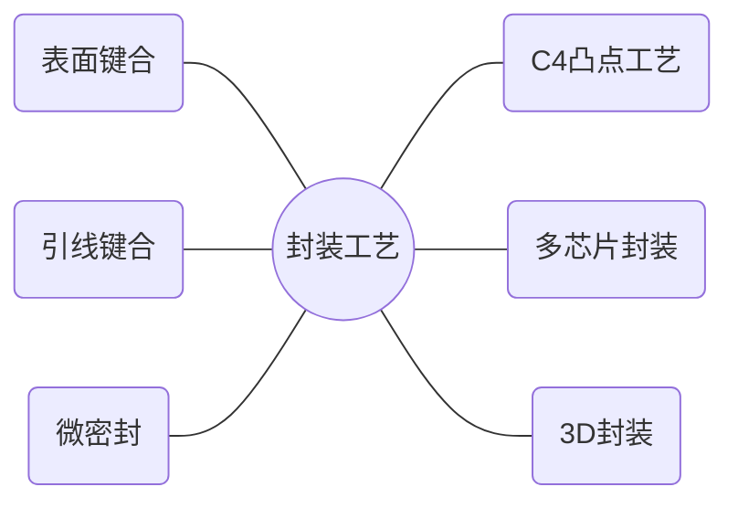

# 第十四章：MEMS封装技术简介

[TOC]

## MEMS概述

### 定义及组成

> Microelectro-mechanical Systems

- <u>M</u>icro：微，适于批量加工的尺寸
- <u>E</u>lectro：电子，能量从电能向非电能转换
- <u>M</u>echanical：机械，能量从电能向非电能转换
- <u>S</u>ystem：系统：解决系统问题，而并非只针对器件

#### 定义

- 微型电子机械系统
- 可批量制作的，将微型机构、微型传感器、微型执行器以及信号处理和控制电路、直至接口、通信和电源等于一体的微型器件或系统
- 从广义上讲，MEMS是指集微型传感器、微型执行器、计算机控制以及能源供给的系统

#### 国际定义与称谓

- 美国：微型机电系统 (Microelectro-mechanical System, MEMS)
- 日本：微机械 (Micro-machine)
- 欧洲：微系统 (Micro-system)

#### 特征尺寸范围

- 小型机械 (mini-)：1 mm - 10 mm
- 微型机械 (micro-)：1 μm - 1 mm
- 纳米机械 (nano-)：1 nm - 1 μm

```
微米尺度: 1 μm ~ 100 μm
亚微米尺度: 100 nm ~ 1 μm
纳米尺度: 1 nm ~ 100 nm
原子团簇: < 1 nm
```


#### 组成

> 集物理、化学和生物的传感器、执行器与信息处理和存储为一体的微型集成系统


### 发展

#### 追溯

- 1959年理查德·费曼在加州理工学院演讲

#### 三十年的积累

> 20世纪50年代末到20世纪80年代末

- 起始点 (50年代末，60年代初)
  - 集成电路技术出现，实现在微米尺度上规模制作电子元器件和电路
    - 1954：史密斯发现压阻效应
    - 1958：用单晶硅制作半导体应变片，其灵敏度是金属应变片的数十倍
    - 1962：第一个硅压力传感器
- 萌芽阶段 (60年代中期到80年代)
  - 开展了一些有关MEMS的零散研究
    - 硅各向异性腐蚀技术用于在平面硅衬底上加工三维结构
    - 利用集成电路加工技术制造如悬臂梁、薄膜和喷嘴等MEMS器件
    - 70年代IBM研发了薄膜型硅微压力传感器，比传统薄膜传感器有更高灵敏度，并可批量化生产
- 收获 (80年代末到90年代初)
  - 1987年，微机电研究真正兴起
    - 加州大学伯克利分校成功研制了直径为10 μm的静电硅微马达
  - 1988年，加州大学伯克利分校微直径约120 μm的静电马达通电并成功使其运转
    - 12个固定电极
    - 8个转子电极
  - 90年代初，ADI的气囊加速度计实现产业化
  - 90年代末，Sandia实验室实现5层多晶硅技术

### 特点

> MEMS器件体积小、重量轻、能耗低、惯性小、谐振频率高、响应时间短

- 微型化
  - 因为惯性质量小，小的系统比大的系统<u>移动更迅速</u>
  - 小器件的小尺寸所面临的<u>热变形</u>和<u>振动问题</u>会更小
  - 小系统除了具有<u>更精确的性能</u>外，小尺寸也使得其<u>更适合应用于药品和手术中</u>
- 制造材料性能稳定
  - 主要材料：硅
  - 优点
    - 强度
    - 硬度
    - 杨氏模量：与铁相当
    - 密度：近似铝
    - 热传导率：接近钼和钨
  - 其他材料
    - 基底材料：石英、砷化镓
    - 封装材料：玻璃、塑料和金属
    - 微系统制作：聚合物、金属材料
- 批量化生产
  - 用硅微加工工艺在一片硅片上可同时制造成百上千个微型机电装置或完整的MEMS
  - 批量化生产可大大降低生产成本
- 集成化程度高
  - 不同功能、敏感方向、致动方向的多个传感器或执行器集成于一体，形成复杂微系统
  - 集成了传感器、缓冲器、振荡器、解调器、信号发生器、载波电容器等
- 多学科交叉
  - 设计电子、机械、材料、制造、通讯和自动控制、物理、化学和生物等多种学科

### 分类

> 主要包括六大器件

#### 微传感器


#### 微执行器


#### 微结构器件


#### 微光学器件


#### 真空微电子器件

- 真空微电子器件 (VMED)是微电子技术、MEMS技术和真空电子学发展的产物
- 具有极快的开关速度、非常好的抗辐照能力和极佳的温度特性
- 主要包括场发射显示器、场发射照明器件、真空微电子毫米波器件、真空微电子传感器等

#### 电力电子器件

- 电力电子器件包括
  - 利用MEMS技术制作的垂直导电型MOS (VMOS)器件
  - V型槽垂直导电MOS (VVMOS)器件
  - 其他各类高压大电流器件

### 应用

#### 空间科学

- MEMS在导航、飞行器设计和微型卫星等方面有着重要应用
  - 基于航天领域里的小卫星、微卫星、纳米卫星和皮米卫星的概念
  - 提出了全硅卫星的设计方案，整个卫星的重量缩小到以千克计算
    - 大幅度降低成本，使较密集的分布式卫星系统成为现实

`美国提出的硅固态卫星的概念图。除了蓄电池外，全由硅片构成，直径仅15 cm`


#### 军事国防

- 用MEMS技术制造的微型飞行器、战场侦察传感器、智能军用机器人和其他MEMS器件，在军事上的无人技术领域发挥着重要作用
- 美国采用MEMS技术制成尺寸只有10 cm × 10 cm的微型侦察

#### 汽车工业

- 汽车发动机控制模块是最早使用MEMS技术的汽车装备
- 在汽车领域应用最多的是微加速度计和微压力传感器
- 角速度计也是应用于汽车行业的重要MEMS传感器
  - 用于车轮的侧滑控制

#### 医疗和生物技术

- 采用体微加工技术制作的各种微泵、微阀、微镊子、微沟槽和微流量计等器件适合于操作生物细胞和生物大分子
- MEMS器件的体积小，能够进入很小的器官和组织，同时又能进行细微精细的操作
  - 大幅提高介入治疗的精度，降低医疗风险

#### 环境科学

- 利用MEMS技术制造的微型仪器在环境检测、分析和处理方面大有作为
- 主要是由化学传感器、生物传感器和数据处理系统组成的微型测量和分析设备
  - 优势在于体积小、价格低、功耗小和易于携带

#### 信息技术

- MEMS逐渐向光通讯领域渗透，形成了由微光学、微电子学、微机械学和材料科学相结合的全新研究领域，即微光电子机械系统 (MOEMS)

## MEMS封装技术

### 与IC封装的差别

#### 可借鉴IC封装技术

- MEMS的制备很多借助于IC的平面制作工艺
- MEMS封装的基本技术借助于传统的IC封装技术
  - 包括外壳/基板的材料选择、封装型式、互连技术、可靠性考虑等

- IC封装：保护芯片及与其互连的引线不受环境影响
- MEMS封装：保护芯片及与其互连的引线不受环境的影响，并实现芯片与外界环境的能量交互

#### MEMS封装的特性

> 尽管MEMS器件的封装技术可以借鉴IC制造，两者有相似之处，但两者之间还是有很大的区别

- 专用性
  - MEMS中通常都有一些可动部分或悬空结
  - 硅杯空腔、梁、沟、槽、膜片，甚至是流体部件与有机部件基本靠表面效应工作
  - 封装架构取决于MEMS器件及用途
    - 对各种不同结构及用途的MEMS器件，其封装设计要因地制宜，与制造技术同步协调，专用性很强
- 复杂性
  - 整体而言，MEMS封装要比IC封装更加复杂
    - 根据应用的不同，多数MEMS封装外壳上需要留有同外界直接相连的非电信号通路
      - 有传递光、磁、热、力、化等一种或多种信息的输入
      - 输入信号界面复杂，对芯片钝化、封装保护提出了特殊要求
    - 在光学MEMS器件中，由于冲击、震动或热膨胀等原因而产生的封装应力会使光器件和光纤之间的对准发生偏移
    - 在高精度加速度计和陀螺仪中，封装需要和MEMS芯片隔离以优化性能
- 空间性
  - 很多MEMS系统含有可动的固体结构，而IC为固定的薄固体结构
  - 为了给MEMS可活动部分提供足够的可动空间，需要在外壳上刻蚀，或留有一定的槽形及其它形状的空间
  - 灌封好的MEMS需要提供有效的保护空间
- 保护性
  - MEMS器件对环境的影响极其敏感，因此保护要求也比IC要高
  - MEMS封装的各操作工序、划片、烧结、互连、密封等需要采用特殊的处理方法
    - 提供相应的保护措施，防止可动部件受机械损伤
  - 系统的电路部分也必须与环境隔离保护
    - 以免影响处理电路性能，要求封装及其材料不应对使用环境造成不良影响
- 可靠性
  - 随着MEMS器件应用领域越来越多，其应用场景对MEMS封装的可靠性要求也随之提高
    - 使MEMS封装的可靠性同样比IC封装要求高
  - MEMS使用范围广泛，对其封装提出更高的可靠性要求，尤其要求确保产品在恶劣条件下的安全工作，免受有害
  - MEMS封装一般不是一种通用的封装形式，因产品而异
    - 想要提高MEMS封装可靠性，还是要根据MEMS器件的特性采取合理的工艺解决
      - 其中晶圆级封装最为重要
  - 环境侵蚀，气密封装能发散多余热量

#### 与IC封装的不同点

- 封装层次
  - 微电子封装的分三个层次
    - 即单芯片和多芯片组件的一级封装
    - 将一级封装和其他元器件一同组装到单层或多层PWB (印制电路板)或其他基板上的二次封装 (插板封装)
    - 将二级封装插装到多层母板上的三级封装
  - MEMS封装的三个层次
    - 芯片级封装
    - 器件级封装
    - 系统级封装
- 封装类型
  - 微电子封装一直追随IC芯片的发展而发展，形成了与各种不同时期相互对应的有代表性的标注封装类型
  - MEMS应用领域十分宽广，涉及多学科技术领域，往往是根据所需功能制作出各种MEMS后，再考虑适宜的封装问题
    - 难以形成规范、标准的封装类型
  - 从某种意义上说，MEMS封装在很多情况下是专用封装
- 封装环境
  - MEMS封装除具有微电子封装的一些共同失效模式外，微型执行器封装后的失效模式，还有其独特性
  - MEMS器件对封装的环境更为敏感
    - 有的要求长期保持气密性
    - 有的要求光的输入均匀
    - 有的要求封装基板平整度很高
    - 有的要求封装本征频率越高越好
    - 有的要求流体进出连续
  - 一旦这些关键指标达不到，MEMS器件就会失效


- 封装体积
  - MEMS封装对体积的减小比微电子封装的要求更迫切，对3D封装的要求更强烈
  - MEMS的各种元器件及部件，特别是执行部件等，为了提高组装密度不可能只在平面内展开，必然向3D延伸
- 封装气密性
  - 高可靠要求的MEMS产品要求采用气密封装
  - 某些可动部件、机械元件又要求真空封装
  - 本来经微型化后只有微米级的部件经各种封装后可能大到毫米量级，甚至厘米量级
  - 从另一方面来说，很多MEMS器件，如光开关，由于功能需要，必须是三维结构，所以MEMS封装也必然是三维封装


- 封装成本
  - 鉴于MEMS封装自身的特殊性和复杂性，大多数微机电系统器件的封装成本占MEMS的成本可从50%直到90％
  - 微电子封装中的封装成本比重要低一些


|                      MEMS (基于硅衬底)                       |                         IC                         |
| :----------------------------------------------------------: | :------------------------------------------------: |
|                        复杂的三维结构                        |                   主要为二维结构                   |
|               很多系统含有可动的固体结构或液体               |                  固定的薄固体结构                  |
|                 需要将微结构和微电子进行集成                 |                   不需要这种集成                   |
|     在生物学、化学、光学及电动机械方面可以实现不同的功能     |            为特定的电子功能实现电能传输            |
|          很多组件需要接触工作介质并处于恶劣环境之下          |        集成电路模板通过包装与工作介质相隔离        |
| 涉及各种不同的材料，如单晶硅、硅化合物、GaAs、石英、聚合物以及金属等 | 只涉及少量几种材料，如单晶硅、硅化合物、塑料和陶瓷 |
|                       很多元件需要组装                       |                  少量元件需要组装                  |
|                     基底上的图形相对简单                     |          基底上的图形相对复杂且元件密度大          |
|                     少量的馈电导体和导线                     |                大量的馈电导体和导线                |
|                   缺少工程设计的方法和标准                   |                完备的设计方法和标准                |
|                     封装技术处于起步阶段                     |                   成熟的封装技术                   |
|                     主要采用人工进行组装                     |                具有自动化的组装技术                |
|               缺乏可靠性和性能测试的标准和技术               |              已有成文的标准和处理过程              |
|                        多样的制造技术                        |          经过实践检验的成文的加工制作技术          |
|       在设计、制造、封装和测试方面没有可参考的工业标准       |                完善的方法和处理过程                |

### 重要性

- 只有经过封装的MEMS器件才能真正称其为产品，才能投入使用，否则只能称作“MEMS芯片”
- 目前，很多成功的MEMS芯片没有作为产品得到实际应用的主要原因就是MEMS的封装技术滞后于器件研究
- MEMS封装是MEMS设计与制造中的的一个关键因素。最佳的封装能使MEMS产品发挥其应有的功能
- MEMS封装技术的发展将直接影响到MEMS产品的进一步发展和进入市场

### 要求

#### 基本要求

> 封装后的MEMS器件须具有IC封装的基本功能：机械支撑、信号 (电)连接、环境保护、散热

- 机械支撑
  - MEMS器件是一种易损器件
    - 需要机械支撑来保护器件在运输、存储和工作时，避免热和机械冲击、振动、高的加速度、灰尘和其它物理损坏
  - 对于某些特殊功能的器件需要有定位用的机械支撑点，如加速度传感器等
- 信号 (电)连接
  - 封装外壳是MEMS器件与系统和外界的主要接口
    - 外壳必须能完成电源、电信号或射频信号与外界的电连接
  - 同时大部分的MEMS芯片还要求提供与媒质的接口
- 环境保护
  - 封装外壳仅仅起到保护MEMS器件不受到像跌落或者操作不当时受到机械损坏
  - 对可靠性要求十分严格的应用领域必须采用气密性保护封装，防止MEMS器件在环境中受到化学腐蚀和物理损坏
  - 在制造和密封时要防止湿气可能被引进到封装腔内
- 散热
  - 对带有功率放大器、其它大信号电路和高集成度封装的MEMS器件，在封装设计时热的释放是一个应该认真对待的问题
  - 封装外壳必须提供热量传递的通道

#### 更多要求

> 器件自身的特殊性及工作环境的多样性提出了更多要求

- 低应力
  - MEMS器件尺寸小 (一般为微、纳米)、精度高、结构脆弱，这就要求封装对器件作用的应力尽量达到最小
- 高真空
  - MEMS器件中可动结构置于真空中可减小摩擦力，增强器件可靠性、延长器件寿命
- 高气密性
  - 一些MEMS器件如微陀螺仪，在低气密性条件下不能持久、可靠地工作
- 高隔离度
  - 为防止其他信号对器件的扰乱，要对MEMS器件的某些特定部位封装以达到隔离目的
- 特殊的封装环境和引出
  - 某些MEMS器件的工作环境是气体、液体或透光的环境，MEMS封装就必须构成稳定的环境，并能使气体、液体稳定流动

### 特殊性

- 特殊的信号界面 (包括电、光、磁、机械、力、温度……等多种输入信号)
- 特殊的外壳要求 (简单的密封已经不再适应，需要考虑不同的应用)
- 特殊的立体结构 (非平面工艺，腔体、悬梁、薄膜……)
- 特殊的芯片钝化要求
- 特殊的可靠性要求

### 注意事项

- MEMS不同于IC封装的特点悬置结构或薄膜容易在清洗和划片过程中损坏
- 悬置结构必须在释放后马上封装，以阻止黏附或灰尘
- 封装腔体内可能需要真空、充氮、充油或其它的特殊条件
- 为了降低封装成本，在MEMS器件的制造过程中，应该尽量使用圆片级封装来取代芯片级封装

### 设计考量因素

#### 一般考虑

- 所设计产品可预期的环境影响，例如温度、湿度、化学毒性
- 对产品封装设计中错误操作及偶然事故的充分估计
- 正确选择材料以保证封装的可靠性
- 尽量减少电子引线和连接点，以使引线断裂和产生故障的可能性达到最小
- 在组件制造、装配、封装中所需成本

### 封装的三个等级


#### 芯片级封装

> 芯片级封装包括组装和保护微型装置中许多的细微元件

- 要求
  - 保护芯片，避免变形或破裂
  - 对有些元件提供必要的电、磁、机械隔离
  - 确保系统在正常操作下的功能实现


#### 器件级封装

> 器件级封装包含MEMS芯片+信号调节和处理电路

- 要求
  - 微型硅片和核心元件的界面与其他封装好的部分尺寸处理恰当
  - 这些微型元件在环境中的接口界面处理恰当，尤其是考虑到诸如温度、压力、工作场合以及接触媒介的毒性等因素

#### 系统级封装

> 系统级封装包含MEMS芯片器件和主要信号处理电路

- 要求
  - 屏蔽：电磁、振动、热
  - 安装位置关系精确
  - 接口顺畅：系统级封装的接口问题主要是安装不同尺寸的元件

### 封装材料

> 用于MEMS封装的材料主要有陶瓷、金属、塑料

#### 要求

- 封装材料的电导性要低，以降低电信号传送的干扰
- 传热性要好，对某些应用是需要散热，而另一些应用，诸如热传感器，则要求其与外界的温度保持一致
- 密封性能要好，对一些微机械结构而言，空气中的某些气体成分对其有腐蚀作用，而且杂质也会影响微机械系统的正常工作
  - 要求封装材料具有良好的密封性能，才能保证器件的高可靠性

#### 金属封装

- 金属封装属于气密封装
  - 短的制作周期，焊封后的密封性较好
  - 具备良好的散热能力和电磁屏蔽能力
  - 成本比塑料封装要高
- 通常被用于微波和混合集成电路器件封装
- 金属封装的引脚需要通过玻璃端子实现和基板的绝缘
  - 因为是脆性材料，此处容易发生漏气


#### 陶瓷封装

- 可获得与金属封装相同的气密性
  - 还具有质量轻，价格低，体积小和可多层布线的优点
- 因为陶瓷本身就是绝缘材料，不需要在引脚和基板之间设置绝缘端子

#### 塑料封装

- 相比陶瓷封装，塑料封装的价格更低，体积更小
- 但是塑料封装不是气密性封装，容易受到水汽的影响
- 对于有气密性要求的MEMS器件，塑料封装仅适合于已经通过圆片键合实现了气密的MEMS器件

### 封装工艺



#### C4凸点工艺

- 控制塌陷芯片连接 (Controlled Collapse Chip Connection，C4)是最常用的倒装芯片连接形式
  - 具有一般凸点芯片倒装焊的优点
  - 可在整个芯片面阵布局，既可与陶瓷或硅基板金属焊区互连，也能与PCB上的金属焊区互连


#### 表面键合

- 表面键合是实现MEMS封装的基本技术，可以用来进行密封、微结构的粘结和固定，以及产生新的MEMS微结构
  - 包括阳极键合、硅熔融键合、低温表面键合
  - 硅-玻璃键合、硅-硅键合是两种主要形式


#### 引线键合

- 引线键合的作用是从核心元件引入和导出电连接
  - 可分为热压键合 (TCB)、超声键合 (USB)和热声键合 (TSB)
  - 引线键合要求引线具有足够的抗冲击和振动的能力，并且不会引起短路，常用的引线有金丝和铝丝
  - 引线键合形成的内引线具有较大的引线电阻和电感，对电性能有重要的影响

#### 微密封

- 密封过程是决定MEMS产品可靠性的关键因素之一，密封过程中造成的任何缺陷将会导致器件失效，或运行一段时间后使器件的性能降低
  - 微壳密封：微壳用来保护微装置中的精细传感和执行元件
    - 在被保护的芯片上沉积一层牺牲，在牺牲层上沉积一层壳材料
    - 随后腐蚀去除牺牲层
    - 在芯片和微壳之间产生了一个间隙，间隙可以小到100nm
     
  - 反应密封：依赖于化学反应来对相配的器件进行密封
    - 在芯片、基座之上放置一个密封帽,二者之间留有间隙
    - 整体进行热氧化，硅帽底部和基座之间生长的二氧化硅正好将芯片进行密封
     

#### 3D封装

- 3D封装是利用倒装、引线键合等混合互连技术，把不同功能的微装置和信号处理芯片通过层叠的方式，堆积成紧凑的三维立体结构
- 3D封装的层叠是在垂直于芯片表面的方向上进行的
  - 采用混合互连技术的目的是为了适应不同层、不同器件间的互连需要
- 优点
  - 体积小，重量轻，多功能，低成本，可靠性高，低噪声，低功耗
  - 封装各层间有良好的导热性
  - 能够实现层间的隔离
  - 信号在层间传输延迟时间减小，
  - 可以通过共用I/O端口减少封装的引脚数，提高组装效率和互连效率等
- 实例：微加速度计封装
  - 将x和y方向上的两个“平面”微加速度计和信号处理单元“堆积”在一起，实现了三维封装


#### 多芯片封装

- 优点
  - 缩短了封装延迟时间，易于实现模块高速化
  - 提高了封装的可靠性和封装密度
  - 节省了封装材料和成本，减小了模块的封装尺寸和重量
  - 芯片具有良好的散热环境


### 典型封装技术

#### 单片全集成

- 全集成的MEMS是指在一个基底上形成微结构和微电路，并使之成为一个系统
- 特点
  - 具有最小的尺寸、最短的内部连接长度、最佳电气特性、最高输出入接点密度、最小功耗
- 挑战
  - 以目前的技术条件，制作这样系统的难度比较大
    - 电子和MEMS器件在材料和制作工艺上的不兼容性和昂贵的成本，这样的器件对封装技术的挑战也是很大的

#### 多芯片组件 (MCM)

- 多芯片组件是指将多个芯片固定在一个基板上，进而集成在一个封装之内，而这些不同的芯片可以是用不同材料和工艺制作的
- 特点
  - 可以充分利用已有的条件和设备，分别地制造一个MEMS器件的不同部分
  - 再通过多芯片组件技术将它们组装到一起，从而形成一个系统
- 关键问题：**如何将不同的芯片组件有效地连接起来**
  - 将芯片固定在基板的表面上，通过基板上的金属导线连接各个芯片
  - 将芯片埋入基板之中，然后通过位于芯片顶面上的连接层，使用焊线或者倒装芯片等技术实现芯片之间的连接


- 一般MEMS器件在投入使用之前还要经过一次蚀刻从而最终形成三维结构或者可移动部件
  - 问题：MEMS器件上的微结构比较脆弱，容易被损坏
  - MCM应用的另外一个问题就是这道蚀刻工序应该在封装前还是封装后
    - 从MEMS器件角度出发，是希望在封装后再完成这道工序
      - 但是蚀刻又可能对芯片上的微电子结构造成破坏，这一矛盾正在进一步研究

#### 倒装芯片技术

- 倒装芯片技术是一种将晶片直接与基板相互连接的封装技术
- 在封装过程中，芯片以面朝下的方式让芯片上的结合点透过金属导体与基板的结合点相互连接的封装技术
- 优势
  - 引脚可放在晶粒正下方的任何地方，而不是只能排列在其四周
  - 使得引线电感变小、串扰变弱、信号传输时间缩短，从而提高电性能


- 可以将导电晶体直接覆盖在晶粒上，从而能够大幅缩小晶粒的尺寸，实现芯片尺寸封装 (CSP)
- 能够在一个基板上安装数个独立的MEMS芯片，使这些芯片通过基板内的多层电气连接层形成一个系统
  - 因此使用倒装芯片技术有可能实现多芯片混合封装，从而形成一个复杂的系统


#### 近密封封装

- 近密封封装技术是通过使用某些特定的封装材料来实现一定密封级别的同时为MEMS器件提供活动空间或者光学通道的一种封装技术
  - 采用的封装材料大多是热固塑脂类环氧基聚合物或者热塑性塑料系列材料等高分子材料
  - 优势：在达到特定密封级别的条件下，近气密性封装的成本结构接近塑料飞气密性封装，具有封装性能好、成本低的优点

#### 模块式集成封装设计

- 德国Fraunhofer IZM提出
- 要求封装可以向三维空间自由扩展和连接，形成模块并能够完成一些功能，同时要保证尽可能高的封装密度
- 优势
  - 模块式MEMS与传统的微机械系统的最大差别在于它要为MEMS设计提供一些模块式的外部接口
    - 使MEMS器件能使用统一的标准化的封装批量生产，进而降低MEMS器件的生产成本，缩短产品生产周期
- 要同时考虑封装的兼容性、功能性和可靠性等重要因素


- 模块式MEMS封装中不同的外部接口对应于不同的应用领域，也可以按其结构和用途划分接口，一般分为光学接口、流体接口和电学接口


### MEMS可靠性测试

- 可靠性测试是检验MEMS器件最终成品的一个重要环节
- 可靠性测试规范主要涉及到MEMS封装工艺中的贴片 (包括倒装焊、载带自动焊)、引线键合、封盖等几个重要工艺的可靠性测试
  - 贴片工艺测试
  - 引线键合工艺测试
  - 封盖工艺测试
  - MEMS封装可靠性筛选试验
  - MEMS封装可靠性寿命试验

#### 贴片工艺测试

- 贴片工艺是将芯片用胶接或者焊接的方式连接到基座上的工艺过程
- 胶接或焊接的质量要受到加工环境与工作环境的影响，因此要对胶接或焊接的质量与可靠性进行测试
- 胶接或焊接处表面应均匀连接，无气孔，不起皮，无裂纹，内部无空洞，并能承受一定的疲劳强度
- 在热循环、热冲击、机械冲击、振动、恒定加速度等环境工作时，芯片与基座应连接牢固，不能产生过大的热应力，芯片与基座无裂纹

|          测试项目          |                   测试说明                   |            失效判据             |
| :------------------------: | :------------------------------------------: | :-----------------------------: |
|          外部目检          |                  显微镜观察                  |           外观有缺陷            |
|        芯片剪切强度        |         加力方向应与衬底表面方向平行         |        大于最小剪切强度         |
|    芯片与基座的附着强度    |         拉力方向应与衬底表面方向垂直         |         大于最小抗拉力          |
| 芯片与基座连接处的应力应变 | 沿横截面贴光栅，用云纹干涉仪来测其应力应变场 |          应变大于0.1%           |
|         X射线照相          |          检测焊点或胶接处内部的空隙          | 空隙长度和宽度小于接触面积的10% |
|          高温高湿          |             85℃，85%RH，1000小时             |        芯片脱离，有裂纹         |
|         恒定加速度         |                  一般30000g                  |        芯片脱离，有裂纹         |
|          机械冲击          |              一般1500g，0.5 ms               |        芯片脱离，有裂纹         |
|          温度循环          |             一般-65℃~150℃，10次              |        芯片脱离，有裂纹         |
|           热冲击           |           一般-40℃~100℃，5min/10s            |        芯片脱离，有裂纹         |
|          扫频振动          |              一般20~2000Hz，20g              |        芯片脱离，有裂纹         |
|       倒装片拉脱试验       |       沿芯片表面法线方向无冲击地拉芯片       |        小于最小外加应力         |

#### 引线键合工艺测试

- 引线键合工艺是用金或铝线将芯片上的信号引出到封装外壳的管脚上的工艺过程
- 引线和两焊点的质量要受到加工环境与工作环境的影响，因此要对引线键合的质量与可靠性进行测试
- 要求用显微镜进行外观检查，主要检查两键合点的形状、在焊盘上的位置、键合点引线与焊盘的粘附情况、键合点根部引线的变形情况和键合点尾丝的长度等是否符合规定
- 在热循环、热冲击、机械冲击、振动、恒定加速度等环境工作时，引线应牢固、键合点具有一定的强度

|  测试项目  |                  测试说明                  |       失效判据       |
| :--------: | :----------------------------------------: | :------------------: |
|  外部目检  |                 显微镜观察                 |       外观缺陷       |
|    短路    |                   探针仪                   |         短路         |
| 引线牢固性 | 拉、弯曲、疲劳、扭、剥离等作用后显微镜观察 | 断线、松动或相对移动 |
|  键合强度  |            双键合点引线拉力试验            |   小于最小键合强度   |
|  高温高湿  |            85℃，85%RH，1000小时            |    键合脱离、断线    |
| 恒定加速度 |                 一般30000g                 |    键合脱离、断线    |
|  机械冲击  |              一般1500g，0.5ms              |    键合脱离、断线    |
|  温度循环  |            一般-65℃~150℃，10次             |    键合脱离、断线    |
|   热冲击   |          一般-40℃~100℃，5min/10s           |    键合脱离、断线    |
|  扫频振动  |             一般20~2000Hz，20g             |    键合脱离、断线    |

#### 封盖工艺测试

- 在贴片和引线键合工艺之后就是封盖工艺
- 由于外壳与盖板热膨胀系数不一致导致在封盖过程中产生热应力
  - 在热循环、热冲击、机械冲击、振动、恒定加速度等环境工作时很容易产生机械和热应力疲劳，出现裂纹，同时发生泄露现象
  - 因此要求对盖板的微小翘曲进行测试和进行气密性测试
- 密封腔中水汽含量过高会造成金属材料的腐蚀，要求进行水汽含量的测试

|   测试项目   |       测试说明       |      失效判据      |
| :----------: | :------------------: | :----------------: |
|   外部目检   |      显微镜观察      |      外观缺陷      |
| 纳米翘曲测试 | 用泰曼格林干涉仪测试 |    应变大于0.1%    |
|   水汽含量   |       氦质谱仪       | 水汽含量大于规定值 |
|    气密性    |     先细检再粗检     |  泄露率大于规定值  |

#### 可靠性筛选试验

- MEMS封装的失效率与时间的关系可分为三个阶段：早期失效阶段、偶然失效阶段和耗损阶段
- 一些具有潜在缺陷的早期失效产品，必须通过筛选试验来剔除掉
- 一般是在MEMS封装上施加一定的应力，施加应力的大小应有利于失效MEMS封装的劣化，而不是损失合格的MEMS封

|  测试项目  |           测试说明           |       失效判据       |
| :--------: | :--------------------------: | :------------------: |
|    老炼    |         125℃，40小时         | 贴片、键合、封盖失效 |
|    高温    |       一般150℃，24小时       | 贴片、键合、封盖失效 |
| 恒定加速度 |          一般30000g          | 贴片、键合、封盖失效 |
|  机械冲击  |       一般1500g，0.5ms       | 贴片、键合、封盖失效 |
|  温度循环  | 一般-55℃~155℃，3次，30/15min | 贴片、键合、封盖失效 |
|   热冲击   |       一般0℃~100℃，3次       | 贴片、键合、封盖失效 |
|  扫频振动  |      一般20~2000Hz，20g      | 贴片、键合、封盖失效 |
|   气密性   |         先细检再粗检         |       封盖失效       |

#### 可靠性寿命试验

- 寿命试验是指评价分析MEMS封装寿命特征量的试验
- 模拟实际工作状态或者存储状态，投入一定量的样品进行试验，记录样品数量、试验条件、失效个数、失效时间等，进行统计分析，从而评估MEMS封装的可靠性特征值
- 一般采用加大应力来促使样品在短期内失效的加速寿命试验方法，但不应改变受试样品的失效分布

| 测试项目 |       测试说明       | 失效判据 |
| :------: | :------------------: | :------: |
| 寿命试验 | 85℃，85%RH，1000小时 |          |

## MEMS封装的应用

### 实例：RF MEMS

- 射频 (RF)微电子机械系统是借用微电子加工工艺技术制作的小型机械器件或系统
- 用于RF和微波频率 (0.1-100GHz)电路中的信号处理


- 与传统的集成电路相比，RF MEMS的封装特别需要满足环境保护、电信号路径、机械支撑和热量处理诸多特性的需要
- 然而RF MEMS封装与传统的集成电路相比，更富有独特的挑战性，因为RF MEMS器件在封装过程的多样性以及许多器件需要与环境连续和紧密的接触
- 对于RF MEMS的封装主要包括以下几个方面
  - 低寄生的芯片/衬底的互联 (使用裸芯，小片距互联)
  - 无源集成衬底 (匹配阻抗，高Q值无源R-L-C器件)
  - 下一级封装的互联 (低插入损耗，电磁屏蔽)
  - 最快的设计方法 (EDA设计，芯片封装的联合设计)

- 应用新型封装技术 (如倒装焊)
- 走系统封装路线


### 实例：硅微陀螺

- 硅微陀螺仪是典型的微机电系统 (Micro electromechanicalsystem, MEMS)器件，国内关于硅微陀螺仪真空封装的研究主要为器件级真空封装
- 气体的泄漏率与器件内外的压力差成正比，真空封装的器件内外压力差远大于气密封装的内外压力差，故真空封装对泄漏率的要求很高
- 此外，外界气体通过封装壳体向腔体内的渗透也会对腔体内压强有较大的影响。因此，选择合适的封装管壳至关重要

`采用钎焊技术实现微机械陀螺仪的真空封装，焊料为共晶金锑 (Au/St)合金，盖板为镀金的合金`


### 实例：硅微型压力传感器

- 压力传感器是一种用来检测压力的器件，当有压力作用时，硅振动膜应力和应变会发生变化，这种变化由相应的电参数反映出来，通过测量电参数间接测出压力
- 在进行封装设计时，既要考虑芯片与被测压力的接口问题，还要考虑芯片隔离、芯片固定、以及芯片保护等工序


### 发展趋势

- 目前的MEMS封装技术大多来自集成电路封装技术，但是由于MEMS器件的特殊性，特殊的信号界面、外壳要求、三维结构和可靠性要求等决定了MEMS封装的难点所在，需要有针对性的重点研究
- MEMS器件封装将进一步微小型化，适用于各种复杂类型封装的特殊结构，机械和工艺
- 封装材料应适应高真空，强腐蚀介质
- 由于MEMS封装已经引起人们的重视，研究低成本高性能的封装方法已经成为MEMS领域一个重要的课题
- 封装方式将逐步向集成化方向发展，向芯片规模封装和三维封装方向等方向发展