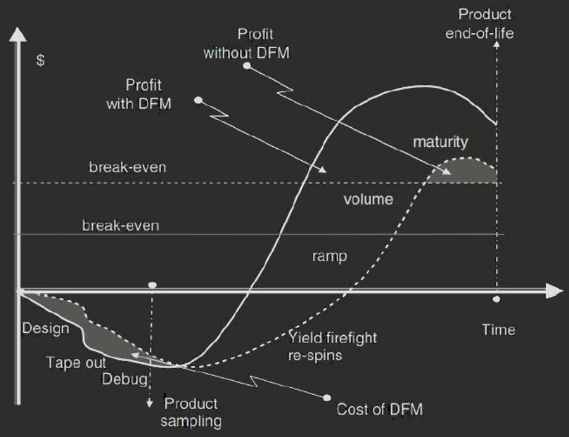

# 纳米级CMOS的可制造性设计

> Design for Manufacturability (DFM) for Nani-scale CMOS

**主讲**：李永福

[TOC]

## Understanding Moore's Law and Its Impact

- 1971：4004
- Moore's law: Enables innovation and cost reductions
  - Power: 35% reduction
  - Performance: 20% increase
  - Area: 30-40% reduction
  - Cost: 15% reduction
  - Environment Cost
- Or
  - Same circuitry ~ half the space
  - Twice the circuitry in the ~ same space
  - Optimized by design for best performance / cost
- e. g. Chip Layout Complexity in iPhone
  - A4 (53 mm2 45 nm)
  - A5 (122 mm2 45 nm) 
  - A6 (97 mm2 32 nm)
  - A7 (102 mm2 28 nm)
  - A8 (89 mm2 20 nm)
  - A9 (105 mm2 16 nm)
  - A10 (125 mm2 16 nm)
  - A11 (87 mm2 10 nm)
  - A12 (83 mm2 7 nm)
  - A13 (98 mm2 7 nm)
- Market continue to grow
- steady market expansion
  - Increasing semiconductor penetration in electronics
  - Increasing functionalities and performance
  - New applications in growth drivers
  - Demand from high end and low end markets
- China market continues to grow
- EDA Companies
  - R&D Centre
  - Regional Office

## Importance of EDA

- Trend between # transistors vs EDA
  - EDA is the backbone of the entire semiconductor industry
- Is EDA research easy
  - Go: number of State 10360
  - Chip Placement: number of State 109000
- Google Research in ISSCC 2020
  - Human Expert: ~6-8 person weeks
  - ML Placer: 24 hours
- Why EDA is important in China
- Who else has this problem
  - What do I benefit from EDA course if I am not into EDA research or industry
  - What about Computational finance?
    - Valuing complex financial instruments, derivatives
    - High dimensional, nonlinear, statistical integrals
    - Speed+accuracy matters here, e.g., ~real time decision making

## What's EDA and its history

- Time Period

  - 1950-1965: manual design only.
  - 1965-1975: Layout editors, e.g., place and route tools, first developed for printed circuit boards.
  - 1975-1985: More advanced tools for ICs and PCBs, with more sophisticated algorithms.
  - 1985-1990: First performance-driven tools and parallel optimization algorithms for layout; better understanding of underlying theory (graph theory, solution complexity, etc.).
  - 1990-2000: First over-the-cell routing, first 3D and multilayer placement and routing techniques developed. Automated circuit synthesis and routability-oriented design become dominant. Start of parallelizing workloads. Emergence of physical synthesis.
  - Design for Manufacturability (DFM), optical proximity correction (OPC), and other techniques emerge at the design-manufacturing interface. Increased reusability of blocks, including intellectual property (IP) blocks. 

- Common EDA terminology

  

  - Logic design: mapping the VHDL/ Verilog code to circuit gates/netlist 
  - Physical design: geometrical arrangement of cells and their connections within the IC layout. 
  - Physical verification: checks the correctness of the layout design. 
    - DRC: Design Rule Checking: Complies with all technology requirements?
    - LV: Layout vs. Schematic: Is consistent with the original netlist?
    - ERC: Electrical Rule Checking: Complies with all electrical requirements?

- Simple concept: schematic to layout

- How does things get complicated

- How to draw the layout
- VLSI design flow

## CMOS Challenges and Its Impact on Yield

### Challenges in Semiconductor Industry

#### Economy

- Huge Capex

  - Financing & Profitability of a new fab?

- ROI Risk

  - Increasing R&D costs
  - Increasing time & investment to ramp up yield

  > Costs are now prohibitive for many companies to continue to invest

#### Technology

- Manufacturing
- Design Complexity
  - Increasing process steps & design rules
  - Increasing yield loss due to process variation

### Define the type of yields?

### What cause poor functional yields?

#### Fab

- Random effects
  - Misalignment
  - Impurities / dust particles (Outside the die)
  - Defects (Within the die)
- Systematic effects
  - Human Errors
  - Equipment Errors
  - Limitation of lithography
  - Planarity issues

#### Design

- Physical effects
  - Fabrication accuracy
- Electrical & Parasitic effects
  - Modelling accuracy
- Thermal effects
  - Thermal gradients
  - Layout

### Yield Loss Mechanisms

### Root Causes?

#### Foundries

- More complex process
  - e. g. Strain engineering
    - Well proximity effects
    - Unforeseen mismatch
- More complex design rules

#### IC Design Companies / Product

- Circuits are sensitive to layout, matching, proximity and stress
  - e. g. It may not b possible for an unaided human to estimate the actual strain on a given transistor
- Harder to get skillful & experienced design engineers
- Reduce the design time cycle
  - maximize profit

#### Software design tool

- Lack of proper design-layout guided tools to ensure robust layout
- Lack of comprehensive verification tools for design sign-off

## What's DFM & It's Capabilities?

### What is the role of DFM in EDA?

- Circuit & Physical Automation
- Circuit Functional Verification
- Physical Verification
- Physical Design Optimization
- DFM Aware Automation Circuit & Physical Automation
- DFM Compliant Verification & Circuit Functional Verification
- DFM Compliant Verification & Physical Verification
- DFM Aware Optimization & Physical Design Optimization

#### or

- Ground Rules
- Recommended Rules
- Electrical Rules

### Design vs Manufacturing

### Foundries Assessment on DFM Value

### Characteristics of DFM

- Manufacturing Yield
  - Root Cause: Global | Local (~1µm)
  - Variation: Systematic | Random
- Type of DFM
  - Physical DFM ==> Functional Yield
    - Identifying physical weak points (Verification)
    - Improving the physical design (Optimization)
  - Electrical Effects ==> Parametric Yield
    - Identifying electrical performance deviation (Verification)
    - Improve the circuit and physical design (Optimization)
- Research / Implementation Techniques:
  - Rule/Heuristic
  - Model/Simulation based

### Industrial DFM Applications

- Systematic
- Printability
- Random
- Parametric
