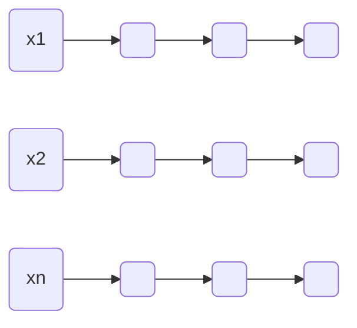
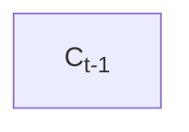

#  神经网络理论与应用及实现

**主讲**：陈海宝

[toc]

## **人工神经网络基础**

### 生物神经网

#### 组成

- 枝蔓 (Dendrite)
- 胞体 (Soma)
- 突触 (Synapse)
- 轴突 (Axon)

#### 基本特征

- 神经元及其联接
- 神经元之间的联接强度决定信号传递的强弱
- 联接强度可以随训练改变
- 信号可以起刺激作用，也可以起抑制作用
- 神经元接受的信号的累积效果决定该神经元的状态
- 每个神经元可以有一个*阈值*

### 人工神经元

#### 基本构成

```mermaid
graph LR
A(x1);B(x2);C(xn);D[Σ];E(f);F(...);G( );
A-->|W1|D;B-->|W2|D;F-->|...|D;C-->|Wn|D;D==net=XW==>E;E-->|"o=f(net)"|G
```

#### 模拟生物神经元的特性

- `waiting for text`

#### 激活函数

- 执行对该神经元所获得的网络输入的变换，也可以称为激励函数或活化函数$o=f(net)$
- 常见激活函数
  - 线性
  - 非线性斜面
  - 阈值函数
  - ReLU
  - S形函数

### 简单单级网



- 连接权：$W=(W_{ij})$
- 

### 多级网

> 相较于简单单级网，多出一些隐藏层


#### 层次划分

- 信号只被允许从较低层流向较高层
- 层号确定层的高低
  - 层号较小者，层次较低
  - 层号较大者，层次较高
- 输入层：第0层
- 第j层：第j-1层的直接后继层 (j>0)，直接接受第j-1层的输出
- 输出层：网络的最后一层，具有该网络的最大层号，负责输出网络的计算结果
- 隐藏层：除输入层和输出层以外的其他各层。不直接接受外界信号，也不直接向外界发送信号

#### 约定

- 输出层的层号为该网络的层数：n层网络，或n级网络
- 第j-1层到第j层的联接矩阵为第j层联接矩阵，一般用$W^{(j)}$表示
- 输出层对应的矩阵叫输出层联接矩阵

### 人工神经网络的训练

- 人工神经网络最具吸引力的是学习能力
- 人工神经网络学习定理
  - **人工神经网络可以学会它可以表达的任何东西** (逼近任何函数)
- 人工神经网络的表达能力大大限制了学习能力
- 学习过程就是训练过程

#### 学习过程

##### 无导师学习

> Unsupervised Learning，对应Unsupervised Training

- 统计、概率分析，逻辑推理
- 抽取样本集合中蕴含的统计特性，并以神经元之间联接权的形式存在于网络中

##### 有导师学习

> Supervised Learning，对应Supervised Training

- 输入向量与其对应的输出向量构成一个"训练对"
- 有导师学习的训练算法的主要步骤包括
  1. 从样本集合中取一个样本$A_i,B_i$
  2. 计算出网络的实际输出$O$
  3. 求$D=B_i-O$
  4. 根据$D$调整权矩阵$W$
  5. 对每个样本重复上述过程，直到整个样本集误差不超过规定范围

### 卷积神经网络 (CNN)

#### 卷积核

- 给定一幅图像，给定一个卷积核，卷积核就是根据卷积窗口进行像素的加权求和
- 卷积核位置，训练神经网络就是为了得出卷积核
  - 卷积核相当于单层感知器中的参数W，可把待学习的卷积核看成是神经网络的训练参数W

#### 卷积过程

> 每个卷积都是一种特征提取方式，将图像中符合条件 (激活值越大越符合)的部分筛选出来

#### 池化

##### 为什么要池化

- 
- 

##### 实例

#### 特征图

#### 示例：LeNet-5

> 用于手写字体识别

- 输入
- 输出
- C1层
- S2层
- C3层
- S4层
- C5层
- F6层

##### 进一步解释

### 深度学习

#### 概述

- 2006年Geoffrey Hinton提出的观点
  - 多隐层的人工神经网络
  - 深度神经网络训练上的难度
- 本质
- 与浅层学习的区别
  - 
  - 

#### 优点

### 深度学习与神经网络

- 深度学习更深
- 

## **张量分解基础**

### Kronecker积

#### 定义

给定$m_1\times m_2$阶的矩阵$A$和$n_1\times n_2$阶的矩阵$B$，则两个矩阵的Kronecker积为

$$
A\otimes B=
\left[
\begin{array}{ccc}
  1&2&3\\
  4&5&6\\
\end{array}
\right]
$$

##### 示例

$$

$$

### Khatri-Rao积

#### 定义

给定$m_\times k$阶的矩阵$A=(\vec{a_1},\vec{a_2},...,\vec{a_k})$和$n\times k$阶的矩阵$B=(\vec{b_1},\vec{b_2},...,\vec{b_k})$，则两个矩阵的Khatri-Rao积为

$$
A\odot B=(\vec{a_1}\otimes\vec{b_1},\vec{a_2}\otimes\vec{b_2},...,\vec{a_k}\otimes\vec{b_k})\\
B\odot A\\
$$

### 向量外积

> Vector Outer Product

#### 定义

给定向量$\vec{a}$，向量$\vec{b}$，向量$A$与$B$的外积
$$
A\circ B=\vec{a}\vec{b}^T
$$

#### 示例

设$\vec{a}=(1,2)^T,\vec{b}=(3,4)^T,\vec{c}=(5,6,7)^T,\chi=\vec{a}\circ\vec{b}\circ\vec{c}$

### 张量内积

> Inner Product

#### 定义

给定向量$\vec{a}$，向量$\vec{b}$，向量$\vec{a}$与$\vec{b}$的内积
$$
\langle\vec{a},\vec{b}\rangle=\vec{a}^T\vec{b}
$$

#### 示例

设$\vec{a}=(1,2)^T,\vec{b}=(3,4)^T$
$$
X(:,:,1)=\left[\begin{array}{cc}1&2\\ 4&5\\ \end{array}\right]
$$

### 张量F-范数

> Frobenius Norm

#### 定义

#### 示例

### 张量展开 (张量的矩阵化)

#### 定义

将高阶张量转换成二维空间的矩阵

- 按照模态1 (mode-1)展开：对应张量的第一阶展开，大小为$m\times nk$

$$
\chi_{(1)}=[\chi(:,:,1)]
$$

- 按照模态2 (mode-2)展开：对应张量的第二阶展开，大小为
- 按照模态3 (mode-3)展开：对应张量的第三阶展开，大小为

#### 示例

$$
\chi(:,:,1)=
\left[\begin{array}{ccc}
  x_{111}&x_{121}&x_{131}\\
  x_{211}&x_{221}&x_{231}\\
  x_{311}&x_{321}&x_{331}\\
  x_{411}&x_{421}&x_{431}\\
\end{array}\right],
\chi(:,:,2)=
\left[\begin{array}{ccc}
  x_{112}&x_{122}&x_{132}\\
  x_{212}&x_{222}&x_{232}\\
  x_{312}&x_{322}&x_{332}\\
  x_{412}&x_{422}&x_{432}\\
\end{array}\right]\\[7ex]
模态1:\chi_{(1)}=
$$

### 模态积 (张量与矩阵相乘)

#### 定义

$n_1\times n_2\times...\times n_d$阶的张量$\chi$与$m\times n_k$阶的矩阵$A$的$k$模态积记作
$$
\chi\times_kA
$$
$\chi\times_kA$的大小为

#### 示例

$$
\chi(:,:,1)=\begin{bmatrix} 1 & 2 \\ 3 & 4 \end{bmatrix},
\chi(:,:,2)=\begin{bmatrix} 5 & 6 \\ 7 & 8 \end{bmatrix},
A=\begin{bmatrix}  1 & 2 \\ 3 & 4 \\ 5 & 6 \end{bmatrix}\\
$$

### 高阶奇异值分解 (HOSVD)

#### 定义

- 矩阵的奇异值分解 (SVD)
  - $m\times n$的矩阵$A$，奇异值分解形式为：$A=U\Sigma V^T$
  - $U$为$m\times m$的左奇异向量，$V$为$n\times n$阶的右奇异向量，$\Sigma$上的元素为奇异值
- 张量的奇异值分解 (HOSVD)
  - $n_1\times n_2\times\cdots\times n_d$的张量$\chi$，对$k$模态的

#### 示例

## 实验室研究进展：DeepEye系统

> 物体边缘的视频理解

- 嵌入式实现
- 边缘设备计算

### GPU上低功耗运算

#### 英伟达GPU

- 高性能，10 TOPs通量
- 高功耗运算

### DeepEye系统

#### 视频理解架构

- 卷积神经网络 (CNN)+AI神经网络 (LSTM)
- 经过训练的量化张量压缩
- 边缘设备上的实时对象检测和动作识别 (ARM)

#### 时空模型

> 结构化，张量化的时间序列特征

- 常规方法
- 将视频帧或原始特征 (CNN)数据直接导入RNN
- DeepEye方法
  - 特征提取器：构建结构化，张量的时间序列模型
  - 深度压缩：张量压缩+经过训练的量化



#### 张量基础