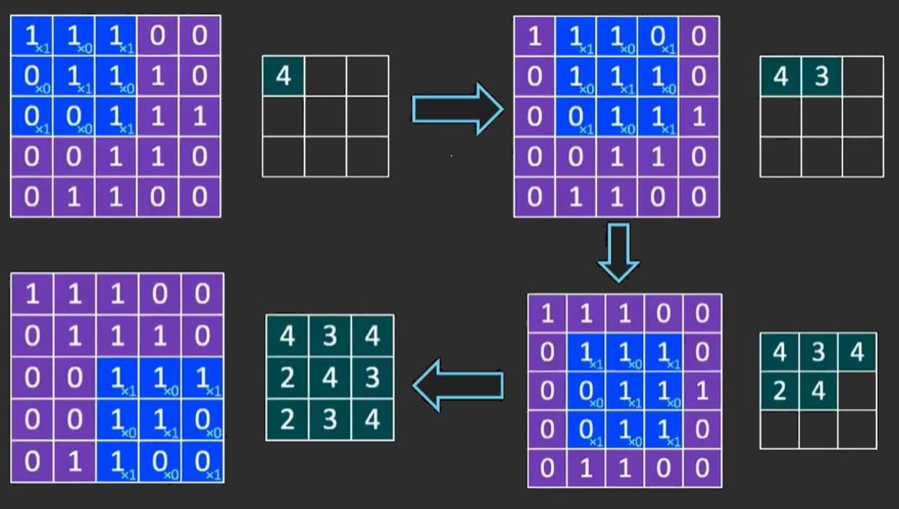
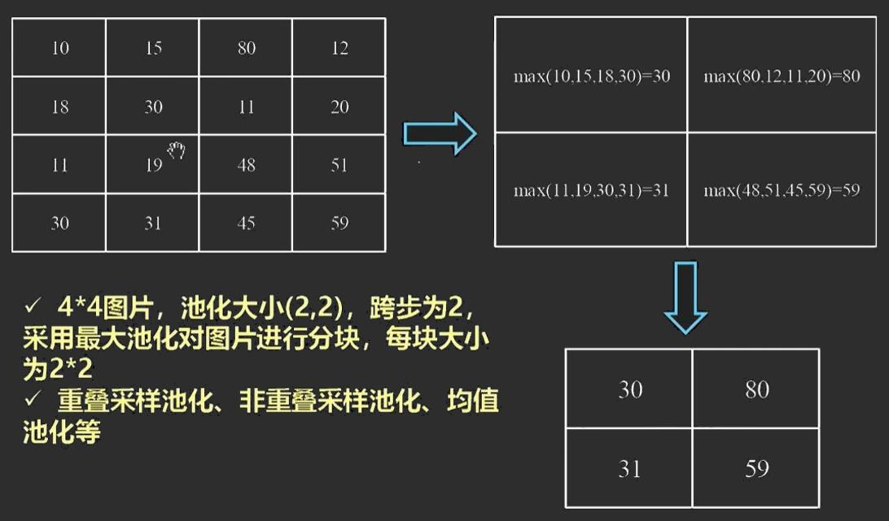
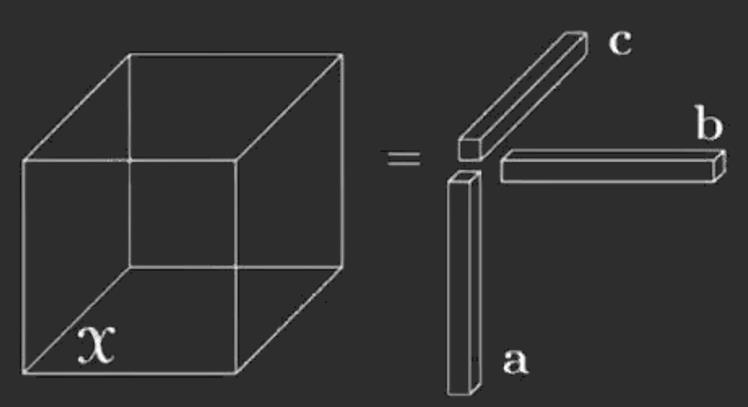
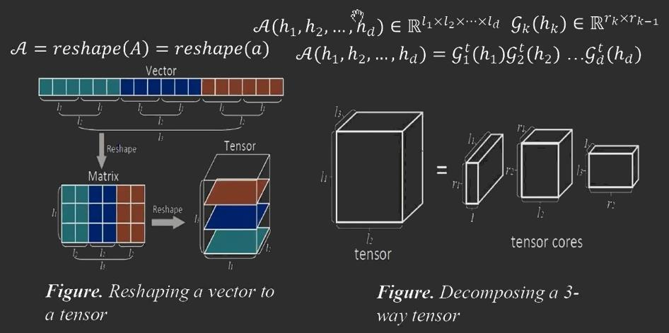
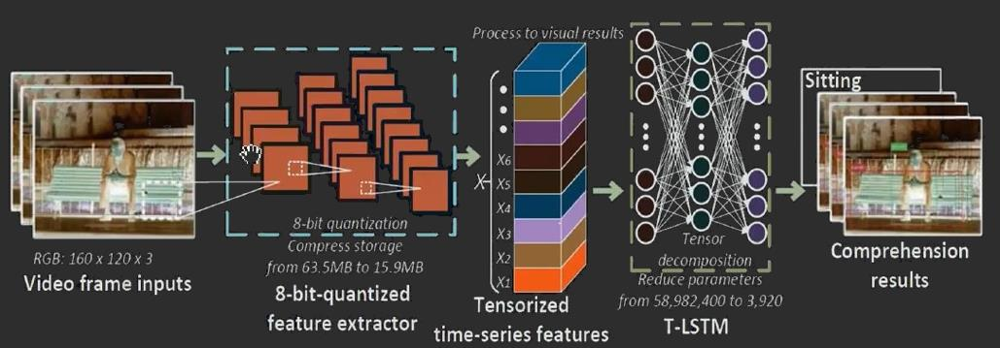

#  神经网络理论与应用及实现

**主讲**：陈海宝

[toc]

## **人工神经网络基础**

### 生物神经网

#### 组成

- 枝蔓 (Dendrite)
- 胞体 (Soma)
- 突触 (Synapse)
- 轴突 (Axon)

#### 基本特征

- 神经元及其联接
- 神经元之间的联接强度决定信号传递的强弱
- 联接强度可以随训练改变
- 信号可以起刺激作用，也可以起抑制作用
- 神经元接受的信号的累积效果决定该神经元的状态
- 每个神经元可以有一个*阈值*

### 人工神经元

#### 基本构成 (简单处理单元PE)

```mermaid
graph LR
A(x1);B(x2);C(xn);D[Σ];E(f);F(...);G( );
A-->|W1|D;B-->|W2|D;F-->|...|D;C-->|Wn|D;D==net=XW==>E;E-->|"o=f(net)"|G
```

#### 模拟生物神经元的特性

- 输入：$X=(x_1,x_2,\cdots,x_n)$
- 联接权：$W=(w_1,w_2,\cdots,w_n)^T$
- 网络输入：$net=\Sigma x_iw_i$
- 向量形式：$net=XW$

#### 激活函数

- 执行对该神经元所获得的网络输入的变换，也可以称为激励函数或活化函数$o=f(net)$
- 常见激活函数
  - 线性
  - 非线性斜面
  - 阈值函数
  - ReLU
  - S形函数


### 简单单级网


- 连接权：$W=(W_{ij})$
- 输出层的第$j$个神经元的网络输入：$net_j, (1≤j≤m)$
  - 取$NET=(net_1,net_2,\cdots,net_m)$
  - $NET=XW,$其中$X=(x_1, x_2, \cdots,x_n)$
  - $O=F(NET)=(f_1(net_1),f_2(net_2),\cdots,f_n(net_n))$

### 多级网

> 相较于简单单级网，多出一些隐藏层。深度神经网络至少有5层以上

 

#### 层次划分

- 信号只被允许从较低层流向较高层
- 层号确定层的高低
  - 层号较小者，层次较低
  - 层号较大者，层次较高
- 输入层：第0层
- 第$j$层：第$j-1,(j>0)$层的直接后继层，直接接受第$j-1$层的输出
- 输出层：网络的最后一层，具有该网络的最大层号，负责输出网络的计算结果
- 隐藏层：除输入层和输出层以外的其他各层。不直接接受外界信号，也不直接向外界发送信号

#### 约定

- 输出层的层号为该网络的层数：n层网络，或n级网络
- 第$j-1$层到第j层的联接矩阵为第$j$层联接矩阵，一般用$W^{(j)}$表示
- 输出层对应的矩阵叫输出层联接矩阵

### 人工神经网络的训练

- 人工神经网络最具吸引力的是学习能力
- 人工神经网络学习定理
  - **人工神经网络可以学会它可以表达的任何东西** (逼近任何函数)
- 人工神经网络的表达能力大大限制了学习能力
- 学习过程就是训练过程

#### 学习过程

##### 无导师学习

> Unsupervised Learning，对应Unsupervised Training

- 统计、概率分析，逻辑推理
- 抽取样本集合中蕴含的统计特性，并以神经元之间联接权的形式存在于网络中

##### 有导师学习

> Supervised Learning，对应Supervised Training

- 输入向量与其对应的输出向量构成一个"训练对"
- 有导师学习的训练算法的主要步骤包括
  1. 从样本集合中取一个样本$A_i,B_i$
  2. 计算出网络的实际输出$O$
  3. 求$D=B_i-O$
  4. 根据$D$调整权矩阵$W$
  5. 对每个样本重复上述过程，直到整个样本集误差不超过规定范围

### 卷积神经网络 (CNN)

#### 卷积核

- 给定一幅图像，给定一个卷积核，卷积核就是根据卷积窗口进行像素的加权求和
- 卷积核位置，训练神经网络就是为了得出卷积核
  - 卷积核相当于单层感知器中的参数W，可把待学习的卷积核看成是神经网络的训练参数W

#### 卷积过程



> 每个卷积都是一种特征提取方式，将图像中符合条件 (激活值越大越符合)的部分筛选出来

#### 池化

##### 为什么要池化

- 对于96×96像素的图像，假设已经学习得到400个定义在8×8输入上的特征
  - 每个特征和图像卷积都会得到$(96-8+1)\times (96-8+1)=7921$维的卷积特征
  - 由于有400个特征，所以每个example都会得到$7921\times 400=3169,400$维的卷积特征向量
  - 学习一个超过三百万特征输入的分类器十分不便，且容易出现**过拟合** (over-fitting)
- 描述大的图像，自然的想法是对不同位置的特征进行**聚合统计**
  - 例如计算图像一个区域上的某个特定特征的平均值(/最大值)
    - 这些概要统计特征具有相比使用所有提取到的特征低得多的维度
    - 可以改善结果，不容易过拟合
  - 这种方法称为池化 (pooling)，有时也称为**平均池化**或**最大池化** (取决于计算池化的方法)

##### 实例



#### 特征图

- CNN的每个卷积层都要人为选取合适的卷积核个数以及卷积核大小
  - 每个卷积核与图片进行卷积就可以得到一张特征图
- CNN中训练的卷积核并不止一个
  - 卷积核用于提取特征
  - 卷积核个数越多，提取的特征越多
    - 卷积核越多理论上精度越高
    - 卷积核越多，要求训练的参数也越多
- LeNet-5经典结构中第一层卷积核选择6个，而在AlexNet (2012)中第一层卷积核选择96个
  - 具体的合适数量需要依靠学习

#### 示例：LeNet-5

> 用于手写字体识别

- 输入：32×32的手写数字图片，有0-9十个类别
- 输出：分类结果，0-9之间的一个数
- C1层
  - 选择6个特征卷积核，每个大小为5×5
  - 得到6个特征图，每个大小为32-5+1=28
  - 神经元个数为6×28×28=784
- S2层 (下采样层)
  - 使用最大池化进行下采样，池化size为 (2, 2)
  - 相当于对C1层28×28的图片进行分块，每块大小为2×2，共14×14个块
  - 统计每个块中最大的值作为下采样的新像素，因此可以得到S1结果为14×14大小的图片，共6张图片
- C3层 (卷积层)
  - 卷积核大小依旧为5×5，据此得到新的图片大小为14-5+1=10
  - S2层包含6张14×14大小的图片，希望C3层得到16张10×10的特征图
  - 16张中每张图片通过S2的六张图片加权组合得到
- S4层
- C5层
- F6层

##### 具体计算过程

$$
假设输入第i个特征图的各个像素值为x_{1i},x{2i},\cdots,x_{25i},\\
因为每个特征图有25个像素,因此第i个特征图经过5\times5的图片卷积后,得到的像素值P_i可表示成\\[1ex]
p_i=w_{1i}\cdot x_{1i}+w_{2i}\cdot x_{2i}+\cdots+w_{25i}\cdot x_{25i}\\[1ex]
可以类似计算P_1到P_6,然后相加\\[1ex]
P=P_1+P_2+\cdots+P_6,即P=WX\\[1ex]
其中X为输入,即6张5\times5特征图片的各个像素点值\\
W是需要学习的参数,相当于6个5\times5的卷积核,包含6\times5\times5个参数\\
因此输出特征图为out=f(P=b),其中b表示偏置项,f为激活函数
$$

### 深度学习

#### 概述

- 2006年Geoffrey Hinton提出的观点
  - 多隐层的人工神经网络具有优异的特征学习能力，学习得到的特征对数据有更本质的刻画，有利于可视化和分类
  - 深度神经网络训练上的难度可以通过**逐层初始化** (layer-wise pre-training)有效克服，可通过无导师学习实现
- 本质
  - 通过构建多隐层的模型和海量训练数据 (可为无标签数据)来学习更有用的特征，从而最终提升分类或预测的准确性
  - **深度模型**是手段，**特征学习**是目的
- 与浅层学习的区别
  - 强调模型结构的深度，通常有5-10层的隐层节点
  - 明确突出特征学习的重要性，通过逐层特征变换将样本在原空间的特征表示变换到一个新特征空间，更容易分类和预测

#### 优点

- 可通过学习一种深层非线性网络结构来实现复杂的函数逼近，表征输入数据分布式表示

### 深度学习与神经网络


- 深度学习层数更深，要学习的网络参数更多，更复杂
- 神经元的计算处理模式类似，输入输出形式一致

## **张量分解基础**

### Kronecker积

#### 定义

给定$m_1\times m_2$阶的矩阵$A$和$n_1\times n_2$阶的矩阵$B$，则两个矩阵的Kronecker积为

$$
A\otimes B=
\left[
\begin{array}{cccc}
  a_{11}B&a_{12}B&\cdots&a_{1m_2}B\\
  a_{21}B&a_{22}B&\cdots&a_{2m_2}B\\
  \vdots&\vdots&\ddots&\vdots\\
  a_{m_11}B&a_{m_12}B&\cdots&a_{m_1m_2}B\\
\end{array}
\right]\\[8ex]
B\otimes A\neq A\otimes B\\
(A\otimes B)^T=A^T\otimes B^T
$$

### Khatri-Rao积

#### 定义

给定$m_\times k$阶的矩阵$A=(\vec{a_1},\vec{a_2},...,\vec{a_k})$和$n\times k$阶的矩阵$B=(\vec{b_1},\vec{b_2},...,\vec{b_k})$，则两个矩阵的Khatri-Rao积为

$$
A\odot B=(\vec{a_1}\otimes\vec{b_1},\vec{a_2}\otimes\vec{b_2},...,\vec{a_k}\otimes\vec{b_k})\\[2ex]
B\odot A\neq A\odot B\\
$$

### 向量外积

> Vector Outer Product

#### 定义

给定向量$\vec{a}$，向量$\vec{b}$，向量$A$与$B$的外积

$$
a\circ b=\vec{a}\vec{b}^T
$$

#### 示例

设$\vec{a}=(1,2)^T,\vec{b}=(3,4)^T,\vec{c}=(5,6,7)^T,\chi=\vec{a}\circ\vec{b}\circ\vec{c}$，则

$$
a\circ b=\vec{a}\vec{b}^T=\left[\begin{array}{cc}3&4\\ 5&8\end{array}\right]\\[4ex]
X(:,:,1)=\left[\begin{array}{cc}1\times3\times5&1\times4\times5\\ 2\times3\times5&2\times4\times5 \end{array}\right]=\left[\begin{array}{cc}15&20\\ 30&40\\ \end{array}\right]\\[4ex]
X(:,:,2)=\left[\begin{array}{cc}1\times3\times6&1\times4\times6\\ 2\times3\times6&2\times4\times6 \end{array}\right]=\left[\begin{array}{cc}18&24\\ 36&48\\ \end{array}\right]\\[4ex]
X(:,:,3)=\left[\begin{array}{cc}1\times3\times7&1\times4\times6\\ 2\times3\times7&2\times4\times7 \end{array}\right]=\left[\begin{array}{cc}21&28\\ 42&56\\ \end{array}\right]\\[5ex]
\chi是一个三维数组，对于任意索引\chi(i,j,k),\chi_{ijk}=a_i·b_j·c_k\\
i=1,2,~j=1,2,~k=1,2,3\\
从而得到一个第三阶张量(third-order tensor)
$$



### 张量内积

> Inner Product

#### 定义

给定向量$\vec{a}$，向量$\vec{b}$，向量$\vec{a}$与$\vec{b}$的内积

$$
\langle\vec{a},\vec{b}\rangle=\vec{a}^T\vec{b}
$$

**两个大小相同的张量，其内积为一个标量**

### 张量F-范数

> Frobenius Norm

#### 定义

给定张量$\chi$，张量$\chi$的F-范数为$\parallel\chi \parallel_F=\sqrt{(\chi,\chi)}$

#### 示例

$$
设\chi(:,:,1)=\left[\begin{array}{cc}1&2\\ 3&4\end{array}\right],~
\chi(:,:,2)=\left[\begin{array}{cc}5&6\\ 7&8\end{array}\right]\\[2ex]
\parallel\chi \parallel_F=\sqrt{(\chi,\chi)}=\sqrt{1^1+2^2+3^3+4^4+5^5+6^6+7^7+8^8}=\sqrt{204}
$$

- 张量$\chi$的F-范数的平方等于其所有元素的平方和
- 多作为矩阵分解或张量分解优化问题中的目标函数

### 张量展开 (张量的矩阵化)

#### 定义

将高阶张量转换成二维空间的矩阵

- 按照模态1 (mode-1)展开：对应张量的第一阶展开，大小为$m\times nk$

$$
\chi_{(1)}=[\chi(:,:,1),~\chi(:,:,2),~\cdots,~\chi(:,:,k)]
$$

- 按照模态2 (mode-2)展开：对应张量的第二阶展开，大小为$n\times mk$

$$
\chi_{(2)}=[\chi(:,:,1)^T,~\chi(:,:,2)^T,~\cdots,~\chi(:,:,k)^T]
$$

- 按照模态3 (mode-3)展开：对应张量的第三阶展开，大小为$k\times mn$

$$
\chi_{(3)}=[\chi(:,1,:)^T,~\chi(:,2,:)^T,~\cdots,~\chi(:,n,:)^T]
$$

#### 示例

$$
\chi(:,:,1)=
\left[\begin{array}{ccc}
  x_{111}&x_{121}&x_{131}\\
  x_{211}&x_{221}&x_{231}\\
  x_{311}&x_{321}&x_{331}\\
  x_{411}&x_{421}&x_{431}
\end{array}\right],
\chi(:,:,2)=
\left[\begin{array}{ccc}
  x_{112}&x_{122}&x_{132}\\
  x_{212}&x_{222}&x_{232}\\
  x_{312}&x_{322}&x_{332}\\
  x_{412}&x_{422}&x_{432}
\end{array}\right]\\[7ex]
模态1:\chi_{(1)}=
\left[\begin{array}{cccccc}
  x_{111}&x_{121}&x_{131}&x_{112}&x_{122}&x_{132}\\
  x_{211}&x_{221}&x_{231}&x_{212}&x_{222}&x_{232}\\
  x_{311}&x_{321}&x_{331}&x_{312}&x_{322}&x_{332}\\
  x_{411}&x_{421}&x_{431}&x_{412}&x_{422}&x_{432}
\end{array}\right]\\[7ex]
模态2:\chi_{(2)}=
\left[\begin{array}{cccccccc}
  x_{111}&x_{211}&x_{311}&x_{411}&x_{112}&x_{212}&x_{313}&x_{412}&\\
  x_{121}&x_{221}&x_{321}&x_{421}&x_{122}&x_{222}&x_{322}&x_{422}&\\
  x_{131}&x_{231}&x_{331}&x_{431}&x_{132}&x_{232}&x_{332}&x_{432}&
\end{array}\right]\\[7ex]
模态3:\chi_{(3)}=
\left[\begin{array}{cccccccccccc}
  x_{111}&x_{211}&x_{311}&x_{411}&x_{121}&x_{221}&
  x_{321}&x_{421}&x_{131}&x_{231}&x_{331}&x_{431}\\
  x_{112}&x_{212}&x_{312}&x_{412}&x_{122}&x_{222}&
  x_{322}&x_{422}&x_{132}&x_{232}&x_{332}&x_{432}
\end{array}\right]\\[7ex]
$$

### 模态积 (张量与矩阵相乘)

#### 定义

$n_1\times n_2\times...\times n_d$阶的张量$\chi$与$m\times n_k$阶的矩阵$A$的$k$模态积记作

$$
\chi\times_kA
$$

$\chi\times_kA$的大小为

$$
n_1\times n_2\times\cdots\times n_{k-1}\times m\times n_{k+1}\times\dots\times n_d
$$

当$1≤i_1≤n_1, 1≤i_d≤n_d,1≤j≤m$，对每个元素满足

$$
(\chi\times_kA)_{i_1i_2\cdots ji_{k+1}\cdots i_d}=\sum_{i_k=1}^{n_k}x_{i_1i_2\cdots i_da_{ji_k}}
$$

$T=\chi\times_kA$与$T_{(k)}=A\chi_{(k)}$等价，可采用张量展开的形式简化模态积运算

#### 示例

$$
\chi(:,:,1)=\begin{bmatrix} 1 & 2 \\ 3 & 4 \end{bmatrix},~
\chi(:,:,2)=\begin{bmatrix} 5 & 6 \\ 7 & 8 \end{bmatrix},~
A=\begin{bmatrix}  1 & 2 \\ 3 & 4 \\ 5 & 6 \end{bmatrix}\\
y=\chi\times_1A是3\times2\times2阶张量\\
y(:,:,1)=\begin{bmatrix}  7 & 10 \\ 15 & 22 \\ 23 & 34 \end{bmatrix},~
y(:,:,2)=\begin{bmatrix}  19 & 22 \\ 43 & 50 \\ 67 & 78 \end{bmatrix}\\
y_{(1)}=A\chi(1)=\begin{bmatrix}
	7  & 10 & 19 & 22 \\
	15 & 22 & 43 & 50 \\
	23 & 34 & 67 & 78 
\end{bmatrix}
$$

### 高阶奇异值分解 (HOSVD)

#### 定义

- 矩阵的奇异值分解 (SVD)
  - $m\times n$的矩阵$A$，奇异值分解形式为：$A=U\Sigma V^T$
  - $U$为$m\times m$的左奇异向量，$V$为$n\times n$阶的右奇异向量，$\Sigma$上的元素为奇异值
- 张量的奇异值分解 (HOSVD)
  
  - $n_1\times n_2\times\cdots\times n_d$的张量$\chi$，对$k$模态的矩阵奇异值分解为
    $$
    \chi_{(k)}=G\times_1U_1\times_2U_2\times\cdots\times_dU_d
    $$
  
  - 其中G为核心张量
    $$
    G=\chi\times_1U_1^T\times_2U_2^T\times_dU_d^T
    $$
  
- G的维度为$n_1\times n_2\times\cdots\times_dU_d^T$，可使用截断的奇异值分解对高阶张量降维

## 实验室研究进展：DeepEye系统

> 物体边缘的视频理解

- 嵌入式实现
- 边缘设备计算

### GPU上低功耗运算

#### 英伟达GPU

- 高性能，10 TOPs通量
- 高功耗运算
  - FP计算效率低
  - 数据迁移效率低

### DeepEye系统

#### 视频理解架构

- 卷积神经网络 (CNN)+AI神经网络 (LSTM)
- 经过训练的量化张量压缩
- 边缘设备上的实时对象检测和动作识别 (ARM)

#### 时空模型

> 结构化，张量化的时间序列特征

- 常规方法
- 将视频帧或原始特征 (CNN)数据直接导入RNN
- DeepEye方法
  - 特征提取器：构建结构化，张量的时间序列模型
  - 深度压缩：张量压缩+经过训练的量化
  - LSTM块的输入是提取的时间序列特征，构造为$s×f×c$张量
  - 为每个帧检测s个对象，为每个对象提取f个特征并预测这些对象的c个置信度得分
  - 通过这种方式，LSTM会获得提炼的信息，以提供高精度和高性能


#### 张量基础

- 张量是矩阵的多维概括
- 张量分解
  - 找到高维数组的低秩近似
  - 表示为一系列小尺寸因素
  - 将计算复杂度从指数降低到线性



#### 结构化张量压缩

- 在RNN/LSTM中，最核心的计算是大规模矩阵向量乘法$y=Wx+b$

  - 权重矩阵：$W\in\mathbb{R}^{N\times M}$
  - 输入特征矩阵：$x\in \mathbb{R}^M$
  - 输出和偏置矩阵：$y,b\in\mathbb{R}^n$

  > $M=m_1\times m_2\times\cdots\times m_d$
  >
  > $N=n_1\times n_2\times\cdots\times n_d$
  >
  > $y(j)=\sum_{i=1}^MW(j,i)x(i)+b(j)$

- 使用双参数技巧，可以使用结构化张量分解完全连接的计算

$$
y(j_1,j_2,\cdots,j_d)=\sum[g_1^t(j_1,i_1)g_2^t(j_2,i_2)\cdots g_d^t(j_d,i_d)\chi(i_1,i_2,\cdots,i_d)]+B(j_1,k_2,\cdots,j_d)
$$

#### 工作流程

- 视频剪辑作为输入馈入8位量化的特征提取器
- 将特征提取器的时间序列特征输出构造成张量，并馈入T-LSTM
- 在对张量输入到隐藏映射和隐藏到隐藏映射进行结构化张量压缩的T-LSTM处理后，获得针对视频动作识别的分类结果

