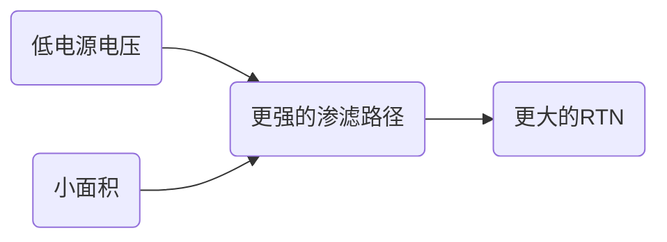
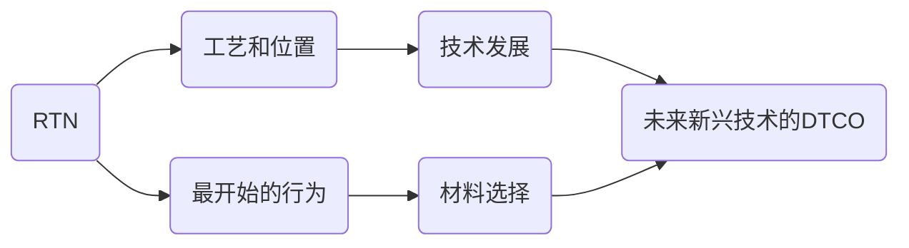

# **Electronic Device and IC Reliability**: State of the art and the future

主讲人：[纪志罡]( http://dmne.sjtu.edu.cn/dmne/%e7%ba%aa%e5%bf%97%e7%bd%a16754-2/ )

[TOC]

## IC产业与规模

### 晶体管史之前

#### 晶体管和集成电路

- 概念：表面场效应晶体管
  - Lilienfeld (1930)
  - Heil (1935)
- 贝尔实验室的第一个基于锗的晶体管 (1947)
- 第一个集成电路 (1BJT + 3电阻 + 1电容)
  - Jack Kilby (1958)
- 第一款具有光刻图案化金属互连的平面集成电路 (4BJT+2R)
  - Robert Noyce (1959)

#### CCD：电影技术的关键因素

- 第一个 CCD
  - Boyle and Smith (1969)
- 第一台数码相机 (1991)
  - DCS100, USD13000, 5kg

#### 机械表的消亡

- CMOS 电子腕表
  - ISSCC (1971)

### 集成电路产业是信息生态社会的关键

- 信息服务
  - 整机性能决定市场竞争力
- 电子产品
  - 芯片、软件决定整机性能
- 集成电路
  - 芯片决定软件性能
- 
  - 工艺决定芯片性能
- 
  - 装备和材料决定工艺水平

### IC最重要的概念：缩放

- 在过去的三十年中，晶体管数量每18个月增加一倍
- 没有其他人工制品能这样被大量制造

### 摩尔定律：意味着什么

$$
2^{33.33}=10,797,662,668
$$

### 缩放：5G技术的关键

- 28 nm通过解决三个问题使4G基带IC在技术上可行
  - 更高的速度以支持更高的数据速率 (100Mbps)
  - 低功耗 (500 pJ/bit)，总功率小于1W
  - 芯片尺寸约 2cm^2^
- 5G 基带：比 1 Gbps的数据比率高10倍
  - 功率消耗：$0.5nJ/bit\times 1Gbps=0.5W,4~paraller\rightarrow 2w$
  - 尺寸：$2cm^2\times 10\times 4=80cm^2$

#### 缩放并不容易

- 更高的驱动电流
- 更少的泄漏
- 更快的速度

#### 驱动电流的驱动器

$$
I=q\times n\times v\times A\\
n:载流子密度\\
v:速度
$$

MOSFET中电子/空穴迁移率增加 ==> 驱动电流增加

- 驱动1: Strain silicon Technology (应变硅技术，Intel 90 nm(2003))
- 驱动2: High mobility material (高迁移率材料)

#### 驱动尺寸缩放的驱动器

$$
Q=CV\\C=\varepsilon_0\varepsilon_r\frac{A}{T_{OX}}
$$

- MOSFET在非常小的L时变成“电阻器”
  - 漏极与栅极竞争以控制沟道势垒
- 解决方案：做得更薄，不止一侧更好的栅控制器

#### FINFET，纳米线和纳米片

### 启用“很多设备”


### 摩尔定律快停止了么

- 从晶体管比例微缩而言，确实快停止了
- 从单位面积算力提升而言，还有很多创新，很多新技术可以做
  - 架构创新
  - 三维集成
  - 新的计算范式：未来计算
- 从企业角度而言，还可以从降低成本，集成更多功能等延续摩尔定律

## “旧”但“新”的问题：可靠性

### 扩展路径中的可靠性问题

- 随着设备尺寸的缩小，添加了各种新的驱动器


### 浴盆曲线

- 失败率：某时间所有样本中有多少次失败的产品
- 实测统计
  - 有些产品在制造初期可能会出现故障
  - 好的产品只能在一段时间内以低故障率正常运行


```c
'浴盆曲线'='早期失败'+'磨损'
```

#### 设备可靠性趋势

- 转向较小的几何形状时，可靠性是一个日益严重的问题
- IC在客户使用时失效的风险越来越大

#### 可靠性的另一个角度

##### 电源电压功率


- 由于亚阈值斜率未缩放，电源电压在大约1V时饱和

##### 电场


- 第三个定标周期：由于未定标的亚阈值斜率而导致的新的恒定电压定标对可靠性产生了新的影响

##### 功率密度


- 温度几乎加速了所有可靠性问题
  - 高温可发生在几乎所有应用中
  - 可靠性问题可以在高温下被触发
- 功率密度堪比核反应堆

### 可靠性的重要性

- 所有产品和技术的重要组成部分

## 最新技术的退化机制和可靠性评估

### 变异性：纳米时代的新挑战


### 寿命预测的加速测试：确定性

- 为什么需要加速测试
  - 通常需要10年无故障运行
  - 但是，该设备无法在运行条件下进行多年测试

### 经典方法变得更加困难

#### 设计成本指数上升


### 经典方法的不足

- 不同的应用程序有不同的工作量，在传统的可靠性评估中并未考虑到这一点，因此引入了悲观的估计

#### 跨层可靠性解决方案

- 可靠性不应该由制造商来保证，而是需要考虑实际的电路操作
  - 可靠性电路设计
  - 设备/技术共同优化 (DTCO)

#### 最新的DTCO


## 关键降解机制：氧化物击穿

### 氧化栅击穿

#### 栅极介电击穿的阶段


#### 单阱传导路径

- 附加的泄漏路径=陷阱辅助隧穿，并产生能量损失
  - 应力引起的漏电流 = SILC
- 稳态SILC的增加与中性氧化物陷阱的密度成正比
- 界面之间中间附近的陷阱=最高电导率


##### SILC的变化外观

- 突然电流增加约250nA
  - 创建单阱陷阱传导路径
  - “离散” SILC事件
- 不是击穿


### 软击穿

- SBD在多个陷阱排在一起时发生
- SBD之后，电路仍然可以工作，但功耗更大


#### TDDB：统计分布参数

- 时间与击穿的统计关系是韦伯分布


$$
F(t)=1-exp[-(\frac{t}{\eta})^\beta]\rightarrow \ln(-\ln(1-F))=\beta\ln(t)-\beta\ln(\eta)
$$

#### TDDB与过滤路径上阱的数量有关


- 韦伯曲线随氧化层厚度增加而增加，可以用作识别多层堆栈 (高K)中的破坏层

#### 确定最大适用栅极电压


- 温度加速度和统计定标的综合作用 (取决于β)
- 此推断仅对**更精确的软击穿电压功率定律**有效

#### 软击穿不总是坏事

- 软击穿是OTP (一次性可编程反熔丝)的基础
- 广泛用于安全和认证


- 在加速击穿后评估$s≡\frac{I_D}{I_S+I_D}$

### 硬击穿：传导路径和热

- 由热失控引起
- 硬击穿后可能出现一些数字噪声


#### 击穿的难度取决于栅电极

- 栅电流时空是由栅的电子供应控制的正反馈过程


- 基于HKMG的10 nm以下技术是TDDB的理想选择

#### 整体TDDB预测


- 范围1：不击穿
- 范围2：多个软击穿
  - 10年后相对漏电流增加DI/I~0~
  - 注意：单个小晶体管的电流增加可能很大
- 范围3：硬击穿 (考虑多个SBD)
  - 0.01%的失效寿命

## 新兴应用的新维度

### TDDB领导的新兴器件

- 能量=信息：新兴记忆的基础
- TDDB：引入能量的方法

#### ReRAM基于软击穿


### RTN：无处不在的现象

- 单电荷可以被捕获，导致电流变化
- 低于22 nm的严重问题
- 对于任何纳米级器件都很重要

#### RTN为什么重要

- RTN使6晶体管SRAM的失效概率趋于平稳


#### RTN关键参数

- 时间常数
  - 捕获时间 (t~c~)：空陷阱捕获电子的时间
  - 发射时间 (τ~e~)：填充的陷阱发射电子的时间
  - 两者均呈指数分布
- 大小
  - $\Delta I_d/I_d$或$\Delta V_{TH}$

#### RTN：异常幅度

- 电荷片模型无法解释其幅度
  - $V_{th}=\frac{q}{C}=q\times \frac{t_{ox}}{e0er}$

#### 低功耗应用的噩梦




#### RTN：高级提取

- HMM和阶乘HMM (FHMM)


#### RTN：耦合问题


#### 如果有RTN，会发生什么

- RTN由于缺乏缺陷，因此自然是纳米级的
- RTN是可电测量的，因此就地非常简单

#### 基于RTN的DTCO



## 后摩尔时代的研究

### 新兴应用

- 5G
- 物联网
- 人工智能

需要算力和存储

### 中国的集成电路产业树

- 几乎没有半导体材料和设备产业
  - 原材料，设备和EDA工具几乎为0
- 集成电路制造与世界水平有一些差距
- 封测与世界水平接近
- 芯片加工部分和先进水平有几代的差距

## 结论

- 集成电路产业和先进技术：对中国具有战略意义
- 可靠性对于任何先进技术的批量生产至关重要
- 可靠性物理，不仅对可靠性很重要，而且对新兴应用也很重要
- IC行业受后摩尔时代的应用推动，以计算能力和新颖的存储技术为中心