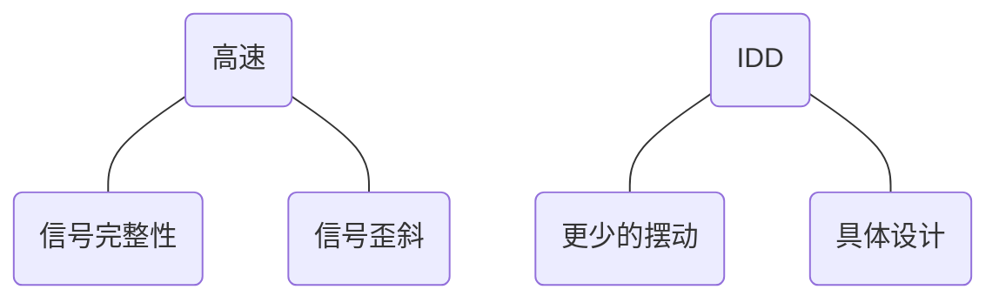
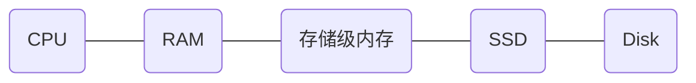

DRAM

**主讲人：韩俊峰，祝铖** (Micron)

[TOC]

## **制造存储芯片：从设计到生产**

<iframe 
    width="800" 
    height="450" 
    src="https://v.qq.com/x/page/t0535aefcwz.html"
    frameborder="0" 
    allowfullscreen>
</iframe>

### DRAM的应用

- 2017年，美光生产了98,015,448,662,016,000,000,000 DRAM比特
  - 整个行业中总共有4×10^20^比特
    - 相当于世界上每个人分配 6GB

## **DRAM如何在系统中工作**

### 计算中不同类型存储

#### DRAM在系统存储中的位置

- 缓存 (on-processor SRAM)
  - 访问极快
  - 每比特成本非常高
- 主存 (DRAM)
  - 访问较快
  - 每比特成本较高
- 外存 (SSD/HDD)
  - 访问相对较慢
  - 每比特成本较低

### 系统内存访问：图书馆模型

- 办公桌旁的一本打开的书就像CPU寄存器中的内存
  - 该页面上的信息立即可用
- 已打开的书中的其他页面类似于CPU缓存
  - 当前打开的书中的信息可以很快获得
- 桌上的其他书籍就像主存储器 (DRAM)
  - 来自桌子上一本书的信息可以很快地获得
- 书架上的书就像存储 (SSD/HDD)
  - 书架上一本书的信息不容易获得
- 如果从缓存中获取信息有1英尺远
  - 主存 (DRAM)在65英尺外
  - SSD数据距离 > 100英里

#### 主存中的控制器

- 当今的处理器包不仅仅包含处理核心
- 内存控制器是系统与DRAM的唯一接口
  - 任何主存的需求都路由到内存控制器

### 系统物理存储的组织

- DIMM (双列in-line内存模块)是一块内存芯片所在的电路板
  - 同一模块上的多个DRAM设备会增加模块密度
  - 使客户能够灵活地提供更多的内存并进行升级
- DIM Ms可能具有共享相同数据总线的内存
  - 一次只能使用一级存储器
- 现代系统具有位于单独总线上的多个“通道”
  - 增加可能的同时内存通信量

#### 系统存储的拓扑逻辑

- 所有程序/应用程序都使用某种形式的内存
- 程序员不希望负担了解所使用的存储技术的负担
  - 幸运的是，程序员可以只声明一个变量或使用数组指针访问主存储器
    - 是否可以想象必须在Javascript或其他应用程序代码中指定Channel，Dimm，Rank，Bank，Row和Column来访问内存？
  - 为了简化此过程，系统创建了一个单一的，统一的统一内存映射，用于描述系统中的所有内存
- 可以使用单个数字索引 (指针)来检索系统中的任何内存字节
  - 从“系统地址”到“内存地址”的转换是一个非常复杂的过程，由于其对系统内存性能的影响，通常被认为是专有的

#### 存储地址翻译的示例

- 在最简单的情况下 (均等的二次幂加载)，系统地址的位直接映射到DRAM地址的位
  - 系统地址：`0xABC123458` = $\color{yellow}{1010~1011~1100~0001}~\color{cyan}{0}\color{lime}{010}~\color{red}{0011~010}\color{orange}{0}~\color{lime}{0}\color{violet}{1}\color{red}{01~1}\color{gray}{000b}$
  - $\color{violet}{\text {Channel}}$：`A6` = `1` (交错通道访问)
  - $\color{orange}{\text {Dimm}}$：`A8` = `0`
  - $\color{cyan}{\text {Rank}}$：`A19` = `0`
  - $\color{lime}{\text {Bank}}$：`A18, A7, A[17:16]` = `0010b` = `2`
  - $\color{yellow}{\text {Row}}$：`A[35:20]` = `1010101111000001b` = `0xABC1`
  - $\color{red}{\text {Column}}$：`A[15:9], A[5:3]` = `0011010011b` = `0x0D3`
- 实际上，系统地址转换要复杂得多
  - DRAM地址位是系统地址位的哈希，该哈希根据加载或所选的系统选项而变化
  - 非均质或非二次幂加载会带来各种翻译挑战

#### 存取的重新排列和数据冲突

- 内存访问优化
  - 存储器控制器可以重新排序存储器请求，以减少DRAM时序的影响。
  - 示例
    - 请求1 $\Longrightarrow$ 读Bank0，第0行，第0列
    - 请求2 $\Longrightarrow$ 写Bank0，第1行，第1列
    - 请求3 $\Longrightarrow$ 写Bank0，第0行，第10列
    - 内存控制器将先处理请求1，然后处理请求3，然后再处理请求2，以避免关闭和重新打开Bank0，第0行
- 数据加扰
  - 内存控制器将根据特定地址和加扰算法对传递给DRAM的数据进行加扰
  - 增加了安全措施
  - 通过避免易于使用SSO的常见数据模式来提高总体信号完整性
  - 示例
    - 发送到控制器的数据：`00 00 00 00 00 00 00 00`
    - 发送到DRAM的数据：`A5 32 6F B9 04 22 BC 47`

#### 这些对DRAM意味着什么

- 本质上，对于程序员而言，要准确地知道其应用程序如何使用DRAM是非常困难的，甚至几乎是不可能的
  - 多层歧义 (甚至比讨论的还要多)
  - 当前的系统诊断测试是一般性压力测试和一般性猜测的混合体，目的是为了消除歧义，但是从来没有100％成功
- 应用程序代码无法直接操纵内存控制器访问
- DiagView演示
  - 该工具显示系统中不同的存储层如何影响DRAM的外观

## DRAM单元、逻辑及运行方式

### 名词解释

- RAM
  - RAM是随机存取存储器的缩写，也称为主存储器，用于直接与CPU交换数据
  - 可以随时读写。由于操作速度非常快，因此RAM始终用作操作系统和工作程序的临时存储介质
  - 当RAM工作时，它可以从指定地址读取/写入数据
  - RAM和ROM之间最大的区别是掉电后数据将丢失，这称为易失性
- 随机访问
  - 随机访问意味着读取/写入数据的必要时间与数据地址无关
  - 与顺序访问不同，在顺序存取存储设备中，读/写数据所需的时间与地址有关
- 挥发性
  - 关闭电源后，RAM无法保存数据
  - 如果有必要保留数据，则应将其写入非易失性存储设备 (例如硬盘)中

#### DRAM存储单元

- DRAM (动态随机存取存储器)是一种半导体存储器
  - 关键原理是使用电容中的电荷量来表示该位是1还是0
  - 由于电容在现实中具有泄漏，并且电位差可能不足以识别，因此需要定期重新充电/刷新
    - 保留数据所必需
  - 由于周期性的刷新特性，DRAM被称为动态RAM
  - 与DRAM相比，即使没有分配刷新，SRAM也不会丢失数据
- DRAM与SRAM相比具有结构简单的优点
  - 仅需要1个电容和一个MOSFET即可处理1位数据
  - SRAM始终需要6个MOSFET才能获取1位数据
  - 由于结构简单，所以DRAM具有很高的密度并且成本很低
  - 另一方面，DRAM遭受低存取速度和高功率需求的缺点

- 需要两个信号来读取和写入存储电容器或存储单元
  - 字线或行 (从行地址解码)
  - 数据线或数字线 (从列地址和DQ解码)
- 字线打开到VCCP

  - 字线接通内部产生的称为~CCP~的高电压电源
  - V~CCP~由电荷泵创建，其DC值通常为V~CC~+1.5V
  - 当从存储单元读取"1"或向存储单元写入"1"时，V~CCP~可以防止访问晶体管两端的电压降 
    - 需要保持NMOS导通，$V_{GA}>V_t$
- 存储电容器必须刷新
  - 电容器无法永远保持其状态，因此，"动态"RAM
  - 商业温度tREF规格为64 ms
  - 泄漏路径包括PN结，访问晶体管，单元到单元和单元电介质

#### 1T-1C存储单元

| DRAM |                              是                              |                             不是                             |
| :--: | :----------------------------------------------------------: | :----------------------------------------------------------: |
| 结构 |                            1T-1C                             |                      1T-nC，NAND flash                       |
| 保留 |                            易失性                            |                           非易失性                           |
| 保留 |                 动态，数据缓慢泄漏，需要刷新                 |                      静态，数据一直保持                      |
| 存取 | 随机，数据可以存储在芯片的任何位置，CPU或内存控制器跟踪该位置的地址 |                        页，NAND flash                        |
| 数据 |           单级单元 (SLC)，用高电平和低电平存储0和1           | 多级单元 (MLC), TLC, NAND flash，一个单元包括0, 1, 2, 3四个级别 |

#### 阵列-子阵列-存储-芯片

- 类比
  - 电源线和外围电路：房屋/单元周围的道路
  - 内存阵列和子阵列：邻居
  - 芯片：城市，向子阵列中的房屋 (单元)提供能源 (电源)和其他资源 (数据)
- 裸片 (封装后称为芯片)可以具有4Gb，8Gb，12Gb，16Gb或更多位的内存

### 基本DRAM操作

#### DRAM结构图

#### DRAM操作框图

#### 构图

- 行
  - 激活 Active
    - 火字线
  - 预充电Precharge
    - 关断字线
    - 预充电数字线
- 列
  - 写
    - 写数据到阵列
  - 读
    - 从阵列读数据
- 刷新
  - 刷新
    - 保持写入阵列的数据
  - 拉低功率 
    - 节约能量

#### 基本DRAM操作

##### 行操作

##### 感测放大器

- N和P感放大器各有两个门
  - 是简单的比较器
- 此处读取到的数字"1"将其电压升至约100 mV
  - 在这种情况下，NLAT和ACT从$\frac{V_{CC}}{2}-0.5V$开始

###### NSA Fire

- NLAT\*电压缓慢下降，直到具有最高电压的栅极导通，从而将较低的位线拉到地

###### PSAs Fire

- ACT电压增加，直到最低电压的栅极导通，从而将较高的位线拉至V~CC~
- 单元已还原，感应放大器现已准备好进行读和写

##### 读和写操作

###### 写数据路径

- 差分输入缓冲从DQ管脚接收收据
- 设置/保持延迟位于数据延迟的上游
- DQS在其上升沿和下降沿都锁存数据
  - DQS域中的数据

###### 读数据路径

##### 刷新操作

- 电容无法永远保持其状态，因此称为"动态"RAM
  - 存储电容必须刷新
- 刷新操作可以粗略地看成是激活和预充电的组合命令
- 刷新与激活+预充电之间的区别
  - 激活和预充电之间的时间
  - 发射的WL数量

### 外围电路

#### 框图

#### 冗余

- 为什么需要冗余
  - WL和位线中的缺陷
  - 自256k代以来，冗余已用于DRAM设计中，以提高良率和获利能力
- 行冗余
  - 不分配正常的行地址
- 列冗余
  - 不分配正常的列地址

#### 冗余控制

- 在每个芯片中，有成千上万个单独的存储阵列 (子阵列)
- 每个子阵列都包含几个冗余的列和行
- 在对内存阵列进行探针测试期间，确定了单个下降单元
- 在测试结束时，将生成“修复算法”，该算法可确定最有效地使用冗余元件来替代所有下降的存储单元
- 如果可以成功更换所有发生故障的存储单元，则表明该芯片已经通过了bin test
- 在下一个bin test中，将识别更多故障存储单元
- 修复算法被修复以尝试涵盖这些新的失败
- 如果没有足够的冗余元素来修复所有新的故障，则裸片将使该bin test<u>失败</u>，并且测试将停止

#### 输入缓冲

- 输入缓冲器将模拟输入信号转换为干净的轨到轨数字片上信号
- 维持占空比并为地址/指令和DQ提供足够的建立/保持时间至关重要
- 选择IB中的晶体管尺寸以实现高速和特定的输入跳变点
- 不能以当前成本为代价过度设计IB

###### 基本结构

- ESD
  - 片上焊盘具有ESF保护电路，该电路可处理输入 (地址/指令)和DQ的大部分ESD电流
- 输入缓冲
  - 单路或差分输入将模拟信号转换为数字信号
- 锁存
  - 将输入地址数据与系统clk同步

##### 设置和保持电路

- 建立和保持时间定义了输入信号不应改变的时间区域
  - (相对于)用于可靠采样的参考信号 (例如：时钟)
- 建立时间是在时钟事件 (正/负沿)之前，输入数据应保持稳定的最短时间
- 保持时间是时钟事件 (正/负沿)之后输入数据应保持稳定的最短时间
- DQ引用w.r.t. DQS (数据选通)，而地址/指令信号引用w.r.t. 时钟

- 设置时间 (t~s1~)不足以对命令信号进行采样
- 需要加快信号以提供足够的t~s2~
- 保持时间 (t~H1~)不足

##### DC输入缓冲

- DQ输入类似于地址/指令输入缓冲，但多了额外的DQS同步锁存

##### 命令输入

##### 命令解码示例

|      功能      | CS_n | RAS_n | CAS_n | WE_n |
| :------------: | :--: | :---: | :---: | :--: |
| 模式寄存器设置 |  0   |   0   |   0   |  0   |
|      刷新      |  0   |   0   |   0   |  1   |
|  单bank预充电  |  0   |   0   |   1   |  0   |
| 所有bank预充电 |  0   |   0   |   1   |  0   |
|       写       |  0   |   1   |   0   |  0   |
|       读       |  0   |   1   |   0   |  1   |
|      ...       | ...  |  ...  |  ...  | ...  |

#### 输出缓冲

- DQ输出缓冲主要包括两个部分
  - 预驱动+控制级
    - DQ输出驱动摆率和输出电阻控制电路
  - 输出驱动级
    - DQ管脚驱动级，通常是一个带有上拉/下拉分离控制的反向器结构

#### 输入输出缓冲设计挑战

### 电力输送

#### 电力系统

- 电力系统是保持DRAM操作正确性的基础设施
  - 正常的逻辑电力供应
  - 很多内部电力供应
    - V~CCP~：大电压，帮助完全充电转移
    - V~BB~：反向电压，减少充电泄漏
    - V~CC~/2：中间水平

##### 电压转换器

- 电力产生器
  - 参照电压产生器
  - 不同的产生形式
    - 泵
    - 调节器
  - 不同的内部电力供应：V~CCP~，V~BB~等

- 电力系统控制
  - 电力产生器数字评估
  - 电力产生器根据操作开关，例如激活操作，读/写操作
  - 省电模式

#### 最小化电源变化并优化供电网络

- 较低的功率规格可降低功率IR下降余量
- 功率传输网络由于密度而变得更大，例如8Gb/12Gb/16Gb
- 由于数据率的急剧增加，更多的电流消耗，时序也变得对V~S~电源非常敏感，也需要较小的电源电阻
  - LPDDR4：4800Mbps
  - LPDDR5：6400Mbps
- 许多内部电源，需要仔细评估每个供电网络
- 具有更多控制信号的更复杂的设计，电力输送变得越来越有挑战性

##### 存储级内存

- 由于存储访问时间很慢，因此已经开发出了几种存储技术来填补DRAM (易失性)和存储 (非易失性)之间的空白
  - 非易失性，比传统存储更快，比存储更昂贵
- 美光 NVDIMM
  - 表现得像普通DRAM (非常快)
  - 当系统断电时，DIMM仍由外部电池供电，并且DRAM内容传输到闪存
  - 在系统上恢复。 内容被传输回DRAM
- 英特尔 "Optane DC永久存储器"
  - 使用Micron/Intel的3D XPoint技术，适合标准DIMM插槽
  - 比存储更快，比DRAM慢，比DRAM更多的存储空间

**容量和延迟从低到高**

## 当前与未来的技术趋势

### 云计算

- 传统的企业级安装正在迁移到云
- 硬件，基础设施，软件等...均作为包装的一部分提供
- 绝对巨大的行业
  - 示例：AWS (Amazon Web服务)
    - 55个不同的地理位置
    - 约250万台服务器
    - 主要客户：Netflix，联合利华，Adobe，Airbnb，GE...
  - AWS，Microsoft，Google，阿里巴巴，IBM，Oracle等
- 整个系统完全虚拟化
  - 内存使用情况千差万别，并取决于用户的应用程序
    - 网络，数据库，科学，大数据等

### 物联网

- 产生数据的物理设备的网络
- 消费者应用
  - 智能家居
    - 温控器，冰箱，灯泡和开关，摄像头
  - 可穿戴技术
  - 健康监护仪
- 农业，环境，健康/医疗，运输
- 工业物联网 (lIoT)
  - 可以产生如此多的商业价值，最终将引发第四次工业革命
  - 制造自动化
    - 设备资产管理
    - 设备健康和性能监控

### 深度学习

- 人工智能
  - 机器展示的人类智能
- 机器学习
  - 使用算法解析数据，从中学习，然后对世界上的事物做出预测
- 深度学习
  - 神经网络机器学习方法
  - 需要大量数据
  - 所有数据训练算法以产生更大的确定性预期结果
- AutoML $\Longrightarrow$ 自动化机器学习模型创建
  - 模型制作的模型再制作模型
- 大量数据=大量存储=大量处理=大量内存

### 增强现实

- 人工图像与真实图像的叠加
  - 经常互动
  - 允许在创建之前将事物可视化

- 从环境本身向我们提供有关环境的信息
- 大量数据传入=大量处理=需要大量内存

### 自动驾驶

- 大量数据
  - 激光雷达
  - 雷达
  - 相机
    - 环境条件
  - 生死攸关的赌注
    - 需要快速决策
  - 大量快速数据处理：GPU和ASIC
    - 大量内存
    - 需要快速存储
      - GDDR/HBM