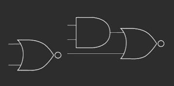
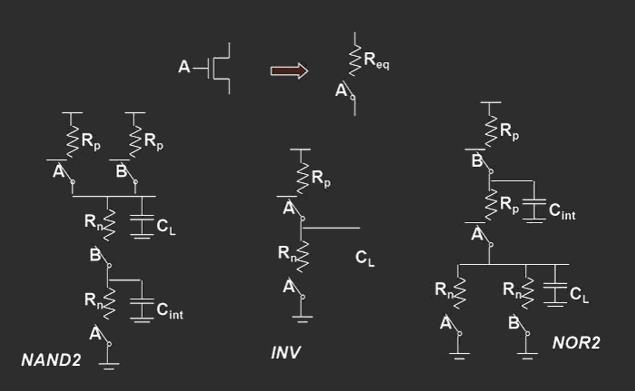
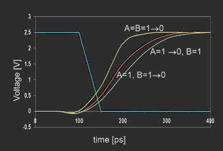
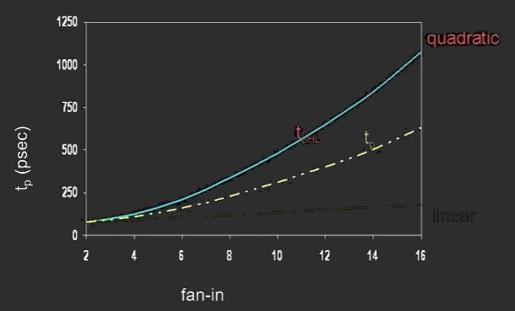
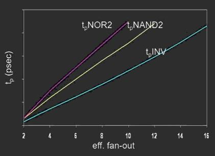

# 组合逻辑与算术运算模块设计优化

[TOC]

## 基础回顾：静态CMOS组合逻辑门

### NMOS与PMOS

> 可以将晶体管视为由其栅极信号控制的开关

#### 串联/并联连接的NMOS晶体管

- 当开关控制输入为高电平时，沟道闭合
  - 串联实现*与*
  - 并联实现*或*
- NMOS晶体管传输"强"0和"弱" 1
  - 弱的原因：阈值电压损失

#### 串联/并联连接的PMOS晶体管

- 当开关控制输入为低电平时，沟道闭合
  - 串联实现*或非*
  - 并联实现*与非*
- PMOS晶体管传输"强"1和"弱"0

### 静态CMOS逻辑结构

- 上拉网络：将输出驱动到VDD
- 下拉网络：将输出驱动到GND
- 两组网络互补，而对于一组输入只有一个网络连通，另一个关断
  - 同时连通：不确定 (x)
  - 同时关断：高阻 (z)
- 静态CMOS门的输出需要取非

### 特点

- **不能同时上拉和下拉**
- 上拉和下拉网络是<u>互补</u>的
  - 下拉并行表示上拉串行
  - 下拉串行表示并行上拉

#### 逻辑门类型

- 简单
  - NAND，NOR，反相器
- 复合门
  - 与或非 (AOI，And-Or-Invert)
  - 或与非 (OAI，Or-And-Invert) 

#####  AOI/OAI逻辑门

- 实现更大的功能
- 上拉和下拉网络非常紧凑
  - 与NAND/NOR网络相比，面积更小，速度更高
- AOI312
  - 与
    - 3个AND输入
    - 1个虚拟 (dummy)AND输入 (只有一个输入)
    - 2个AND输入
  - 或
    - 连接在一起取或
  - 非
    - 取或后取非

### 设计方法

- 先NMOS，后PMOS
- NMOS
  - AND ==> 串联
  - OR ==> 并联
- PMOS
  - AND ==> 并联
  - OR ==> 串联

### 示例

#### AOI21

$$
out=\overline{a\cdot b+c}​
$$

- 两个N管串联形成AND
- 再整体和C并联形成OR
- P管网络与之互补
- 输出取非

#### XOR

$$
out=X~xor~Y=\bar{X}Y+X\bar{Y}=\overline{XY+\bar{X}\bar{Y}}=\overline{XY+(\overline{X+Y})}
$$

- CMOS中一个异或门需两个逻辑门实现
- 需要N管和P管各5个

#### 复合CMOS门

$$
out=\overline{D+A·(B+C)}
$$

### 门的延迟

- 延迟由两部分组成
  - 本征延迟 (特点)
  - 负载延迟 (属性?)
- 影响延迟的要素
  - N/P管不对称
  - 串联晶体管个数影响
  - 输入组合/顺序影响
  - 环境条件影响

#### RC延迟示意

- 延迟取决于输入模式
- 从低到高过渡
  - 两个输入都变为低
    - 延迟为$\frac{0.69R_p}{2C_L}$
  - 一个输入变为低电平
    - 延迟为$0.69R_p·C_L$
- 从高到低过渡
  - 两个输入都变为高电平
    - 延迟为$0.69·2R_n·2C_L$

#### 延迟对输入模式的依赖

| 输入模式  | A=B=0→1 | A=1，B=0→1 | A=0→1，B=1 | A=B=1→0 | A=1，B=1→0 | A=1→0，B=1 |
| :-------: | :-----: | :--------: | :--------: | :-----: | :--------: | :--------: |
| 延迟 (ps) |   67    |     64     |     61     |   45    |     80     |     81     |

- NMOS=0.5 μm/0.25 μm
- PMOS=0.75 μm/0.25 μm
- C~L~=100fF

#### tp作为扇入的函数

- 多个晶体管串联相当于多个电阻串联
- **避免扇入大于4的门的复合门**，否则延迟会非常大
  - N管串联不超过5个
  - P管串联不超过4个

#### tp作为扇出的函数

- 所有栅极具有相同的驱动电流
- 斜率是"驱动强度"的函数

> - 扇入：由于电阻和电容的增加而呈平方
> - 扇出：每个额外的扇出栅极为C~L~添加两个栅极电容

### 快速复合门设计技术

- 替代逻辑结构

$$
F=ABCDEFGH
$$

## 面积优化问题：全加器

### 面积优化要素

- 结构越规则，优化越方便
- 晶体管数目是核心
- 浪费面积的要素
  - 多余的晶体管
  - 过于密集的布线导致面积增加
  - 模块间的空隙
- <u>晶体管数目优化案例：全加器最简化的逻辑</u>
  - <u>进位优化：逻辑表达式优化</u>
  - <u>和优化：再造逻辑表达式</u>

### 全加器的设计

####  功能

- A、B、C~i~求和，产生进位C~o~，和S
- 算数表达式：$Sum(A, B, C_i) = 2C_o+S$

#### 逻辑表达式和化简 ：进位Co

- A、B、Ci中任意两个是1就会产生进位
- C~o~逻辑表达式：$C_o=A\cdot C_i+B\cdot C_i+A\cdot B$

##### 需要多少个晶体管实现

- $\overline{C_o}=\overline{A\cdot C_i+B\cdot C_i+A\cdot B}$
  - 共7个NMOS、7个PMOS
- 整理C~o~的逻辑表达式：$(A+B)\cdot C_i+A\cdot B$
  - $\overline{C_o}=\overline{(A+B)\cdot C_i+A\cdot B}$
  - 共6个NMOS、6个PMOS

#### 逻辑表达式和化简 ：和S

- $S=A\oplus B\oplus C_i$
- $X\oplus Y=\bar{X}·Y+X·\bar{Y}=\overline{X·Y+\bar{X}·\bar{Y}}=\overline{X·Y+\overline{(X+Y)}}$
- 即一个异或操作需要两个CMOS门实现，共5个NMOS，5个PMOS
- S需要两个异或，共需要10个NMOS，10个PMOS

##### S什么时候为1

- A、B、Ci中有奇数个1
- $S=A·B·C_i+\overline{C_o}·(A+B+C_i)$
- 共8个NMOS，8个PMOS

## 速度提升：加法器、并行乘法器

### 速度提升要素

- 减少门的级数：一般以面积付出为代价
- 同样门的级数可以减少负载：同样会增加面积
- 速度提升往往带来面积增加：做合适的平衡

### 加法器

#### 波纹进位加法器

> The Ripple-Carry Adder

- 最坏情况下的延迟与位数成线性关系

$$
t_d=O(N)\\
t_{adder}\approx(N-1)t_{carry}+t_{sum}
$$

- 目标：尽可能快地进行路径传送

##### 翻转属性

$$
\bar{S}(A,B,C_i)=S(\bar{A},\bar{B},\bar{C_i})\\
\bar{C_o}(A,B,C_i)=C_o(\bar{A},\bar{B},\bar{C_i})\\
$$

##### 通过减少反相级来最小化关键路径

- 利用反转属性
- 注意：需要两种不同类型的单元

#### 进位跳跃加法器

> Carry-Skip Adder

- 如果 (P0与P1与P2与P3=1)，则C~o3~=C~0~，否则“kill”或“generate”

#### 超前进位加法器

> Carry Lookahead Trees

$$
C_{o,0}=G_0+P_0C_{i,0}\\
C_{o,1}=G_1+P_1G_0+P_1P_0C_{i,0}\\
C_{0,2}=G_2+P_2G_1+P_2P_1G_0+P_2P_1P_0C_{i,o}\\
=(G_2+P_2G_1)+(P_2P_1)(G_0+P_0C_{i,0})=G_{2:1}+P_{2:1}C_{o,0}
$$

$$
C_k=G_k+P_k·C_{k-1}=(G_k+P_k)\Delta C_{k-1}\\
=(G_k+P_k)\Delta((G_{k-1}+P_{k-1})\Delta C_{k-2})=\cdots\\
=(G_k+P_k)\Delta((\cdots(G_{k-1}+P_{k-1})\Delta\cdots\Delta((G_0+P_0)\Delta C_0)\\
可以证明\Delta具有结合律规律\\
A\Delta(B\Delta C)=(A\Delta B)\Delta C=A\Delta B\Delta C\\
展开后得\\
C_k=(G_k+P_k)\Delta(G_{k-1}+P_{k-1}\Delta\cdots\Delta(G_0+P_0)\Delta C_0
$$

##### 对数超前进位加法器

- 二叉树实现顺序运算的并行，得到对数加速比
- 互连复杂性加大，如果多输出还要增加硬件

### 乘法器

$$
\begin{array} {cccccccccc}
&&&&x_{n-1}&x_{n-2}&\cdots &x_1&x_0\\
\times&&&&y_{m-1}&y_{m-2}&\cdots&y_1&y_0\\
\hline
&&&&P_{n-10}&P_{n-20}&\cdots &P_{10}&P_{00}\\
&&&P_{n-10}&P_{n-21}&\cdots &P_{11}&P_{01}&\\
&&&\cdots\\
&&\cdots\\
&P_{n-1m-1}&P_{n-2m-1}&\cdots&P_{1m-1}&P_{0m-1}\\
\hline
 P_{n+m-1}&P_{n+m-2}&\cdots&&&&&P_1&P_0
\end{array}
$$

- 部分积和最终积
- 加法和压缩
  - 压缩：局部积的加法运算
- 进位延迟和加法器连接
- 加法器和计数器
  - 加法器也称为计数器
- 乘法与累加

#### 阵列乘法器

> The 4×4  Array Multiplier

#### MxN阵列乘法器

$$
t_{mult}\approx [(M-2)+(N-2)]t_{carry}+(N-1)t_{sum}+(N-1)t_{and}
$$

#### 进位保存加法器

$$
t_{mult}=(N-1)t_{carry}+(N-1)t_{and}+t_{merge}
$$

#### 华莱士树乘法器

> Wallace-Tree Multiplier

### 其他

#### 树结构加法器：使用 (4:2)计数器

- 所有结构加法器资源是固定的，变化的是连线方式和资源
- Wallace tree加速效果最好，即加法器级数最小，但连线最复杂
  - 由于不是二叉树结构，连线没有规律
- 一般工程上采用 (4, 2)压缩器 (如图)
  - 实际上是 (5, 3)压缩
- 可实现二叉树结构

#### 修改的Booth算法

部分积的m行太多

- 通过该算法乘数位数减小为一半
- 值为2、1、0、-1、-2
- 局部积个数基本减少为$\frac{1}{2}$，加法器个数减半

$$
z_k=-2y_{2i+1}=y_{2i}+y_{2i-1}\\
Y=\sum_{i=0}^{m}y_i2^i=Z=\sum_k z_k2^{2k}
$$

## 其它逻辑形式：三态CMOS逻辑、动态逻辑

### 传输门逻辑

- 引入第三个状态：高阻态
- 高阻态的作用
  - 总线 (bus)
  - 双向传输
- 特例：三态门

#### 开关逻辑：传输门

> 左右传输等价

- 互补晶体管-n和p
- 没有阈值问题
- 成本：额外的晶体管，额外的控制输入
- 不是完美的导体

##### 开关逻辑示例：2-1 MUX

### 传输门全加器

- 考虑串联的传输门
  - 每个节点都有寄生电容
  - 输入更改为重新分配费用时出现问题
  - 解决方案：设计网络，以便始终存在从V~DD~或gnd到输出的路径

### 动态逻辑

- 提升速度具有优势
- 电路规模小
- 手工设计，难以大规模推广

### 曼彻斯特进位链

#### CMOS实现

- 通过传输晶体管实现P
- 上拉执行G，下拉执行删除 (kill)
- 使用动态逻辑来降低复杂性并加快速度