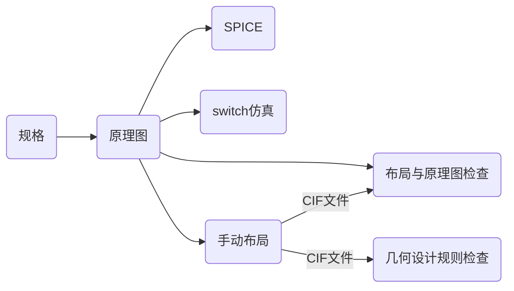
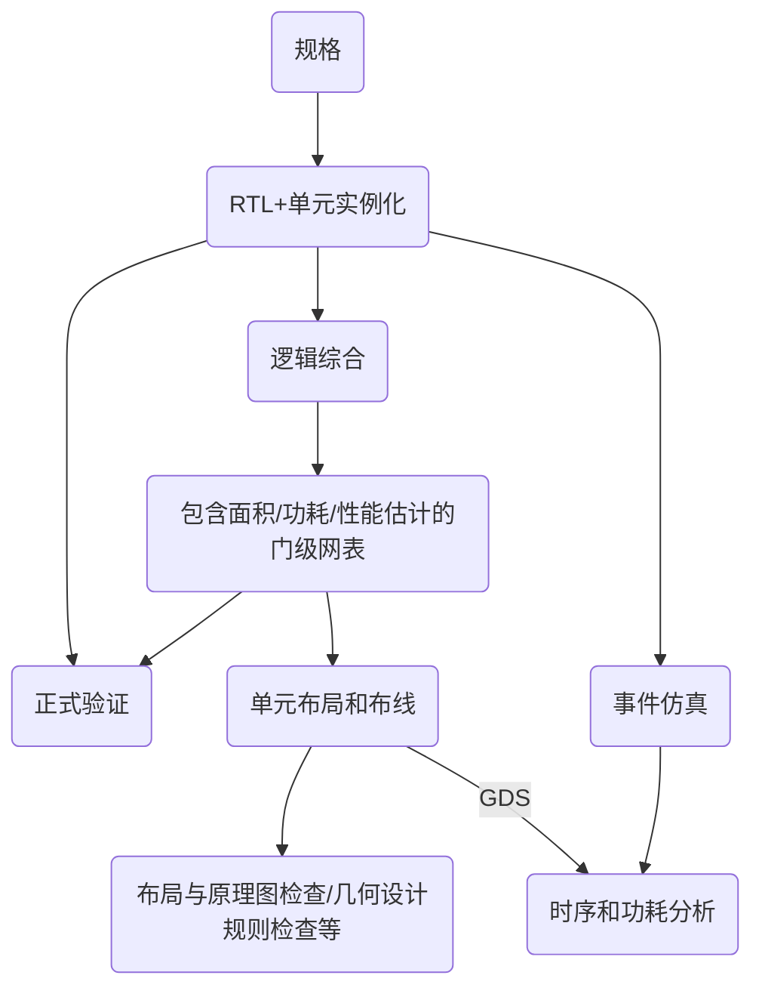
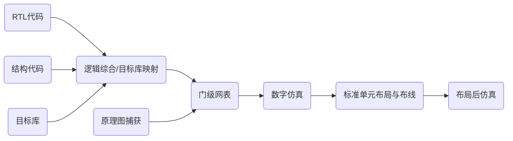
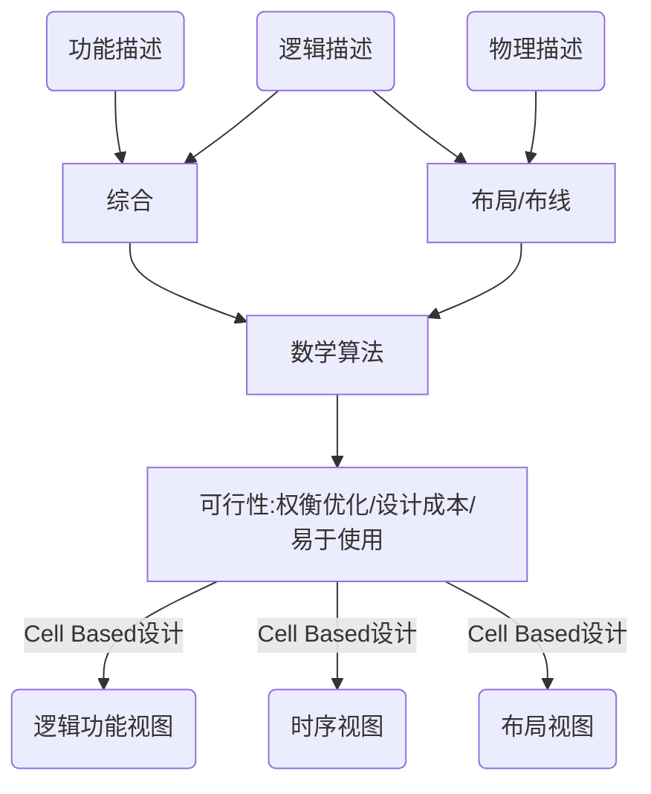
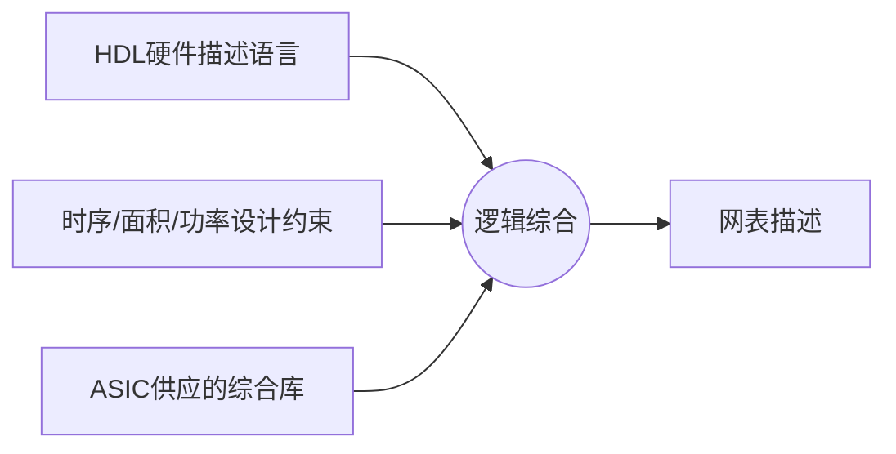

# 设计流程和设计方法学

[TOC]

## 设计方法的变迁

### 设计滞后现象

- 脑力的集成电路设计能力增长不能跟上芯片复杂度的增长速率
- 从脑力过渡到计算机：设计方法学变革

### 设计生产力挑战

- 设计复杂性和设计生产率之间的差距越来越大

### 四次大的设计方法变革

#### 概述

- L-E：计算机版图
- P&R：计算机自动布局布线
- Synth：逻辑综合
- SoC：片上系统

#### 早期：纯手工到CAD

- 原理图+全定制布局
  - SPICE用于关键路径
  - switch-level仿真用于整体功能
  - 手工布局
  - 无功耗分析
  - 布局使用LVS和GDRC验证

##### 自底向上的设计流程

#### 后期：自顶向下设计

- 电路规模达到手工无法完成设计
- 关键技术
  - 硬件描述语言：VHDL vs Verilog (目前后者用得更多)
  - 逻辑综合：最终锁定RTL (寄存器传输级)
    - 时序逻辑已经由代码确定
    - 组合逻辑由综合工具优化
    - 目前的行为级综合只适用特定算法，普适的行为级综合工具暂不存在
  - 自动布局布线：最终锁定Cell Base

##### 现代ASIC方法和流程

- 基于RTL综合
  - HDL将设计指定为组合逻辑+状态元素
  - 未通过综合推断的块所需的单元实例化 (通常为RAM)
  - 事件模拟验证RTL
  - “正式”验证将门网表的逻辑结构与RTL进行比较
  - 布局和路线生成布局
  - 静态检查时序和电源
  - 布局使用LVS和GDRC验证

##### 自顶向下的设计流程

#### 从模块到系统的集成

- 专用电路 (ASIC)大有用武之地
  - 应用带动研发
  - Top-down技术完善
  - 门阵列、标准单元、FPGA/CPLD出现
- 单片机无处不在
  - 处理器技术的又一个延伸
  - 嵌入式软件和系统得到推广
- 从模块到系统：SoC登场
  - 摩尔定律发展一定会导致SoC
  - 单片机应用发展一定会走向SoC
  - 专业化分工精细一定会支持SoC

#### SoC时期

- 进入芯片集成一个系统的时代，复杂度太高，设计时间变短
- 关键技术：模块化、复用、系统级验证手段
- 体系结构平台化、标准化
- 更加复杂的设计验证工具的引入
  - 时钟/时序验证更加复杂
  - 功耗分析/电源管理更加复杂
  - 可制造性被广泛重视
  - 工艺波动性影响更为广泛
  - IP核的交付和认定成为关键要素
  - 软件更加重要：软硬件协同、软件工程管理技术

##### IPs in SoC

## 芯片实现方法：自动化、定制、FPGA

### 其他设计风格

- VLSI电路的复杂性
  - 性能
  - 尺寸
  - 成本
  - 上市时间
- 不同的设计风格 (成本，灵活性与性能从低到高)
  - 可编程门阵列 (FPGA)
  - 门阵列 (Gate Array) (目前几乎不用了)
  - 标准单元
  - 全定制

|        形式         |                   描述                    |
| :-----------------: | :---------------------------------------: |
|       全定制        |    所有的电路与晶体管布局为应用而优化     |
|      标准单元       | 小型功能块 (逻辑门，触发器)的阵列自动放置 |
| 门阵列 (结构化ASIC) |    使用金属层或通孔定制的部分预制晶圆     |
|        FPGA         |     定制芯片，带有可装入引线的latches     |
|      微处理器       |        通过软件定制的指令集解释器         |
|   特定领域处理器    |   特殊的的指令集解释器 (如DSP, NP, GPU)   |

#### 全定制

- 电路风格和电阻器的自定义尺寸大小，以便优化芯片，尺寸，功率和性能
- 高非循环工程 (NRE)成本
  - 耗时且容易出错的布局
- 为小芯片的优化可以降低单位成本，达到极低功耗或极高性能
- 对于模拟电路设计是普遍的
- 需要全套自定义掩膜
- 通常仅在大量应用程序/市场或高度受限且对成本不敏感的市场重使用

#### 标准单元

- 基于预先设计/验证的单元集
  - 如NANDs, NORs, 触发器, 计数器, 缓冲
- 每个单元通过过以下步骤完成
  - 布局 (可能要满足不同技术节点和制程)
  - 仿真，延迟和功耗模型
- 芯片布局是自动的，降低NREs (通常无手动布局)
- 要求全套自定义掩膜，没有预制造
- 没有最充分地优化面积、功率等，导致相较于全定制更高的单个芯片成本
- 通常用于其他设计实现策略 (大块存储/输入输出等)

#### 门阵列

- 存储“有源”层，栅极层和局部互连的预制晶圆，主要包括多排晶体管
- “后端”金属加工 (接触切口，金属线)根据需要进行定制
- 可以采样不同工艺厂

- 将大部分设计和掩膜NRE移交给供应商
- 缩短设计和处理时间，缩短上市时间
- 具有固定大小的晶体管的高度结构化布局会导致较大的子电路 (如触发器)，并增加每个芯片的成本
- 内存阵列效率特别低，因此通常是预制的

#### FPGA

- 简单逻辑和互连块的二维阵列
- 典型体系结构：LUT实现n输入的任何功能
- 每个LUT都有可选的触发器
- 引线，EPROM或静态RAM单元用于存储配置
  - 决定了LUT实现的功能，触发器的选择和互连线点
- 很多FPGA包含特殊电路以加速加法器进位链和很多特殊核，如RAM，MAC，E1net，PCI，SERDES等
- 优点
  - 虽然性能差，但可以用于debug，比仿真快很多
  - 成本高是相对的，但设计成本、流片成本和纠错成本低，推向市场速度很快
  - 也可以推出后纠错 (例如基站中使用，可以不断升级)

##### 传统FPGA与ASIC的争论 (CIRCA 2000)

- ASIC：高NRE成本 (0.35 um芯片为200万美元，模具成本相对较低
- FPGA：非常低的NRE成本。 相对较低的硅效率 ==> 零件成本高
- 从具有成本效益的FPGA设计到ASIC的跨接量在10k范围内
- 颗数多时 (如几十万颗)，芯片比FPGA便宜

##### 跨接点右移

- ASIC: 增加的NRE成本 (90 nm芯片为4000万美元) (验证，掩膜成本等)
  - 更少的硅设计成为必然
- FPGA：进一步满足需求，FPGA能够更好地遵循摩尔定律，且测试成本相对较低
- 跨接量大于100k

### 设计风格比较

|        | 全定制 |  标准单元  | 门阵列 | FPGA |
| :----: | :----: | :--------: | :----: | :--: |
|  面积  |  紧凑  | 紧凑到中等 |  中等  |  大  |
|  性能  |   高   |  高到中等  |  中等  |  低  |
| 制造层 |  全部  |    全部    | 布线层 |  无  |

### 实施选择的影响

> 40纳米以下：能效是集成电路关键指标

## Cell Base设计、标准单元

### Cell Base解决思路

### Cell Base设计细节

- 不同的技术：不同的库
- 不同的负载/速度：不同的电池
- 不同的时序限制：不同的电路路径
- 不同的面积要求：不同的电路门数
- 功率，V~t~

#### 库单元种类

- 简单组合门和复合门
- 各类DFF、DL、Register
- Buffers
- 常用的模块 (加法器、乘法器、移位寄存器、PLL等)
- I/O Pads
- 各类V~t~的单元
- 存储器

#### 库单元内涵

- 综合模型
- 仿真模型
- 静态时序分析模型
- 版图信息
- 版图细节

#### 标准单元物理特征

- 等高，电源/地对齐
- I/O在上下
- 任何两个单元并列复合设计规则
- 对金属线的使用复合约定

#### Cell Base图示

## 逻辑综合和RTL

### 设计问题的复杂性

#### 电路越来越复杂

- 在电路层，单个工程师仅能做几千门的随机逻辑设计
- 需要众多工程师协同设计，组织越来越困难
- 需要及早对后期芯片达到的指标和功能正确性进行评价
- 验证工作量巨大
- 人工绘制版图无法实现

#### 解决思路

- 实现版图设计自动化 (自动布局布线)
- 实现电路图自动产生 (逻辑综合)
- 借鉴软件工程的方法组织项目实施
- 模块复用 (IP和SoC)

#### 带来的问题

- 优化问题
- 抽象逻辑和工艺的结合问题

### 现代设计方法学的特点

#### 设计输入/输出

- 电路功能/行为/结构描述 → 版图

#### 设计复杂度高

- 软硬件协同设计：需要行为仿真验证
- 硬件规模庞大：需要分割和协同，需要不同抽象层次的验证、管理
- 验证工作繁重

#### 高抽象层向低抽象层的自动化转化

- RTL → 逻辑网表
- 逻辑网表 → 版图

#### 整体结构和物理效应对设计成功与否影响巨大

- 好的顶层算法/结构设计是面积、速度、功耗达到优化的核心，这项工作不能依赖自动化工具，必须由工程师依赖经验、知识和智慧完成
- 顶层设计的缺陷会导致前功尽弃，所以设计方法应支持尽早评估物理设计效果，而这一效果在版图完成前很难准确评估
- 早期评估物理效应还能够尽早预期电路性能。所以物理效应的及时反馈非常关键
- 最难对付的物理效应是延迟 (器件、连线、时钟信号)

### 有用的抽象的属性

- 隐藏不太重要的细节
  - 对于RTL，不必担心组合逻辑如何分解为逻辑门
- 允许控制更重要的细节
  - RTL设计器仍控制任何两个寄存器之间执行多少逻辑
- 如果操作正确，可提高便携性
  - 相同的RTL可以实现为自定义逻辑，标准单元，FPGA甚至真空管逻辑，效果相当好

### 传统流程中的VLSI设计级别

- 规格
  - 系统 (或组件)应执行的操作
- 架构
  - 组件的高级设计
    - 状态定义
    - 逻辑划分为主要块
- 逻辑
  - 门，触发器及其之间的连接
- 电路
  - 晶体管电路实现逻辑元件
- 器件
  - 单个电路元件的行为
- 布局
  - 用于定义和连接电路元件的几何
- 工艺
  - 用于定义电路元件的步骤

### 简单的设计流程

### 逻辑综合

- 将设计的高级描述转换为优化的门级表示的过程
- 逻辑综合使用具有简单单元的标准单元库，例如
  - 基本逻辑门，如与或非
  - 宏单元，例如加法器，多路复用器，内存
  - 触发器
- 放在一起的标准单元称为技术库
  - 通常技术库 晶体管尺寸 (0.18 um, 90 nm)
- 电路描述以硬件描述语言 (HDL)编写
  - 设计人员应首先了解体系结构描述
  -  然后应该考虑设计约束，例如时序。 面积，可测试性和功率

### 逻辑综合能够实现的目标有限

#### 逻辑综合步骤

- 语言仅是手段，核心是算法
- 与工艺无关的逻辑优化
  - 对组合逻辑、状态机逻辑等理论上已经成熟
  - 近期对特定行为描述也可以完成
  - 对任意行为 (含时序逻辑)束手无策
- 与工艺相关的工艺映射
  - 由库单元替代优化后的逻辑
  - 满足时序约定/限定

#### 被逻辑综合的电路抽象层次

- 结构确定，时序部件位置确定 (综合是不针对随机时序逻辑的)，这样的结构即RTL (寄存器传输级)
- 电路各模块功能按照时间轴向被离散化 (称为事件)，设计者清醒地知道各模块、各时间发生关系和顺序
- 状态机是描述时间发生条件和顺序的最好手段

### 逻辑综合约束

- 约束驱动的综合
- 时间约束
  - 时钟周期，设置时间，保持时间限制
- 面积限制
- 功率约束
  - 门的选择肯定会影响功耗
  - 逻辑综合可以生成门控，以最大程度减少操作期间的转换次数
- 设计规则约束
  - 最大输出负载
  - 输出的最大过渡时间

### 时序收敛问题

- 现代数字电路功能的复杂还伴随时序问题越发复杂；功能正确时序失败的电路同样是失败的电路，因为时间发生的顺序已经被打乱
- 时序问题出现的可能
  - 关键路径太多、太长
  - 时钟出现严重skew
  - 线延迟超出容限：基本是完成布线后才发现，只好重新布线、或重新综合、甚至重新修改描述代码；多次尝试还有问题则是时序不收敛
- 防止时序不收敛
  - 核心是理解硬件延迟特征，在设计初期就能对电路可能出现的延迟问题有正确预估，并在早期结构和代码设计上加以预防
  - 设计上要为后期物理设计留有余量。
  - 版图规划对解决长线延迟问题很有效果
  - 要对不收敛情况有客观分析，确认是无关紧要的问题、根本无法解决的问题等，并采取相应措施；反复尝试在很多情况下是无济于事的

## 仿真验证

### 验证：testbench

> 均用硬件描述语言实现

#### 挑战

- DUT变得越来越复杂
  - SW/HW共同验证
  - 系统/子模块协同验证
  - 非常复杂的刺激
  - 非常难以检查结果
  - 第三部分IP
- 任务可能不同，采用的方法应该不同
  - 功能验证
  - 性能验证
  - 系统或仅小电路验证
- 对DUT的验证是否足够
  - 很难确认
  - 没有足够的时间

#### 规划

- testbench基础设施
  - 层
  - 架构

#### 执行

- 刺激与反应
  - 测试用例生成
    - 随机，直接，异常，嵌入式
  - 响应检查
    - 嵌入式监控器，断言，参考模块
    - 重要提示：准确性

#### 评价

- 覆盖率驱动的验证
  - 效率百分比
  - 功能级别
  - 结构层次
    - 行/表达式/切换/ FSM覆盖

### 不同层次的仿真精度和耗时

- 仿真分类
  - 行为仿真 (HDL)
  - 逻辑仿真 (HDL或网表)
  - 电路仿真 (网表)
- 抽象级别
  - 行为或结构HDL
  - 逻辑级网表
  - 器件/电路级网表
- 精度和时序成本
  - 行为级
  - 逻辑
  - 电路
- 后期仿真和物理效果仿真

### 几种仿真模型

- 计算机只能做线性数学问题
- 模型与现实之间的区别
- 门延迟模型
  - 线性
  - 查找表
  - 分段
- 连接线路延迟模型
  - 简单RC
  - 复杂RC
  - 电感问题
- 电路级模型：SPICE
  - 门级不准确
  - 为模型使用线性组件
  - 精度与运行时间