# ICB总线及实验用SoC介绍

[TOC]

## ICB总线

> 目前的主流总线协议不适用于蜂鸟这类低功耗处理器

- AXI协议
  - 分离的读写通道有很高的吞吐率
  - 控制相对复杂，会增大硬件开销
- AHB协议
  - 是高性能低功耗总线的最佳选择
  - 不容易添加流水线级数，无法支持多个滞外交易
- APB协议
  - 低速设备总线
  - 不适合作为主总线用

`所以蜂鸟采用的是一款自定义的总线架构ICB`

### 简介

> ICB 的设计初衷是为了结合AXI和AHB的优点，兼顾高速性和易用性

#### 特点

> 蜂鸟中ICB总线几乎被用于所有场合，包括内部模块之间的接口，SRAM模块接口，低速设备总线以及系统存储总线等

- 读写操作共用地址通道，共用结果返回通道，控制简单
- 分离的地址和数据阶段 (AXI)
- 支持任意主从数目 (AXI)
  - 一主一从
  - 一主多从
  - 多主一从
  - 多主多从
- 每个读写操作都会在地址通道上产生地址 (AHB)
- 支持非对齐访问，使用mask来控制部分写操作 (AXI)
- 支持多个滞外交易 (AXI)
- 结果顺序返回 (AHB)

### ICB协议信号

- ICB 总线包括两个通道
  - 命令通道用于主设备向从设备发起读写请求
  - 返回通道用于从设备向主设备返回读写结果

#### ICB总线信号

|   通道   |            功能            | 方向 | 宽度 |    信号名     |                介绍                |
| :------: | :------------------------: | :--: | :--: | :-----------: | :--------------------------------: |
| 命令通道 | 主设备向从设备发起读写请求 | 输出 |  1   | icb_cmd_valid |   主设备向从设备发送读写请求信号   |
| 命令通道 | 主设备向从设备发起读写请求 | 输出 |  DW  | icb_cmd_addr  |              读写地址              |
| 命令通道 | 主设备向从设备发起读写请求 | 输出 |  1   | icb_cmd_read  |          读或写操作的指示          |
| 命令通道 | 主设备向从设备发起读写请求 | 输出 |  DW  | icb_cmd_wdata |            写操作的数据            |
| 命令通道 | 主设备向从设备发起读写请求 | 输出 | DW/8 | icb_cmd_wmask |          写操作的字节掩码          |
| 命令通道 | 主设备向从设备发起读写请求 | 输入 |  1   | icb_cmd_ready |   从设备向主设备返回读写接受信号   |
| 反馈通道 | 从设备向主设备返回读写结果 | 输入 |  1   | icb_rsp_valid | 从设备向主设备发送读写反馈请求信号 |
| 反馈通道 | 从设备向主设备返回读写结果 | 输入 |  DW  | icb_rsp_rdata |            读反馈的数据            |
| 反馈通道 | 从设备向主设备返回读写结果 | 输入 |  1   |  icb_rsp_err  |        读或写反馈的错误标志        |
| 反馈通道 | 从设备向主设备返回读写结果 | 输出 |  1   | icb_rsp_ready | 主设备向从设备返回读写反馈接受信号 |

- [ ] DW是数据位宽
- [ ] 关于wmask，以数据位宽32位为例 (4个字节，假定数据为32’h11223344)
  - [ ] 其对应的mask位宽为4bit，每bit用来指示写数据的其中一个字节是否会写入从机
  - [ ] 假定0表示会写入 (写数据不被mask)，1表示不会写入 (写数据被mask)
    - [ ] 如果mask=0000，那么发送给从设备的写数据就是11223344
    - [ ] 如果mask=1100，那么发送给从设备的数据就是00003344
    - [ ] 以此类推
- [ ] ready和valid信号是基本的握手信号
  - [ ] ready表示从设备已经做好准备接受主设备的请求
  - [ ] valid表示主设备已经可以发送一个请求给从设备
  - [ ] 当这两者都为高时，表示一次握手成功
  - [ ] 反馈通道的rsp_valid和rsp_ready也是类似的道理
- [ ] 有些地方会发现除了上面的信号外还有icb_cmd_burst，beat等信号，相关的连线已经连好，可忽略

### ICB时序

#### 写操作同一周期返回结果

- 当cmd_valid拉高时，当前周期主设备会发送这一次请求的具体信息，包括地址，读/写 (0表示写)，写数据，写mask
- **cmd_valid和cmd_ready同时为高表示命令通道握手成功**，从设备接受到了这次请求
- 当前周期就返回反馈信息，并且成功握手，没有error

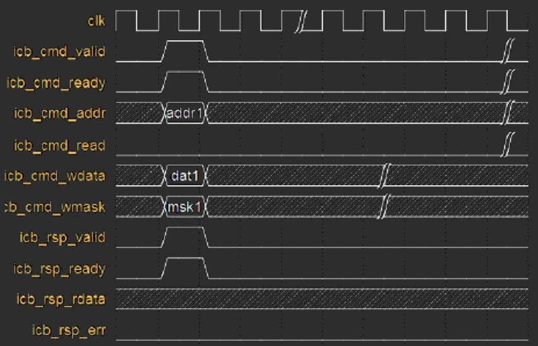

- 主设备向从设备通过ICB的命令通道发送写操作请求 (icb_cmd_read为低)
  - 从设备立即接收该请求 (icb_cmd_ready为高)
- 从设备在同一个周期返回读结果且结果正确 (icb_rsp_err为低)
  - 主设备立即接收该结果 (icb_rsp_ready为高)

#### 读操作下一周期返回结果

- 对于读操作没有wdata和wmask
  - 当命令通道成功握手时，表示从设备接受到了这次请求
  - 返回通道和写不同，上图是下一个周期返回结果 (包括读数据和err信号)并且马上握手成功
- 上图只是两个特定的例子，并不是说写操作就是当前周期返回，读操作就是下一周期返回
- 取决于从设备处理读写请求的速度
  - 如果当前周期就完成，那么当前周期返回结果
  - 4个周期完成就4个周期返回结果

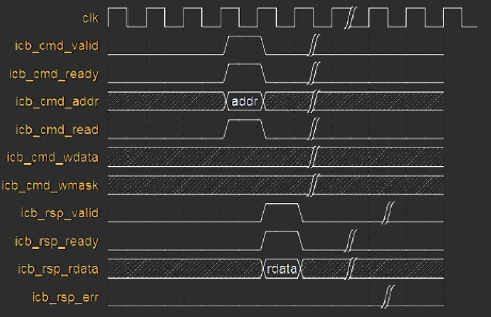

- 主设备向从设备通过ICB的命令通道发送读操作请求 (icb_cmd_read为高)
  - 从设备立即接收该请求 (icb_cmd_ready为高)
- 从设备在下一个周期返回读结果且结果正确 (icb_rsp_err为低)
  - 主设备立即接收该结果 (icb_rsp_ready为高)

#### 写操作下一周期返回结果

- 主设备向从设备通过ICB的命令通道发送写操作请求 (icb_cmd_read为低)
  - 从设备立即接收该请求 (icb_cmd_ready为高)
- 从设备在下一个周期返回读结果且结果正确 (icb_rsp_err为低)
  - 主设备立即接收该结果 (icb_rsp_ready为高)

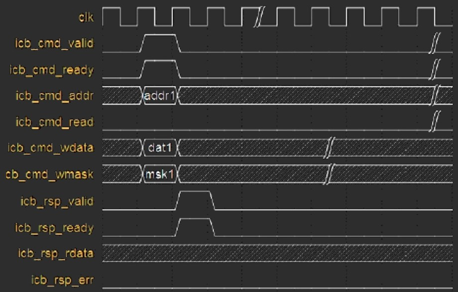

#### 读操作四个周期后返回结果

- 主设备向从设备通过ICB的命令通道发送读操作请求 (icb_cmd_read为高)
  - 从设备立即接收该请求 (icb_cmd_ready为高)
- 从设备在四个周期后返回读结果且结果正确 (icb_rsp_err为低)
  - 主设备立即接收该结果 (icb_rsp_ready为高)

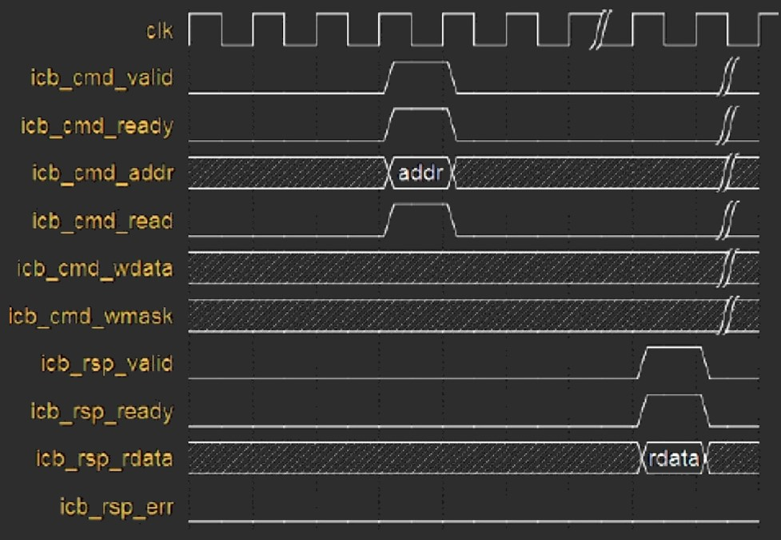

#### 写操作四个周期返回结果且出错

- 主设备向从设备通过ICB的命令通道发送写操作请求 (icb_cmd_read为低)
  - 从设备立即接收该请求 (icb_cmd_ready为高)
- 从设备在四个周期后返回结果但结果错误 (icb_rsp_err为高)
  - 主设备立即接收该结果 (icb_rsp_ready为高)

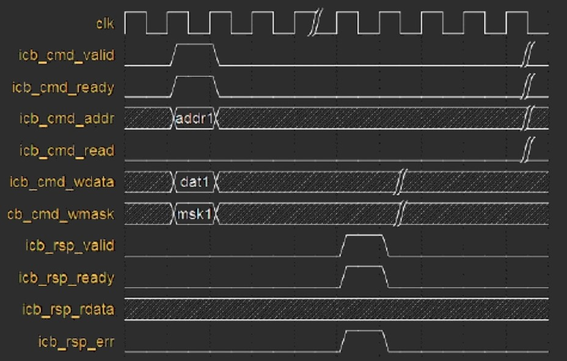

#### 连续四个读操作均四个周期返回结果

- 主设备向从设备通过ICB的命令通道连续发送四个读操作请求 (icb_cmd_read为高)
  - 从设备均立即接收该请求 (icb_cmd_ready为高)
- 从设备在四个周期后连续返回四个读结果
  - 其中前三个结果正确 (icb_rsp_err为低)
  - 第四个结果错误 (icb_rsp_err为高)
  - 主设备均立即接收此四个结果 (icb_rsp_ready为高)

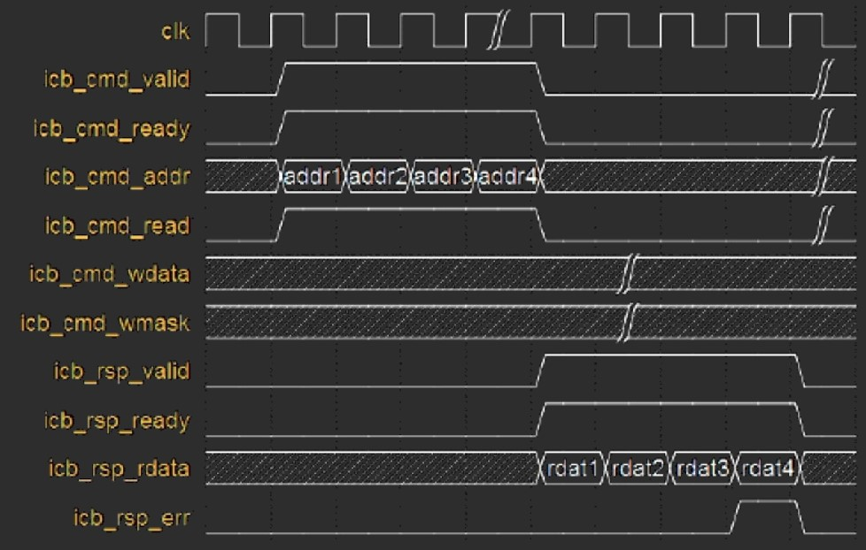

#### 连续四个写操作均四个周期返回结果且最后一个错误

- 主设备向从设备通过ICB的命令通道连续发送四个写操作请求 (icb_cmd_read为低)
  - 从设备均立即接收该请求 (icb_cmd_ready为高)
- 从设备在四个周期后连续返回四个写结果
  - 其中前三个结果正确 (icb_rsp_err为低)
  - 第四个结果错误 (icb_rsp_err为高)
  - 主设备均立即接收此四个结果 (icb_rsp_ready为高)

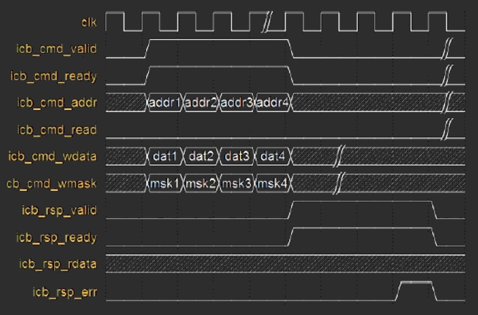

#### 读写混合请求

- 主设备向从设备通过ICB的命令通道相继连续发送三个读和写操作请求
- 从设备立即接收了第一个和第三个请求
  - 第二个请求第一个周期并没有立即接受 (icb_cmd_ready为低)
  - 因此主设备一直将地址控制和写数据信号保持不变，直到下一周期该请求被从设备接受 (icb_cmd_ready为高)
- 从设备对于第一个和第二个请求都是在同一个周期就返回结果且被主设备立即接受
  - 对于第三个请求则是在下一个周期才返回结果
  - 主设备还没有立即接受 (icb_rsp_ready为低)
  - 因此从设备一直将返回信号保持不变，直到下一周期该返回结果被主设备接受

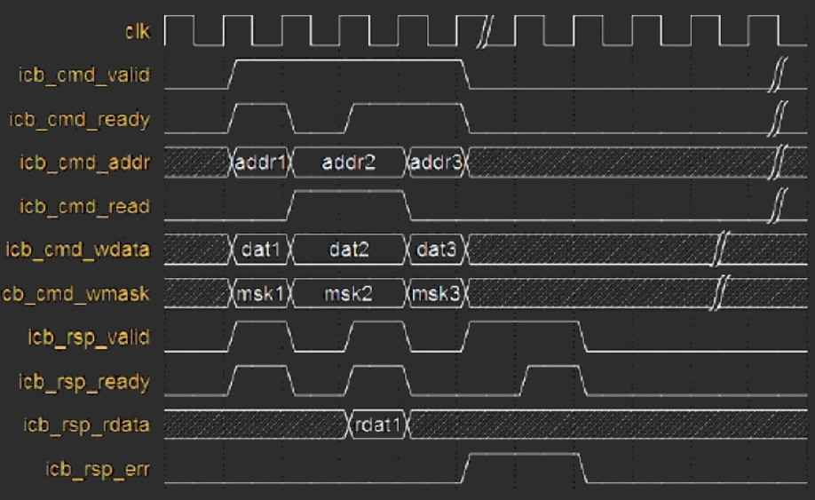

- 在前面的时序图中，valid和ready信号都是同时变化的
  - 一旦主机发送请求 (cmd_valid拉高)，从机马上就响应
  - 一旦从机发送反馈请求 (rsp_valid拉高)，主机马上就响应
- 并不都是这样。比如上图中，第二个请求 (addr2，读操作)对应的cmd_valid拉高后，从机的ready信号并没有到来
  - 表明从机还没有准备好接受请求
    - 此时总线上的命令请求会一直保持直到ready信号来，握手成功后才意味着真正被从机所接受
  - 类似的，对于第三个写请求 (addr3，data3，msk3)，从机反馈信号来后(rsp_valid拉高)，同一周期主机还没有准备好接受响应 (rsp_ready为低)
    - 此时会一直等到rsp_ready为高时才表示握手成功，响应被主机所接受

#### 总结

- 上面介绍的实际上针对一个master一个slave的情况，但很多系统中往往没有这么简单
- 考虑多个master和一个slave的情况，显然需要一个仲裁模块，通过自己定义的仲裁机制，在多个master同时发起请求的时候让优先级高的通过，其它等待
- 对应的硬件实现：当命令通道的in1，in2，in3经过仲裁之后得到输出out的命令通道，并将仲裁信息压入到FIFO中，该信息会指示反馈通道应该送往in1，in2，in3的反馈通道中的哪一个

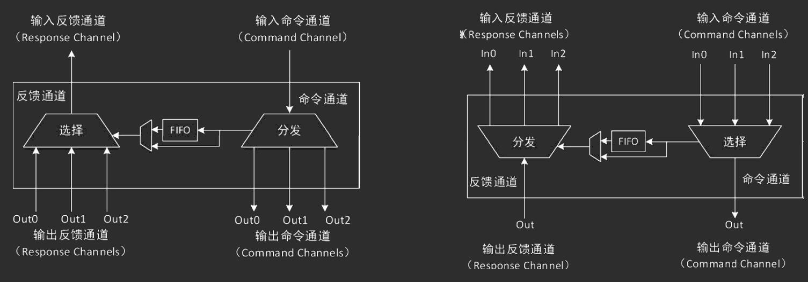

- 考虑一个master和多个slave的情况
- 显然需要一个分发模块将master的命令请求发送给对应的slave
  - 分发的依据为slave的地址区间，即master的命令请求地址落在哪一个slave的地址空间中，就将请求发送给哪个slave
- 左图是其硬件实现思路
  - 判断输入命令通道地址将命令请求发送给对应的slave，并存储分发信息
  - 该信息会指示3个输出反馈通道中的哪一个送给输入反馈通道
- 当多个master对应多个slave时，显然上面两者都需要
- 实际系统中，仲裁和分发都有专门的转接桥实现

## 实验SOC介绍

### 基本框架

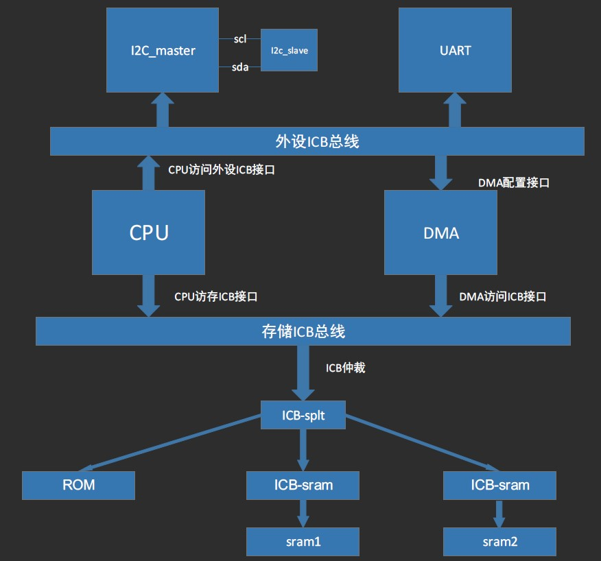

- CPU有两个ICB接口
  - 外设ICB接口
  - 存储ICB接口
- 在上电时 (初始化)，CPU会通过存储ICB接口访问ROM，ROM里面有引导程序，使PC值跳到CPU 里面的指令寄存器
- 外设ICB 方面，本实验中保留了I2C，UART，DMA 三个外设
- 从CPU的请求会根据地址区间不同通过ICB‐splt桥分发给对应的外设模块 (这部分桥没有在上图中画出来)

### 地址映射划分

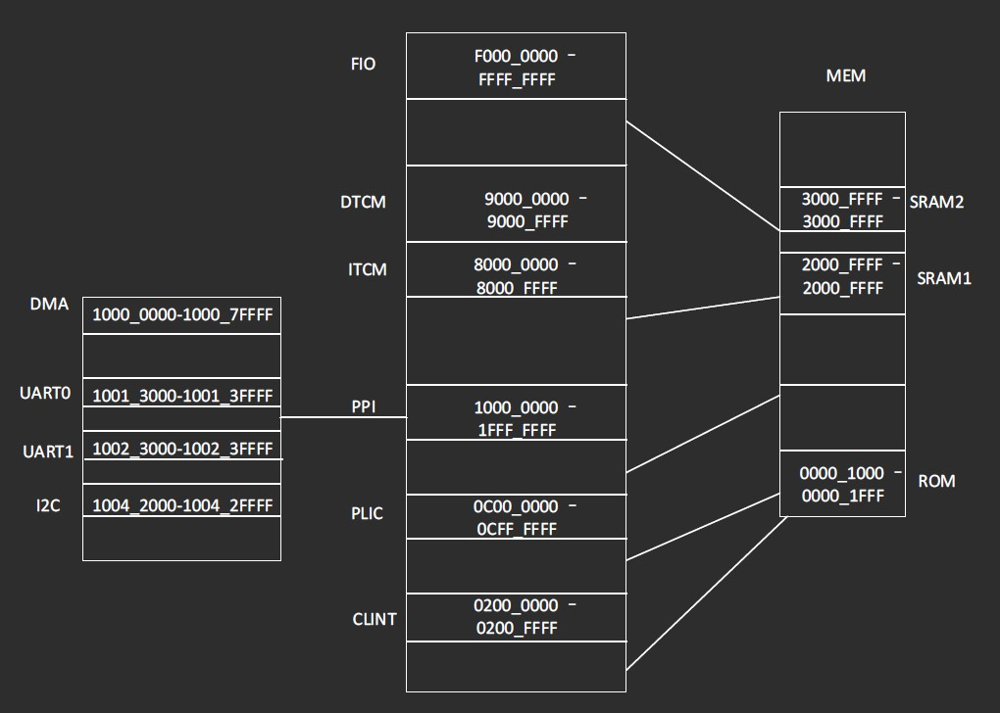

- 当地址请求落在相应的地址区间时，会发送到相应的ICB 接口
  - ITCM是CPU内部的指令存储器
  - DTCM是CPU内部的数据存储器
- 这两部分ICB接口意味着可能会有外部模块发起对ITCM，DTCM的直接访问 (本实验不会出现这
  种情况)
- 图的中间部分只需要关心两个接口
  - MEM 接口
    - MEM 接口的地址空间为中间所有空白部分对应的地址
    - 在这些地址空间基础上进一步划分了ROM，SRAM1，SRAM2的地址区域 (即右边那个图)
  - PPI 接口
    - CPU 的私有外设接口，在该地址空间上进一步划分出DMA，UART0，UART1，I2C等外设的地址区域 (左边部分)
- 该平台是删减而成，所以MEM空间和PPI空间都有一些地址空间没有用到 (空白部分)
- 不要向这些没有用到的地址区域发访问请求，否则可能会有x态出现