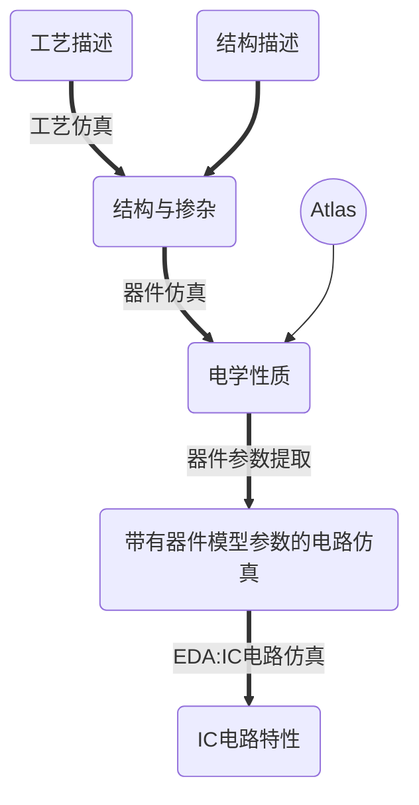
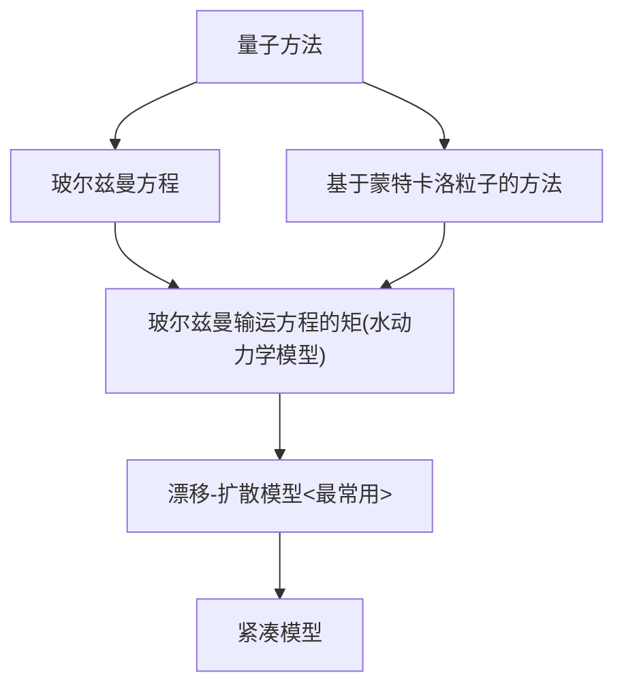
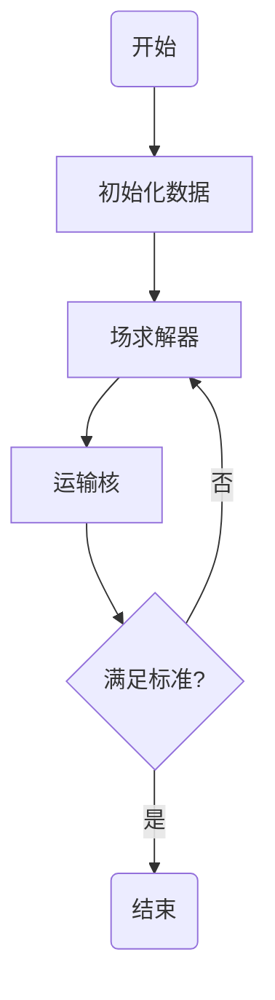
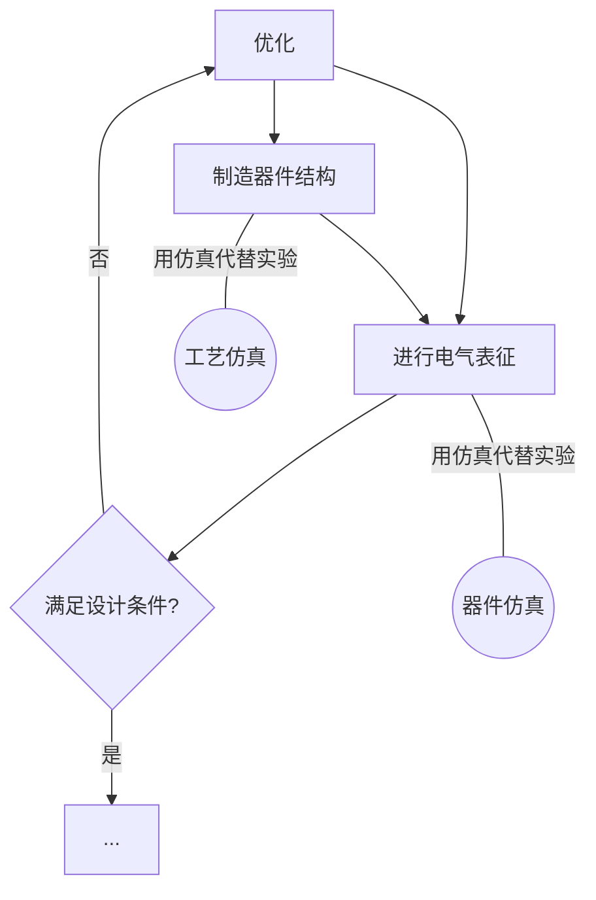
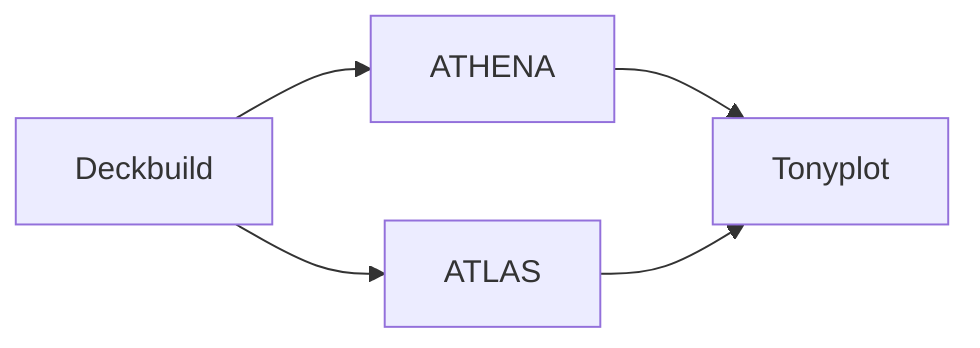
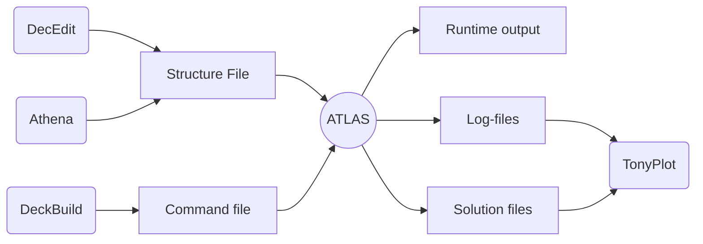

# Introduction to TCAD and Silvaco

[TOC]

## **工艺仿真与器件**

### TCAD

#### 范围和在流程中的位置

包括

- 工艺描述
- 结构和掺杂
- 电学性质

#### TCAD历史

- 1949
  - 肖克利发表论文，提出半导体器件仿真的概念，为结型二极管和晶体管奠定基础
  -  局部分析方法，无法分析高级注入和收集器的扩展
- 1964
  - H. K. Gummel通过数值方法而非分析方法对一维双极晶体管进行了仿真
  - 使器件仿真朝着计算机化方向发展
- 1970
  - D. P. Kennedy和R.R. O'Brien首先研究了二维JFET数值方法
  - J. W. Slotboom通过二维数值方法研究晶体管的直流特性
  - 从此大量论文研究二维数值分析在不同情况下以及在不同器件上的应用
  - 出现了各种成熟的仿真软件，例如CADDET和MINIMOS

### 物理器件建模的历史发展

- 闭式分析建模
  - 肖克利 (1952)：渐进通道近似
- 数值方法
  - Gummel (1964)<双极性晶体管等效电路提出者之一>：BJT的一维数值方案
  - De Mari (1968)：p-n结的一维数值模型
  - Sharfetter and Gummel (1969)：硅读取 (IMPATT)二极管的一维仿真
  - Kenedy and O’Brien (1970)：硅JFET的二维模拟
  - Slotboom (1973)：BJT的二维模拟
  - Yoshii et al. (1982)：适用于各种半导体器件的3D建模
- 商业器件仿真器
  - 2D MOS：MINIMOS, GEMINI, PISCES, CADDET, HFIELDS, CURRY
  - 3D MOS：WATMOS, FIELDAY
  - 1D BJT：SEDAN, BIPOLE, LUSTRE
  - 2D BJT：BAMBI, CURRY
  -  金属-半导体[接触势垒]场效应晶体管 (MESFET)：CUPID
  - 基于粒子的模拟器：DAMOCLES
  - 量子传输模拟器：NEMO

### 器件仿真工艺仿真的作用

- 器件仿真可实现**电气特性仿真**和**电气参数提取**
  - 可用于**设计**新器件，**改进**旧器件并**验证**器件的电气特性
    - 例如MOS晶体管，二极管，双极晶体管
  - 提取**器件参数**或建立**简化模型**以进行电路仿真
- 工艺仿真可以**模拟**离子注入，氧化，蚀刻，光刻和其他**工艺**
  - 可用于**设计**新工艺流程并**改进**旧工艺

### 器件仿真

- 通过近似数学模型来表示器件的物理结构或行为

  - 闭式表达式 (分析模型)
  - 用数字求解的联立方程组

- 分析模型

  - 将表征器件的复杂问题分解为简单的组件的方法
  - 可以以很精确的方式完成所需的研究

- 数值模型

  - 器件特性的数值模拟

  > 传统的器件建模涉及反复试验的方法，对于超小型器件而言，这种方法过于昂贵

#### 固态器件模型

- **等效电路**模型
  - 基于器件的**电气性能**
  - 适用于**电路设计**应用
  - 由于很难将**模型元素**与**物理参数**关联，因此其应用范围受到限制
  - **不适合预测**新型器件结构的性能
- **物理器件**模型
  - 基于**载波传输的物理原理** (直流，瞬态，大信号和高频运行)
  - 使用以下方法**求解物理器件模型**：散装运输模型，玻尔兹曼运输模型或量子运输概念
  - **适用于预测**复杂器件结构的性能
  - 详细的物理器件模型需要**大量的计算机时间和内存**

> SRH: Shockley-Read-Hall (非平衡载流子复合)
>
> 非平衡载流子通过电子与空穴的相遇而成对消失的过程

#### 物理器件模型的层次结构

#### 半经典运输模型的有效性

- 漂移扩散模型
  - 适用于L~G~ ＞ 0.5 μm的器件
  - 无法处理热载流子效应
- 流体动力学模型
  - 适用于L~G~ ≥ 0.1 μm的器件
  - 模型中包含了热载流子效应，例如速度超调
  - 高估了高场速度
- 基于粒子的仿真
  - 适用于L~G~ ＜ 0.1 μm的器件
  - 精确到经典极限
  - 允许适当处理离散杂质效应以及e-e和e-i相互作用
  - 耗时

#### 物理器件仿真

- 任何物理器件仿真器中都有两个主要组件
  - 归因于驱动力和扩散过程 (运输)的电荷运动的表征
  - 电荷分布和运动引起的场

##### 场方程

通常，需要解决器件内部和外部的**麦克斯韦方程组**

$$
\bigtriangledown\times E=-\frac{\part B}{\part t},~\bigtriangledown\cdot D=\rho\\
\bigtriangledown\times H=J+\frac{\part D}{\part t},~\bigtriangledown\cdot B=0
$$

解决这些方程式的数值技术包括

- 时域有限差分解决方案 (**FDTD**)
- **频域解决方案** (频谱技术) <较少用>

##### 输运方程

$$
\text{漂移-扩散模型}\\[3ex]
连续性方程
\left\{\begin{aligned}
	\frac{\part n}{\part t} & = \frac{1}{q}\bigtriangledown\cdot J_n-r_n+g_n \\
	\frac{\part p}{\part t} & = -\frac{1}{q}\bigtriangledown\cdot J_p-r_p+g_p
\end{aligned}\right.,~
电流密度方程
\left\{\begin{aligned}
	J_n=q\mu_nnE+qD_n\bigtriangledown n\\
	J_p=q\mu_ppE+qD_p\bigtriangledown p
\end{aligned}\right.
$$

##### 物理器件仿真

目前，几乎所有的器件仿真工具都采用**准静态逼近**，以便从**泊松方程**获得电场
$$
\bigtriangledown^2V(r)=\frac{\rho(r)}{\epsilon},~D=-\bigtriangledown V
$$

- **变量**n，p和V同时求解
- **迁移是局部**的，由两个量描述
  - 现象迁移率 (漂移速度)$v=\mu(E)E$
  - 扩散系数$D(E)=\frac{kT}{q}\mu(E)$ (爱因斯坦关系)

### 工艺仿真

- 通过**求解方程式组**来完成，该方程式描述半导体工艺的**物理和化学**性质
- 通过一个或多个处理步骤对半导体器件结构的**物理形成**进行**数值模拟**

#### 离子掺杂工艺示例

- 离子注入是制造硅器件 (特别是集成电路)时最常使用的掺杂技术
- 经常使用两种模型来描述离子注入过程
  - **分析模型**
    - 对物理的理解没有帮助
    - 由于简单，可以**满足许多工程应用的需求**
  - **统计 (蒙特卡洛技术)**
    - 第一性原理计算 (耗时)
    - 可以描述**寄生效应**
      - 晶格混乱和缺陷 (用高温退火和旋转注入修复)
      - 反向散射和靶溅射
      - 穿通现象 (在晶体材料中很重要，用旋转注入修复)

##### 分析模型

$$
C(x)=Df(x)\\
D:每单位面积的总植入剂量\\
f(x):概率密度函数
$$

用以下四个特征量描述频率函数

- 投射范围 (Projected range)

$$
R_p=\int_{-\infin}^{+\infin}xf(x)dx
$$

- 标准偏差 (Standard deviation)

$$
\Delta R_p=\lgroup\int_{-\infin}^{+\infin}(x-R_p)^2f(x)dx\rgroup^{\frac{1}{2}}
$$

- 偏度 (Skewness)

$$
\gamma=\frac{\int_{-\infin}^{+\infin}(x-R_p)^3 f(x)dx}{(\Delta R_p)^3}
$$

- 峰度 (Excess or kurtosis)

$$
\beta=\frac{\int_{-\infin}^{+\infin}(x-R_p)^4 f(x)dx}{(\Delta R_p)^4}
$$

##### 分析模型的一些示例

- 注入剂量为10^14^ cm^-2^的磷
- 使用分布函数的**高斯模型**
-  **范围**和**标准偏差**以微米指定，不使用表格值

`IMPLANT PHOS DOSE=1E14 RANGE=0.1 STD.DEV=0.02 GAUSS`

- 注入剂量为4×10^12^ cm^-2^，倾斜角与旋转角度均为0°的60 keV的硼
- 使用分布函数的Pearson模型
- 通过CRYSTAL参数规范考虑沟道效应

`IMPLANT BORON DOSE=4.0E12 ENERGY=60 PEARSON TILT=0 ROTATION=0 CRYSTAL`

###### Pearson模型

##### 蒙特卡洛技术

- 将分析模型应用于简单平面结构中的离子注入时，可以提供非常好的结果
- 对于非平面结构，需要更复杂的模型
- SSUPREM4包含用于蒙特卡洛模拟的两个模型
  - 非晶材料模型
  - 水晶材料模型
- 蒙特卡洛模型也可以解决离子注入损伤问题
  - 损伤类型：弗兰克尔对 (间隙和空位剖面)，<311>晶簇，位错环
  - 存在两个用于离子注入损伤建模的模型
    - Kinchin-Pease模型 (用于无定形材料)
    - 结晶材料模型

#### 先进工艺仿真

- 基于物理的工艺仿真可预测由指定工艺序列产生的结构
- 基于物理的工艺仿真具有三个主要优点
  - 可预测
  - 提供见解
  - 以非专家可以理解的方式捕获理论知识
- 让基于物理的工艺仿真变得重要的因素
  - 比实验更快，更便宜
  - 提供难以测量的信息

### 器件制造工作流程

#### TCAD历史

- 斯坦福的Dutton和Plummer
  - SUPREM (SUPREM3 and SUPREM4)
  - PISCES
- 技术建模协会 (TMA) (1979)
  - TSUPREM4
  - MEDICI
- 集成系统工程 (ISE)
  - DIOS
  - DESSIS
  
  > TMA ==> Avant!
  > Avant! + ISE ==> Synopsys
- SILVACO
  - ATHENA (包括 SSUPREM4)
  - ATLAS

#### 其他器件/工艺仿真工具

- MOSFET具体的器件仿真器包括
  - MINIMOS (维也纳技术大学)
  - SEQUOIA Device Designer
- FLOOPS/FLOODS (佛罗里达大学提供的工艺/器件仿真器)
  - FEDSS/FIELDAY (IBM)
  - PROPHET/PADRE (Agere)

## **Silvaco仿真软件：Athena/Atlas**

### Silvaco工具

- VWF (Virtual Wafer Fab, 虚拟晶圆厂) 框架包含两组不同的工具
  - 核心工具
  - 辅助工具

- ATHENA：工艺仿真工具
  - 预测加工步骤产生的物理结构
  - 将工艺仿真视为一系列事件
  - ATLAS：器件仿真工具
    - 执行基于物理的2D/3D器件仿真
    - 预测指定半导体结构的电行为，并深入了解与器件操作相关的内部物理机制
    - 包括ATLAS的各种工具包括
      - S-PISCES, BLAZE, GIGA, TFT, LUMINOUS, LASER, MIXEMODE, DEVICE3D, INTERCONNECT3D, THERMAL3D

`指令的输入通过deckbuild软件窗口传送至仿真器`

`*.log,*.str等输出文件通过tonyplot软件窗口查看`

### DevEdit

- 用于构造器件
- 生成网格 (修改网格)
  - 可为DevEdit绘制的器件生成网格
  - 可以修改Athena工艺仿真软件生成的器件的网格
- 为什么要重新定义网格
  - 工艺仿真中生成的网格用于形成掺杂剂的准确浓度分布和结的深度
  - 这些网格对于计算器件参数不一定是必须的
    - 例如，当计算阈值电压，源极/漏极电阻，沟槽电场效应或载流子迁移率时，DevEdit可以帮助在沟槽部分提供更密集的网格，并减少其他不重要区域 (例如栅极区域或半导体/氧化物)中的网格接口
    - 密集网格用于关键区域，稀疏网格用于不重要的区域
- 与工艺仿真的区别
  - DevEdit：关注结果，而不是可行性
  - Athena：需要考虑实际工艺以获得结构

### DeckBuild Overview

- 启动DeckBuild需要输入：deckbuild

- DeckBuild启动时，将弹出应用程序窗口

  - Up Toolbar

    - 导入先前保存的描述感兴趣结构的ASCII文件
    - 主要控制按钮包含Optimizer和Examples

  - Down Toolbar

    > 用于控制模拟器的运行方式

    - next：向模拟器发送下一行
    - run：从头到尾运行deck
    - quit：向模拟器发送退出语句
    - restart：重启模拟器
    - kill：关闭模拟器

### Athena

- 开发和优化半导体制造工艺
- 模块大致分为两类
  - 模拟离子注入，扩散，氧化等导致的掺杂分布

  - 模拟蚀刻，沉积和其他基于形态的模块
  - 所谓的IC工艺统计模拟，以模拟原始和异质衬底参数和/或制造工艺参数对工艺结果的影响
- Athena可以专注于单个工艺的影响，同时保持其他工艺非常简单
- 可以快速准确地模拟以下器件的所有关键处理步骤
  - CMOS
  - 双极晶体管
  - SiGe/SiGeC
  - SiC
  - SOI
  - III-V
  - 光电和功率器件

### Atlas

#### 输入输出

- 大多数Atlas模拟器采用两种输入形式
  - 文本文件
  - 结构文件
- Atlas由三种输出文件形式
  - Runtime output：正在运行的仿真进度指南
  - Log files：电气输出信息汇总
  - Solution files：存储与解决方案变量的值相关的2D，3D数据

#### 操作模式

- 三种不同的操作模式

  - 使用DeckBuild的交互模式

    `deckbuild -as <input_filename>`

  - 使用DeckBuild的批处理模式

    - 使用X-Windows操作

      `deckbuild -run -as <input_filename> -outfile <output_filename>`

    - 不使用X-Windows操作

      `deckbuild -run -ascii -as <input_filename> -outfile <output_filename>`

  - 不使用DeckBuild的批处理模式

    `atlas <input_filename> -logfile <output_filename>`