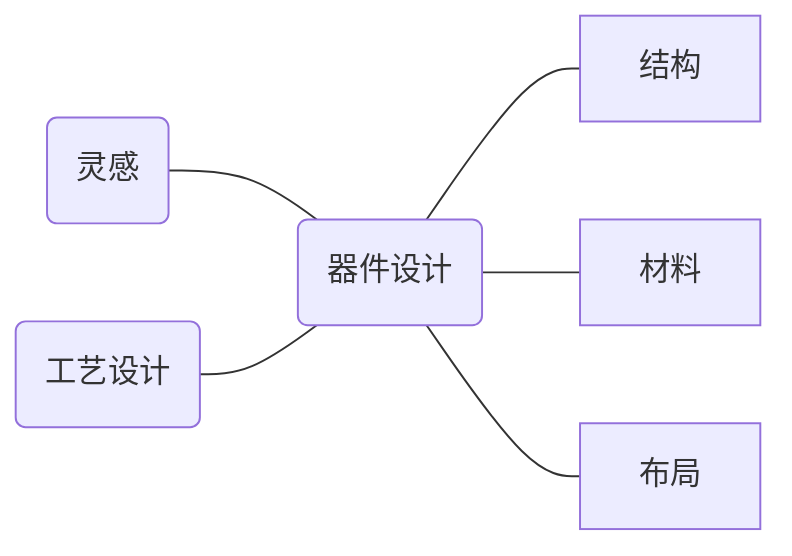
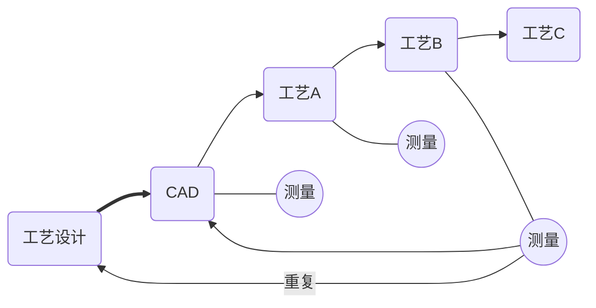
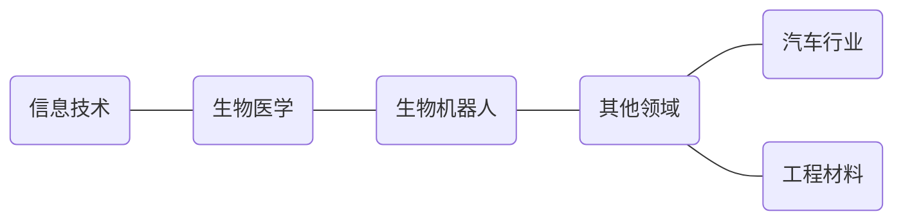
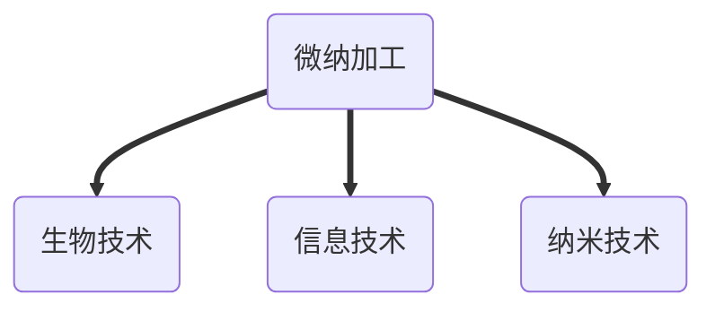

# 概论

[TOC]

## 引论

### 器件分类

- 标准集成电路/无源器件
- MEMS传感器/执行器

#### 导航与姿态

- 磁敏传感器
- 加速度计
- 陀螺
- 气压传感器

#### 输入输出

- 硅麦克风
- 触摸传感器
- 指纹传感器
- 力敏传感器

#### 光学与成像

- CMOS传感器
- 光线传感器
- 接近传感器
- 微投影仪

## 定义


- 受需求推动 ($12 billion市场，11%增长率)
  - 小型化，体积更小
  - 多功能集成 (例如传感器和执行器)
- 微系统与纳米技术的结合

#### MEMS/NEMS

> 微机电系统和纳机电系统

- 微米/纳米尺寸的结构和零件的制造 **100 μm**/100nm
- 批量制造
  - 三维微加工
- 微米和纳米制造之间没有明显区别
- 多学科
- 21世纪信息时代的核心
- 另一次工业革命

### 微加工

- 体加工

  - 减法 (硅/非硅)：做出后刻蚀

- 表面加工

  - 微光刻 (图案)
  - 沉积/刻蚀


> 二者在实际加工中往往融合

- 超精密加工

  - 微工具
    - 微型钻头: φ2.5μm
    - 微型铣刀: 30μm

- 基于硅的微加工

  > 通过光刻制造微结构

  - IC工艺 (<μm)
  - MEMS <例如手机中传感器> (压电电阻器，陀螺仪 (gyro)，加速度计)

#### LIGA 和 UV-LIGA

##### LIGA

- 由德国的W. Ehrfeldfrom发明
  - 同步辐射X射线 (光刻，Lithographie)
  - 电铸 (Electroforming)
  - 塑胶成型 (Plastic molding)
- 特点
  - 尺寸范围：亚毫米和微米
  - 高深宽比 (High aspect ration)
  - 陡峭 (~90°)，且图形保真度较高
  - 价格昂贵


##### UV-LIGA

> 现在更为常用

- SU-8胶： 化学增幅型负光刻胶


```
从微米到纳米的制造并不是尺寸的简单减小，而是加工技术的重大进步
```

### 纳米技术

- 在原子、分子或大分子水平上的研究和技术开发，尺度范围约为1-100 nm
- 创建和使用具有新颖特性和中等大小的结构，设备和系统
- 在原子尺度上进行控制或操纵的能力
- 将这些特性和功能集成到从纳米到宏观尺度的系统中的能力

```
纳米制造涉及从纳米尺度到宏观尺度的结构的创建
```

#### 摩尔定律

- 当价格不变时，集成电路上可容纳的元器件的数目，约每隔18-24个月便会增加一倍，性能也将提升一倍
- 当前最新工艺：目前7nm已经成熟，TSMC计划今年推出5 nm

#### 集成度

|       Integration level       | Abbreviation | Number of devices on a chip |
| :---------------------------: | :----------: | :-------------------------: |
|    Small Scale Integration    |     SSI      |            2-50             |
|   Medium Scale Integration    |     MSI      |          50-5,000           |
|    Large Scale Integration    |     LSI      |        5,000-100,000        |
| Very Large Scale Integration  |     VLSI     |     100,000-10,000,000      |
| Ultra Large Scale Integration |     ULSI     |  10,000,000-1,000,000,000   |
| Super Large Scale Integration |     SLSI     |     over 1,000,000,000      |

#### 场效应晶体管的演进

- 栅材料：传统二氧化硅 ==> 氧化锆/氧化铪等 (高K)
  - 减小隧穿效应


## 历史

### 起源

> 我想描述一个领域，该领域几乎没有做任何事情，但原则上可以完成很多工作……我要谈论的是小规模操纵和控制事物的问题……为什么我们不能在大头针上写下《不列颠百科全书》的全部24卷呢？(by 理查德·费曼)

- 费曼奖：向第一个将信息放在书页上并将其放置在线性标尺上缩小1/25,000的区域的人提供$1000
  - 1960年，威廉·麦克米伦获得
- 向第一个制造出电动机 (可以从外部控制并且不计算引入线的只有1/64英寸立方体大小的旋转电动机)的人再奖励$1,000
  - 1985年，托马斯·纽曼获得

### 发展里程碑

- 1959年：*There’s Plenty of Room at the Bottom* (Feynman)
- 1960年：电子束光刻的首次展示 (Möllenstedt＆Speidel)
- 1969年：观察到PMMA对电子辐射敏感 (Hatzakis)
- 1974年：X射线光刻 (Smith)
- 1978年：自组装单分子膜 (Sagiv)
- 1981年：亚波长全息图案 (Smith)
- 1980年：光学相移 (Lin)
- 1981年：发明STM (Binnig＆Rohrer)
- 1985年：第二届费曼奖 (Newman)
- 1986年：发现富勒烯 (Smalley)
- 1988年：软光刻技术 (Whitesides)
- 1989年：原子尺度图案化 (Eigler)
- 1990年：结构DNA (Seeman)
- 1992年：发现多壁碳纳米管 (Iijima)
- 1994年：提议并观察到SWNT (Bethune)
- 1996年：纳米压印光刻技术 (Chou)
- 2000年：半导体的多肽识别 (Belcher)
- 2002年：浸笔纳米光刻技术 (Mirkin)
- 2003年：低于100 nm的CMOS栅极投入生产 (IBM, Intel)
- 2006年：DNA折纸 (Rothemund)

### 主要技术

#### 工艺技术

- 薄膜技术
- 光刻图案
- 化学
- 自组装
- 生物分子相互作用

#### 工艺特征

- 表征
- 显微镜检查
  - 光学显微镜
  - 扫描电镜/透射电镜 (SEM/TEM)
  - SPM
- 光谱学
  - 紫外线
  - 红外
  - XPS

### 流程

#### 总体流程



#### 工艺制造流程



#### 平面制作工艺 (通用)


#### 薄膜工艺

- 沉积
  - 物理气相沉积 (PVD)
  - 化学气相沉积 (CVD)
  - 原子层沉积 (ALD)
  - 分子束外延 (MBE)
  - 电沉积 (电镀和电化学沉积)
- 表征
  - 物理
  - 化学

#### 光刻

##### 基于光子的光刻

- 光学
  - 曝光系统
  - 分辨率限制
  - 干涉效应
  - 相移
- 短波技术
  - 极紫外线 (EUV)
  - X射线
  - 近场
- 亚分辨率技术
  - 双重图案
  - 抵抗修剪

##### 电子束光刻

- 探针形成
  - 探针
  - 源
  - 电子光学
  - 失真/校正
- 曝光系统
  - 吞吐量
  - 解析度
  - 放置精度
- 电子-固体相互作用
  - 抗性
  - 电子散射和邻近效应

###### 特点

- 波长更短
- 高分辨率
- 更容易控制

##### 离子/原子束光刻

Masked IBL

- 聚焦IBL
  - 离子束光学
- 原子光刻
- 曝光系统
  - 无邻近效应
  - 长焦深

##### 扫描探针图形法

- 原子操纵
- “机械”光刻
- 电子发射
- 局部钝化
- 浸笔光刻

##### 软光刻

- 微/纳米接触印刷
  - 蒙层
  - 材料
- 优点
  - 便宜
  - 复杂图案
  - 曲面上的图案
  - 各种材质

##### 纳米压印光刻

- 热压印
- 紫外线烙印
- 材料
  - 蒙层
  - 压印介质

#### 图案转移


#### 自组装

- 二维和三维自组装系统
  - SAM
  - 沸石
  - 中孔膜
  - 嵌段共聚物
  - 纳米颗粒
- 定向/模板化自组装
  - 受控增长

#### 生物启发的制造

- 有机分子-无机物相互作用
  - 综合
  - 装配
  - DNA支架和图案
  - DNA介导的组装

##### 应用



### 微纳加工应用



