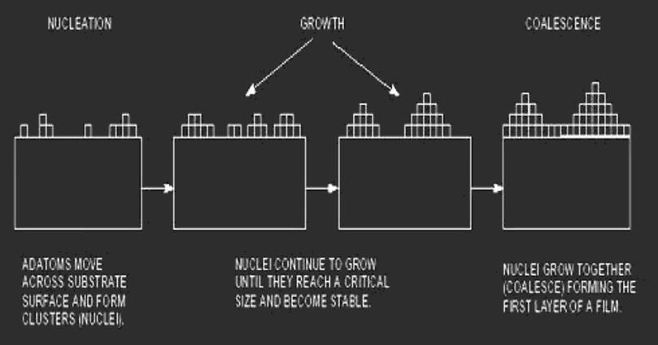
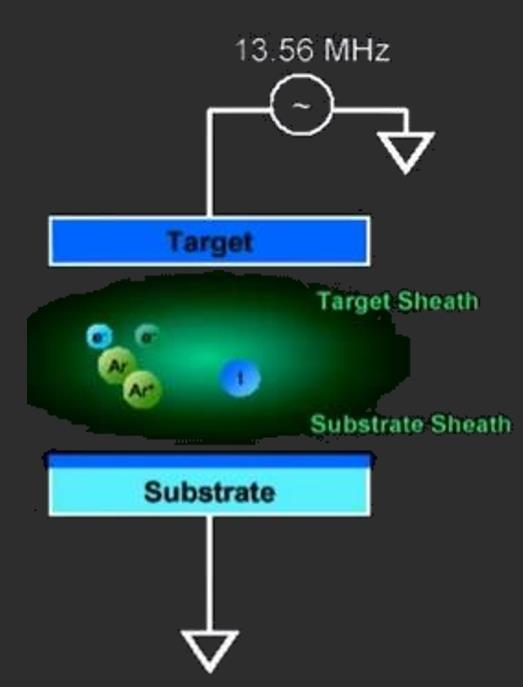
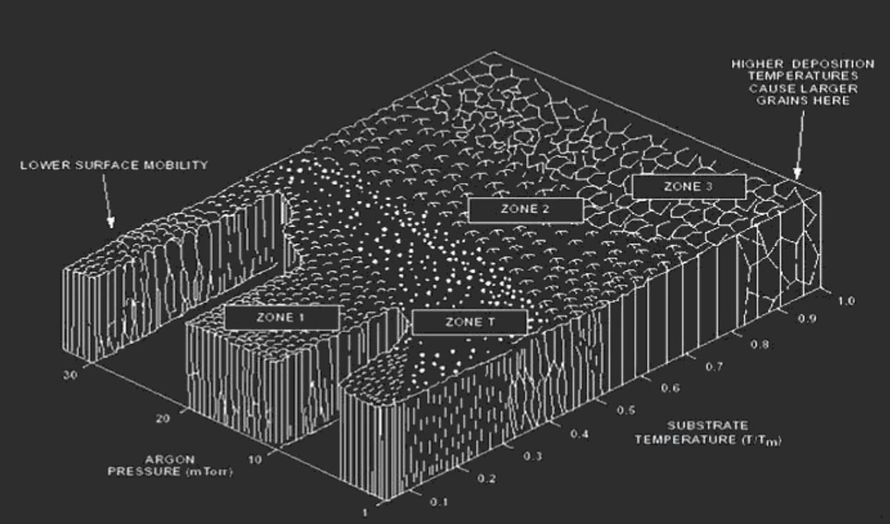

# 薄膜工艺

> **How can we make devices more powerful, lighter, smaller, cheaper?**

[TOC]

## **薄膜沉积方法**

### 物理气相沉积 (PVD)

> 热蒸发和溅射 (Sputtering)都归为物理气相沉积 (physical vapor deposition)的一种

所有PVD工艺均按照以下步骤顺序进行

- 将要沉积的材料物理转化为气相
- 蒸气在整个减压区域 (从源到衬底)传输
- 蒸气在衬底上凝结形成薄膜

#### 溅射

> 通过高能粒子 (主要是惰性气体等离子体)撞击将原子从靶材表面去除的过程

##### PVD原理

- Vacuum：真空
- Plasma：等离子体

##### 溅射原理

- 薄膜源原子通过与高能离子的碰撞而离开靶材表面
- 产生离子并将其对准目标 (胶片源材料)
- 喷射 (溅射)的原子转移到衬底上
- 溅射的原子撞击衬底，在衬底上凝聚并形成薄膜

- 一些寄生效应
  - 左侧：反射/进入/形成离子注入
  - 右侧：**溅射**/级联反应/二次电子散射

- 成核：原子在整个基体表面移动并形成团簇 (核)
- 生长：核继续生长，直到达到临界尺寸并变得稳定
- 凝聚：核生长到一起 (凝聚)，形成薄膜的第一层

##### 溅射方法

###### 直流溅射

> 需要导电性较好的靶材

- 游离电子与Ar原子碰撞
  - 激发Ar原子
  - Ar^+^二次电子的电离
- 电子产生朝目标加速的附加等离子体Ar^+^
  - 溅射靶材
- 沉积不定向，方向性不强 (除非准直 (collimated))

- 粉红区域即放电区域
- 如果靶材不导电 (如使用陶瓷)
  - 刚开始能启辉，但随后电位变高，溅射终止

###### 磁控溅射

- 磁场将电子限制在目标区域内 (洛伦兹力)
  - 溅射效率更高
  - 靶材利用率也更高
- 电流密度上升
- 放电气压下降
- 沉积速率提高 (等离子体密度提高)

关键挑战：如何排列磁体以获得完全的表面腐蚀

- 设计磁场以获得所需的的溅射均匀性
- 典型气压：1-20 mT

###### 射频溅射 (RF)

> 导电性不好的材料可选用此方式

- 射频场中和电极上的正电荷
  - 允许电介质的沉积 (导电性不好的材料)
- <100 kHz时，电子和离子都能跟随电位切换
- \> 1 MHz时，重离子惯性较大，不能跟随开关切换电压
  - 一般选择13.56 MHz

##### 溅射分布

> 不同能量粒子轰击下，溅射的分布不同

- 显示溅射原子离开靶材表面的角度与能量入射的关系
- 所有入射离子都平行于目标表面法线 (直接进入靶材)传播
- 入射离子能量越高，溅射的原子离开靶材表面的角度越高
- 在较低的离子能量下，原子以较小的角度离开表面

##### 成核和晶粒生长模式

- 理想的成膜是连续岛状形成膜

- (a) 层状
  - 要求沉积的膜和衬底的匹配良好 (润湿性都非常好)
  - $\mu_{sf}>\mu_{ss}$

- (b) 岛状
  - 在 a 与 c 之间
- (c)
  - 沉积膜与衬底间有较大的不匹配 (润湿性比较差)
  - $\mu_{sf}<\mu_{ss}$

#### PVD工艺控制

##### 主要工艺参数

- 晶圆温度控制
  - 在溅射过程中必须精确控制晶片温度。 最常用方法是使用背面导热
    - 将高压氩气施加到晶圆的背面，以提供热力学耦合 (通过传导热传递)至晶圆下方的加热卡盘

##### 压力

###### 气压单位

- 1 大气压 = 760 torr (1 torr = 1 mmHg) = 1 Bar = 10^-5^ Pa (N/m^2^) = 14.7 磅/英尺^2^
- 常用转换
  - 1 mbar = 160 mtorr
  - 1 Pa = 7.6 mtorr

###### 气压测量

- 对流计
  - 大气压 (Atm.) -50 mT
  - 低真空
-  薄膜电容式真空压力计 (Baratron)
  - 100 mT - 1mT
  - 电离真空
- 电离计
  - 100 mT - 10^-9^ T
  - 高真空 (如本底气压)
  - 热丝或冷阴极

###### 铝趋势图

- 衬底沉积时温度越高，电阻率越小
  - 温度越高，晶粒越大 (晶界少)，孔洞越少
- 均匀性 (Uniformity)，越高越好
- 反射 (Reflectivity)
  - 温度越高，晶粒越大，表面平整度越低
- 沉积速率与功率成正比，但功率过高时会变缓
  - 功率越高，产生的氩等离子体密度越高
- 沉积速率与衬底和靶材间距成反比
  - 距离过远，粒子命中率较低

###### 钛趋势图

- 对均匀性比较敏感
- 温度升高，压应力变成张应力

###### TiN趋势图

- 左下角气压为work pressure
  - 本底气压 (base pressure)：溅射前抽真空的真空度，结晶时使用

##### 温度

###### 晶粒尺寸随衬底温度的变化

- 高温时动能大，更容易跨过势垒，对成核有利，晶粒尺寸会更大

###### 晶粒尺寸随衬底表面洁净度的变化

- 真空度越高，杂质越少，洁净度 (cleanliness)越高

###### 薄膜生长与衬底温度的关系 (MD Zone)

- Argon pressure: 工作 (溅射)气压，而不是base pressure
- 衬底温度越高，晶粒尺寸越大
- 温度高时气压与晶粒关系不大

**示例**

- Gold TiN
  - T~D~/T~M~ = 673/3100 = 0.22
  - 4 mTorr
  - **Zone T Film**
- Brown TiN
  - T~D~/T~M~ = 573/3100 = 0.18
  - 10 mTorr
  - **Zone 1 Film**

- 区域不一样，外观与性能也不一样
  - **T (过渡)型组织：致密纤维状晶粒** (较常使用)
    - 紧密排布的细纤维
    - 边界致密化
  - Ⅰ 型组织：疏松纤维状结构
    - 倒锥状纤维 (微晶)
    - 晶界大量孔隙
  - Ⅱ 型组织：柱状晶
  - Ⅲ 型组织：再结晶晶粒
    - 粗大等轴晶
- Al~2~O~3~：熔点 2054℃
  - Ⅰ 区：$0.1\times 2054=205.4℃$
  -  T 区：$0.1-0.3\times 2054=205.4-616.2℃$
  - Ⅱ 区：$0.3-0.5-0.7-0.8\times 2054=616.2-1027-1437.8-1643.2℃$
  - Ⅲ 区：$0.7-0.8\times 2054=1437.8-1643.2℃$

##### 功率

##### 间距 (Spacing)

> 靶材和衬底的间距

###### 台阶覆盖率测量标准

## **薄膜表征**