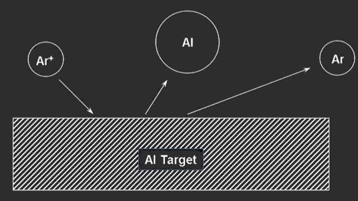
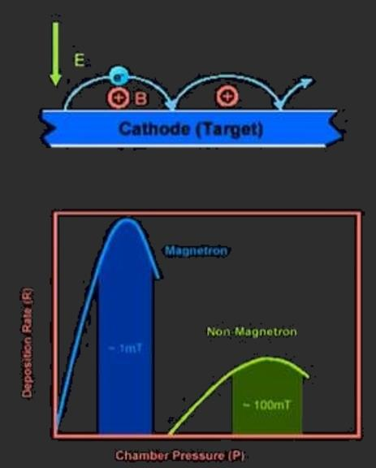
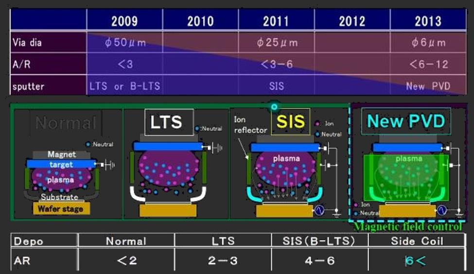

# 薄膜工艺

> **How can we make devices more powerful, lighter, smaller, cheaper?**

[TOC]

## 薄膜沉积方法

### 物理气相沉积 (PVD)

> 热蒸发和溅射 (Sputtering)都归为物理气相沉积 (physical vapor deposition)的一种

所有PVD工艺均按照以下步骤顺序进行

- 将要沉积的材料物理转化为气相
- 蒸气在整个减压区域 (从源到衬底)传输
- 蒸气在衬底上凝结形成薄膜

#### 溅射

> 通过高能粒子 (主要是惰性气体等离子体)撞击将原子从靶材表面去除的过程

##### PVD原理

- Vacuum：真空
- Plasma：等离子体

##### 溅射原理

- 薄膜源原子通过与高能离子的碰撞而离开靶材表面
- 产生离子并将其对准目标 (胶片源材料)
- 喷射 (溅射)的原子转移到衬底上
- 溅射的原子撞击衬底，在衬底上凝聚并形成薄膜

- 一些寄生效应
  - 左侧：反射/进入/形成离子注入
  - 右侧：**溅射**/级联反应/二次电子散射

- 成核：原子在整个基体表面移动并形成团簇 (核)
- 生长：核继续生长，直到达到临界尺寸并变得稳定
- 凝聚：核生长到一起 (凝聚)，形成薄膜的第一层

##### 溅射方法

###### 直流溅射

> 需要导电性较好的靶材

- 游离电子与Ar原子碰撞
  - 激发Ar原子
  - Ar^+^二次电子的电离
- 电子产生朝目标加速的附加等离子体Ar^+^
  - 溅射靶材
- 沉积不定向，方向性不强 (除非准直 (collimated))

- 粉红区域即放电区域
- 如果靶材不导电 (如使用陶瓷)
  - 刚开始能启辉，但随后电位变高，溅射终止

###### 磁控溅射

- 磁场将电子限制在目标区域内 (洛伦兹力)
  - 溅射效率更高
  - 靶材利用率也更高
- 电流密度上升
- 放电气压下降
- 沉积速率提高 (等离子体密度提高)

关键挑战：如何排列磁体以获得完全的表面腐蚀

- 设计磁场以获得所需的的溅射均匀性
- 典型气压：1-20 mT

###### 射频溅射 (RF)

> 导电性不好的材料可选用此方式

- 射频场中和电极上的正电荷
  - 允许电介质的沉积 (导电性不好的材料)
- <100 kHz时，电子和离子都能跟随电位切换
- \> 1 MHz时，重离子惯性较大，不能跟随开关切换电压
  - 一般选择13.56 MHz

##### 溅射分布

> 不同能量粒子轰击下，溅射的分布不同

- 显示溅射原子离开靶材表面的角度与能量入射的关系
- 所有入射离子都平行于目标表面法线 (直接进入靶材)传播
- 入射离子能量越高，溅射的原子离开靶材表面的角度越高
- 在较低的离子能量下，原子以较小的角度离开表面

##### 成核和晶粒生长模式

- 理想的成膜是连续岛状形成膜

- (a) 层状
  - 要求沉积的膜和衬底的匹配良好 (润湿性都非常好)
  - $\mu_{sf}>\mu_{ss}$

- (b) 岛状
  - 在 a 与 c 之间
- (c)
  - 沉积膜与衬底间有较大的不匹配 (润湿性比较差)
  - $\mu_{sf}<\mu_{ss}$

#### PVD工艺控制

##### 主要工艺参数

- 晶圆温度控制
  - 在溅射过程中必须精确控制晶片温度。 最常用方法是使用背面导热
    - 将高压氩气施加到晶圆的背面，以提供热力学耦合 (通过传导热传递)至晶圆下方的加热卡盘

##### 压力

###### 气压单位

- 1 大气压 = 760 torr (1 torr = 1 mmHg) = 1 Bar = 10^-5^ Pa (N/m^2^) = 14.7 磅/英尺^2^
- 常用转换
  - 1 mbar = 160 mtorr
  - 1 Pa = 7.6 mtorr

###### 气压测量

- 对流计
  - 大气压 (Atm.) -50 mT
  - 低真空
-  薄膜电容式真空压力计 (Baratron)
  - 100 mT - 1mT
  - 电离真空
- 电离计
  - 100 mT - 10^-9^ T
  - 高真空 (如本底气压)
  - 热丝或冷阴极

###### 铝趋势图

- 衬底沉积时温度越高，电阻率越小
  - 温度越高，晶粒越大 (晶界少)，孔洞越少
- 均匀性 (Uniformity)，越高越好
- 反射 (Reflectivity)
  - 温度越高，晶粒越大，表面平整度越低
- 沉积速率与功率成正比，但功率过高时会变缓
  - 功率越高，产生的氩等离子体密度越高
- 沉积速率与衬底和靶材间距成反比
  - 距离过远，粒子命中率较低

###### 钛趋势图

- 对均匀性比较敏感
- 温度升高，压应力变成张应力

###### TiN趋势图

- 左下角气压为work pressure
  - 本底气压 (base pressure)：溅射前抽真空的真空度，结晶时使用

##### 温度

###### 晶粒尺寸随衬底温度的变化

- 高温时动能大，更容易跨过势垒，对成核有利，晶粒尺寸会更大

###### 晶粒尺寸随衬底表面洁净度的变化

- 真空度越高，杂质越少，洁净度 (cleanliness)越高

###### 薄膜生长与衬底温度的关系 (MD Zone)

- Argon pressure: 工作 (溅射)气压，而不是base pressure
- 衬底温度越高，晶粒尺寸越大
- 温度高时气压与晶粒关系不大

**示例**

- Gold TiN
  - T~D~/T~M~ = 673/3100 = 0.22
  - 4 mTorr
  - **Zone T Film**
- Brown TiN
  - T~D~/T~M~ = 573/3100 = 0.18
  - 10 mTorr
  - **Zone 1 Film**

- 区域不一样，外观与性能也不一样
  - **T (过渡)型组织：致密纤维状晶粒** (较常使用)
    - 紧密排布的细纤维
    - 边界致密化
  - Ⅰ 型组织：疏松纤维状结构
    - 倒锥状纤维 (微晶)
    - 晶界大量孔隙
  - Ⅱ 型组织：柱状晶
  - Ⅲ 型组织：再结晶晶粒
    - 粗大等轴晶
- Al~2~O~3~：熔点 2054℃
  - Ⅰ 区：$0.1\times 2054=205.4℃$
  -  T 区：$0.1-0.3\times 2054=205.4-616.2℃$
  - Ⅱ 区：$0.3-0.5-0.7-0.8\times 2054=616.2-1027-1437.8-1643.2℃$
  - Ⅲ 区：$0.7-0.8\times 2054=1437.8-1643.2℃$

##### 功率

##### 间距 (Spacing)

> 靶材和衬底的间距

###### 台阶覆盖率测量标准

> 与均匀性相似

- CVD工艺可达到较优的覆盖率

###### 覆盖率的挑战

- A/R：身宽比
- 身宽比越来越大，填孔难度越来越大
  - 普通设备具有局限性
  - SIS：自激发离化，方向性较好
  - New PVD：等离子体更均匀，方向性更好

#### PVD应用

##### Salicide

##### 阻挡层

> Barrier

- 铜会**扩散迁移**到硅中，所以需要进行阻挡

##### 抗反射图层

> ARC

##### 互连

#### 比较

##### 薄膜沉积

- 材料
  - 金属
  - 电介质
  - 聚合物
- 所需的组成
- 低污染
- 均匀度
  - 样本间厚度/致密度差别
  - 每批次间厚度/致密度差别
- 方向性
  - 方向性较好：较容易玻璃，容易剥离
  - 方向性不好：台阶覆盖性较好
- 膜性质
  - 应力
  - 结合力 (adhension)
  - 化学计量参数 (stoichiometry)
  - 薄膜密度
  - 晶粒大小，界面性质(晶界/薄膜材料与衬底边界)，晶向 (orientation)
  - 电学性质 (如击穿电压)
  - 光学特性 (如反射)
  - 磁性材料

##### 薄膜沉积技术

- 蒸发

  - 热 (对于熔点不高的材料)
  - 电子束 (对于熔点较高的材料)

  

  |  蒸发  |       材料       |                           典型蒸发                           | 杂质 |  沉积速率  | 温度范围 | 成本 |
  | :----: | :--------------: | :----------------------------------------------------------: | :--: | :--------: | :------: | :--: |
  |   热   | 金属或低熔点材料 | Au, Ag, Al, Cr, Sn, Sb, Ge, In, Mg, Ga, CdS, PbS, CdSe, NaCl, KCl, AgCl |  高  |  1~20 A/s  |  ~1800℃  |  低  |
  | 电子束 | 都为金属或电介质 | 除上述外，还有：Ni, Pt, Ir,Rh, Ti, V, Zr, W, Ta, Mo, Al~2~O~3~, SiO |  低  | 10~100 A/s |  ~3000℃  |  高  |

  - 分子束外延 (MBE)

- 溅射

|                蒸发                |                           溅射                            |
| :--------------------------------: | :-------------------------------------------------------: |
|         低能原子 (~0.1 eV)         | 高能原子/离子 (1~10 eV)，致密薄膜，小晶核，更好的粘合性质 |
| 高真空，方向性好，有利于提起低杂质 |  低真空，方向性不好，更好的台阶覆盖率，气体原子注入薄膜   |
|         点状源，均匀性较差         |                  平行板状源，均匀性更好                   |
|  成分以不同速率蒸发，化学计量较差  |          所有成分以相似速率溅射，更好的化学计量           |

- 激光烧蚀 (PLD，脉冲激光沉积)
- 化学气相沉积 (CVD)

|                         |     作用     |        特性要求        |
| :---------------------: | :----------: | :--------------------: |
|  G-Sin~x~ (栅极绝缘层)  |   绝缘保护   |      电解质系数高      |
|     a-Si （通道层）     |   电子沟道   |      电子迁移率高      |
| N^+^ a-Si (欧姆接触层)  | 信号线性传输 |      形成欧姆接触      |
| Pas-SiN~x~ (绝缘保护层) |   绝缘保护   | 抗化学腐蚀性好，抗潮湿 |

- RPSC作用
  - 在CVD制程中玻璃和整个PC内壁是同时镀膜的
    - 到了一定时间如果不加以清除，就会在后续制程中剥离脱落形成Particle，而影响镀膜品质
    - 所以在一定时间后会用RPSC对Chamber进行清洁以去除膜
- 设备原理
  - 在高温下，将Chamber抽至真空状态 (1 torr)时，通入制程气体，将高频电源加在上电极板形成电场，形成等离子体 (整体呈电中性)，通过吸附结合作用，在玻璃基板上形成薄膜

- 原子层沉积 (ALD)

|    工艺    |       材料       | 均匀性 | 杂质 | 晶核大小  | 膜密度 |           沉积速率           | 衬底温度  |  方向性  | 成本 |
| :--------: | :--------------: | :----: | :--: | :-------: | :----: | :--------------------------: | :-------: | :------: | :--: |
|   热蒸发   | 金属或低熔点材料 |   差   |  高  | 10~100 nm |   差   |           1~20 A/s           |  50~100℃  |    是    | 很低 |
| 电子束蒸发 |   金属和电介质   |   差   |  低  | 10~100 nm |   差   |          10~100 A/s          |  50~100℃  |    是    |  高  |
|    溅射    |   金属和电介质   |  很好  |  低  |  ~10 nm   |   好   | 金属1-- A/s，电介质 1~10 A/s |   ~200℃   | 部分角度 |  高  |
|   PECVD    |    主要电介质    |   好   | 很低 | 10~100 nm |   好   |          10~100 A/s          | 200~300℃  | 部分角度 | 很高 |
|   LPCVD    |    主要电介质    |  很好  | 很低 |  1~10 nm  |  极佳  |          10~100 A/s          | 600~1200℃ | 各向同性 | 很高 |

##### 台阶覆盖性

## 薄膜表征

### 概述

|     属性      |          工具          |
| :-----------: | :--------------------: |
|   **出现**    |       显微镜检查       |
|     宏观      |          光学          |
|     微观      |        SEM/TEM         |
|   原子尺度    | 扫描探针 (STM/AFM/...) |
|   **结构**    |  轮廓仪，QCM，椭圆仪   |
|     厚度      |           —            |
|     形貌      |          AFM           |
|     成分      |    XRD (X射线衍射)     |
|     密度      |          LEED          |
| 微观/原子尺度 |         RHEED          |
|   **组成**    |  俄歇光谱 (表面分析)   |
|   元素方面    |   EDAX (能谱，波谱)    |
|     杂质      |  SIMS (二次离子质谱)   |
|    化学态     |          RBS           |

### 物理表征

#### 椭偏仪

- 测量极化状态的变化 (平行或垂直极化)
  - 膜厚度
  - 光学常数
  - 表面粗糙度
- 可见光长 (350~700 nm)
- 宏观 (50~10 mm)
- 采样深度
- 固定旋转角度的束
- 固定波长或光谱
- 点或区域

#### 表面轮廓仪

- 测量
  - 膜厚度 (台阶高度)
    - 20~50 um
    - 垂直分辨率 ~几纳米
  - 粗糙度 (取决于针尖半径)
  - 横向分辨率 ~十几微米

#### 光学轮廓仪

#### 接触角的测量

- 与液/固界面处的表面能和表面张力相关
  - 粘接
  - 润湿性
  - 粘接质量
- 方法
  - 静态液滴法
  - 威廉板
  - 毛细气泡
  - 虹吸
  - 倾斜基板

### 化学表征

- 区分标准
  - 传入粒子
    - 光子
    - 声子
    - 电子
    - 离子
    - 原子
  - 传出粒子
    - 光子
    - 声子
    - 电子
    - 离子
    - 原子
  - 相互作用
    - 有弹性
    - 无弹性
  - 相互作用+信息深度，要素
  - 解析度/分辨率

#### 问题

- 要分析的元素
- 定性或定量
- 侧壁分辨率
- 深度分辨率 (溅射)

#### 微观分析形貌

|       技术       |   限制   | 分辨率  |
| :--------------: | :------: | :-----: |
|       肉眼       |  视网膜  | 100 nm  |
|    光学显微镜    |  光衍射  | 300 um  |
|  扫描电子显微镜  | 电子衍射 | 2-3 nm  |
|     透射电镜     | 电子衍射 | 0.1 nm  |
|    场离子电镜    | 原子尺寸 | 0.3 nm  |
| 近场扫描透射电镜 | 光圈尺寸 | 1-10 nm |

#### SEM检测

#### 透射电镜

- 电子源
  - W
  - LaB6
  - FEG
- 聚光镜 (电磁)
- 样品物镜 (确定点分辨率)
- 样品后镜片
- 检测器：电子光转换器
- 对比机制：原子散射 (明亮的场，没有散射光)
- 化学分析：EDS

> 波长 200 kV - 0.0025 nm

##### 布拉格衍射

$$
2d\sin\theta=\lambda n
$$

- 相衬 (由于散射光束之间的干涉)揭示了原子的周期性
- 界面粗糙低至原子尺寸