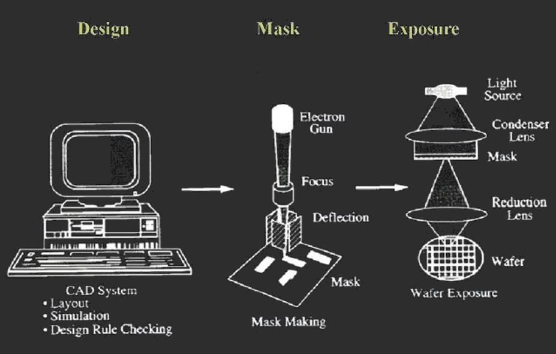
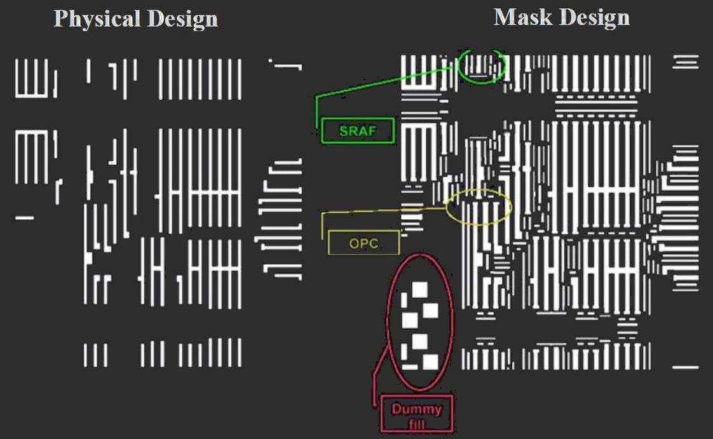

# 基于光子的光刻

[TOC]

## **基本概念**

### 光学光刻的关键参数

- 分辨率
- 焦深
- 套刻精度 (例如覆盖)
- 光刻胶响应

### 光学光刻工艺流程

- 设计
  - 版图
  - 反正
  - 设计规则检查 (DRC)
- 制造掩膜板
- 曝光

### 分辨率限制

#### 衍射

- 基于远场的光刻，距离远远大于波长

#### 数值孔径

$$
d=2nf\sin\theta\\
NA=n\sin\theta\\
$$

#### 瑞利判据

$$
\sin\theta=1.220\frac{\lambda}{D}\\
R=\frac{1.22f\lambda}{d}=\frac{1.22f\lambda}{n(2f\sin\theta)}=\frac{0.61\lambda}{n\sin\theta}\\
l_{min}=k_1\frac{\lambda}{NA}\\
k1:常数，由光学，抗蚀剂和加工范围决定
$$

#### 艾里斑

## **曝光系统**

### 曝光系统

- 同样的光源，接触式的分辨率高 (因为离光源近，衍射小)

### 掩膜成分

#### 衬底

- 要求
  - 高传输性
  - 热膨胀系数低
  - 平整度
  - 最小非线性
- 通常材料
  - 石英
  - 熔融石英
  - BSC

#### 吸收剂

- 要求
  - λ时没有传输
  - 对衬底的附着力好
  - 耐用性
- 常用材料
  - 铬
  - 乳液
  - Fe~2~O~3~

### 接触式曝光

- 1:1
- 没有透镜
- 理想分辨率：远小于1 μm (可以非常高)
  - 近场：没有衍射限制
- 实际分辨率：大于1 μm
- 有缺陷或损坏可能

#### 最佳分辨率要求

- 光学平整的掩膜和衬底
- 贴合掩膜
- 贴合衬底

> 示例：掩膜与衬底之间完美，紧密的接触

#### 接触式曝光的纳米尺度特征

### 非接触式曝光

$$
l_{min}~(\lambda g)^{1/2}
$$

- 随着掩模与晶圆间隙 (g)的增加，强度随位置的变化而变化
  - 间隙小时保真性较好，距离越远，变形越大

### 投影式曝光

- 缩放倍数
  - 10x
  - 5x
  - 4x
- 非常高的分辨率 (深紫外光)
  - 复杂的光学
  - 昂贵

### 总结

|  系统  |             优点             |        缺点        |
| :----: | :--------------------------: | :----------------: |
|  接触  |      潜在高分辨率，便宜      | 掩膜污染和缺陷损伤 |
| 非接触 |          低掩膜污染          |    交叉的分辨率    |
|  投影  | 高分辨率，低掩膜污染，高产量 |     昂贵，复杂     |

### 光学步长

#### 步进和扫描

### 对准和覆盖

#### 对齐和套准错误

- 错误对准
  - 转译
  - 翻转

$$
runout=r(\Delta T_m\alpha_m-\Delta T_w·\alpha_w)\\
r:晶圆半径\\
\alpha:热扩散因子
$$

## **分辨率限制**

### 光源

|    Lamp    | 光源名称  | 波长 (nm) | 图案线宽(μm) |
| :--------: | :-------: | :-------: | :----------: |
|    汞灯    |  g-line   |    436    |     0.5      |
|    汞灯    |  H-line   |    405    |  0.25~0.35   |
|    汞灯    |  I-line   |    365    |  0.25~0.35   |
| 准分子激光 |    XeF    |    351    |  0.25~0.35   |
| 准分子激光 |   XeCl    |    308    |  0.25~0.35   |
| 准分子激光 | KrF (DUV) |    248    |  0.13~0.25   |
| 准分子激光 | ArF (DUV) |    193    |  0.07~0.15   |
| 准分子激光 |    F2     |    157    |     ≤0.1     |

- 用于限制曝光波长的滤光片
- 收集区域的强度均匀性必须好于服务百分比
- 光源老化需要定期校准 (光谱曝光仪)

### 聚焦

$$
光程差:OPD=\delta(1-\cos\theta)
$$

### 焦深

$$
OPD=\delta(1-\cos\theta)\approx \frac{1}{2}\delta\sin^@\theta\\
OPD_{max}=k_2\frac{\lambda}{4},(k_2<1)\\
DOF=2\delta_{max}=\frac{k_2\lambda}{\sin^2\theta}=k_2\frac{\lambda}{2(NA)^2}
$$

#### 焦深的意义

#### 分辨率与焦深

$$
l_{min}～\lambda/NA\\
DOC～\lambda/2(NA)^2
$$

- 需要更小的$l_{min}$，更大的焦深

### 提升分辨率

- 光学
  - 镜头质量（像差等）
  - 照明条件
    - 孔径平面的相干度和强度分布
- 掩膜
- 光刻胶和工艺范围
  - 为简单起见，极小值通常取为P/2，其中P是周期光栅的间距

### 减小λ

> 更短的波长带来更好的分辨率

|  光源  | G-line (Hg Arc) | I-line (Hg Arc) | KrF (准分子) | ArF (准分子) | F~2~ (准分子) | EUV (激光等离子体) |
| :----: | :-------------: | :-------------: | :----------: | :----------: | :-----------: | :----------------: |
| λ (nm) |       436       |       365       |    248.3     |    193.4     |     157.6     |         13         |
|   %    |        -        |       16%       |     32%      |     22%      |      19%      |        91%         |

- 新光源带来的挑战
  - 光学兼容性
  - 窄带宽
  - 光刻胶反应
    - 在λ处的聚合物吸收
  - 成本
    - 新工具
    - 新材料
  - 污染
  - 高能光子化学

#### F~2~光刻

> λ = 157 nm

- 掩膜
  - 改性熔融石英
- 挑战
  - 无防护膜 (保护掩膜)
  - 透镜材质：CaF2
  - 光学质量差
  - 光刻胶材料
  - 成本

### 增大NA

- DOF缩放占主导
  - 对于$NA\approx 1, DOF\approx\frac{\lambda}{2}$
  - $DOF\approx\pm\frac{\lambda}{2(NA)^2}$
- 近年来有了很大的进步
  - 光学技术进步超出预期
  - 镜头设计/制造允许NA接近1 (达到0.93)
  - 先进的流程可以减少焦点预算
  - 工艺地形，例如 CMP，晶圆平整度
  - 工具控制，自动对焦错误
- 超高NA的问题
  - 小自由度
  - 优化的抗蚀剂工艺
  - 光学内的偏振和双折射

#### 提升分辨率和焦深：浸没式光刻

- 对于$k1=0.25$
  - $\lambda=193nm,NA=0.93$
  - $n_{air}=1,I_{min}=51nm$
  - $n_{water}=1.44,I_{min}=35nm$ (用水作为介质)

$$
DOF=\frac{k_2}{2}\frac{\lambda}{n_{fluid}(1-\cos\theta)}\\
\frac{DOF(immersion)}{DOF(dry)}=\frac{1-\sqrt{1-(\lambda/p)^2}}{n_{fluid-\sqrt{n_{fluid}^2-(\lambda/p)^2}}}
$$

- 超过$NA>1$限制
  - 和n~fluid~一样高
- 自由度提高n倍以上
- H~2~O是$λ=193 nm$的好选择
  - $n_{water}\approx 1.44$

##### 挑战

- 光学成本和并发症
- 缺陷
- 污染
- 流体成本

#### DOF趋势

#### 扩展浸没式光刻

### 减小k~1~

- 低像差光学
- 出色的过程控制
- 准确的遮罩图案

### 光刻趋势

| 年份 |  λ   |  NA   | fluid n | k~1~ | I~min~ |  DoF  |
| :--: | :--: | :---: | :-----: | :--: | :----: | :---: |
| 1980 | 436  | 0.166 |    1    | 0.8  |  2101  | 15713 |
| 1984 | 436  | 0.28  |    1    | 0.75 |  1168  | 5450  |
| 1988 | 254  | 0.166 |    1    | 0.6  |  918   | 9154  |
| 1989 | 365  | 0.45  |    1    | 0.7  |  568   | 1706  |
| 1992 | 365  | 0.57  |    1    | 0.65 |  416   | 1023  |
| 1993 | 254  |  0.5  |    1    | 0.6  |  305   |  948  |
| 1996 | 365  | 0.63  |    1    | 0.65 |  377   |  817  |
| 1997 | 248  |  0.6  |    1    | 0.55 |  227   |  620  |
| 1999 | 193  |  0.5  |    1    | 0.6  |  232   |  720  |
| 2001 | 193  | 0.75  |    1    | 0.4  |  103   |  285  |
| 2001 | 365  | 0.65  |    1    | 0.6  |  337   |  760  |
| 2002 | 248  |  0.8  |    1    | 0.45 |  140   |  310  |
| 2004 | 193  | 0.85  |    1    | 0.35 |   79   |  204  |
| 2005 | 193  | 0.93  |    1    | 0.3  |   62   |  153  |
| 2005 | 193  | 0.93  |  1.44   | 0.3  |   62   |  283  |
| 2006 | 193  | 1.15  |  1.44   | 0.3  |   50   |  168  |
| 2008 | 193  |  1.3  |  1.44   | 0.3  |   45   |  118  |

## **分辨率增强技术**

> Resolution Enhancement Technologies (RET)

### 概述

- 改善分辨率和自由度
  - COG：玻璃上的铬 (二元掩膜)
  - PSM：相移掩模
    - 减损
    - 替代
  - OAI：离轴照明
  - SRAF：亚分辨率辅助功能

### 相移掩模

> 相邻曝光区域相位相消，提高曝光的对比度，边界图像更清晰

- 光学强度和曝光能量
  - 电场 (ε)：$\varepsilon(\vec{r},v=\varepsilon(\vec{r})e^{j\phi(\vec{r},v)}$
  - 强度 (I)：$I=\varepsilon*\varepsilon^*=\phi_0e^{j\phi}·\varepsilon_0e^{-j\phi}=\varepsilon^2_0$
  - 能量 (E)：$E=\int I·dt\approx I·t$

### 光学邻近修正

> Optical Proximity Correction, OPC

- 缩短线
- 叠加错误
- CD错误
- 弯曲和摆动

#### OPC：总工艺补偿

- 有意地让掩膜图案变形以补偿系统的和稳定的图案错误

##### 历史发展

- "调整"DRAM和SRAM单元
- 锚定形状以补偿栅缩短
- 基于规则的OPC
  - 根据校正表选择线偏
  - 通过设计规则检查器实现
- 基于模型的OPC
  - 反复修改形状，直到模型适合公差

### 次解析辅助功能

> Sub-Resolution Assist Features, SRAFs

- 主要功能使用更大的自由度进行打印
- 辅助功能不应打印
- 隔离线和密集线变得更加均匀

#### 数据准备

#### 光刻胶修整

#### 双重图案

- 双重曝光+双重蚀刻工艺
  - 2个光栅 (1:3)交错
    - 不适用于简单的双重曝光
- 降低有效k~1~
  - 半间距$k_1=0.15$的实际打印
  - $2k_1=0.3$光栅
- 受覆盖错误和工艺扭曲的影响

##### 双重图案+OPC

#### 干涉光刻

##### 浸入+干涉光刻

