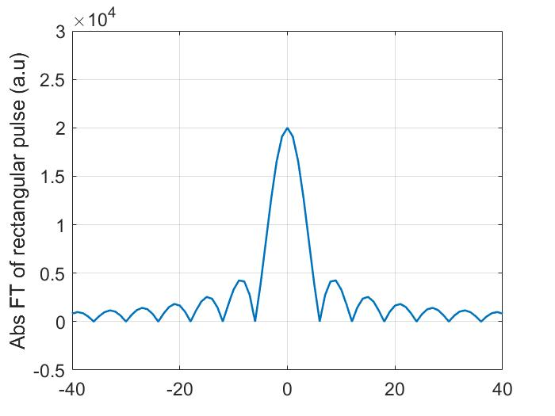

# Matlab_计算光子学

[toc]

## 绪论

### 什么是光子学

- 涉及电磁能量的场

  - 光子学与涉及电子的电子学是平行的

  - 光子之间不相互作用

### 什么是计算光子学

- 利用数值方法研究光在波导结构中的特性和传播

- 利用分析和计算模型来研究光的行为和光与物质的相互作用

- 方法：计算电磁学

  - 广义的三类问题

    - 频域特征计算

    - 频域解算

    - 时域模拟

  - CAD建模中使用的主要算法 (没有普适性)

    - 波束传播法 (BPM)

    - 本征模式展开法 (EME)

    - 时域有限差分法 (FDTD)

  - 考察指标

    - 速度

    - 存储利用率

    - 数值孔径

    - 折射率在器件中的对比

    - 极化、损耗、反射和非线性

### 应用

- 计算纳米光子学

  - 在这种尺度下，多重散射和近场效应对光的传播和光物相互作用有较大的影响

  - 最终的目标是创造出三维光子结构

    - 可能会引发渐进式光学计算

    - 有朝一日可能实现全光学计算

- 光纤通信 (略)

- 生物和医学光子学 (略)

- 光子传感器 (略)

- 硅光子学
  - 硅不是直接间隙材料，因此不能有效地产生光

- 光量子信息科学 (略)

## 光学基本知识

### 几何光学

- 概述

  - 几何光学是以射线的概念为基础的

  - 射线是光学效果的几何表征

- 射线理论及其应用

  - 斯涅耳定律：平面界面处，透射射线的方向

  - 菲涅耳公式：平面波导中两种主要类型的波的反射系数

- 关键角度

  - 临界角θ满足
    $$
    sinθ=\frac{n_2}{n_1}
    $$
  
- 棱镜
  
- 只关注薄透镜：可以忽略光线穿过透镜时的垂直平动
  
- GRIN系统

  - GRIN：折射率梯度 (GRadient in the INdex of refraction)

  - 材料折射率不均匀，有空间依赖性

  - 为了使光线聚集在焦点上，所有光线的光路必须相同

  - 光程：给定区域的几何距离与该区域的折射率的乘积

  - 为了使平行光通过GRIN圆盘聚焦，折射率应该以二次函数关系依赖于半径

### 波动光学

#### 概述

- 光作为电磁波，由电场矢量和垂直磁场矢量组成

- 以$10^{14}\text{Hz}$量级振荡并沿垂直电场矢量和磁场矢量的方向在空间中运动

- 电场矢量符合波动方程

  - 与时间无关，可由此建立斯托克斯关系

- 介质中一维波动方程

$$
\frac{1}{v^2}\frac{\part^2}{\part t^2}E(z,t)=\frac{\part^2}{\part z^2}E(z,t)
$$

#### 相速度

- 选择一个点，假设这一点保持恒定相

- $v_p=\frac{dz}{dt}=ω/k$

- 代表恒定相面在介质中移动的速度

#### 群速度

- 脉冲在介质中的传播速度
  $$
  E(z,t)=2E_0 cos(kz-\omega t)cos(\Delta kz-\Delta\omega t)
  $$

- 表示载波频率为$~\omega~$的波被拍频$~\Delta\omega~$的正弦包络所调制

$$
v_g=\frac{\Delta\omega}{\Delta k}\rightarrow \frac{d\omega}{dk}
$$

- 在自由空间 (真空)中，相速度和群速度是相同的

#### 斯托克斯关系

- 描述光在两介质界面面上的反射率和透射率
- 光以任意角度$~θ_i~$入射时单片薄膜中的干涉


$$
r^2E+t'tE=E\\
rtE+r'tE=0
$$
由此得到斯托克斯关系
$$
t't=1-r^2\\
r'=-r
$$

#### 介质膜干涉

- 通过计算光程差推导建设性干涉和破坏性干涉的条件
- 光穿过薄膜所获得的相位差$\delta$与光程差$\Delta$对应关系为

$$
\delta=k\cdot\Delta=\frac{2\pi}{\lambda_0}\cdot\Delta
$$

#### 平行板中的多重干涉

- 辐照度$~I_R~$

$$
I_R=\frac{2r^2(1-cos\delta)}{1+r^4-2r^2cos\delta}I_i
$$

$$
I_T=\frac{(1-r^2)^2}{1+r^4-2r^2cos\delta}I_i
$$

有
$$
I_R+I_T=I_i
$$

### MATLAB代码

|      函数名      |            描述             |
| :--------------: | :-------------------------: |
| phase_velocity.m |         相速度绘图          |
| group_velocity.m |         群速度绘图          |
|  FP_transmit.m   | 法布里-珀罗标准具透射比绘图 |

#### 相速度绘图

```matlab
% File name: phase_velocity.m
% Illustrative plot of phase velocity
clear all
N_max = 101;  % number of points for plot
t = linspace(0,30d-15,N_max);  % creation of theta arguments
%
c = 3d14;  % velocity of light in microns/s
n = 3.4;  %  refractive index
v_p = c/n;  % phase velocity
lambda = 1.0;  % microns
k = 2*pi/lambda;
frequency = v_p/lambda;
z = 0.6;  % distance in microns
omega = 2*pi*frequency;
A = sin(k*z - omega*t);
plot(t,A,'LineWidth',1.5)
xlabel('Time','FontSize',14);
ylabel('Amplitude','FontSize',14);
set(gca,'FontSize',14);  % size of tick marks on both axes
axis([0 30d-15 -1.5 2])
text(17d-15, 1.3, 'z(t)','Fontsize',16)
line([1.53d-14,2d-14],[1,1],'LineWidth',3.0)  % drawing arrow
line([1.9d-14,2d-14],[1.1,1],'LineWidth',3.0)
line([1.9d-14,2d-14],[0.9,1],'LineWidth',3.0)
pause
close all
```


#### 群速度绘图

```matlab
% File name: group_velocity.m
% Illustrative plot of group velocity by superposition
% of two plane waves
clear all
N_max = 300;  % number of points for plot
t = linspace(0,300d-15,N_max);  % creation of theta arguments
%
c = 3d14;  % velocity of light in microns/s
n = 3.4;  % refractive index
v_p = c/n;  % phase velocity
lambda = 1.0;  % microns
frequency = v_p/lambda;
z = 0.6;  % distance in microns
omega = 2*pi*frequency;
k = 2*pi/lambda;
Delta_omega = omega/15.0;
Delta_k = k/15.0;
%
omega_1 = omega + Delta_omega;
omega_2 = omega - Delta_omega;
k_1 = k + Delta_k;
k_2 = k - Delta_k;
A = 2*cos(k*z - omega*t).*cos(Delta_k*z - Delta_omega*t);
plot(t,A,'LineWidth',1.3)
xlabel('Time','FontSize',14)
ylabel('Amplitude','FontSize',14)
set(gca,'FontSize',14);  % size of tick marks on both axes
pause
close all
```


#### 法布里-珀罗标准具透射比绘图

```matlab
% FP_transmit.m
% Plot of transmittance of FP etalon
clear all
N_max = 401;  % number of points for plot
t = linspace(0,1,N_max);  % creation of theta arguments
delta = (5*pi)*t;  % angles in radians
%
hold on
for r = [0.2 0.4 0.8]  % reflection coefficient
F = 4*r^2/(1-r^2).^2;  % coefficient of finesse
T = 1./(1 + F*(sin(delta/2)).^2);
plot(delta,T,'LineWidth',1.5)
end
%
% Redefine figure properties
ylabel('Transmittance','FontSize',14)
xlabel('Phase difference (rad)','FontSize',14)
set(gca,'FontSize',14);  % size of tick marks on both axes
text(6.1, 0.05, '2 \pi','Fontsize',14)
text(12.2, 0.05, '4 \pi','Fontsize',14)
text(8.5, 0.1, 'r = 0.8','Fontsize',14)
text(8.5, 0.5, 'r = 0.4','Fontsize',14)
text(8.5, 0.8, 'r = 0.2','Fontsize',14)
%
pause
close all
```


## 电磁学基本知识

### 麦克斯韦方程组

#### 微分形式麦克斯韦方程组

$$
\nabla\times \bold{E}=-\frac{\part \bold{B}}{\part t}\\
\nabla\times\bold{H}=\bold{J}+\frac{\part \bold{D}}{\part t}\\
\nabla\cdot\bold{D}=\rho_v\\
\nabla\cdot\bold{B}=0
$$

其中
$$
\bold{E}:电场强度[V/m]\\
\bold{B}:磁通密度[T]\\
\bold{H}:磁场强度[A/m]\\
\bold{D}:电通密度[C/m^2]\\
\bold{J}:电流密度[A/m^2]\\
\rho_v:体积电荷密度[C/m^3]\\
笛卡尔坐标系下的算子\nabla:\nabla=[\frac{\part}{\part x},\frac{\part}{\part y},\frac{\part}{\part z}]
$$
且有
$$
\bold{D}=\varepsilon\bold{E}\\
\bold{B}=\mu\bold{H}\\
\bold{J}=\sigma\bold{E}\\
$$
其中
$$
\varepsilon:介电常数[F/m]\\
\mu:渗透率[H/m]\\
\sigma:电导率
$$

#### 高斯定理

$$
\oint\bold{F}\cdot ds=\int_V\nabla\cdot\bold{F}dv
$$

#### 斯托克斯定理

$$
\oint\bold{F}\cdot dl=\int_A\nabla\cdot\bold{F}d\bold{s}
$$

#### 积分形式麦克斯韦方程组

> 由上述两定理可将微分形式转为积分形式

$$
\oint_S\bold{D}d\bold{s}=\int_V\rho_vdv\\
\oint\bold{B}\cdot\bold{s}=0\\
\oint_L\bold{E}\cdot d\bold{l}=-\int\frac{\part\bold{B}}{\part t}\\
\oint_L\bold{H}\cdot d\bold{l}=\int_A\frac{\part\bold{D}}{\part t}+I
$$

- 介质性质主要由$~\varepsilon,\mu,\sigma~$决定
  - 对于介电介质，$~\varepsilon~$起主要作用
- $~\varepsilon~$与$~E~$无关时称为线性介质，否则非线性
- 不依赖空间上位置时称为均匀介质，否则非均匀
- 性质与方向无关，则介质为各向同性，否则为各向异性

### 边界条件

> 由麦克斯韦方程组的积分形式导出


- 将所有向量分为两个分量，一个平行于界面，一个垂直于界面
- 所示的轮廓和圆柱形状简化了边界条件的推导
  - 对于电场和磁场是独立的

#### 电场边界条件

$$
\frac{D_{1t}}{\varepsilon_{r1}}=\frac{D_{2t}}{\varepsilon_{r2}}
$$

#### 磁场边界条件

$$
\mu_{r1}H_{1n}=\mu_{r2}H_{2n}
$$

### 波动方程

> 无源介质的波动方程


$$
\nabla^2\bold{E}-\mu\varepsilon\frac{\part^2}{\part t^2}\bold{E}
$$

### 时谐场

$$
\bold{E}(\bold{r},t)=Re\{\bold{E}(\bold{r})e^{j\omega t}\}
$$

- $~\bold E(\bold{r})~$是$~\bold{E}(\bold{r},t)~$的相量形式，是一般复数

### 极化波

- 极化的特征：$\bold{E}$矢量在空间中某一点 (与传播方向正交的平面上)所作的曲线作为时间的函数
- 在一般情况下，产生的曲线是一个椭圆，因此波称为椭圆极化
- 在一定条件下，椭圆可以化为一个圆或一段直线 (波的偏振分别是圆偏振和线偏振)

#### 线性极化波

> 平面极化波

$$
\bold{E}=\bold{\hat{e}}E_0e^{i(\omega t-\bold{k\cdot r}+\phi)}
$$

#### 圆极化波和椭圆极化波

> 考虑沿正交方向振荡的两个平面波，叠加就可以形成复杂波、

$$
(\frac{E_y}{E_{0y}})^2+(\frac{E_x}{E_{0x}})^2=1
$$

- $~E(z,t)~$的端点将在空间的给定点上追踪一个椭圆 (右椭圆极化波)


### 菲涅尔系数和相位

- 入射平面：入射波和反射波的传播方向与两种介质间的界面垂直的单位向量所形成的平面
- 菲涅耳系数：根据两种介质的入射角度和材料性质 (ε介电常数)推导出的反射系数和透射系数
- 菲涅尔相

$$
r=e^{-2/\phi}
$$

#### TE极化


边界条件要求总场$~\bold{E}~$和总场$~\bold{H}~$在界面两侧的切向分量相等
$$
E_{1i}+E_{1r}=E_{2t}\\
-H_{1i}\cos\theta_1+H_{1r}\cos\theta_1=-H_{2t}\cos\theta_2
$$


### 介质表面反射的极化

### 增反射涂层

### 布拉格透镜

### 坡印廷定理

### MATLAB代码

|       函数名        |                   描述                   |
| :-----------------: | :--------------------------------------: |
| reflections_TE_TM.m |     基于菲涅耳方程绘制TE和TM模的反射     |
|     bragg_an.m      | 用解析方法绘制TE模布拉格反射镜的反射率谱 |

#### 基于菲涅耳方程的反射图

```matlab
% reflections_TE_TM.m
% Plot of reflections based on Fresnel equations
% TE and TM reflections
% cases of external reflection
clear all
n = 1.50;  % relative refractive index
N_max = 11;  % number of points for plot
t = linspace(0,1,N_max);  % creation of theta arguments
theta = (pi/2)*t;  % angles in radians
% Plot reflection coefficients
num_TE = cos(theta) - sqrt(n^2-(sin(theta)).^2 );
den_TE = cos(theta) + sqrt(n^2-(sin(theta)).^2 );
r_TE = num_TE./den_TE;  % Plot for TE mode
num_TM = n^2*cos(theta) - sqrt(n^2-(sin(theta)).^2 );
den_TM = n^2*cos(theta) + sqrt(n^2-(sin(theta)).^2 );
r_TM = num_TM./den_TM;  % Plot for TM mode
%
angle_degrees = (theta./pi)*180;
x_line = [0 max(angle_degrees)];  % needed to draw horizontal line
y_line = [0 0];  % passing through zero
plot(angle_degrees,r_TE,angle_degrees,r_TM, x_line, y_line, '-',...
'LineWidth',1.5)
xlabel('Angle of incidence','FontSize',14)
set(gca,'FontSize',14);  % size of tick marks on both axes
text(60, -0.6, 'r_{TE}','Fontsize',14)
text(60, -0.2, 'r_{TM}','Fontsize',14)
text(55, 0.1, '\theta_{Brewster}','Fontsize',14)
pause
close all
```


#### 确定TE模式下布拉格反射镜的反射率谱

```matlab
% File name: bragg_an.m
% Determines reflectivity spectrum of Bragg mirror for TE mode
% using analytical method
clear all
N = 10;  % number of periods
n_L = 1.45;  % refractive index
n_H = 2.25;  % refractive index
a_L = 259;  % thickness (nm)
a_H = 167;  % thickness (nm)
Lambda = a_L + a_H;  % period of the structure
lambda = 1000:10:2200;
k_L = 2*pi*n_L./lambda;
k_H = 2*pi*n_H./lambda;
%
a=exp(1i*a_H*k_H).*(cos(k_L*a_L)+(1i/2)*(k_H./k_L+k_L./k_H).*sin(k_L*a_L));
d=exp(-1i*a_H*k_H).*(cos(k_L*a_L)-(1i/2)*(k_H./k_L+k_L./k_H).*sin(k_L*a_L));
b = exp(-1i*a_H*k_H).*((1i/2)*(k_L./k_H - k_H./k_L).*sin(k_L*a_L));
c = exp(1i*a_H*k_H).*((1i/2)*(k_H./k_L - k_L./k_H).*sin(k_L*a_L));
%
K = (1/Lambda)*acos((a+d)/2);
tt = (sin(K*Lambda)./sin(N*K*Lambda)).^2;
denom = abs(c).^2 + tt;
R = abs(c).^2./denom;
plot(lambda,R,'LineWidth',1.5)
axis([1000 2200 0 1.2])
xlabel('Wavelenght (nm)','FontSize',14)
ylabel('Reflectivity','FontSize',14)
set(gca,'FontSize',14);  % size of tick marks on both axes
pause
close all
```


## 平板波导

### 射线光学平板波导

### EM介质波导理论基础

### 波动方程平面波导宽

### 三层对称指导结构(TE模式)

### 任意三层非对称平面波导的一维模式

### 多层平板波导：一维方法

### MATLAB代码

|    函数名     |        描述         |
| :-----------: | :-----------------: |
| b_V_diagram.m | 绘制平面波导的b-V图 |
|     a3L.m     | 三层平面波导的分析  |
|  func_asym.m  |   a3L.m使用的函数   |

|   函数名   |                  描述                  |
| :--------: | :------------------------------------: |
|   slab.m   | 驱动函数(决定道具。常量和字段配置文件) |
| lossless.m |          无损耗波导结构的数据          |
|  lossy.m   |          有损耗的波导结构数据          |
|  visser.m  |          Visser描述的结构数据          |
|  muller.m  |              实现穆勒方法              |
|   f_TE.m   |           建立TE场的超越方程           |
|  mesh_x.m  |               生成一维网               |
| refindex.m |      为每个网格点分配参考索引的值      |
| TE_field.m |          确定所有网格点的TE域          |

```matlab
% File name: b_V_diagram.m
% function which plots b-V diagram of a planar slab waveguide
clear all
N_max = 400;  % number of points for plot
b = linspace(0,1.0,N_max);
hold on
for nu = [0, 1, 2]
  for a = [0.0, 8.0,50.0];  % asymmetry coefficient
    % determine V
    V1 = atan(sqrt(b./(1-b)) );
    V2 = atan(sqrt((b+a)./(1.0-b)));
    V3 = 1./sqrt(1.0-b);
    V = (nu*pi + V1 + V2).*V3;
    %
    plot(V,b,'LineWidth',1.2)
    grid on
    axis([0.0 20.0 0.0 1.0])  % change axis limit
  end
end
box on  % makes frame around plot
xlabel ('V','FontSize',14);
ylabel('b','FontSize',14);
set(gca,'FontSize',14);  % size of tick marks on both axes
text(10, 0.96, '\nu=0','Fontsize',14)
text(10, 0.8, '\nu=1','Fontsize',14)
text(10, 0.55, '\nu=2','Fontsize',14)
%
text(0.1, 0.3, 'a=0','Fontsize',14)
text(2.5, 0.3, 'a=50','Fontsize',14)
%
text(3.3, 0.2, 'a=0','Fontsize',14)
text(5.8, 0.2, 'a=50','Fontsize',14)
%
text(6, 0.1, 'a=0','Fontsize',14)
text(8.8, 0.1, 'a=50','Fontsize',14)
pause
close all
```


```matlab
% File name: a3L.m
% Analysis for TE modes
% First, we conduct test plots to find ranges of beta where possible
% solutions exists. This is done in several steps:
% 1. Plots are done treating kappa_f as an independent variable
% 2. Ranges of kappa_f are determined where there are zeros of functions
% 3. Corresponding ranges of beta are determined
% 4. Searches are performed to find propagation constants
%
clear all
% Definition of structure
n_f  = 1.50;  % ref. index of film layer
n_s  = 1.45;  % ref. index of substrate
n_c  = 1.40;  % ref. index of cladding
lambda = 1.0;  % wavelength in microns
h  = 5.0;  % thickness of film layer in microns
a_c  = 2*h;  % thickness of cladding region
a_s  = 2*h;  % thickness of substrate region
%
k = 2*pi/lambda;  % wave number
kappa_f = 0:0.01:3.0;  % establish range of kappa_f
beta_temp = sqrt((n_f*k)^2 - kappa_f.^2);
beta_min = min(beta_temp);
beta_max = max(beta_temp);
% Before searches, we plot search function versus beta
beta = beta_min:0.001:beta_max; % establish range of beta
N = beta./k;
ff = func_asym(beta,n_c,n_s,n_f,k,h);
plot(beta,ff)
xlabel('\beta','FontSize',22);
ylabel('Search function','FontSize',22);
ylim([-10.0 10.0])
grid on
pause
close all
%
% From the above plot, one must choose proper search range for each mode.
% Search numbers provided below are only for the waveguide defined above.
% For different waveguide, one must choose different ranges
% for searches.
beta0 = fzero(@(beta) func_asym(beta,n_c,n_s,n_f,k,h),[9.40 9.41])
beta1 = fzero(@(beta) func_asym(beta,n_c,n_s,n_f,k,h),[9.35 9.37])
beta2 = fzero(@(beta) func_asym(beta,n_c,n_s,n_f,k,h),[9.27 9.29])
beta3 = fzero(@(beta) func_asym(beta,n_c,n_s,n_f,k,h),[9.17 9.18])
% Plot of field profiles
A_s = 1.0;
thickness = h + a_c + a_s;
beta_field = beta0; % Select appropriate propagation constant for plotting
gamma_s = sqrt(beta_field^2 - (n_s*k)^2);
gamma_c = sqrt(beta_field^2 - (n_c*k)^2);
kappa_f = sqrt((n_f*k)^2 - beta_field^2);
%
% In the formulas below for electric field E_y we have shifted
% x-coordinate by a_s
% We also 'reversed' direction of plot in the substrate region
NN = 100;
delta = thickness/NN;
x = 0.0:delta:thickness;  % coordinates of plot points
x_t = 0;
for i=1:NN+1
  x_t(i+1)= x_t(i) + delta;
  if (x_t(i)<=a_s);
  	E_y(i) = A_s*exp(gamma_s*(x_t(i)-a_s));
  elseif (a_s<=x_t(i)) && (x_t(i)<=a_s+h);
  	E_y(i) = A_s*(cos(kappa_f*(x_t(i)-a_s))+...
  	gamma_s*sin(kappa_f*(x_t(i)-a_s))/kappa_f);
  else (a_s+h<=x_t(i)) & (x_t(i)<=thickness);
  	E_y(i) = A_s*(cos(kappa_f*h)+gamma_s*sin(kappa_f*h)/kappa_f)...
  	*exp(-gamma_c*(x_t(i)-h-a_s));
  end
end
%
h=plot(x,E_y);
% add text on x-axix and y-axis and size of x and y labels
xlabel('x (microns)','FontSize',22);
ylabel('TE electric field','FontSize',22);
set(h,'LineWidth',1.5);  % new thickness of plotting lines
set(gca,'FontSize',22);  % new size of tick marks on both axes
grid on
pause
close all
```


```matlab
function f = func_asym(beta,n_c,n_s,n_f,k,h)
% Construction of search function for asymmetric 3-layers waveguide
%
gamma_c = sqrt(beta.^2 - (n_c*k)^2);
gamma_s = sqrt(beta.^2 - (n_s*k)^2);
kappa_f = sqrt((n_f*k)^2 - beta.^2);
%
denom = kappa_f - (gamma_c.*gamma_s)./kappa_f;
f = tan(kappa_f*h) - (gamma_s+gamma_c)./denom;
```

```matlab
% File name: slab.m
% Driver function which determines propagation constants and
% electric field profiles (TE mode) for multilayered slab structure
clear all;
format long
% Input structure for analysis (select appropriate input)
%lossless;
%lossy;
visser
%
epsilon = 1e-6;  % numerical parameter
TE_mode = [];
n_max = max(n_layer);
z1 = n_max;  % max value of refractive index
n_min = max(n_s,n_c) + 0.001;  % min value of refractive index
dz = 0.005;  % iteration step
mode_control = 0;
%
while(z1 > n_min)
      z0 = z1 - dz;  % starting point for Muller method
      z2 = 0.5*(z1 + z0);  % starting point for Muller method
      z_new = muller(@f_TE , z0, z1, z2);
    if (z_new ~= 0)
    % verifying for mode existence
    for u=1 : length(TE_mode)
      if(abs(TE_mode(u) - z_new) < epsilon)
        mode_control = 1; break; % mode found
      end
    end
    if (mode_control == 1)
      mode_control = 0;
    else
      TE_mode(length(TE_mode) + 1) = z_new;
    end
  end
z1 = z0;
end
%
TE_mode = sort(TE_mode, 'descend');
%TE_mode'  % outputs all calculated modes
beta = TE_mode(2);  % selects mode for plotting field profile
x = mesh_x(d_s,d_layer,d_c,NumberMesh);
n_total = [n_s,n_layer,n_c];  % ref index for all layers
n_mesh = refindex(x,NumberMesh,n_total);
TE_mode_field = TE_field(beta,n_mesh,x,k_0);
```

```matlab
% File name: lossless.m
% Contains data for lossless waveguide
% Reference:
% J. Chilwell and I. Hodgkinson,
% "Thin-films field-transfer matrix theory of planar multilayer
% waveguides and reflection from prism-loaded waveguide",
% J. Opt. Soc. Amer.A, vol.1, pp. 742-753 (1984).
% Fig.3
% Global variables to be transferred to function f_TE.m
%
global n_c  % ref. index cladding
global n_layer  % ref. index of internal layers
global n_s  % ref. index substrate
global d_c  % thickness of cladding (microns)
global d_layer  % thicknesses of internal layers (microns)
global d_s  % thickness of substrate (microns)
global k_0  % wavenumber
global NumberMesh  % number of mesh points in each layer
% (including substrate and cladding)
n_c  = 1.0;
n_layer  = [1.66 1.60 1.53 1.66];
n_s  = 1.5;
d_c  = 0.5;
d_layer  = [0.5 0.5 0.5 0.5];
d_s  = 1.0;
NumberMesh = [10 10 10 10 10 10];
lambda  = 0.6328; % wavelength in microns
k_0  = 2*pi/lambda;
```

```matlab
% File name: lossy.m
% Contains data for lossy waveguide.
% Reference:
% C. Chen et al, Proc. SPIE, v.3795 (1999)
% Global variables to be transferred to function f_TE.m
global n_c  % ref. index cladding
global n_layer  % ref. index of internal layers
global n_s  % ref. index substrate
global d_c  % thickness of cladding (microns)
global d_layer  % thicknesses of internal layers (microns)
global d_s  % thickness of substrate (microns)
global k_0  % wavenumber
global NumberMesh  % number of mesh points in each layer
% (including substrate and cladding)
n_c  = 1.0;
n_layer  = [3.16455 3.22534 3.39583 3.5321-1j*0.08817 3.39614 3.38327];
n_s  = 3.172951;
d_c  = 1.0;
d_layer  = [0.6 1.6 0.518 0.6 0.2 0.1];
d_s  = 1.0;
NumberMesh = [10 10 10 10 10 10 10 10];
lambda  = 1.523; % wavelength in microns
k_0  = 2*pi/lambda;
```

```matlab
% File name: visser.m
% Contains data for five-layer waveguide with gain and losses
% Reference:
% T.D. Visser et al, JQE v.31, p.1803 (1995)
% Fig.6
% Global variables to be transferred to function f_TE.m
%
global n_c  % ref. index cladding
global n_layer  % ref. index of internal layers
global n_s  % ref. index substrate
global d_c  % thickness of cladding (microns)
global d_layer  % thicknesses of internal layers (microns)
global d_s  % thickness of substrate (microns)
global k_0  % wavenumber
global NumberMesh % number of mesh points in each layer
% (including substrate and cladding)
n_c  = 1.0;
n_layer  = [3.40-1i*0.002 3.60+1i*0.010 3.40-1i*0.002];
n_s  = 1.0;
d_s  = 0.4;
d_layer  = [0.6 0.4 0.6];
d_c  = 0.5;
NumberMesh = [10 10 10 10 10];
lambda  = 1.3; % wavelength in microns
k_0  = 2*pi/lambda;
```

```matlab
function f_val = muller (f, x0, x1, x2)
% Function implements Muller's method
iter_max = 100;  % max number of steps in Muller method
f_tol  = 1e-6;  % numerical parameters
x_tol = 1e-6;
y0 = f(x0);
y1 = f(x1);
y2 = f(x2);
iter = 0;
while(iter <= iter_max)
  iter = iter + 1;
  a =( (x1 - x2)*(y0 - y2) - (x0 - x2)*(y1 - y2)) / ...
  ( (x0 - x2)*(x1 - x2)*(x0 - x1) );
  %
  b = ( ( x0 - x2 )^2 * ( y1 - y2 ) - ( x1 - x2 )^2 *  ( y0 - y2 ) ) / .  .  .
  ( (x0 - x2)*(x1 - x2)*(x0 - x1) );
  %
  c = y2;
  %
  if (a~=0)
    D = sqrt(b*b - 4*a*c);
    q1 = b + D  ;
    q2 = b - D  ;
    if (abs(q1) < abs(q2))
      dx = - 2*c/q2;
    else
      dx = - 2*c/q1;
    end
    elseif (b~=0)
      dx = -c/b;
  else
    warning('Muller method failed to find a root')
    break;
  end
  x3 = x2 + dx;
  x0 = x1;
  x1 = x2;
  x2 = x3;
  y0 = y1;
  y1 = y2;
  y2 = feval(f, x2);
  if (abs(dx) < x_tol && abs (y2) < f_tol)
    break;
  end
end
% Lines below ensure that only proper values are calculated
if (abs(y2) < f_tol)
	f_val = x2;
	return;
else
	f_val = 0;
end
```

```matlab
function result = f_TE(z)
% Creates function used to determine propagation constant
% Variable description:
% result - expression used in search for propagation constant
% z  - actual value of propagation constant
%
% Global variables:
% Global variables are used to transfer values from data functions
global n_s  % ref. index substrate
global n_c  % ref. index cladding
global n_layer  % ref. index of internal layers
global d_layer  % thicknesses of internal layers (microns)
global k_0  % wavenumber
%
zz=z*k_0;
NumLayers = length(d_layer);
%
% Creation for substrate and cladding
gamma_sub=sqrt(zz^2-(k_0*n_s)^2);
gamma_clad=sqrt(zz^2-(k_0*n_c)^2);
%
% Creation of kappa for internal layers
kappa=sqrt(k_0^2*n_layer.^2-zz.^2);
temp = kappa.*d_layer;
%
% Construction of transfer matrix for first layer
cc = cos(temp);
ss = sin(temp);
m(1,1) = cc(1);
m(1,2) = -1j*ss(1)/kappa(1);
m(2,1) = -1j*kappa(1)*ss(1);
m(2,2) = cc(1);
%
% Construction of transfer matrices for remaining layers
% and multiplication of matrices
for i=2:NumLayers
  mt(1,1) = cc(i);
  mt(1,2) = -1j*ss(i)/kappa(i);
  mt(2,1) = -1j*ss(i)*kappa(i);
  mt(2,2) = cc(i);
  m = mt*m;
end
%
result = 1j*(gamma_clad*m(1,1)+gamma_sub*m(2,2))...
		+ m(2,1) - gamma_sub*gamma_clad*m(1,2);
```

```matlab
function x = mesh_x(d_s,d_layer,d_c,NumberMesh)
% Generates one-dimensional mesh along x-axis
% Variable description:
% Input
% d_layer  - thicknesses of each layer
% NumberMesh - number of mesh points in each layer
% Output
% x  - mesh point coordinates
%
d_total = [d_s,d_layer,d_c];  % thicknesses of all layers
NumberOfLayers = length(d_total); % determine number of layers
delta = d_total./NumberMesh;  % separation of points for all layers
%
x(1) = 0.0;  % coordinate of first mesh point
i_mesh = 1;
for k = 1:NumberOfLayers  % loop over all layers
  for i = 1:NumberMesh(k)  % loop within layer
    x(i_mesh+1) = x(i_mesh) + delta(k);
    i_mesh = i_mesh + 1;
  end
end
```

```matlab
function n_mesh = refindex(x,interface,index_layer)
% Assigns the values of refractive indices to mesh points
% in all layers
% Input
% x()  -- mesh points coordinates
% interface(n) -- number of mesh points in layers
% index_layer() -- refrective index in layers
% Output
% index_mesh  -- refractive index for each mesh point
%
% Within a given layer, refractive index is assigned the same value.
% Loop scans over all mesh points.
% For all mesh points selected for a given layer, the same
% value of refractive index is assigned.
%
N_mesh = length(x);
NumberOfLayers = length(index_layer);
%
i_mesh = 1;
for k = 1:NumberOfLayers  % loop over all layers
  for i = 1:interface(k)  % loop within layer
    n_mesh(i_mesh+1) = index_layer(k);
    i_mesh = i_mesh + 1;
	end
end
```

```matlab
function TE_mode_field = TE_field(beta,index_mesh,x,k_zero)
% Determines TE optical field for all layers
%
% x - grid created in mesh_x.m
TotalMesh = length(x); % total number of mesh points
%
zz=beta*k_zero;
%
% Creation of constants at each mesh point
kappa = 0;
for n = 1:(TotalMesh)
  kappa(n)=sqrt((k_zero*index_mesh(n))^2-zz^2);
end
%
% Establish boundary conditions in first layer (substrate).
% Values of the fields U and V are numbered by index not by
% location along x-axis.
% For visualization purposes boundary conditions are set at first point.
U(1) = 1.0;
temp = imag(kappa(1));
if(temp<0), kappa(1) = - kappa(1);
end
% The above ensures that we get a field decaying in the substrate
V(1) = kappa(1);
%
for n=2:(TotalMesh)
  cc=cos( kappa(n)*(x(n)-x(n-1)) );
  ss=sin( kappa(n)*(x(n)-x(n-1)) );
  m(1,1)=cc;
  m(1,2)=-1i/kappa(n)*ss;
  m(2,1)=-1i*kappa(n)*ss;
  m(2,2)=cc;
  %
  U(n)=m(1,1)*U(n-1)+m(1,2)*V(n-1);
  V(n)=m(2,1)*U(n-1)+m(2,2)*V(n-1);
end
%
TE_mode_field = abs(U);  % Finds Abs(E)
max_value = max(TE_mode_field);
h = plot(x,TE_mode_field/max_value); % plot normalized value of TE field
% adds text on x-axix and size of x label
xlabel('x (microns)','FontSize',22);
% adds text on y-axix and size of y label
ylabel('TE electric field','FontSize',22);
set(h,'LineWidth',1.5);  % new thickness of plotting lines
set(gca,'FontSize',22);  % new size of tick marks on both axes
pause
close all
```

## 线性光纤和信号退化

### 几何光学描述

### 柱坐标下的光纤模

### 色散

### 传播过程中的脉冲色散

### MATLAB代码

#### 第一类贝塞尔函数作图

```matlab
% File name: bessel_J.m
% Plot of Bessel functions of the first kind J_m(z)
clear all
N_max = 101;  % number of points for plot
z = linspace(0,10,N_max);  % creation of z arguments
%
hold on
for m = [0 1 2]  % m - order of Bessel function
  J = BESSELJ(m,z);
  h = plot(z,J);
% Redefine figure properties
xlabel('z','FontSize',22);
ylabel('J_m(z)','FontSize',22);
text(1.1, 0.85, 'm = 0','Fontsize',18);
text(1.8, 0.65, 'm = 1','Fontsize',18);
text(3, 0.55,  'm = 2','Fontsize',18);
grid on
box on
%
set(h,'LineWidth',1.5);  % new thickness of plotting lines
set(gca,'FontSize',22);  % new size of tick marks on both axes
end
pause
close all
```

#### 第二类贝塞尔函数作图

```matlab
% File name: bessel_Y.m
% Plot of Bessel functions of the second kind Y_m(z)
clear all
N_max = 101;  % number of points for plot
z = linspace(0.01,10,N_max);  % creation of z arguments
%
hold on
for m = [0 1 2]  % m - order of Bessel function
Y = BESSELY(m,z);
h = plot(z,Y);
% Redefine figure properties
xlabel('z','FontSize',22);
ylabel('Y_m(z)','FontSize',22);
text(2.0, 0.7, 'm = 0','Fontsize',18);
text(3.5, 0.7, 'm = 1','Fontsize',18);
text(5.0, 0.7, 'm = 2','Fontsize',18);
axis([0 10 -5 1.5]);
grid on
box on
%
set(h,'LineWidth',1.5);  % new thickness of plotting lines
set(gca,'FontSize',22);  % new size of tick marks on both axes
end
pause
close all
```

#### 第二类修正贝塞尔函数作图

```matlab
% File name: bessel_K.m
% Plot of modified Bessel functions of the second kind K_m(z)
clear all
N_max = 101;  % number of points for plot
z = linspace(0.01,3,N_max);  % creation of z arguments
%
hold on
for m = [0 1 2]  % m - order of Bessel function
  K = BESSELK(m,z);
  h = plot(z,K);
% Redefine figure properties
xlabel('z','FontSize',22);
ylabel('K_m(z)','FontSize',22);
text(0.2, 0.8, 'm = 0','Fontsize',18);
text(1.0, 0.8, 'm = 1','Fontsize',18);
text(1.5, 0.8, 'm = 2','Fontsize',18);
axis([0 3 0 5]);
grid on
box on
%
set(h,'LineWidth',1.5);  % new thickness of plotting lines
set(gca,'FontSize',22);  % new size of tick marks on both axes
end
pause
close all
```

#### 第一类修正贝塞尔函数作图

```matlab
% File name: bessel_I.m
% Plot of modified Bessel functions of the first kind I_m(z)
clear all
N_max = 101;  % number of points for plot
z = linspace(0,3,N_max);  % creation of z arguments
%
hold on
for m = [0 1 2]  % m - order of Bessel function
  Y = BESSELI(m,z);
  h = plot(z,Y);
% Redefine figure properties
xlabel('z','FontSize',22);
ylabel('I_m(z)','FontSize',22);
text(1.1, 1.7, 'm = 0','Fontsize',18);
text(1.75, 1.7, 'm = 1','Fontsize',18);
text(2.4, 1.7, 'm = 2','Fontsize',18);
grid on
box on
%
set(h,'LineWidth',1.5);  % new thickness of plotting lines
set(gca,'FontSize',22);  % new size of tick marks on both axes
end
pause
close all
```

#### 确定函数并绘制模式HE_11的通用关系

```matlab
% File name: HE11.m
% Function determines and plots universal relation for mode HE_11
clear all
format long
% It works in the range of V = [0.50 2.4]
N_max = 190;
for n = 1:N_max
  VV(n) = 0.50 + n*0.01;
  V = VV(n);
  b_c(n) = fzero(@(b) func_HE11(b,V),[0.0000001 0.8]);
end
%
hold on
h1 = plot(VV,b_c);  % plots b =b(V)
%
temp1 = VV.*b_c;
dy1 = diff(temp1)./diff(VV);
Vnew1 = VV(1:length(VV)-1);
h2 = plot(Vnew1,dy1);  % plots first derivative
%
temp2 = dy1;
dy2 = diff(temp2)./diff(Vnew1);
Vnew2 = Vnew1(1:length(Vnew1)-1);
h3 = plot(Vnew2,Vnew2.*dy2);  % plots second derivative
%
text(2.3, 0.6, 'b','Fontsize',16);
text(1.8, 1.2, '{d(bV)}/{dV}','Fontsize',16);
text(0.25, 1.3, 'V{d^{2}(bV)}/{dV^{2}}','Fontsize',16);
axis([0 2.5 0 1.5]);
% Redefine figure properties
xlabel('V','FontSize',22);
grid on
box on
set(h1,'LineWidth',1.5);  % new thickness of plotting lines
set(h2,'LineWidth',1.5);
set(h3,'LineWidth',1.5);
set(gca,'FontSize',22);  % new size of tick marks on both axes
pause
close all
```

#### 定义基本关系的函数

```matlab
function result = func_HE11(b,V)
% Function name: func_HE11.m
% Function which defines basic relation
u= V*sqrt(1-b);
J1 = BESSELJ(1,u);
J0 = BESSELJ(0,u);
%
w = V*sqrt(b);
K1 = BESSELK(1,w);
K0 = BESSELK(0,w);
lhs = J1./J0;
rhs = (w./u).*(K1./K0);
result = lhs - rhs;
```

#### 基于塞尔米勒方程的折射率图

```matlab
% File name: sellmeier.m
% Plot of refractive index based on Sellmeier equation
% for Si O_2
clear all
N_max = 101;  % number of points for plot
lambda = linspace(0.5,1.8,N_max);  % creation of lambda arguments
% between 0.5 and 1.8 microns
%
% Data for SiO_2
G_1 = 0.696749; G_2 = 0.408218; G_3 = 0.890815;
lambda_1=0.0690606; lambda_2=0.115662; lambda_3=9.900559; % in microns
%
term1 = (G_1*lambda.^2)./(lambda.^2 - lambda_1^2);
term2 = (G_2*lambda.^2)./(lambda.^2 - lambda_2^2);
term3 = (G_3*lambda.^2)./(lambda.^2 - lambda_3^2);
ref_index_sq = 1.0 + term1 + term2 + term3;
ref_index = sqrt(ref_index_sq);
%
h = plot(lambda,ref_index,'LineWidth',1.5);
% Redefine figure properties
xlabel('wavelength (\mum)','FontSize',14);
ylabel('refractive index','FontSize',14);
set(gca,'FontSize',14);  % size of tick marks on both axes
pause
close all
```


#### 材料色散

```matlab
% File name: disp_mat.m
% Plots D_mat
% Material dispersion is determined using Sellmeier equation
% describing refractive index for pure and doped silica
% Data from Kasap2001, p.45 for SiO_2 - GeO_2
clear all
c_light = 3d5;  % velocity of light, km/s
disp_min = -20; disp_max =20;
N_max = 101;  % number of points for plot
lambda_min = 1.200; lambda_max = 1.600; % in microns
% creation of lambda arguments between 1.2 and 1.6 microns
lambda = linspace(lambda_min,lambda_max,N_max);
G_1 = 0.711040; G_2 = 0.451885; G_3 = 0.704048;
lambda_1 = 0.0642700; lambda_2 = 0.129408; lambda_3 = 9.425478;
%
term1 = (G_1*lambda.^2)./(lambda.^2 - lambda_1^2);
term2 = (G_2*lambda.^2)./(lambda.^2 - lambda_2^2);
term3 = (G_3*lambda.^2)./(lambda.^2 - lambda_3^2);
%
ref_index_sq = 1.0 + term1 + term2 + term3;
ref_index = sqrt(ref_index_sq);
%
%---------- Determination of material dispersion D_mat -------------
ttt1 = ref_index;
dy1_lam = diff(ttt1)./diff(lambda); % first derivative
lambda1 = lambda(1:length(lambda)-1);
ttt2 = dy1_lam;
dy2_lam = diff(ttt2)./diff(lambda1);
lambda2 = lambda1(1:length(lambda1)-1);
D_mat = (-lambda2.*dy2_lam/c_light)*1d9;
plot(lambda2,D_mat,'LineWidth',1.5);
xlabel('wavelength (\mum)','FontSize',14);
ylabel('Material dispersion (ps/km nm)','FontSize',14);
set(gca,'FontSize',14);  % size of tick marks on both axes
axis([lambda_min, lambda_max, disp_min, disp_max])
grid on
pause
close all
```


## 线性脉冲的传播

### 基本脉冲

### 半导体激光器的调制

### 有色散时脉冲传播方程的简单推导

### 线性脉冲的数学理论

### 脉冲的传播

### MATLAB代码

|    函数名     |                       描述                       |
| :-----------: | :----------------------------------------------: |
|     rp.m      |                 创建近似矩形脉冲                 |
|    FT_rp.m    | 用解析表达式和MATLAB函数计算矩形脉冲的傅立叶变换 |
| super_gauss.m |                  绘制超高斯脉冲                  |
| gauss_chirp.m |                 绘制啁啾高斯脉冲                 |
|   ptrain.m    |                 产生高斯脉冲序列                 |
|   fgauss.m    |                ptrain.m使用的函数                |
|   bit_gen.m   |                 说明NRZ调制格式                  |
| pulse_evol.m  |           脉冲的演化 (有啁啾和无啁啾)            |
|    pdisp.m    |               带色散的高斯脉冲宽度               |
|   gauss_m.m   |         pdisp.m使用的函数，定义高斯脉冲          |
|    sslg.m     |          用傅里叶变换分步法演化高斯脉冲          |

#### 创建近似矩形脉冲

```matlab
% File name: rp.m (rectangular pulse)
clear all
N_max = 100;  % number of points for plot
% Pulse characteristics
s_0 = 1.0;  % pulse amplitude
t_min = 2;  % start of pulse
t_max = 10.0;  % end of pulse
A = 0.5;
dt = 1/N_max;
t = 0:dt:2*t_max;
x = A*(sign(t-t_min)-sign(t-t_max));  % creates rectangular pulse
hold on
h = plot(t,x);
set(h,'LineWidth',2);
axis([0 1.2*t_max -0.5 1.7]);  % plots rectangular pulse
%
s = 0.0;
for n = [1 3 5]
  s = s + 4*s_0/(pi*n)*sin(n*pi*(t-t_min)./(t_max-t_min));
  h = plot(t,s);
  set(h,'LineWidth',2);
end
axis([0 1.2*t_max -0.5 1.7]);
xlabel('time (a.u.)','FontSize',14);  % size of x label
ylabel('s (a.u)','FontSize',14);  % size of y label
set(gca,'FontSize',14);  % size of tick marks on both axes
% Add description
text(5.5, 1.4, 'n = 1','Fontsize',13)
text(7.0, 1.4, 'n = 3','Fontsize',13)
text(8.5, 1.4, 'n = 5','Fontsize',13)
pause
close all
```


#### 计算矩形脉冲的傅立叶变换

```matlab
% File name: FT_rp.m
% Plots symmetric rectangular pulse of duration tau and its
% Fourier transform
clear all
N_max = 1000;  % number of points for plot
% Pulse characteristics
tau = 10.0;  % 1/2 pulse width
A = 0.5;  % pulse height
% Plotting Fourier transform of rectangular pulse using analytical formula
omega = linspace(-20/tau, 20/tau, N_max); % creation of frequency argument
S = 2*A*sin(tau.*omega)./omega;
h = plot(omega,S);
set(h,'LineWidth',1.5);  % thickness of plotting lines
grid
xlabel('frequency (a.u.)','FontSize',14);
ylabel('Fourier transform (S) (a.u.)','FontSize',14);
set(gca,'FontSize',14);  % size of tick marks on both axes
text(0.65, 0, 'A','Fontsize',13);
text(1, 0, 'B','Fontsize',13);
pause
close all
%---- Plotting rectangular pulse -----------------------------------------
dt = 1/N_max;
t = -6*tau:dt:6*tau;  % Creation of points for pulse plotting
s = A*(sign(t+tau)-sign(t-tau));
h = plot(t,s);
set(h,'LineWidth',1.5);  % thickness of plotting lines
axis([-2*tau 2*tau 0 2]);
xlabel('time (a.u.)','FontSize',14); ylabel('s_r (a.u.)','FontSize',14);
set(gca,'FontSize',14);  % size of tick marks on both axes
pause
close all
%----- Plotting its Fourier transform using Matlab functions ----------
y = fft(s);  % discrete Fourier transform
SM = fftshift(y); % shift zero-frequency component to center of spectrum
N = length(SM);
k = -(N-1)/2:(N-1)/2;
f = abs(SM);
h = plot(k,f);
set(h,'LineWidth',1.5);  % thickness of plotting lines
axis([-4*tau 4*tau -5000 30000]);
ylabel('Abs FT of rectangular pulse (a.u)','FontSize',14);
grid
set(gca,'FontSize',14);  % size of tick marks on both axes
pause
close all
```


#### 绘制超高斯脉冲

```matlab
% File name: super_gauss.m
% Plots super-Gaussian pulses
clear all
A = 1  ;
sigma = 30;
N = 300.0;
t = linspace(-50,50,N);
hold on
for m = [1 2 3 4]
  p = A/(sigma*sqrt(2*pi))*exp(-t.^(2*m)/(sigma^(2*m)));
  h = plot(p);
  set(h,'LineWidth',1.5);  % thickness of plotting lines
end
xlabel('time','FontSize',14); ylabel('amplitude','FontSize',14);
set(gca,'FontSize',14);  % size of tick marks on both axes
pause
close all
Listing 6A.4 Function gauss chirp.m. Generates Gaussian and chirp Gaussian pulses.
```



#### 绘制啁啾高斯脉冲

```matlab
% File name: gauss_chirp.m
% Creation of Gaussian pulse and also chirped Gaussian pulse
clear all;
%
t_zero = 20.0;  % center of incident pulse
width = 6.0;  % width of the incident pulse
C = 15;  % chirped parameter
%
N  = 300.0;
time = linspace(0,50,N);
pulse = exp(-0.5*((t_zero - time)/width).^2);  % Gaussian pulse
pulse_ch = exp(-(0.5+1i*C)*((t_zero - time)/width).^2); % chirped pulse
%
subplot (2,1,1), h = plot(time,pulse);
set(h,'LineWidth',1.5);  % thickness of plotting lines
title('Gaussian pulse','FontSize',14)
xlabel('time','FontSize',14); ylabel('amplitude','FontSize',14);
set(gca,'FontSize',14);  % size of tick marks on both axes
%
subplot (2,1,2), h = plot(time,pulse_ch);
set(h,'LineWidth',1.5);  % thickness of plotting lines
title('Chirped Gaussian pulse','FontSize',14)
xlabel('time','FontSize',14); ylabel('amplitude','FontSize',14);
set(gca,'FontSize',14);  % size of tick marks on both axes
pause
close all
```


#### 产生高斯脉冲序列

```matlab
% File name: ptrain.m
% Generates train of pulses
% Allows for overlap of pulses
clear all
bits = [0 1 0 1 1 0];  % definition of logical pattern
T = 1d-9;  % pulse period [s]
num_pulses = length(bits);  % number of pulses
N = 1000;  % number of time points
width = 0.3*T;  % width of pulse
time=linspace(0,num_pulses*T,N);
signal = zeros(1,N);
pulses = zeros(num_pulses,N);
%
t_0= T/2;  %position of peak of first impulse in signal
for i=1:num_pulses
  if (bits(i)==1)
    pulses(i,:)= fgauss(time,width,t_0);
    signal = signal + fgauss(time,width,t_0);
  end
  t_0 = t_0 + T;
end
%
subplot (2,1,1); h = plot(time,pulses);
set(h,'LineWidth',1.5);  % thickness of plotting lines
xlabel('time','FontSize',14);  % size of x label
title('Individual pulses','FontSize',14)
set(gca,'FontSize',14);  % size of tick marks on both axes
subplot (2,1,2); h = plot(time,signal);
set(h,'LineWidth',1.5);  % thickness of plotting lines
xlabel('time','FontSize',14);  % size of x label
set(gca,'FontSize',14);  % size of tick marks on both axes
title('Total signal','FontSize',14)
pause
close all
```

```matlab
function pulse = fgauss(time,width,t_0)
% function pulse = wave_gauss(t,T_period)
% Generates individual Gaussian pulse used in the creation of
% train of pulses
pulse = exp(-0.5*((t_0 - time)/width).^2);
```


#### 说明NRZ调制格式

```matlab
% File name: bits_gen.m
%-----------------------------------------------------------------
% Purpose:
% Generates 8-bits long pattern
% generates single bit which is then repeated 8 times
% Source
% R.Sabella and P.Lugli
% "High Speed Optical Communications"
% Kluwer Academic Publishers 1999
% p.32
%*********************************
%
clear all
bits = [0 1 0 0 1 1 0 1];  % Definition of logical pattern
%
T_period = 1d-9;  % pulse period [s]
I_bias = 2;  % mA
I_m = 3;  % mA
tau_r = 0.2*T_period;  % rise time
%
% Generation of current pattern corresponding to bit pattern
I_p = 0;
N_div = 50;  % number of divisions within each bit interval
t = linspace(0, T_period, N_div);  % the same time interval is
% generated for each bit
%******** first bit *************************************
  if bits(1)==0,  I_p_1 = I_bias + 0*t;
  elseif bits(1)==1, I_p_1 = I_bias + I_m + 0*t;
  end
%------------------------------------------
% Generates single, arbitrary bit
%t = linspace(0, T_period, N_div);
temp_I = I_p_1;
%
number_of_bits = length(bits);
%
for k = 2:number_of_bits
  if bits(k)==1 && bits(k-1)==0
  	I_p = I_bias + I_m*(1 - exp(-2.2*t./tau_r));
  elseif bits(k)==0 && bits(k-1)==1
  	I_p = I_bias + I_m*exp(-2.2*t./tau_r);
  elseif bits(k)==0 && bits(k-1)==0
  	I_p = I_bias + 0*t;
  else bits(k)==1 && bits(k-1)==1
  	I_p = I_bias + I_m + 0*t;
  end
  I_p = [temp_I,I_p];
  temp_I = I_p;
end
temp_t = t;
for k = 2:number_of_bits
  t = linspace(0, T_period, N_div);
  t = [temp_t,(k-1)*T_period+t];
  temp_t = t;
end
%
x_min = 0;
x_max = max(t);
y_min = I_bias;
y_max = I_bias + 1.2*I_m;
%
h = plot(t,I_p);
grid on
set(h,'LineWidth',1.5);  % thickness of plotting lines
xlabel('time [s]','FontSize',14);  % size of x label
ylabel('Current [mA]','FontSize',14);  % size of y label
set(gca,'FontSize',14);  % size of tick marks on both axes
axis([x_min x_max y_min y_max])
pause
close all
```


#### 脉冲的演化

```matlab
% File name: pulse_evol.m
% Describes evolution of pulse width as a function of normalized
% distance for chirped and unchirped pulses
%
clear all
% Data
beta_2 = -20;  % [-20ps^2/km] at 1.55 microns
T_0 = 200;  % [ps] = 0.2 ns, bit rate 10Gb/s
L_D = (T_0^2)/abs(beta_2);
N_max = 401;  % number of points for plot
x = linspace(0,1.5,N_max);  % normalized distance; x = z/L_D
%
hold on
for C = [-1 0 1 2]  % chirped coefficient
  T = sqrt((1+sign(beta_2)*C*x).^2 + (x).^2);
  h = plot(x,T);
  set(h,'LineWidth',1.5);  % thickness of plotting lines
end
% Redefine figure properties
ylabel('T_1/T_0','FontSize',14)
xlabel('z/L_D','FontSize',14)
text(0.35, 1.65, 'C = -1','Fontsize',14)
text(0.35, 1.2, 'C = 0','Fontsize',14)
text(0.35, 0.8, 'C = 1','Fontsize',14)
text(0.35, 0.55, 'C = 2','Fontsize',14)
set(gca,'FontSize',14);  % size of tick marks on both axes
pause
close all
```


#### 带色散的高斯脉冲

```matlab
% File name: pdisp.m
% Propagation of Gaussian pulse in the presence of dispersion
% using Fourier transform
clear all;
% Creation of input pulse
T_0 = 1.0;  % pulse width
T_s = 0.08;  % sampling period
t = -4:T_s:4-T_s;  % creation of time interval
p = gauss_m(t,T_0);
P=fftshift(fft(p));  % Fourier transform of the original pulse
Fs=1/64;  % sampling frequency
N=length(t);  % length of time interval
f = -N/2*Fs:Fs:N/2*Fs-Fs;  % frequency range
omega = 2*pi*f;
% Parameters of optical fiber
alpha = 0.0;  % losses
beta_2 = 60.0;  % coefficient beta_2 [ps^2/km]
%beta_2 = 0.0;  % coefficient beta_2 [ps^2/km]
beta_3 = 0.01;  % coefficient beta_3 [ps^3/km]
% Transfer function of optical fiber
distance = 4000;
H=exp((alpha/2+1i/2*beta_2*omega.^2+1i/6*beta_3*omega.^3)*distance);
%
P_prop = P.*H;  % Fourier transform of final pulse
p_prop = ifft(fftshift(P_prop)); % time dependence of final pulse
p_plot = abs(p_prop).^2;
%
h = plot(t, p, '.', t, p_plot);
set(h,'LineWidth',1.5);  % thickness of plotting lines
xlabel('time','FontSize',14);  % size of x label
ylabel('Arbitrary units','FontSize',14); % size of y label
set(gca,'FontSize',14);  % size of tick marks on both axes
legend('original pulse', 'transmited pulse')
pause
close all
```

```matlab
function p = gauss_m(t,T_0)
% Definition of Gaussian and super-Gaussian pulses
m = 1;  % m=1, usual Gauss; m=3, super-Gauss
%  m = 3  ;
p = exp(-t.^(2*m)/(2*T_0^(2*m)));
```


####  用傅里叶变换分步法演化高斯脉冲

```matlab
% File name: sslg.m
% Calculates and plots the evolution of a Gaussian pulse in optical fiber
% using Fast Fourier Transform split-step method with linear terms only
clear all
% Input parameters
N= 32;  % number of points along time axis
T_domain = 100;  % total time domain kept [in ps]
beta_2 = 2;  % dispersion coefficient [in ps/nm-km]
beta_3 = 1.01;
%
Delta_t = T_domain/N;  % node spacing in time
Delta_om = 2*pi/T_domain;  % node spacing in radial frequency
t = Delta_t*(-N/2:1:(N/2)-1);  % array of time points
omega = Delta_om*(-N/2:1:(N/2)-1); % array of radial frequency points
t_FWHM_0 = 20;  % initial pulse FWHM [in ps]
P_0 = 1;  % initial peak power [in mW]
A_0 = sqrt(P_0);  % initial amplitude of the Gaussian
T_0 = t_FWHM_0/(2*sqrt(log(2)));  % initial pulse standard deviation
gauss = A_0*exp(-t.^2/(2*T_0^2));  % initial Gauss pulse in time
%
L_D = 200;
z_plot = [0 0.25 0.5 0.75 1.0]*L_D; % z-values to plot [in km]
gauss_F = fftshift(abs(fft(gauss)));% initial Gauss in frequency
z = 0;  % starting distance
n = 0;  % controls stepping
hold on
for z_val = z_plot  % for selected z-values
  n = n + 1;  % creates new step
  % P -propagator function
  P = exp(((1j/2)*beta_2*(omega.^2)+(1j/6)*beta_3*(omega.^3))*z_val);
  u_F_z = gauss_F.*P;  % propagation at point z
  u_z = ifft(u_F_z,N);  % takes inverse Fourier transform
  u_abs_z = abs(u_z).^2;
  u = fftshift(u_abs_z);  % shifts frequency components
  u_3D(:,n) = u';  % create array for 3D plot
  plot(t,u,'LineWidth',1.5)
end
grid on
xlabel('time [ps]','FontSize',14); ylabel('amplitude','FontSize',14);
set(gca,'FontSize',14);  % size of tick marks on both axes
pause
close all
%
% Make 3D plot
for k = 1:1:length(z_plot)  % choosing 3D plots every step
  y = z_plot(k)*ones(size(t));  % spread out along y-axis
  plot3(t,y,u_3D(:,k),'LineWidth',1.5)
  hold on
end
xlabel('time [ps]','FontSize',14); ylabel('distance [km]','FontSize',14);
set(gca,'FontSize',14);  % size of tick marks on both axes
grid on
pause
close all
```


## 光源

### 激光器概述

### 半导体激光器

### 速率方程

### 基于速率方程的分析

### MATLAB代码

|        函数名        |             描述             |
| :------------------: | :--------------------------: |
|    small_signal.m    |          小信号分析          |
| param_rate_eq_bulk.m | 速率方程中体积有源区域的参数 |
|   small_epsilon.m    |   带有增益压缩的小信号响应   |
|  param_rate_eq_QW.m  |  速率方程中QW有源区域的参数  |
|    large_signal.m    |          大信号分析          |
|     eqs_large.m      | 定义用于大信号分析的速率方程 |

#### 小信号分析

```matlab
% File name: small_signal.m
% Purpose:
% Determines response function
clear all
param_rate_eq_bulk  % input data
%
% loop over frequency in GHz
N_max = 5000;  % number of points for plot
f_min = 0.01; f_max = 100;
freq_GHz = linspace(f_min,f_max,N_max); % From 0.1 to 2 GHz
semilogx(freq_GHz,0);
%
freq = freq_GHz*1d9;  % convert frequency to 1/s
omega = 2*pi*freq;
%
hold on
for power_out = [1d-4 1d-3 0.01 0.1 1.0]  % values of output power [W]
% Determine steady-state photon density from a given output power
S_zero = 2*power_out/(v_g*alpha_m*h_Planck*freq_ph*V_p);
%
% Construct denominator
D = - omega.^2 + 1j*omega*(1/tau +v_g*a*S_zero) + v_g*a*S_zero/tau_p;
%
response = (v_g*a*S_zero/tau_p)./abs(D);
response_dB = 10*log(response);
%
h = semilogx(freq_GHz,response_dB);
end
xlabel('frequency [GHz]','FontSize',14);  % size of x label
ylabel('Response function [dB]','FontSize',14);  % size of y label
set(gca,'FontSize',14);  % size of tick marks on both axes
axis([f_min f_max -20 35]);
text(0.05, 7, '10 \muW','Fontsize',14)
text(0.2, 18, '1 mW','Fontsize',14)
text(0.6, 27, '10 mW','Fontsize',14)
text(2.5, 33, '0.1W','Fontsize',14)
text(8, 26, '1W','Fontsize',14)
pause
close all
```


#### 速率方程中体积有源区域的参数

```matlab
% File name: param_rate_eq_bulk.m
% Purpose:
% Contains parameters for rate equation model for bulk
% active region
% Source
% G.P. Agrawal and N.K. Dutta
% Long-wavelength semiconductor lasers
% Van Nostrand 1986
% Table 6.1, p. 227
%
% General constants
c = 3d10;  % velocity of light [cm/s]
q = 1.6021892d-19;  % elementary charge [C]
h_Planck = 6.626176d-34;  % Planck constant [J s]
hbar = h_Planck/(2.0*pi); % Dirac constant [J s]
% Geometrical dimensions bulk active region
length = 250d-3;  % cavity length [cm]; 250 microns
width = 2d-3;  % active region width [cm]; 2 microns
thickness = 0.2d-3;  % thickness of an active region [cm]; 0.2 microns
volume_active = length*width*thickness; % volume of active region
%
conf = 0.3;  % confinement factor [dimensionless]
V_p = volume_active/conf; % cavity volume [cm^3]
ref_index = 3.4;  % effective mode index
%
v_g = c/ref_index;  % group velocity [cm/s]
tau_p = 1.6d-12;  % photon life-time [s]
tau = 2.2d-9;  % carrier life-time [2.71 ns]
%
a = 2.5d-16;  % differential gain (linear model) [cm^2]
% Parameters needed to determine output power
alpha_m = 45;  % mirror reflectivity [cm^-1]
lambda_ph = 1.3d-3;  % laser wavelength [microns]; 1.3 microns
freq_ph = v_g/lambda_ph;  % phonon frequency
```


#### 带有增益压缩的小信号响应

```matlab
% File name: small_epsilon.m
% Purpose:
% Determines response function for quantum well with epsilon
clear all
param_rate_eq_QW  % input data
%
% loop over frequency in GHz
N_max = 100;  % number of points for plot
f_min = 0.1; f_max = 100;
freq_GHz = linspace(f_min,f_max,N_max);  % From 0.1 to 2 GHz
semilogx(freq_GHz,0);  % make axis and force log scale
%
freq = freq_GHz*1d9;  % convert frequency to 1/s
omega = 2*pi*freq;
power_out = 0.001;  % output power (10 mW/facet)
%
hold on
for epsilon = [0 1.5d-17 5d-17]  % values of epsilon
% Determine steady-state photon density from a given output power
S_zero = 2*power_out/(v_g*alpha_m*h_Planck*freq_ph*V_p);
%
% Construct denominator
A = 1/tau + v_g*S_zero*a/(1+epsilon*S_zero);
B = 1/(conf*tau_p) - (1/(conf*tau_p))*S_zero*epsilon/(1+epsilon*S_zero);
C = conf*v_g*S_zero*a/(1+epsilon*S_zero);
D = (1/tau_p)*S_zero*epsilon/(1+epsilon*S_zero);
damping = A + D;
omega_R2 = A*D + C*B;
H = - omega.^2 + 1j*omega.*damping + omega_R2;
%
response = (A*D+C*B)./abs(H);
response_dB = 10*log(response);
h = plot(freq_GHz,response_dB);
end
xlabel('frequency [GHz]','FontSize',14);  % size of x label
ylabel('Response function [dB]','FontSize',14);  % size of y label
set(gca,'FontSize',14);  % size of tick marks on both axes
axis([f_min f_max -20 20]);
text(2, 13, '\epsilon = 0','Fontsize',14)
text(2, 10, '\epsilon = 1.5 \times 10^{-17}','Fontsize',14)
text(2, 7, '\epsilon = 5 \times 10^{-17}','Fontsize',14)
pause
close all
```


#### 速率方程中QW有源区域的参数

```matlab
% File name: param_rate_eq_QW.m
% Purpose:
% Contains parameters for rate equation model for QW active region
% Source
% L.A. Coldren and S.W. Corzine,
% "Diode Lasers and Photonic Integrated Circuits", Wiley 1995.
% General constants
c = 3d10;  % velocity of light [cm/s]
q = 1.6021892d-19;  % elementary charge [C]
h_Planck = 6.626176d-34;  % Planck constant [J s]
hbar = h_Planck/(2.0*pi); % Dirac constant [J s]
% Geometrical dimensions
% QW active region
L = 250d-4;  % cavity length [cm];  250 microns
w = 2d-4;  % active region width [cm];  2 microns
d = 80d-8;  % thickness of an active region [cm]; 80 Angstroms
%
%V = L*w*d;
V = 4d-12;  % volume of active region
%
conf = 0.03;  % confinement factor [dimensionless]
V_p = V/conf;  % cavity volume [cm^3]
ref_index = 4.2;  % effective mode index
%
v_g = c/ref_index;  % group velocity [cm/s]
tau_p = 2.77d-12;  % photon life-time [s]
tau = 2.71d-9;  % carrier life-time [s]
beta_sp = 0.8d-4;  % spontaneous emission factor
%
a = 5.34d-16;  % differential gain (linear model) [cm^2]
N_tr = 1.8d18;  % carrier density at transparency [cm^-3]
eta_i = 0.8;
epsilon = 1d-17;
current_th = 1.11d-3;  % current at threshold [A]; 1.11 mA
%
% Parameters needed to determine output power
alpha_m = 45;  % mirror reflectivity [cm^-1]
lambda_ph = 1.3d-3;  % laser wavelength [microns]; 1.3 microns
freq_ph = v_g/lambda_ph;  % phonon frequency
```


#### 大信号分析

```matlab
% File name: large_signal.m
% Purpose:
% Driver which controls computations for large signal rate equations
% function z = large_signal
%
clear all
tspan = [0 2d-9];  % time interval, up to 2 ns
y0 = [0, 0];  % initial values of N and S
%
[t,y] = ode45('eqs_large',tspan,y0);
%
size(t);
t=t*1d9;
y_max = max(y);
y1 = y_max(1);
y2 = y_max(2);
h = plot(t,y(:,1)/y1,'-.', t, y(:,2)/y2);  % divided to normalize
set(h,'LineWidth',1.5);  % thickness of plotting lines
xlabel('time [ns]','FontSize',14); % size of x label
ylabel('Arbitrary units','FontSize',14);  % size of y label
set(gca,'FontSize',14);  % size of tick marks on both axes
legend('carrier density', 'photon density') % legend inside the plot
pause
close all
```


#### 定义用于大信号分析的速率方程

```matlab
% File name: eqs_large.m
% Purpose:
% Large signal rate equations are established
% N == y(1)
% S == y(2)
% assumed linear gain model
function ydot = eqs_large(t,y)
%
param_rate_eq_QW  % input of needed parameters
%
current = 3d-2;  % bias current (step function) [A]; 3 mA
A = v_g*a*(y(1) - N_tr)/(1+epsilon*y(2));
ydot(1) = eta_i*current/(q*V) - y(1)/tau - A*y(2);
ydot(2) = conf*A*y(2) - y(2)/tau_p + conf*beta_sp*y(1)/tau;
ydot = ydot';  % must return column vector
```


## 光放大器和掺铒光纤放大器 (EDFA)

### 一般特性

### 掺铒光纤放大器

### 掺铒光纤放大器的增益特性

### MATLAB代码

## 半导体光放大器(SOA)

### 一般讨论

### 脉冲传播的SOA速率方程

### SOA的设计

### SOA的一些应用

### MATLAB代码

## 光学接收器

### 主要特性

### 光电探测器

### 接收器分析

### 光电接收器建模

### MATLAB代码

|   函数名    |       描述       |
| :---------: | :--------------: |
| min_power.m | 确定最小信号功率 |
|   berQ.m    |  图的误码率与Q   |

#### 确定最小信号功率

```matlab
% File name: min_power.m
% Determines minimum signal power required to give S/N ratio of one
% for a PIN detector
clear all
h_Planck = 6.6261d-34;  % Planck's constant (J s)
c_light=299.80d6;  % speed of light (m/s)
k_B= 1.3807d-23;  % Boltzmann constant (J/K)
e=1.602d-19;  % electron's charge (C)
%
C_j = 1d-12;  % junction capacitance (1pF)
eta = 1;  % quantum efficiency
lambda = 0.85d-6;  % wavelength (0.85 microns)
B = 1d6:1d5:1d10;  % range of detector bandwidth
%
for T_eff = [500 1000 1500]
  P_min=(2*h_Planck*c_light/(eta*e*lambda))*sqrt(2*pi*k_B*T_eff*C_j)*B;
  loglog(B,P_min,'LineWidth',1.5)
  hold on
end
%
xlabel('Detector bandwidth (Hz)','FontSize',14);
ylabel('Minimum signal power (W)','FontSize',14);
text(1d9, 4d-7, '500K','Fontsize',14)
text(5d7, 4d-7, '1500K','Fontsize',14)
set(gca,'FontSize',14);  % size of tick marks on both axes
grid on
pause
close all
```


#### 图的误码率与Q

```matlab
% File name: berQ.m
% Plots bit error rate versus Q
syms x  % defines symbolic variable
f=(1/sqrt(2*pi))*exp(-x^2/2);  % defines function for plot
Q_i = 3.5; Q_f = 8; Q_step = 0.5; % defines range and step
yy = double(int(f,x,Q_i,inf));
for Q = Q_i+Q_step:Q_step:Q_f
  y = double(int(f,x,Q,inf));
  yy = [yy,y];
end
Qplot = Q_i:Q_step:Q_f;  % defines Q for plot
semilogy(Qplot,yy,'LineWidth',1.5)
xlabel('Q','FontSize',14);
ylabel('Bit Error Rate','FontSize',14);
set(gca,'FontSize',14);  % size of tick marks on both axes
grid on
pause
close all
```

## 有限差分时域 (FDTD)公式

### 一般公式

### 无离差的一维Yee实现

### 一维边界条件

### 无离差的二维Yee实现

### 二维吸收边界条件

### 离差

### MATLAB代码

## 光束传播法 (BPM)

> 集成光学中研究光传播的最有力的技术
>
> - 用于亥姆霍兹方程的数值解
> - 用于非线性薛定谔方程的数值解
>
> 
>
> - 
> - 传播器是数学上的“对象”，它将场从一个空间坐标传播到另一个空间坐标
> - 最初基于FFT算法，后来扩展到基于有限差分的BPM方案 (FD-BPM)和有限元BPM方案 (FE-BPM)

### 近轴公式

#### 单色波的波动方程

$$
\frac{\part^2E}{\part x^2}+\frac{\part^2E}{\part y^2}+\frac{\part^2E}{\part z^2}+k^2(x,y,z)=0\\
k(x,y,z)=k_0\vec{n}(x,y,z):空间相关的波数\\
k_0=2\pi/\lambda:自由空间的波数
$$

$$
E(x,y,z)=u(x,y,z)e^{-j\beta z}\\
\beta:代表特征传播波向量的常数，\beta=\vec{n}_0\omega/c\\
\vec{n}_0:参考折射率\\
\beta:场E的平均相位变化，即传播常数
$$

#### 菲涅尔近似

$$
2i\beta\frac{\part u}{\part z}=\frac{\part^2u}{\part x^2}+\frac{\part^2u}{\part y}+(k^2-\beta^2)u
$$

- 描述非均匀介质 (如光波导)中电场 (或磁场)演化的起点
- 没有描述极化效应

上式也可以表示为
$$
2j\beta\frac{\part u}{\part z}=\widehat{D}u+\widehat{W}u\\
其中\widehat{D}=\frac{1}{2j\beta}(\frac{\part^2}{\part x^2}+\frac{\part^2}{\part y^2})\\
$$


### 一般理论

### 1+1维FD-BPM公式

### 结束语

### MATLAB代码

|    函数名     |                描述                |
| :-----------: | :--------------------------------: |
|    pbpm.m     |   近轴近似下自由空间中的高斯脉冲   |
| fd_bpm_free.m | 自由空间高斯脉冲 (Crank-Nicholson) |
|   bpm_tbc.m   |            透明边界条件            |
|    prop.m     |  由bpm_btc.m调用的函数，单步执行   |

#### 近轴近似下自由空间中的高斯脉冲

```matlab
% File name: pbpm.m
% Propagation of 2D Gaussian pulse by paraxial FT split-step BPM
clear all N= 10; delta_x = 1/N;
x = -5:delta_x:5;  % creation of space arguments
y = -5:delta_x:5;  % creation of space arguments
delta_z = 5.0;  % step size along z-axis
delta_n = 0.4; k_zero = 100;
beta = 20;  % propagation constant
%
u_init=(exp(-x.^2))'*exp(-y.^2);  % initial Gaussian pulse
mesh(x,y,abs(u_init));  % plots original pulse
pause
close all
%
k_x = -5:1/N:5;  % creation of Fourier variables
k_y = -5:1/N:5;  % creation of Fourier variables
%
temp = delta_z/(2*beta); H_transfer =
(exp(1i*temp*k_x.^2))'*(exp(1i*temp*k_y.^2)); H_transfer =
fftshift(H_transfer); S_phase = exp(-1i*k_zero*delta_n);
%
for n=1:100
  z = fft2(u_init);
  zz = z.*H_transfer;
  u_prime = ifft2(zz);
  u = S_phase.*u_prime;
  u_init = u;
end
%
mesh(x,y,abs(u_init))  % plots pulse after propagation
pause
close all
```

#### 自由空间高斯脉冲

```matlab
% File name: fd_bpm_free.m
% Propagation of Gaussian pulse in a free space by Crank-Nicholson method
% No boundary conditions are introduced
clear all
L_x=10.0;  % transversal dimension (along x-axis)
w_0=1.0;  % width of input Gaussian pulse
lambda = 0.6;  % wavelength
n=1.0;  % refractive index of the medium
k_0=2*pi/lambda;  % wavenumber
N_x=128;  % points on x axis
Delta_x=L_x/(N_x-1);  % x axis spacing
h=5*Delta_x;  % propagation step along z-axis
N_z=100;  % number of propagation steps
plotting=zeros(N_x,N_z);  % storage for plotting
x=linspace(-0.5*L_x,0.5*L_x,N_x);  % coordinates along x-axis
x = x';
E=exp(-(x/w_0).^2);  % initial Gaussian field
%
% beta = n*k_0. With this choice, last term in propagator vanishes
prefactor = 1/(2*n*k_0*Delta_x^2); main = ones(N_x,1); above = ones(N_x-1,1); below = above;
P = prefactor*(diag(above,-1)-2*diag(main,0)+diag(below,1)); % matrix P
%
step_plus = eye(N_x) + 0.5i*h*P;  % step forward
step_minus =eye(N_x)-0.5i*h*P;  % step backward
%
  z = 0; z_plot = zeros(N_z); for r=1:N_z
  z = z + h  ;
  z_plot(r) = z + h;
  plotting(:,r)=abs(E).^2;
  E=step_plus\step_minus*E;
end;
%
for k = 1:N_z/10:N_z  % choosing 2D plots every 10-th step
  plot(plotting(:,k),'LineWidth',1.5)
  set(gca,'FontSize',14);  % size of tick marks on both axes
  hold on
end
pause
close all
%
for k = 1:N_z/10:N_z  % choosing 3D plots every 10-th step
  y = z_plot(k)*ones(size(x));  % spread out along y-axis
  plot3(x,y,plotting(:,k),'LineWidth',1.5)
  hold on
end grid on xlabel('x (mm)','FontSize',14)
ylabel('z (mm)','FontSize',14)  % along propagation direction
set(gca,'FontSize',14);  % size of tick marks on both axes
pause
close all
```


#### 透明边界条件

```matlab
% File name: bpm_tbc.m
% Illustrates propagation of Gaussian pulse in a free space
% using BPM with transparent boundary conditions
% Operator P is determined in a separate function
clear all
L_x=10.0;  % transversal dimension (along x-axis)
w_0=1.0;  % width of input Gaussian pulse
lambda = 0.6;  % wavelength
n=1.0;  % refractive index of the medium
k_0=2*pi/lambda;  % wavenumber
N_x=128;  % number of points on x axis
Delta_x=L_x/(N_x-1);  % x axis spacing
h=5*Delta_x;  % propagation step
N_z=100;  % number of propagation steps
plotting=zeros(N_x,N_z);  % storage for plotting
x=linspace(-0.5*L_x,0.5*L_x,N_x);  % coordinates along x-axis
x = x';
E=exp(-(x/w_0).^2);  % initial Gaussian field
%
z = 0  ;
z_plot = zeros(N_z);
for r=1:N_z  % BPM stepping
  z = z + h  ;
  z_plot(r) = z + h;
  plotting(:,r)=abs(E).^2;
  E = step(Delta_x,k_0,h,n,E);  % Propagates pulse over one step
end;
%
for k = 1:N_z/10:N_z  % choosing 2D plots every 10-th step
  plot(plotting(:,k),'LineWidth',1.5)
  set(gca,'FontSize',14);  % size of tick marks on both axes
  hold on
end
pause
close all
%
for k = 1:N_z/10:N_z  % choosing 3D plots every 10-th step
  y = z_plot(k)*ones(size(x));  % spread out along y-axis
  plot3(x,y,plotting(:,k),'LineWidth',1.5)
  hold on
end
grid on
xlabel('x','FontSize',14)
ylabel('z','FontSize',14)  % along propagation direction
set(gca,'FontSize',14);  % size of tick marks on both axes
pause
close all
```

```matlab
% File name: step.m
function E_new = step(Delta_x,k_0,h,n,E_old)
% Function propagates BPM solution along one step
N_x = size(E_old,1);  % determine size of the system
%--- Defines operator P outside of a boundary
prefactor = 1/(2*n*k_0*Delta_x^2);
main = ones(N_x,1);
above = ones(N_x-1,1);
below = above;
P = prefactor*(diag(above,-1)-2*diag(main,0)+diag(below,1)); % matrix P
%
L_plus = eye(N_x) + 0.5i*h*P;  % step forward
L_minus = eye(N_x)-0.5i*h*P;  % step backward
%
%---- Implementation of boundary conditions
%
pref = 0.5i*h/(2*k_0*Delta_x^2);
k=1i/Delta_x*log(E_old(2)/E_old(1));
if real(k)<0
	k=1i*imag(k);
end;
left = pref*exp(1i*k*Delta_x);  % left correction for next step
L_plus(1) = L_plus(1)+left;
L_minus(1) = L_minus(1)-left;
%
k=-1i/Delta_x*log(E_old(N_x)/E_old(N_x-1));
if real(k)<0
	k=1i*imag(k);
end;
right = pref*exp(1i*k*Delta_x);  % right correction for nest step
L_plus(N_x) = L_plus(N_x) + right;
L_minus(N_x) = L_minus(N_x) - right;
%
E_new = L_minus\L_plus*E_old;  % determine new solution
```

## 一些波分复用 (WDM)设备

### WDM系统基础

### WDM基础技术

### BPM在光子器件中的应用

### MATLAB代码

## 光链路

### 光通信系统

### 光链路

### 的设计

### 链路性能的测量

### 光纤作为线性系统

### 基于滤波功能的光链路模型

### MATLAB代码

|     函数名     |          描述          |
| :------------: | :--------------------: |
| bits_gen_eye.m | 生成高斯脉冲图形和眼图 |
| rectangular.m  |    矩形脉冲前后滤波    |
|     link.m     | 光链路 (矩形脉冲)仿真  |

#### 生成高斯脉冲图形和眼图

```matlab
% File name: bits_gen_eye.m
% Purpose:
% Generates 6-bits long pattern of Gaussian pulses with random terms
% Based on generated sequence, eye diagram is created
%
clear all
bits = [0 1 0 1 0 1];  % def. of bit's sequence
T_period = 50d-9;  % pulse period [s]
t_zero = 20d-9;  % center of incident pulse [s]
width = 6d-9;  % width of the incident pulse [s]
% Generation of current pattern corresponding to bit pattern
I_p = 0;
N_div = 50;  % number of divisions within each bit interval
t = linspace(0, T_period, N_div);  % the same time interval is
% generated for each bit
g = exp(-0.5*((t_zero - t)/width).^2); % def. of a single Gaussian pulse
%
if bits(1)==0,  I_p_1 = rand(1)*(1- g); % generates first bit
elseif bits(1)==1, I_p_1 = rand(1)*g;
end
temp = I_p_1;
number_of_bits = length(bits);
for k = 2:number_of_bits 	 % generation of remaining bits
  if bits(k)==1
    A = rand(1)*g;
    elseif bits(k)==0, A = rand(1)*(1- g);
  end
  A = [temp,A];
  temp = A;
end
temp_t = t;
for k = 2:number_of_bits
  t = linspace(0, T_period, N_div);
  t = [temp_t,(k-1)*T_period+t];
  temp_t = t;
end
%
h = plot(t,A,'LineWidth',1.5);
xlabel('time [s]','FontSize',14); % size of x label
set(gca,'FontSize',14);  % size of tick marks on both axes
pause
close all
%
%=============== Eye diagram ============================
% put all bit plots on the first one
t_eye = linspace(0, T_period, N_div);
hold on
for m = 1:number_of_bits
  A_temp = A((1+(m-1)*N_div):(m*N_div));
  e = plot(t_eye,A_temp);
  set(e,'LineWidth',1.5); % thickness of plotting lines
  set(gca,'FontSize',14);  % size of tick marks on both axes
end
pause
close all
```


#### 矩形脉冲前后滤波

```matlab
% File name: rectangular.m
% Analysis of rectangular pulse after filtering
%
clear all
hwidth = 10;  % half-width of a pulse
time_step = 0.001;  % time step
range = 40;
t = -range:time_step:range;  % time range
%------ Creation of rectangular pulse -------
y = (5/2)*(sign(t+hwidth)-sign(t-hwidth));
plot(t,y,'LineWidth',1.5);
xlabel('time (a.u','FontSize',14);
ylabel('Pulse amplitude','FontSize',14);
set(gca,'FontSize',14);  % size of tick marks on both axes
axis([-range range 0 6]);
pause
% %----- Fourier transform of a rectangular pulse -------
y_shift = fftshift(fft(y));
N=length(y_shift);
n=-(N-1)/2:(N-1)/2;
%------ Definitions of different filters ------------------
filter = (1/2)*(sign(n+100)-sign(n-100));
%filter = exp(-pi*n*0.0001);
%filter = 0.1*cos(pi*n*0.005).^2;
%filter = (1 + cos(0.05*n))/2;
plot(n,filter,'LineWidth',1.5);
axis([-3*range 3*range 0 1.5]);
xlabel('Frequency (a.u.)','FontSize',14);
ylabel('Amplitude','FontSize',14);
set(gca,'FontSize',14);  % size of tick marks on both axes
pause
%-------- Regeneration of signal using filtered output ----------
y_reg=filter.*y_shift;  % Filter original frequency spectrum
y_reg_inv=ifft(y_reg);  % Inverse Fourier transform
plot (t,abs(y_reg_inv),'LineWidth',1.3);
axis([-range range 0 6]);
xlabel('Time(a.u.)','FontSize',14);
ylabel('amplitude','FontSize',14);
set(gca,'FontSize',14);  % size of tick marks on both axes
pause
close all
```


#### 光链路 (矩形脉冲)仿真

```matlab
% File name: link.m
% Optical link simulations
% Follow code on p.133 of S. Geckeler (1983) paper
% No model of a transmitter
% No noise
%
clear all
%----------- Pulse produced by transmitter ----------------------
R_0 = 50d5;  % Bit rate of binary digital signal, 50 Mbit/s
P_0 = 5d-4;  % Max power of optical pulse, 0.5 mW
T_0 = 0.7;  % Normalized pulse duration = tau_0/T
%------------- Fibre parameters -------------------------
L_1 = 15;  % Fibre length, 15 km
A_L = 3.0;  % Attenuation coefficient, 3 dB/km
D_1 = 10^(-A_L*L_1/10);  % Power ratio
P_1 = P_0*T_0*D_1/2;  % Mean optical power at the end of fibre
B_L = 5d8;  % Bandwidth-length product, 500 MHz km
L_C = 10;  % Coupling length of a multimode fibre, 10 km
B_1 = B_L/L_1 + B_L/(3*L_C);  % Fibre bandwidth
T_1 = R_0/(2*B_1);
%-------------- Receiver parameters -------------------------
T_2 = 0.7;
%============== System evaluation =======================================
% Output signal spectrum
D_F = pi/(20*T_2);
N = 32;
f = zeros(1,N);
f_A = zeros(1,N);
f_B = zeros(1,N);
f_C = zeros(1,N);
H_F = zeros(1,N);
H_F(1) = 1.0;
for j = 1:N
  f(j) = j*D_F;
  f_A(j) = sin(f(j)*T_0)/(f(j)*T_0);  % transmitter
  f_B(j) = exp(-f(j)^2*T_1*T_1/pi);  % fibre
  f_C(j) = (1/2)*(1 + cos(f(j)*T_2));  % receiver
  H_F(j) = f_A(j)*f_B(j)*f_C(j);
end
%
plot(f,f_A,'.',f,H_F,'LineWidth',1.5)  % Plot signal after propagation
xlabel('Frequency (a.u.)','FontSize',14);
set(gca,'FontSize',14);  % size of tick marks on both axes
pause
s = ifft(H_F);
s = s/max(s);
ff = linspace(0,2/3,N);
%
plot(fftshift(abs(s)),'LineWidth',1.5);
xlabel('time','FontSize',14);
ylabel('time output function','FontSize',14);
set(gca,'FontSize',14);  % size of tick marks on both axes
grid
pause
close all
```


## 光孤子

### 非线性光学极化率

### 主要非线性效应

### 非线性薛定谔方程的推导

### 分步傅里叶方法

### 数值结果

### 关于孤子通信的几点评论

### MATLAB代码

## 太阳能电池

### 简介

### 光伏发电原理

### 太阳能电池等效电路

### 多结结构

### MATLAB代码

## 超材料

### 简介

### Veselago方法

### 如何创造超材料

### 超材料的一些应用

### 具有活性元素的超材料

### MATLAB代码

# 附录

## MATLAB基础

### 初步用法

```matlab
% File name: intro_session.m
%----------------------- Initialization --------------------------
clear all
'its me'  % outputs text on screen
pause
d=6;  % assigns value 6 to variable d
C=[1 2 3; 3 2 1  ; 4 5 6];% defines matrix C
C
who  % lists defined matrices
pause
whos  % lists the matrices and their sizes
pause
%------------------ Colon operator -------------------------------
x =C( : , 3)  % selects third column of C matrix
pause
format long  % shows variables on a screen in a long format
% format short
t = 0:0.1:2;
t  % lists value of t
pause
t'  % transpose operator, creates vertical vector
pause
%------------- Special values and special matrices -----------------
pi  % shows the value of pi
1i
Inf
clock  % year, month, day, hour, minute, seconds
pause
date  % date in string format
eps  % the smallest number on my computer
pause
A = zeros(4)  % creates 4x4 matrix consisting of zeros
B = zeros(4,3)  % creates 3x4 matrix consisting of zeros
pause
A1 = ones(3)  % creates 3x3 matrix consisting of ones
B1 = ones(4,3)  % creates 3x4 matrix consisting of ones
C3=A.*B  % element by element multiplication
C4=A./B  % element by element division
C5=A.^B  % element by element exponentiation
pause
```

### MATLAB中良好编程的一些规则

#### 预先声明内存

```matlab
% File name: memoryMSW.m
% comparison of execution time with and without memory reservation
clear all
% regular loop without memory allocation
% we use functions tic and toc to measure elapsed time
N = 10000;
tic;  % start timer
n = 0  ;
for x = 1:N
n = n + 1  ;
y(n) = cos(2*pi*x);
end
toc  % measure elapsed time since last call to tic
%
% the same loop with preallocated memory
tic
n = 0  ;
y =zeros(1,N);
for x = 1:N
n = n + 1  ;
y(n) = cos(2*pi*x);
end
toc
```

#### 矢量循环

```matlab
% File name: loops.m
% comparison of execution time for regular loop and vector loop
clear all
% regular loop is executed first
% we use functions tic and toc to measure elapsed time
tic;  % start timer
n = 0  ;
for x = 1:0.1:1000
n = n + 1  ;
y(n) = cos(2*pi*x);
end
toc  % measure elapsed time since last call to tic
%
% the same loop is vectorized below
tic
x = 0:0.1:1000;
y = cos(2*pi*x);
toc
```

### 基本图形

#### 基础二维绘图

```matlab
x1 = 0:pi/100:2*pi;  % 100 evenly spaced points
x2 = [0:0.25:2*pi];  % predefined spacing of 0.25
x3 = linspace(0,2*pi,100); % 100 evenly spaced points
%
clear all  % clears all variables in memory
x = 0:pi/100:2*pi;  % creates array containing independent variable
y = cos(2*x);  % creates array containing function values
plot(x,y)  % creates generic plot, without description
pause  % pause, to view the plot
close all  % closes all figures
```

#### 二维绘图

```matlab
% File name: basic_2D_plot.m
% Basic plotting of MATLAB are explained.
clear all
% Generate data for plot
n = 100;  % number of plotting points
x = linspace(0,10,n);  % generates points on x-axis
y = 3*x;  % function to be plotted
% Creation of basic plot and adding description
h = plot(x,y);  % basic plot
pause  % stop to analyse plot
title('Plot of function 3*x','FontSize',14)  % adding title
xlabel('x value','FontSize',14);% adding text on x-axis and size of x label
ylabel('y value','FontSize',14);% adding text on y-axis and size of y label
%
pause(2)  % stop for 2 seconds
grid  % adding grid
set(h,'LineWidth',1.5);  % new thickness of plotting lines
set(gca,'FontSize',14);  % new size of tick marks on both axes
%
pause  % final stop
close all  % closing all windows
```

```matlab
% File name: sub_plots.m
% Creation of subplots with different properties.
clear all
% Generate data for plot
n = 100;  % number of plotting points
x = linspace(0,10,n);  % generates points on x-axis
y = 3*x.^2;  % function to be plotted
subplot(2,2,1)  % division of Figure window
h1 = plot(x,y);  % basic plot shown in top-left window
set(gca,'FontSize',10);  % size of tick marks on both axes
pause  % stop to contemplate effects
% The above function is now plotted on different log scales
% and plots are placed in the remaining sub-windows
subplot(2,2,2)
h2 = semilogx(x,y);  % log scale on x-axis
set(gca,'FontSize',14);  % size of tick marks on both axes
subplot(2,2,3)
h3 = semilogy(x,y);  % log scale on y-axis
set(gca,'FontSize',15); subplot(2,2,4)
h4 = loglog(x,y);  % log scale on both axes
set(gca,'FontSize',16);  % size of tick marks on both axes
%
% Below we set new thicknesses of plotting lines
set(h1,'LineWidth',1.5); set(h2,'LineWidth',2);
set(h3,'LineWidth',2.5); set(h4,'LineWidth',3.5);
pause
close all
```

#### 三维绘图

```matlab
% File name: pview.m
% Allows multiple 2D plots to be stacked next to one another
% along one dimension; also provides 3D view of all plots
clear all
x = linspace(0,3*pi).';  % x-axis data
Z = [sin(x) sin(2*x) sin(3*x) sin(4*x)];
% Code below gives each curve different value on y-axis
Y = [zeros(size(x)) ones(size(x))/3 (2/3)*ones(size(x)) ones(size(x))];
plot3(x,Y,Z,'LineWidth',1.5)
grid on
xlabel('x','FontSize',14)
ylabel('y','FontSize',14)
zlabel('z','FontSize',14)
set(gca,'FontSize',14);  % size of tick marks on both axes
view(-40,60)
pause
close all
```

### 基本输入输出

#### 写入文本文件

```matlab
% File name: file_write.m
% open file
fid = fopen('myfile.txt','wt');  % 'wt' means "write text"
if (fid < 0)
error('could not open file "myfile.txt"');
end;
for i=1:10  % write to file
fprintf(fid,'Number = %3d Square = %6d\n',i,i*i);
end;
fclose(fid);  % close the file
```

#### 读入文本文件

```matlab
% File name: file_read.m
% open file
fid = fopen('myfile.txt','rt'); % 'rt' means "read text"
if (fid < 0)
error('could not open file "myfile.txt"');
end;
% read from file into table with 2 rows and 1 column per line
out = fscanf(fid,'Number = %d Square = %d\n',[2,inf]);
fclose(fid);  % close the file
xx = out';  % convert to 2 columns and 1 row per line.
xx  % output results to screen
```

### 数值微分

```matlab
% File name: deriv.m
% Program evaluates first and second derivatives and plots results
clear all
font_size = 18;
N_max = 190;
x = linspace(0,2,N_max);
y1 = sin(pi.*x);
h1 = plot(x,y1);  % plot of original function
xlabel('x','FontSize',font_size);
ylabel('Original function','FontSize',font_size);
grid on
pause
%
temp1 = y1;
dy1 = diff(temp1)./diff(x);
xnew1 = x(1:length(x)-1);
h2 = plot(xnew1,dy1);  % plots first derivative
xlabel('x','FontSize',font_size);
ylabel('First derivative','FontSize',font_size);
grid on
pause
%
temp2 = dy1;
dy2 = diff(temp2)./diff(xnew1);
xnew2 = xnew1(1:length(xnew1)-1);
h3 = plot(xnew2,dy2);  % plots second derivative
xlabel('x','FontSize',font_size);
ylabel('Second derivative','FontSize',font_size);
grid on
pause
close all
```

## 基本数值方法

### 一元牛顿法

### 穆勒方法

### 数值微分

### 龙格-库塔 (RK)方法

### 解微分方程

### 数值积分

### MATLAB中的符号集成

### 傅里叶级数

### 傅里叶变换

### FFT